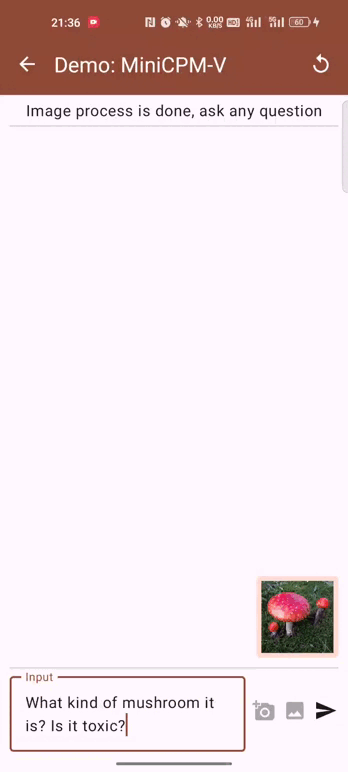
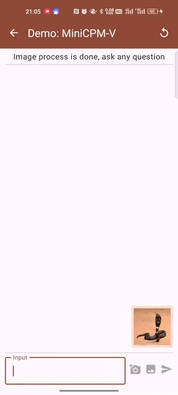

<div align="center">

<!-- <!-- <h1 style="color: #33A6B8; font-family: Helvetica"> OmniLMM </h1> -->

</img> 

**Large multi-modal models for strong performance and efficient deployment**
<p align="center">
  OmniLMM-3B  <a href="https://huggingface.co/openbmb/OmniLMM-3B/">🤗</a> <a href="http://120.92.209.146:80/">🤖</a> |
  OmniLMM-12B <a href="https://huggingface.co/openbmb/OmniLMM-12B/">🤗</a> <a href="http://120.92.209.146:8081">🤖</a>
</p>

</div>


**OmniLMM** is a family of open-source large multimodal models (LMMs) that are adept at vision & language modeling. This model processes both images and text inputs and delivers high-quality text outputs. We release two distinct versions of OmniLMM that are targeted at **strong performance and efficient deployment**:

- **OmniLMM-12B:** The most capable version that achieves leading performance among models with comparable sizes on multiple benchmarks.

- **OmniLMM-3B:** The efficient version that is perfect for deployment on edge devices with promising performance. 

## OmniLMM 12B
**OmniLMM-12B** is the most capable version. The model is built based on [EVA02-5B](https://github.com/baaivision/EVA/tree/master/EVA-CLIP) and [Zephyr-7B-β](https://huggingface.co/HuggingFaceH4/zephyr-7b-beta), connected with a perceiver resampler layer, and trained on multimodal data in a curriculum fashion. The model has three notable features:

- 🔥 **Strong Performance.** 

  OmniLMM-12B achieves **leading performance** among models with comparable sizes, surpassing established LMMs on multiple benchmarks (including MME, MMBench, SEED-Bench, etc). The model also **supports OCR capability** and endows **rich multimodal world knowledge**.

- 🏆 **Trustworthy Behavior.** 

  LMMs are known for suffering from hallucination, often generating text that is not factually grounded in images (e.g., faithfully describing non-existing objects in images). OmniLMM-12B is **the first state-of-the-art open-source LMM aligned via multimodal RLHF for trustworthy behavior** (using our recent [RLHF-V](https://rlhf-v.github.io/) technique) and **ranked #1** among open-source models on [MMHal-Bench](https://huggingface.co/datasets/Shengcao1006/MMHal-Bench).

- 🕹 **Real-time Multimodal Interaction.** 

  We combine the OmniLMM-12B and GPT-3.5 into a **real-time multimodal interactive assistant**. The assistant accepts video streams from the camera and speech streams from the microphone and emits speech output. While still primary, we find the model can **replicate some of the fun cases shown in the Gemini Demo video, without any video edition**.


<table>
<thead>
  <tr>
    <th align="left">Model</th>
    <th>Size</th>
    <th>MME</th>
    <th nowrap="nowrap" >MMMU val</th>
    <th nowrap="nowrap" >MMHal-Bench</th>
    <th nowrap="nowrap" >SeedBench-I</th>
    <th nowrap="nowrap" >LLaVA Bench W</th>
    <th>MathVista</th>
    <th nowrap="nowrap">MMB dev (en)</th>
  </tr>
</thead>
<tbody align="center">
  <tr>
    <td align="left">GPT-4V †</td>
    <td>-</td>
    <td>1409</td>
    <td>56.8</td>
    <td>3.53 / 70.8</td>
    <td>71.6 </td>
    <td>93.1 </td>
    <td>47.8 </td>
    <td>75.1 </td>
  </tr>
  <tr>
    <td nowrap="nowrap" align="left">Qwen-VL-Plus †</td>
    <td>-</td>
    <td>1681</td>
    <td>45.2</td>
    <td>- </td>
    <td>65.7 </td>
    <td>73.7 </td>
    <td>36.0 </td>
    <td>66.2 </td>
  </tr>
  <tr>
    <td align="left">Yi-VL 6B</td>
    <td align="right">6.7B </td>
    <td>- </td>
    <td>39.1 </td>
    <td>- </td>
    <td>66.1 </td>
    <td>39.9 </td>
    <td>28.0 </td>
    <td>68.2 </td>
  </tr>
  <tr>
    <td align="left" >CogVLM</td>
    <td align="right">17.4B</td>
    <td>1438</td>
    <td>32.1 </td>
    <td>2.68 / 52.1 </td>
    <td>68.8 </td>
    <td>73.9 </td>
    <td>34.7 </td>
    <td>63.7 </td>
  </tr>
  <tr>
    <td nowrap="nowrap" align="left" >Qwen-VL-Chat</td>
    <td align="right">9.6B</td>
    <td>1488</td>
    <td>35.9</td>
    <td>2.93 / 59.4</td>
    <td>64.8 </td>
    <td>67.7 </td>
    <td>33.8 </td>
    <td>60.6 </td>
  </tr>
  <tr>
    <td align="left" >LLaVA 1.5</td>
    <td align="right">13.6B </td>
    <td>1531 </td>
    <td>36.4 </td>
    <td>2.71 / 51.0 </td>
    <td>68.1 </td>
    <td>64.6 </td>
    <td>26.4 </td>
    <td>68.2 </td>
  </tr>
  <tr>
    <td nowrap="nowrap" align="left" ><b>OmniLMM-12B</b></td>
    <td align="right">11.6B </td>
    <td>1637 </td>
    <td>40.7 </td>
    <td>3.45 / 68.8 </td>
    <td>71.1 </td>
    <td>72.0 </td>
    <td>34.9 </td>
    <td>71.6 </td>
  </tr>
</tbody>
</table>
<small>†: closed-source models</small>


TODO：case画图展示 @蔡天驰

## OmniLMM 3B
**OmniLMM-3B** (i.e., MiniCPM-Omni) is an efficient version with promising performance for deployment. The model is built based on SigLip-400M and MiniCPM-2.4B, connected by a perceiver resampler. Notable features of OmniLMM-3B include:

- 🚀 **High Efficiency.** 

  OmniLMM-3B can be **efficiently deployed on most GPU cards and personal computers**, and **even on edge devices such as mobile phones**. In terms of visual encoding, we compress the image representations into 64 tokens via a perceiver resampler, which is significantly fewer than other LMMs based on MLP architecture (typically > 512 tokens). This allows OmniLMM-3B to operate with **much less memory cost and higher speed during inference**.

- 🔥 **Promising Performance.** 

  OmniLMM-3B achieves **state-of-the-art performance** on multiple benchmarks (including MMMU, MME, and MMbech, etc) among models with comparable sizes, surpassing existing LMMs built on Phi-2. It even **achieves comparable or better performance than the 9.6B Qwen-VL-Chat**.

- 🙌 **Bilingual Support.** 

  OmniLMM-3B is **the first edge-deployable LMM supporting bilingual multimodal interaction in English and Chinese**. This is achieved by generalizing multimodal capabilities across languages, a technique from our ICLR 2024 spotlight [paper](https://arxiv.org/abs/2308.12038).

### Evaluation

<div align="center">

<table style="margin: 0px auto;">
<thead>
  <tr>
    <th align="left">Model</th>
    <th>Size</th>
    <th>MME</th>
    <th nowrap="nowrap" >MMB dev (en)</th>
    <th nowrap="nowrap" >MMB dev (zh)</th>
    <th nowrap="nowrap" >MMMU val</th>
    <th nowrap="nowrap" >CMMMU val</th>
  </tr>
</thead>
<tbody align="center">
  <tr>
    <td align="left">LLaVA-Phi</td>
    <td align="right">3B</td>
    <td>1335</td>
    <td>59.8</td>
    <td>- </td>
    <td>- </td>
    <td>- </td>
  </tr>
  <tr>
    <td nowrap="nowrap" align="left">MobileVLM</td>
    <td align="right">3B</td>
    <td>1289</td>
    <td>59.6</td>
    <td>- </td>
    <td>- </td>
    <td>- </td>
  </tr>
  <tr>
    <td nowrap="nowrap" align="left" >Imp-v1</td>
    <td align="right">3B</td>
    <td>1434</td>
    <td>66.5</td>
    <td>- </td>
    <td>- </td>
    <td>- </td>
  </tr>
  <tr>
    <td align="left" >Qwen-VL-Chat</td>
    <td align="right" >9.6B</td>
    <td>1487</td>
    <td>60.6 </td>
    <td>56.7 </td>
    <td>35.9 </td>
    <td>30.7 </td>
  </tr>
  <tr>
    <td nowrap="nowrap" align="left" ><b>OmniLMM-3B</b></td>
    <td align="right">3B </td>
    <td>1452 </td>
    <td>67.3 </td>
    <td>61.9 </td>
    <td>34.7 </td>
    <td>32.1 </td>
  </tr>
</tbody>
</table>

</div>

### Examples

<div align="center">
<table>
  <tr>
    <td>
      <p> 
        
      </p>
    </td>
    <td>
      <p> 
        
      </p>
    </td>
  </tr>
</table>
</div>

## Demo
Click here to try out the Demo of [OmniLMM-12B](http://120.92.209.146:8081) and [OmniLMM-3B](http://120.92.209.146:80).

## ⚙️ Install

1. Clone this repository and navigate to the source folder

```bash
git clone https://github.com/OpenBMB/OmniLMM.git
cd OmniLMM
```

2. Create conda environment

```Shell
conda create -n OmniLMM python=3.10 -y
conda activate OmniLMM
```

3. Install dependencies

```shell
pip install -r requirements.txt
```

## 💡 Inference

### Model Zoo
| Model                | Description       | Download Link |
|:----------------------|:-------------------|:---------------:|
| OmniLMM-12B | The most capable version with strong performance.                   |  [🤗](https://huggingface.co/openbmb/OmniLMM-12B) &nbsp;&nbsp; <a url="https://modelscope.cn/models/OpenBMB/OmniLMM-12B/files"> </img></a> |
| OmniLMM-3B  | The efficient version for edge device deployment.          |  [🤗](https://huggingface.co/openbmb/MiniCPM-V) &nbsp;&nbsp; <a url="https://modelscope.cn/models/OpenBMB/MiniCPM-V/files"> </img></a> |


### Multi-turn Conversation
Please refer to the following codes to run `OmniLMM`.

<div align="center">

</div>

##### OmniLMM-12B
```python
from chat import OmniLMMChat, img2base64

chat_model = OmniLMMChat('openbmb/OmniLMM-12B')

im_64 = img2base64('./data/COCO_test2015_000000262144.jpg')

# First round chat 
msgs = [{"role": "user", "content": "What are the people doing?"}]

inputs = {"image": im_64, "question": json.dumps(msgs)}
answer = chat_model.process(inputs)
print(answer)

# Second round chat 
# pass history context of multi-turn conversation
msgs.append({"role": "assistant", "content": answer})
msgs.append({"role": "user", "content": "Describe the image"})

inputs = {"image": im_64, "question": json.dumps(msgs)}
answer = chat_model.process(inputs)
print(answer)
```

We can obtain the following results:
```
"The people in the image are playing baseball. One person is pitching a ball, another one is swinging a bat to hit it, and there's also an umpire present who appears to be watching the game closely."

"The image depicts a baseball game in progress. A pitcher is throwing the ball, while another player is swinging his bat to hit it. An umpire can be seen observing the play closely."
```

##### OmniLMM-3B
```python
import torch
from PIL import Image
from transformers import AutoModel, AutoTokenizer

model_path='openbmb/MiniCPM-V'
model = AutoModel.from_pretrained(model_path, trust_remote_code=True).to(dtype=torch.bfloat16)
tokenizer = AutoTokenizer.from_pretrained(model_path, trust_remote_code=True)
model.eval().cuda()

image = Image.open('./data/COCO_test2015_000000262144.jpg').convert('RGB')

question = '请描述一下该图像'
res, context, _ = model.chat(
    image=image,
    question=question,
    context=None,
    tokenizer=tokenizer,
    sampling=True,
    temperature=0.7
)
print(res)
```

TODO：使用文档（安装、使用，包括3B和12B） @朱宏吉

## ✅ TODO

- [ ] Fine-tuning support
- [ ] Local Web-UI deployment
- [ ] Code release for real-time interactive assistant

## 🏫 Institutions

This project is developed by the following institutions:

-  [THUNLP](https://nlp.csai.tsinghua.edu.cn/)
-  [ModelBest](https://modelbest.cn/)
-  [Zhihu](https://www.zhihu.com/ )

