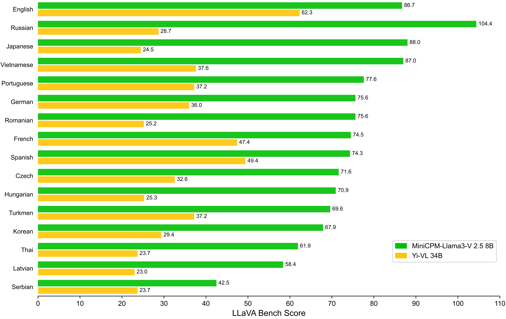

<div align="center">

<!-- <!-- <h1 style="color: #33A6B8; font-family: Helvetica"> OmniLMM </h1> -->

</img> 

**端侧可用的 GPT-4V 级多模态大模型**

  <strong>中文 |
  [English](./README_en.md)</strong>

<p align="center">
  MiniCPM-Llama3-V  2.5  <a href="https://huggingface.co/openbmb/MiniCPM-Llama3-V-2_5/">🤗</a> <a href="http://120.92.209.146:8889/">🤖</a> |
  MiniCPM-V 2.0  <a href="https://huggingface.co/openbmb/MiniCPM-V-2/">🤗</a> <a href="https://huggingface.co/spaces/openbmb/MiniCPM-V-2">🤖</a> |
  <a href="https://openbmb.vercel.app/minicpm-v-2">MiniCPM-V 2.0 技术博客</a>
</p>

</div>


**MiniCPM-V**是面向图文理解的端侧多模态大模型系列。该系列模型接受图像和文本输入，并提供高质量的文本输出。自2024年2月以来，我们共发布了4个版本模型，旨在实现**领先的性能和高效的部署**，目前该系列最值得关注的模型包括：

- **MiniCPM-Llama3-V 2.5**：🔥🔥🔥 MiniCPM-V系列的最新、性能最佳模型。总参数量8B，多模态综合性能超越 GPT-4V-1106、Gemini Pro、Claude 3、Qwen-VL-Max 等商用闭源模型，OCR 能力及指令跟随能力进一步提升，并支持超过30种语言的多模态交互。通过系统使用模型量化、CPU、NPU、编译优化等高效推理技术，MiniCPM-Llama3-V 2.5 可以实现高效的终端设备部署。

- **MiniCPM-V 2.0**：MiniCPM-V系列的最轻量级模型。总参数量2B，多模态综合性能超越 Yi-VL 34B、CogVLM-Chat 17B、Qwen-VL-Chat 10B 等更大参数规模的模型，可接受 180 万像素的任意长宽比图像输入，实现了和 Gemini Pro 相近的场景文字识别能力以及和 GPT-4V 相匹的低幻觉率。


## 更新日志 <!-- omit in toc -->

* [2024.05.20] 我们开源了 MiniCPM-Llama3-V 2.5，增强了 OCR 能力，支持 30 多种语言，并首次在端侧实现了 GPT-4V 级的多模态能力！我们提供了[高效推理](#手机端部署)和[简易微调](./finetune/readme.md)的支持，欢迎试用！
* [2024.04.23] 我们增加了对 [vLLM](#vllm) 的支持，欢迎体验！
* [2024.04.18] 我们在 HuggingFace Space 新增了 MiniCPM-V 2.0 的 [demo](https://huggingface.co/spaces/openbmb/MiniCPM-V-2)，欢迎体验！
* [2024.04.17] MiniCPM-V 2.0 现在支持用户部署本地 [WebUI Demo](#本地webui-demo部署) 了，欢迎试用!
* [2024.04.15] MiniCPM-V 2.0 现在可以通过 SWIFT 框架 [微调](https://github.com/modelscope/swift/blob/main/docs/source/Multi-Modal/minicpm-v-2最佳实践.md) 了，支持流式输出!
* [2024.04.12] 我们开源了 MiniCPM-V 2.0，该模型刷新了 OCRBench 开源模型最佳成绩，在场景文字识别能力上比肩 Gemini Pro，同时还在综合了 11 个主流多模态大模型评测基准的 <a href="https://rank.opencompass.org.cn/leaderboard-multimodal">OpenCompass</a> 榜单上超过了 Qwen-VL-Chat 10B、CogVLM-Chat 17B 和 Yi-VL 34B 等更大参数规模的模型！点击<a href="https://openbmb.vercel.app/minicpm-v-2">这里</a>查看 MiniCPM-V 2.0 技术博客。
* [2024.03.14] MiniCPM-V 现在支持 SWIFT 框架下的[微调](https://github.com/modelscope/swift/blob/main/docs/source/Multi-Modal/minicpm-v最佳实践.md)了，感谢 [Jintao](https://github.com/Jintao-Huang) 的贡献！
* [2024.03.01] MiniCPM-V 现在支持在 Mac 电脑上进行部署！
* [2024.02.01] 我们开源了 MiniCPM-V 和 OmniLMM-12B，分别可以支持高效的端侧部署和同规模领先的多模态能力！


## 目录 <!-- omit in toc -->

- [MiniCPM-Llama3-V 2.5](#minicpm-llama3-v-25)
  - [性能评估](#性能评估)
  - [典型示例](#典型示例)
- [MiniCPM-V 2.0](#minicpm-v-20)
- [Online Demo](#online-demo)
- [安装](#安装)
- [推理](#推理)
  - [模型库](#模型库)
  - [多轮对话](#多轮对话)
  - [Mac 推理](#mac-推理)
  - [手机端部署](#手机端部署)
  - [本地WebUI Demo部署](#本地webui-demo部署)
  - [vLLM 部署 ](#vllm-部署-)
- [微调](#微调)
- [未来计划](#未来计划)
- [引用](#引用)


## MiniCPM-Llama3-V 2.5
**MiniCPM-Llama3-V 2.5** 是 MiniCPM-V 系列的最新版本模型，基于 SigLip-400M 和 Llama3-8B-Instruct 构建，共 8B 参数量，相较于 MiniCPM-V 2.0 性能取得较大幅度提升。MiniCPM-Llama3-V 2.5 值得关注的特点包括：

- 🔥 **领先的性能。**
  MiniCPM-Llama3-V 2.5 在综合了 11 个主流多模态大模型评测基准的 OpenCompass 榜单上平均得分 65.1，**以 8B 量级的大小超过了 GPT-4V-1106、Gemini Pro、Claude 3、Qwen-VL-Max 等主流商用闭源多模态大模型**，大幅超越基于Llama 3构建的其他多模态大模型。

- 💪 **优秀的 OCR 能力。**
  MiniCPM-Llama3-V 2.5 可接受 180 万像素的任意宽高比图像输入，**OCRBench 得分达到 725，超越 GPT-4o、GPT-4V、Gemini Pro、Qwen-VL-Max 等商用闭源模型**，达到最佳水平。基于近期用户反馈建议，MiniCPM-Llama3-V 2.5 增强了全文 OCR 信息提取、表格图像转 markdown 等高频实用能力，并且进一步加强了指令跟随、复杂推理能力，带来更好的多模态交互体感。

  
- 🏆 **可信行为。** 
  借助最新的 [RLAIF-V](https://github.com/RLHF-V/RLAIF-V/) 对齐技术（[RLHF-V](https://github.com/RLHF-V/) [CVPR'24]系列的最新技术），MiniCPM-Llama3-V 2.5 具有更加可信的多模态行为，在 Object HalBench 的幻觉率降低到了 **10.3%**，显著低于 GPT-4V-1106 (13.6%)，达到开源社区最佳水平。

- 🌏 **多语言支持。**
  得益于 Llama 3 强大的多语言能力和 VisCPM 的跨语言泛化技术，MiniCPM-Llama3-V 2.5 在中英双语多模态能力的基础上，仅通过少量翻译的多模态数据的指令微调，高效泛化支持了**德语、法语、西班牙语、意大利语、俄语等 30+ 种语言**的多模态能力，并表现出了良好的多语言多模态对话性能。[查看所有支持语言](./assets/minicpm-llama-v-2-5_languages.md)

- 🚀 **高效部署。**
  MiniCPM-Llama3-V 2.5 较为系统地通过**模型量化、CPU、NPU、编译优化**等高效加速技术，实现高效的终端设备部署。对于高通芯片的移动手机，我们首次将 NPU 加速框架 QNN 整合进了 llama.cpp。经过系统优化后，MiniCPM-Llama3-V 2.5 实现了多模态大模型端侧**语言解码速度 3 倍加速**、**图像编码 150 倍加速**的巨大提升。


### 性能评估

<div align="center">
    
</div>
<details>
<summary>TextVQA, DocVQA, OCRBench, OpenCompass MultiModal Avg Score, MME, MMBench, MMMU, MathVista, LLaVA Bench, RealWorld QA, Object HalBench上的详细评测结果。 </summary>
<div align="center">

<table style="margin: 0px auto;">
    <thead>
        <tr>
            <th align="left">Model</th>
            <th>Size</th>
            <th>OCRBench</th>
            <th>TextVQA val</th>
            <th>DocVQA test</th>
            <th>Open-Compass</th>
            <th>MME</th>
            <th>MMB test (en)</th>
            <th>MMB test (cn)</th>
            <th>MMMU val</th>
            <th>Math-Vista</th>
            <th>LLaVA Bench</th>
            <th>RealWorld QA</th>
            <th>Object HalBench</th>
        </tr>
    </thead>
            <tbody align="center">
        <tr>
            <td colspan="14" align="left"><strong>Proprietary</strong></td>
        </tr>
        <tr>
            <td nowrap="nowrap" align="left">Gemini Pro</td>
            <td>-</td>
            <td>680</td>
            <td>74.6</td>
            <td>88.1</td>
            <td>62.9</td>
            <td>2148.9</td>
            <td>73.6</td>
            <td>74.3</td>
            <td>48.9</td>
            <td>45.8</td>
            <td>79.9</td>
            <td>60.4</td>
            <td>-</td>
        </tr>
        <tr>
            <td nowrap="nowrap" align="left">GPT-4V (2023.11.06)</td>
            <td>-</td>
            <td>645</td>
            <td>78.0</td>
            <td>88.4</td>
            <td>63.5</td>
            <td>1771.5</td>
            <td>77.0</td>
            <td>74.4</td>
            <td>53.8</td>
            <td>47.8</td>
            <td>93.1</td>
            <td>63.0</td>
            <td>86.4</td>
        </tr>
        <tr>
            <td colspan="14" align="left"><strong>Open-source</strong></td>
        </tr>
        <tr>
            <td nowrap="nowrap" align="left">Mini-Gemini</td>
            <td>2.2B</td>
            <td>-</td>
            <td>56.2</td>
            <td>34.2*</td>
            <td>-</td>
            <td>1653.0</td>
            <td>-</td>
            <td>-</td>
            <td>31.7</td>
            <td>-</td>
            <td>-</td>
            <td>-</td>
            <td>-</td>
        </tr>
        <tr>
            <td nowrap="nowrap" align="left">Qwen-VL-Chat</td>
            <td>9.6B</td>
            <td>488</td>
            <td>61.5</td>
            <td>62.6</td>
            <td>51.6</td>
            <td>1860.0</td>
            <td>61.8</td>
            <td>56.3</td>
            <td>37.0</td>
            <td>33.8</td>
            <td>67.7</td>
            <td>49.3</td>
            <td>56.2</td>
        </tr>
        <tr>
            <td nowrap="nowrap" align="left">DeepSeek-VL-7B</td>
            <td>7.3B</td>
            <td>435</td>
            <td>64.7*</td>
            <td>47.0*</td>
            <td>54.6</td>
            <td>1765.4</td>
            <td>73.8</td>
            <td>71.4</td>
            <td>38.3</td>
            <td>36.8</td>
            <td>77.8</td>
            <td>54.2</td>
            <td></td>
        </tr>        
        <tr>
            <td nowrap="nowrap" align="left">Yi-VL-34B</td>
            <td>34B</td>
            <td>290</td>
            <td>43.4*</td>
            <td>16.9*</td>
            <td>52.2</td>
            <td><strong>2050.2</strong></td>
            <td>72.4</td>
            <td>70.7</td>
            <td>45.1</td>
            <td>30.7</td>
            <td>62.3</td>
            <td>54.8</td>
            <td>79.3</td>
        </tr>
        <tr>
            <td nowrap="nowrap" align="left">CogVLM-Chat</td>
            <td>17.4B</td>
            <td>590</td>
            <td>70.4</td>
            <td>33.3*</td>
            <td>54.2</td>
            <td>1736.6</td>
            <td>65.8</td>
            <td>55.9</td>
            <td>37.3</td>
            <td>34.7</td>
            <td>73.9</td>
            <td>60.3</td>
            <td>73.6</td>
        </tr>
        <tr>
            <td nowrap="nowrap" align="left">TextMonkey</td>
            <td>9.7B</td>
            <td>558</td>
            <td>64.3</td>
            <td>66.7</td>
            <td>-</td>
            <td>-</td>
            <td>-</td>
            <td>-</td>
            <td>-</td>
            <td>-</td>
            <td>-</td>
            <td>-</td>
            <td>-</td>
        </tr>
        <tr>
          <td nowrap="nowrap" align="left">IDEFICS2-8B</td>
          <td>8.0B</td>
          <td>-</td>
          <td>73.0</td>
          <td>74.0</td>
          <td>57.2</td>
          <td>1847.6</td>
          <td>75.7</td>
          <td>68.6</td>
          <td>45.2</td>
          <td>52.2</td>
          <td>49.1</td>
          <td>60.7</td>
          <td>-</td>
        </tr>
        <tr>
            <td nowrap="nowrap" align="left">Bunny-LLama-3-8B</td>
            <td>8.4B</td>
            <td>-</td>
            <td>-</td>
            <td>-</td>
            <td>54.3</td>
            <td>1920.3</td>
            <td>77.0</td>
            <td>73.9</td>
            <td>41.3</td>
            <td>31.5</td>
            <td>61.2</td>
            <td>58.8</td>
            <td>-</td>
        </tr>
        <tr>
            <td nowrap="nowrap" align="left">LLaVA-NeXT Llama-3-8B</td>
            <td>8.4B</td>
            <td>-</td>
            <td>-</td>
            <td>-</td>
            <td>-</td>
            <td>1971.5</td>
            <td>-</td>
            <td>-</td>
            <td>41.7</td>
            <td>-</td>
            <td>80.1</td>
            <td>60.0</td>
            <td>-</td>
        </tr>
        <tr style="background-color: #e6f2ff;">
            <td nowrap="nowrap" align="left">MiniCPM-V 1.0</td>
            <td>2.8B</td>
            <td>366</td>
            <td>60.6</td>
            <td>38.2</td>
            <td>47.5</td>
            <td>1650.2</td>
            <td>64.1</td>
            <td>62.6</td>
            <td>38.3</td>
            <td>28.9</td>
            <td>51.3</td>
            <td>51.2</td>
            <td>78.4</td>
        </tr>
        <tr style="background-color: #e6f2ff;">
            <td nowrap="nowrap" align="left">MiniCPM-V 2.0</td>
            <td>2.8B</td>
            <td>605</td>
            <td>74.1</td>
            <td>71.9</td>
            <td>54.5</td>
            <td>1808.6</td>
            <td>69.1</td>
            <td>66.5</td>
            <td>38.2</td>
            <td>38.7</td>
            <td>69.2</td>
            <td>55.8</td>
            <td>85.5</td>
        </tr>
        <tr style="background-color: #e6f2ff;">
            <td nowrap="nowrap" align="left">MiniCPM-Llama3-V 2.5</td>
            <td>8.5B</td>
            <td><strong>725</strong></td>
            <td><strong>76.6</strong></td>
            <td><strong>84.8</strong></td>
            <td><strong>65.1</strong></td>
            <td>2024.6</td>
            <td><strong>77.2</strong></td>
            <td><strong>74.2</strong></td>
            <td><strong>45.8</strong></td>
            <td><strong>54.3</strong></td>
            <td><strong>86.7</strong></td>
            <td><strong>63.5</strong></td>
            <td><strong>89.7</strong></td>
        </tr>
    </tbody>
</table>

</div>
* 正式开源模型权重的评测结果。
</details>

<div align="center">
    
    <br>
    多语言LLaVABench评测结果
</div>


### 典型示例
<table align="center">
    <p align="center">
      
    </p>
</table>

我们将 MiniCPM-Llama3-V 2.5 部署在小米 14 Pro 上，并录制了以下演示视频，我们以2倍速播放视频。

<table align="center">
    <p align="center">
      
      
    </p>
</table>

<table align="center">
    <p align="center" width=80%>
      
    </p>
</table>

## MiniCPM-V 2.0

<details>
<summary>查看 MiniCPM-V 2.0 的详细信息</summary>

**MiniCPM-V 2.0**可以高效部署到终端设备。该模型基于 SigLip-400M 和 [MiniCPM-2.4B](https://github.com/OpenBMB/MiniCPM/)构建，通过perceiver resampler连接。其特点包括：

- 🔥 **优秀的性能。**

  MiniCPM-V 2.0 在多个测试基准（如 OCRBench, TextVQA, MME, MMB, MathVista 等）中实现了 7B 以下模型的**最佳性能**。**在综合了 11 个主流多模态大模型评测基准的 OpenCompass 榜单上超过了 Qwen-VL-Chat 9.6B、CogVLM-Chat 17.4B 和 Yi-VL 34B 等更大参数规模的模型**。MiniCPM-V 2.0 还展现出**领先的 OCR 能力**，在场景文字识别能力上**接近 Gemini Pro**，OCRBench 得分达到**开源模型第一**。
  

- 🏆 **可信行为。** 

  多模态大模型深受幻觉问题困扰，模型经常生成和图像中的事实不符的文本。MiniCPM-V 2.0 是 **第一个通过多模态 RLHF 对齐的端侧多模态大模型**（借助 [RLHF-V](https://rlhf-v.github.io/) [CVPR'24] 系列技术）。该模型在 [Object HalBench](https://arxiv.org/abs/2312.00849) 达到**和 GPT-4V 相仿**的性能。


- 🌟 **高清图像高效编码。**

  MiniCPM-V 2.0 可以接受 **180 万像素的任意长宽比图像输入**（基于最新的[LLaVA-UHD](https://arxiv.org/pdf/2403.11703.pdf) 技术），这使得模型可以感知到小物体、密集文字等更加细粒度的视觉信息。 


- ⚡️ **高效部署。**

  MiniCPM-V 2.0 可以**高效部署在大多数消费级显卡和个人电脑上**，包括**移动手机等终端设备**。在视觉编码方面，我们通过perceiver resampler将图像表示压缩为更少的 token。这使得 MiniCPM-V 2.0 即便是**面对高分辨率图像，也能占用较低的存储并展现优秀的推理速度**。

- 🙌 **双语支持。**

  MiniCPM-V 2.0 **提供领先的中英双语多模态能力支持**。
  该能力通过 [VisCPM](https://arxiv.org/abs/2308.12038) [ICLR'24] 论文中提出的多模态能力的跨语言泛化技术实现。

### 典型示例 <!-- omit in toc -->


<table align="center">
    <p align="center">
      
    </p>
</table>

我们将 MiniCPM-V 2.0 部署在小米 14 Pro 上，并录制了以下演示视频，未经任何视频剪辑。

<table align="center">
    <p align="center">
      
      
    </p>
</table>

</details>


<a id='legacy-models'></a>

## 历史版本模型  <!-- omit in toc -->


| 模型                | 介绍信息和使用教程       |
|:----------------------|:-------------------:|
| MiniCPM-V 1.0  | [文档](./minicpm_v1.md)   | 
| OmniLMM-12B  | [文档](./omnilmm.md)   |  


## Online Demo

欢迎通过以下链接使用我们的网页端推理服务： [MiniCPM-Llama3-V 2.5](http://120.92.209.146:8889/) ｜ [MiniCPM-V 2.0](http://120.92.209.146:80).

## 安装

1. 克隆我们的仓库并跳转到相应目录

```bash
git clone https://github.com/OpenBMB/MiniCPM-V.git
cd MiniCPM-V
```

1. 创建 conda 环境

```Shell
conda create -n MiniCPMV python=3.10 -y
conda activate MiniCPMV
```

3. 安装依赖

```shell
pip install -r requirements.txt
```

## 推理

### 模型库

| 模型                | 简介       | 下载链接 |
|:----------------------|:-------------------|:---------------:|
| MiniCPM-Llama3-V 2.5  | 最新版本，提供最佳的端侧多模态理解能力。   |  [🤗](https://huggingface.co/openbmb/MiniCPM-Llama3-V-2_5/) &nbsp;&nbsp; [</img>](https://modelscope.cn/models/OpenBMB/MiniCPM-Llama3-V-2_5/files) |
| MiniCPM-Llama3-V 2.5 int4  | int4量化版，更低显存占用。   |  [🤗](https://huggingface.co/openbmb/MiniCPM-Llama3-V-2_5-int4/) &nbsp;&nbsp; [</img>](https://modelscope.cn/models/OpenBMB/MiniCPM-Llama3-V-2_5-int4/files) |
| MiniCPM-V 2.0  | 轻量级版本，平衡计算开销和多模态理解能力。   |  [🤗](https://huggingface.co/openbmb/MiniCPM-V-2) &nbsp;&nbsp; [</img>](https://modelscope.cn/models/OpenBMB/MiniCPM-V-2/files) |
| MiniCPM-V 1.0 | 最轻量版本， 提供最快的推理速度。    |   [🤗](https://huggingface.co/openbmb/MiniCPM-V) &nbsp;&nbsp; [</img>](https://modelscope.cn/models/OpenBMB/MiniCPM-V/files) |

更多[历史版本模型](#legacy-models)

### 多轮对话

请参考以下代码进行推理。

<div align="center">

</div>


```python
from chat import OmniLMMChat, img2base64
import torch
torch.manual_seed(20)

chat_model = OmniLMMChat('openbmb/MiniCPM-Llama3-V-2_5')

im_64 = img2base64('./assets/hk_OCR.jpg')

# First round chat 
msgs = [{"role": "user", "content": "Where should I go to buy a camera?"}]

inputs = {"image": im_64, "question": json.dumps(msgs)}
answer = chat_model.chat(inputs)
print(answer)

# Second round chat 
# pass history context of multi-turn conversation
msgs.append({"role": "assistant", "content": answer})
msgs.append({"role": "user", "content": "请用中文回答"})

inputs = {"image": im_64, "question": json.dumps(msgs)}
answer = chat_model.chat(inputs)
print(answer)
```

可以得到以下输出:

```
"You should go to the Nikon store, as indicated by the neon sign on the right side of the image."

"你应该去到尼康店，正如指示在图片的右侧。"
```


### Mac 推理
<details>
<summary>点击查看 MiniCPM-Llama3-V 2.5 / MiniCPM-V 2.0 基于Mac MPS运行 (Apple silicon 或 AMD GPUs)的示例。 </summary>

```python
# test.py    Need more than 16GB memory to run.
import torch
from PIL import Image
from transformers import AutoModel, AutoTokenizer

model = AutoModel.from_pretrained('openbmb/MiniCPM-Llama3-V-2_5', trust_remote_code=True, low_cpu_mem_usage=True)
model = model.to(device='mps')

tokenizer = AutoTokenizer.from_pretrained('openbmb/MiniCPM-Llama3-V-2_5', trust_remote_code=True)
model.eval()

image = Image.open('./assets/hk_OCR.jpg').convert('RGB')
question = 'Where is this photo taken?'
msgs = [{'role': 'user', 'content': question}]

answer, context, _ = model.chat(
    image=image,
    msgs=msgs,
    context=None,
    tokenizer=tokenizer,
    sampling=True
)
print(answer)
```
运行:
```shell
PYTORCH_ENABLE_MPS_FALLBACK=1 python test.py
```
</details>


### 手机端部署
MiniCPM-V 2.0 可运行在Android手机上, 点击[2.0](https://github.com/OpenBMB/mlc-MiniCPM)安装apk使用; MiniCPM-Llama3-V 2.5 将很快推出，敬请期待。

### 本地WebUI Demo部署
<details>
<summary>点击查看本地WebUI demo 在 NVIDIA GPU, Mac等不同设备部署方法 </summary>
  
```shell
pip install -r requirements.txt
```
  
```shell
# For NVIDIA GPUs, run:
python web_demo_2.5.py --device cuda

# For Mac with MPS (Apple silicon or AMD GPUs), run:
PYTORCH_ENABLE_MPS_FALLBACK=1 python web_demo_2.5.py --device mps
```
</details>

### vLLM 部署 <a id='vllm'></a>
<details>
<summary>点击查看 vLLM 部署运行的方法</summary>
由于我们对 vLLM 提交的 PR 还在 review 中，因此目前我们 fork 了一个 vLLM 仓库以供测试使用。

1. 首先克隆我们 fork 的 vLLM 库:
```shell
git clone https://github.com/OpenBMB/vllm.git
```
2. 安装 vLLM 库:
```shell
cd vllm
pip install -e .
```
3. 安装 timm 库: 
```shell
pip install timm=0.9.10
```
4. 测试运行示例程序:
```shell
python examples/minicpmv_example.py 
```


</details>


## 微调

### 简易微调 <!-- omit in toc -->

我们支持使用 Huggingface Transformers 库简易地微调 MiniCPM-V 2.0 和 MiniCPM-Llama3-V 2.5 模型。

[参考文档](./finetune/readme.md)

### 使用 SWIFT 框架 <!-- omit in toc -->

我们支持使用 SWIFT 框架微调 MiniCPM-V 系列模型。SWIFT 支持近 200 种大语言模型和多模态大模型的训练、推理、评测和部署。支持 PEFT 提供的轻量训练方案和完整的 Adapters 库支持的最新训练技术如 NEFTune、LoRA+、LLaMA-PRO 等。 

参考文档：[MiniCPM-V 1.0](https://github.com/modelscope/swift/blob/main/docs/source/Multi-Modal/minicpm-v最佳实践.md), [MiniCPM-V 2.0](https://github.com/modelscope/swift/blob/main/docs/source/Multi-Modal/minicpm-v-2最佳实践.md)

## 未来计划

- [x] 支持 MiniCPM-V 系列模型微调
- [ ] 实时多模态交互代码开源


## 模型协议 <!-- omit in toc -->

本仓库中代码依照 Apache-2.0 协议开源

本项目中模型权重的使用遵循 “[通用模型许可协议-来源说明-宣传限制-商业授权](https://github.com/OpenBMB/General-Model-License/blob/main/通用模型许可协议-来源说明-宣传限制-商业授权.md)”。

本项目中模型权重对学术研究完全开放。

如需将模型用于商业用途，请联系 cpm@modelbest.cn 来获取书面授权，登记后可以免费商业使用。


## 声明 <!-- omit in toc -->

作为多模态大模型，MiniCPM-V 系列模型（包括 OmniLMM）通过学习大量的多模态数据来生成内容，但它无法理解、表达个人观点或价值判断，它所输出的任何内容都不代表模型开发者的观点和立场。

因此用户在使用本项目的系列模型生成的内容时，应自行负责对其进行评估和验证。如果由于使用本项目的系列开源模型而导致的任何问题，包括但不限于数据安全问题、公共舆论风险，或模型被误导、滥用、传播或不当利用所带来的任何风险和问题，我们将不承担任何责任。


## 机构 <!-- omit in toc -->

本项目由以下机构共同开发：

-  [清华大学自然语言处理实验室](https://nlp.csai.tsinghua.edu.cn/)
-  [面壁智能](https://modelbest.cn/)
-  [知乎](https://www.zhihu.com/ )

## 其他多模态项目 <!-- omit in toc -->

👏 欢迎了解我们更多的多模态项目：

[VisCPM](https://github.com/OpenBMB/VisCPM/tree/main) | [RLHF-V](https://github.com/RLHF-V/RLHF-V) | [LLaVA-UHD](https://github.com/thunlp/LLaVA-UHD) | [RLAIF-V](https://github.com/RLHF-V/RLAIF-V)

## 引用

如果您觉得我们模型/代码/论文有帮助，请给我们 ⭐ 和 引用 📝，感谢！

```bib
@article{yu2023rlhf,
  title={Rlhf-v: Towards trustworthy mllms via behavior alignment from fine-grained correctional human feedback},
  author={Yu, Tianyu and Yao, Yuan and Zhang, Haoye and He, Taiwen and Han, Yifeng and Cui, Ganqu and Hu, Jinyi and Liu, Zhiyuan and Zheng, Hai-Tao and Sun, Maosong and others},
  journal={arXiv preprint arXiv:2312.00849},
  year={2023}
}
@article{viscpm,
    title={Large Multilingual Models Pivot Zero-Shot Multimodal Learning across Languages}, 
    author={Jinyi Hu and Yuan Yao and Chongyi Wang and Shan Wang and Yinxu Pan and Qianyu Chen and Tianyu Yu and Hanghao Wu and Yue Zhao and Haoye Zhang and Xu Han and Yankai Lin and Jiao Xue and Dahai Li and Zhiyuan Liu and Maosong Sun},
    journal={arXiv preprint arXiv:2308.12038},
    year={2023}
}
@article{xu2024llava-uhd,
  title={{LLaVA-UHD}: an LMM Perceiving Any Aspect Ratio and High-Resolution Images},
  author={Xu, Ruyi and Yao, Yuan and Guo, Zonghao and Cui, Junbo and Ni, Zanlin and Ge, Chunjiang and Chua, Tat-Seng and Liu, Zhiyuan and Huang, Gao},
  journal={arXiv preprint arXiv:2403.11703},
  year={2024}
}
```
