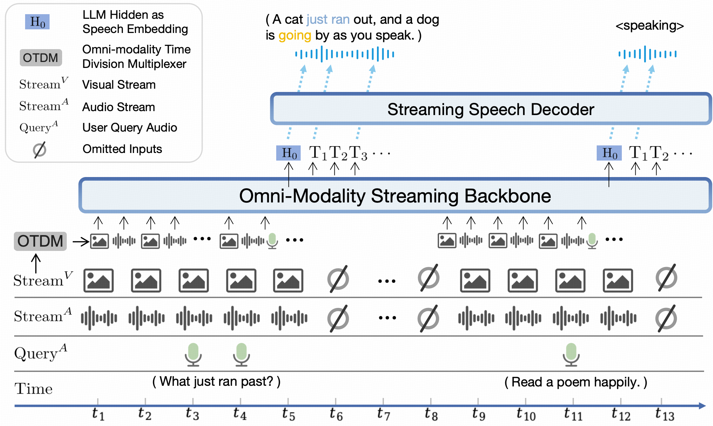
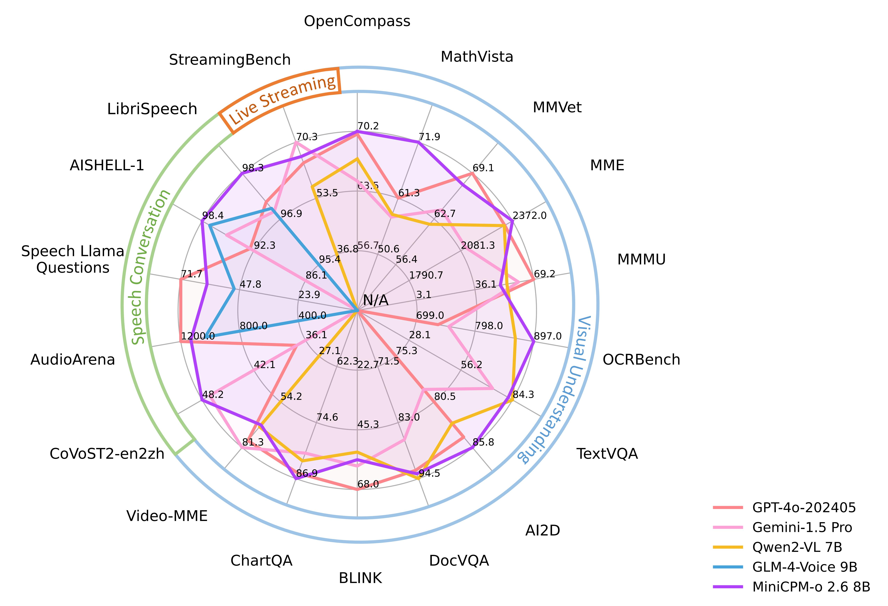
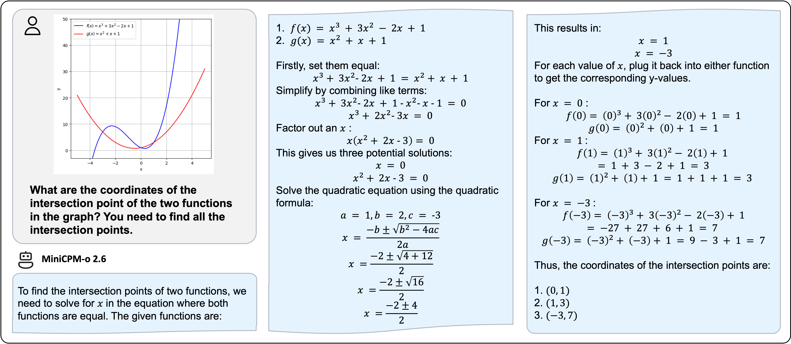
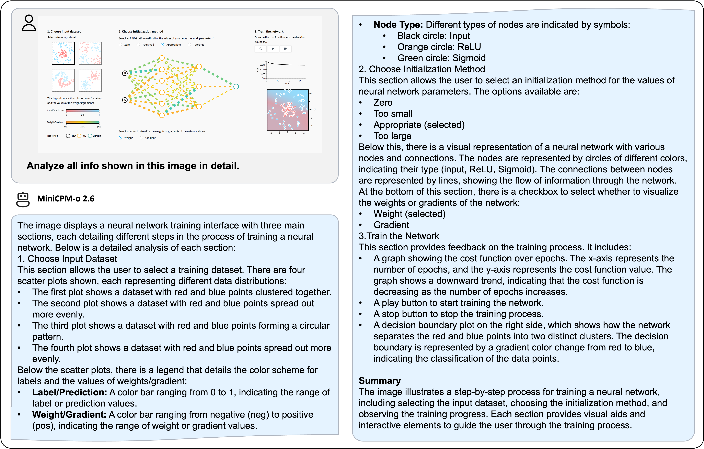

<div align="center">

</img> 

**A GPT-4o Level MLLM for Vision, Speech and Multimodal Live Streaming on Your Phone**

  <strong>[中文](./README_zh.md) |
  English</strong>


<span style="display: inline-flex; align-items: center; margin-right: 2px;">
  
  <a href="docs/wechat.md" target="_blank"> WeChat</a> &nbsp;|
</span>
&nbsp;
<span style="display: inline-flex; align-items: center; margin-left: -8px;">

  <a href="https://discord.gg/uQpn8kKx" target="_blank"> Discord</a>  
</span>


<p align="center">
  MiniCPM-o 2.6 <a href="https://huggingface.co/openbmb/MiniCPM-o-2_6">🤗</a>  <a href="https://minicpm-omni-webdemo-us.modelbest.cn/"> 🤖</a> | MiniCPM-V 2.6 <a href="https://huggingface.co/openbmb/MiniCPM-V-2_6">🤗</a> <a href="http://120.92.209.146:8887/">🤖</a> | 
  Technical Blog Coming Soon
</p>

</div>

**MiniCPM-o** is the latest series of end-side multimodal LLMs (MLLMs) ungraded from MiniCPM-V. The models can now take image, video, text, and audio as inputs and provide high-quality text and speech outputs in an end-to-end fashion. Since February 2024, we have released 6 versions of the model, aiming to achieve **strong performance and efficient deployment**. The most notable models in the series currently include:

- **MiniCPM-o 2.6**: 🔥🔥🔥 The latest and most capable model in the MiniCPM-o series. With a total of 8B parameters, this end-to-end model **achieves comparable performance to GPT-4o-202405 in vision, speech, and multimodal live streaming**, making it one of the most versatile and performant models in the open-source community. For the new voice mode, MiniCPM-o 2.6 **supports bilingual real-time speech conversation with configurable voices**, and also allows for fun capabilities such as emotion/speed/style control, end-to-end voice cloning, role play, etc. It also advances MiniCPM-V 2.6's visual capabilities such **strong OCR capability, trustworthy behavior, multilingual support, and video understanding**. Due to its superior token density, MiniCPM-o 2.6 can for the first time **support multimodal live streaming on end-side devices** such as iPad.

- **MiniCPM-V 2.6**: The most capable model in the MiniCPM-V series. With a total of 8B parameters, the model **surpasses GPT-4V in single image, multi-image and video understanding**. It outperforms **GPT-4o mini, Gemini 1.5 Pro and Claude 3.5 Sonnet** in single image understanding, and can for the first time support real-time video understanding on iPad.


## News <!-- omit in toc -->

#### 📌 Pinned


* [2025.01.19] 📢 **ATTENTION!** We are currently working on merging MiniCPM-o 2.6 into the official repositories of llama.cpp, ollama, and vllm. Until the merge is complete, please USE OUR LOCAL FORKS of [llama.cpp](https://github.com/OpenBMB/llama.cpp/blob/minicpm-omni/examples/llava/README-minicpmo2.6.md), [ollama](https://github.com/OpenBMB/ollama/blob/minicpm-v2.6/examples/minicpm-v2.6/README.md), and [vllm](https://github.com/OpenBMB/MiniCPM-o?tab=readme-ov-file#efficient-inference-with-llamacpp-ollama-vllm). **Using the official repositories before the merge may lead to unexpected issues**.

* [2025.01.19] ⭐️⭐️⭐️ MiniCPM-o tops GitHub Trending and reaches top-2 on Hugging Face Trending!

* [2025.01.17] We have updated the usage of MiniCPM-o 2.6 int4 quantization version, and resolved the model initialization error. Click [here](https://huggingface.co/openbmb/MiniCPM-o-2_6-int4) and try it now!

* [2025.01.13] 🔥🔥🔥 We open-source MiniCPM-o 2.6, which matches GPT-4o-202405 on vision, speech and multimodal live streaming. It advances popular capabitlies of MiniCPM-V 2.6, and supports various new fun features. Try it now!

* [2024.08.17] 🚀🚀🚀 MiniCPM-V 2.6 is now fully supported by [official](https://github.com/ggerganov/llama.cpp) llama.cpp! GGUF models of various sizes are available [here](https://huggingface.co/openbmb/MiniCPM-V-2_6-gguf).

* [2024.08.06] 🔥🔥🔥 We open-source MiniCPM-V 2.6, which outperforms GPT-4V on single image, multi-image and video understanding. It advances popular features of MiniCPM-Llama3-V 2.5, and can support real-time video understanding on iPad. Try it now!

* [2024.08.03] MiniCPM-Llama3-V 2.5 technical report is released! See [here](https://arxiv.org/abs/2408.01800).

* [2024.05.23] 🔥🔥🔥 MiniCPM-V tops GitHub Trending and Hugging Face Trending! Our demo, recommended by Hugging Face Gradio’s official account, is available [here](https://huggingface.co/spaces/openbmb/MiniCPM-Llama3-V-2_5). Come and try it out!

<br>

<details> 
<summary>Click to view more news.</summary>

* [2024.08.15] We now also support multi-image SFT. For more details, please refer to the [document](https://github.com/OpenBMB/MiniCPM-V/tree/main/finetune).
* [2024.08.14] MiniCPM-V 2.6 now also supports [fine-tuning](https://github.com/modelscope/ms-swift/issues/1613) with the SWIFT framework!
* [2024.08.10] 🚀🚀🚀 MiniCPM-Llama3-V 2.5 is now fully supported by [official](https://github.com/ggerganov/llama.cpp) llama.cpp! GGUF models of various sizes are available [here](https://huggingface.co/openbmb/MiniCPM-Llama3-V-2_5-gguf).

* [2024.07.19] MiniCPM-Llama3-V 2.5 supports vLLM now! See [here](#inference-with-vllm).

* [2024.06.03] Now, you can run MiniCPM-Llama3-V 2.5 on multiple low VRAM GPUs(12 GB or 16 GB) by distributing the model's layers across multiple GPUs. For more details, Check this [link](https://github.com/OpenBMB/MiniCPM-V/blob/main/docs/inference_on_multiple_gpus.md).
* [2024.05.28] 🚀🚀🚀 MiniCPM-Llama3-V 2.5 now fully supports its feature in llama.cpp and ollama! Please pull the latest code **of our provided forks** ([llama.cpp](https://github.com/OpenBMB/llama.cpp/blob/minicpm-v2.5/examples/minicpmv/README.md), [ollama](https://github.com/OpenBMB/ollama/tree/minicpm-v2.5/examples/minicpm-v2.5)). GGUF models in various sizes are available [here](https://huggingface.co/openbmb/MiniCPM-Llama3-V-2_5-gguf/tree/main). MiniCPM-Llama3-V 2.5 series is **not supported by the official repositories yet**, and we are working hard to merge PRs. Please stay tuned!

* [2024.05.28] 💫 We now support LoRA fine-tuning for MiniCPM-Llama3-V 2.5, using only 2 V100 GPUs! See more statistics [here](https://github.com/OpenBMB/MiniCPM-V/tree/main/finetune#model-fine-tuning-memory-usage-statistics).

* [2024.05.25] MiniCPM-Llama3-V 2.5 now supports streaming outputs and customized system prompts. Try it [here](https://huggingface.co/openbmb/MiniCPM-Llama3-V-2_5#usage)!
* [2024.05.24] We release the MiniCPM-Llama3-V 2.5 [gguf](https://huggingface.co/openbmb/MiniCPM-Llama3-V-2_5-gguf), which supports [llama.cpp](#inference-with-llamacpp) inference and provides a 6~8 token/s smooth decoding on mobile phones. Try it now!

* [2024.05.23] 🔍 We've released a comprehensive comparison between Phi-3-vision-128k-instruct and MiniCPM-Llama3-V 2.5, including benchmarks evaluations, multilingual capabilities, and inference efficiency 🌟📊🌍🚀. Click [here](./docs/compare_with_phi-3_vision.md) to view more details.

* [2024.05.20] We open-soure MiniCPM-Llama3-V 2.5, it has improved OCR capability and supports 30+ languages, representing the first end-side MLLM achieving GPT-4V level performance! We provide [efficient inference](#deployment-on-mobile-phone) and [simple fine-tuning](./finetune/readme.md). Try it now!
* [2024.04.23] MiniCPM-V-2.0 supports vLLM now! Click [here](#inference-with-vllm) to view more details.
* [2024.04.18] We create a HuggingFace Space to host the demo of MiniCPM-V 2.0 at [here](https://huggingface.co/spaces/openbmb/MiniCPM-V-2)!
* [2024.04.17] MiniCPM-V-2.0 supports deploying [WebUI Demo](#webui-demo) now!
* [2024.04.15] MiniCPM-V-2.0 now also supports [fine-tuning](https://github.com/modelscope/swift/blob/main/docs/source/Multi-Modal/minicpm-v-2最佳实践.md) with the SWIFT framework!
* [2024.04.12] We open-source MiniCPM-V 2.0, which achieves comparable performance with Gemini Pro in understanding scene text and outperforms strong Qwen-VL-Chat 9.6B and Yi-VL 34B on <a href="https://rank.opencompass.org.cn/leaderboard-multimodal">OpenCompass</a>, a comprehensive evaluation over 11 popular benchmarks. Click <a href="https://openbmb.vercel.app/minicpm-v-2">here</a> to view the MiniCPM-V 2.0 technical blog.
* [2024.03.14] MiniCPM-V now supports [fine-tuning](https://github.com/modelscope/swift/blob/main/docs/source/Multi-Modal/minicpm-v最佳实践.md) with the SWIFT framework. Thanks to [Jintao](https://github.com/Jintao-Huang) for the contribution！
* [2024.03.01] MiniCPM-V now can be deployed on Mac!
* [2024.02.01] We open-source MiniCPM-V and OmniLMM-12B, which support efficient end-side deployment and powerful multimodal capabilities correspondingly.
</details> 


## Contents <!-- omit in toc -->


- [MiniCPM-o 2.6](#minicpm-o-26)
- [MiniCPM-V 2.6](#minicpm-v-26)
- [Chat with Our Demo on Gradio 🤗](#chat-with-our-demo-on-gradio-)
- [Inference](#inference)
  - [Model Zoo](#model-zoo)
  - [Multi-turn Conversation](#multi-turn-conversation)
    - [Chat with Multiple Images](#chat-with-multiple-images)
    - [In-context Few-shot Learning](#in-context-few-shot-learning)
    - [Chat with Video](#chat-with-video)
    - [Speech Conversation](#speech-conversation)
      - [Mimick](#mimick)
      - [General Speech Conversation with Configurable Voices](#general-speech-conversation-with-configurable-voices)
      - [Addressing Various Audio Tasks](#addressing-various-audio-tasks)
    - [Multimodal Live Streaming](#multimodal-live-streaming)
  - [Inference on Multiple GPUs](#inference-on-multiple-gpus)
  - [Inference on Mac](#inference-on-mac)
  - [Efficient Inference with llama.cpp, ollama, vLLM](#efficient-inference-with-llamacpp-ollama-vllm)
- [Fine-tuning](#fine-tuning)
- [FAQs](#faqs)
- [Limitations](#limitations)


## MiniCPM-o 2.6

**MiniCPM-o 2.6** is the latest and most capable model in the MiniCPM-o series. The model is built in an end-to-end fashion based on SigLip-400M, Whisper-medium-300M, ChatTTS-200M, and Qwen2.5-7B with a total of 8B parameters. It exhibits a significant performance improvement over MiniCPM-V 2.6, and introduces new features for real-time speech conversation and multimodal live streaming. Notable features of MiniCPM-o 2.6 include:

- 🔥 **Leading Visual Capability.**
  MiniCPM-o 2.6 achieves an average score of 70.2 on OpenCompass, a comprehensive evaluation over 8 popular benchmarks. **With only 8B parameters, it surpasses widely used proprietary models like GPT-4o-202405, Gemini 1.5 Pro, and Claude 3.5 Sonnet** for single image understanding. It also **outperforms GPT-4V and Claude 3.5 Sonnet** in mutli-image and video understanding, and shows promising in-context learning capability.

- 🎙 **State-of-the-art Speech Capability.** MiniCPM-o 2.6 supports **bilingual real-time speech conversation with configurable voices** in English and Chinese. It **outperforms GPT-4o-realtime on audio understanding tasks** such as ASR and STT translation, and shows **state-of-the-art performance on speech conversation in both semantic and acoustic evaluations in the open-source community**. It also allows for fun features such as emotion/speed/style control, end-to-end voice cloning, role play, etc.

- 🎬 **Strong Multimodal Live Streaming Capability.** As a new feature, MiniCPM-o 2.6 can **accept continous video and audio streams independent of user queries, and support real-time speech interaction**. It **outperforms GPT-4o-202408 and Claude 3.5 Sonnet and shows state-of-art performance in open-source community on StreamingBench**, a comprehensive benchmark for real-time video understanding, omni-source (video & audio) understanding, and multimodal contextual understanding.										

- 💪 **Strong OCR Capability and Others.**
Advancing popular visual capabilites from MiniCPM-V series, MiniCPM-o 2.6 can process images with any aspect ratio and up to 1.8 million pixels (e.g., 1344x1344). It achieves **state-of-the-art performance on OCRBench for models under 25B, surpassing proprietary models such as GPT-4o-202405**.
  Based on the the latest [RLAIF-V](https://github.com/RLHF-V/RLAIF-V/) and [VisCPM](https://github.com/OpenBMB/VisCPM) techniques, it features **trustworthy behaviors**, outperforming GPT-4o and Claude 3.5 Sonnet on MMHal-Bench, and supports **multilingual capabilities** on more than 30 languages.


- 🚀 **Superior Efficiency.**
  In addition to its friendly size, MiniCPM-o 2.6 also shows **state-of-the-art token density** (i.e., number of pixels encoded into each visual token). **It produces only 640 tokens when processing a 1.8M pixel image, which is 75% fewer than most models**. This directly improves the inference speed, first-token latency, memory usage, and power consumption. As a result, MiniCPM-o 2.6 can efficiently support **multimodal live streaming** on end-side devices such as iPad.

-  💫  **Easy Usage.**
MiniCPM-o 2.6 can be easily used in various ways: (1) [llama.cpp](https://github.com/OpenBMB/llama.cpp/blob/minicpm-omni/examples/llava/README-minicpmo2.6.md) support for efficient CPU inference on local devices, (2) [int4](https://huggingface.co/openbmb/MiniCPM-o-2_6-int4) and [GGUF](https://huggingface.co/openbmb/MiniCPM-o-2_6-gguf) format quantized models in 16 sizes, (3) [vLLM](#efficient-inference-with-llamacpp-ollama-vllm) support for high-throughput and memory-efficient inference, (4) fine-tuning on new domains and tasks with [LLaMA-Factory](./docs/llamafactory_train_and_infer.md), (5) quick [local WebUI demo](#chat-with-our-demo-on-gradio), and (6) online web demo on [server](https://minicpm-omni-webdemo-us.modelbest.cn/).

**Model Architecture.**

- **End-to-end Omni-modal Architecture.** Different modality encoder/decoders are connected and trained in an **end-to-end** fashion to fully exploit rich multimodal knowledge. The model is trained in a fully end-to-end manner with only CE loss.
- **Omni-modal Live Streaming Mechanism.** (1) We change the offline modality encoder/decoders into online ones for **streaming inputs/outputs.** (2) We devise a **time-division multiplexing (TDM) mechanism** for omni-modality streaming processing in the LLM backbone. It divides parallel omni-modality streams into sequential info within small periodic time slices. 
- **Configurable Speech Modeling Design.** We devise a multimodal system prompt, including traditional text system prompt, and **a new audio system prompt to determine the assistant voice**. This enables flexible voice configurations in inference time, and also facilitates end-to-end voice cloning and description-based voice creation.

<div align="center">

</div>


### Evaluation  <!-- omit in toc -->

<div align="center">
  
</div>

<details>
<summary>Click to view visual understanding results.</summary>

**Image Understanding**

<div align="center">
<table style="margin: 0px auto;">
    <thead>
        <tr>
            <th align="left">Model</th>
            <th>Size</th>
            <th>Token Density<sup>+</sup></th>
            <th>OpenCompass</th>
            <th>OCRBench</th>
            <th>MathVista mini</th>
            <th>ChartQA</th>
            <th>MMVet</th>
            <th>MMStar</th>
            <th>MME</th>
            <th>MMB1.1 test</th>
            <th>AI2D</th>
            <th>MMMU val</th>
            <th>HallusionBench</th>
            <th>TextVQA val</th>
            <th>DocVQA test</th>
            <th>MathVerse mini</th>
            <th>MathVision</th>
            <th>MMHal Score</th>
        </tr>
    </thead>
    <tbody align="center">
        <tr>
            <td colspan="19" align="left"><strong>Proprietary</strong></td>
        </tr>
        <tr>
            <td nowrap="nowrap" align="left">GPT-4o-20240513</td>
            <td>-</td>
            <td>1088</td>
            <td><u>69.9</u></td>
            <td>736</td>
            <td>61.3</td>
            <td>85.7</td>
            <td><strong>69.1</strong></td>
            <td>63.9</td>
            <td>2328.7</td>
            <td>82.2</td>
            <td>84.6</td>
            <td><strong>69.2</strong></td>
            <td><strong>55.0</strong></td>
            <td>-</td>
            <td>92.8</td>
            <td><strong>50.2</strong></td>
            <td><strong>30.4</strong></td>
            <td><u>3.6</u></td>
        </tr>
        <tr>
            <td nowrap="nowrap" align="left">Claude3.5-Sonnet</td>
            <td>-</td>
            <td>750</td>
            <td>67.9</td>
            <td>788</td>
            <td>61.6</td>
            <td><strong>90.8</strong></td>
            <td>66.0</td>
            <td>62.2</td>
            <td>1920.0</td>
            <td>78.5</td>
            <td>80.2</td>
            <td><u>65.9</u></td>
            <td>49.9</td>
            <td>-</td>
            <td><strong>95.2</strong></td>
            <td>-</td>
            <td>-</td>
            <td>3.4</td>
        </tr>
        <tr>
            <td nowrap="nowrap" align="left">Gemini 1.5 Pro</td>
            <td>-</td>
            <td>-</td>
            <td>64.4</td>
            <td>754</td>
            <td>57.7</td>
            <td>81.3</td>
            <td>64.0</td>
            <td>59.1</td>
            <td>2110.6</td>
            <td>73.9</td>
            <td>79.1</td>
            <td>60.6</td>
            <td>45.6</td>
            <td>73.5</td>
            <td>86.5</td>
            <td>-</td>
            <td>19.2</td>
            <td>-</td>
        </tr>
        <tr>
            <td nowrap="nowrap" align="left">GPT-4o-mini-20240718</td>
            <td>-</td>
            <td>1088</td>
            <td>64.1</td>
            <td>785</td>
            <td>52.4</td>
            <td>-</td>
            <td>66.9</td>
            <td>54.8</td>
            <td>2003.4</td>
            <td>76.0</td>
            <td>77.8</td>
            <td>60.0</td>
            <td>46.1</td>
            <td>-</td>
            <td>-</td>
            <td>-</td>
            <td>-</td>
            <td>3.3</td>
        </tr>
        <tr>
            <td colspan="19" align="left"><strong>Open Source</strong></td>
        </tr>
        <tr>
            <td nowrap="nowrap" align="left">Cambrian-34B</td>
            <td>34B</td>
            <td><u>1820</u></td>
            <td>58.3</td>
            <td>591</td>
            <td>50.3</td>
            <td>75.6</td>
            <td>53.2</td>
            <td>54.2</td>
            <td>2049.9</td>
            <td>77.8</td>
            <td>79.5</td>
            <td>50.4</td>
            <td>41.6</td>
            <td>76.7</td>
            <td>75.5</td>
            <td>-</td>
            <td>-</td>
            <td>-</td>
        </tr>
        <tr>
            <td nowrap="nowrap" align="left">GLM-4V-9B</td>
            <td>13B</td>
            <td>784</td>
            <td>59.1</td>
            <td>776</td>
            <td>51.1</td>
            <td>-</td>
            <td>58.0</td>
            <td>54.8</td>
            <td>2018.8</td>
            <td>67.9</td>
            <td>71.2</td>
            <td>46.9</td>
            <td>45.0</td>
            <td>-</td>
            <td>-</td>
            <td>-</td>
            <td>-</td>
            <td>-</td>
        </tr>
        <tr>
            <td nowrap="nowrap" align="left">Pixtral-12B</td>
            <td>12B</td>
            <td>256</td>
            <td>61.0</td>
            <td>685</td>
            <td>56.9</td>
            <td>81.8</td>
            <td>58.5</td>
            <td>54.5</td>
            <td>-</td>
            <td>72.7</td>
            <td>79.0</td>
            <td>51.1</td>
            <td>47.0</td>
            <td>75.7</td>
            <td>90.7</td>
            <td>-</td>
            <td>-</td>
            <td>-</td>
        </tr>
        <tr>
            <td nowrap="nowrap" align="left">VITA-1.5</td>
            <td>8B</td>
            <td>784</td>
            <td>63.3</td>
            <td>741</td>
            <td>66.2</td>
            <td>-</td>
            <td>52.7</td>
            <td>60.2</td>
            <td>2328.1</td>
            <td>76.8</td>
            <td>79.2</td>
            <td>52.6</td>
            <td>44.6</td>
            <td>-</td>
            <td>-</td>
            <td>-</td>
            <td>-</td>
            <td>-</td>
        </tr>
        <tr>
            <td nowrap="nowrap" align="left">DeepSeek-VL2-27B (4B)</td>
            <td>27B</td>
            <td>672</td>
            <td>66.4</td>
            <td>809</td>
            <td>63.9</td>
            <td>86.0</td>
            <td>60.0</td>
            <td>61.9</td>
            <td>2253.0</td>
            <td>81.2</td>
            <td>83.8</td>
            <td>54.0</td>
            <td>45.3</td>
            <td><u>84.2</u></td>
            <td>93.3</td>
            <td>-</td>
            <td>-</td>
            <td>3.0</td>
        </tr>
        <tr>
            <td nowrap="nowrap" align="left">Qwen2-VL-7B</td>
            <td>8B</td>
            <td>784</td>
            <td>67.1</td>
            <td><u>866</u></td>
            <td>58.2</td>
            <td>83.0</td>
            <td>62.0</td>
            <td>60.7</td>
            <td>2326.0</td>
            <td>81.8</td>
            <td>83.0</td>
            <td>54.1</td>
            <td>50.6</td>
            <td><strong>84.3</strong></td>
            <td><u>94.5</u></td>
            <td>31.9</td>
            <td>16.3</td>
            <td>3.2</td>
        </tr>
        <tr>
            <td nowrap="nowrap" align="left">LLaVA-OneVision-72B</td>
            <td>72B</td>
            <td>182</td>
            <td>68.1</td>
            <td>741</td>
            <td>67.5</td>
            <td>83.7</td>
            <td>60.6</td>
            <td><strong>65.8</strong></td>
            <td>2261.0</td>
            <td><strong>85.0</strong></td>
            <td><u>85.6</u></td>
            <td>56.8</td>
            <td>49.0</td>
            <td>80.5</td>
            <td>91.3</td>
            <td>39.1</td>
            <td>-</td>
            <td>3.5</td>
        </tr>
        <tr>
            <td nowrap="nowrap" align="left">InternVL2.5-8B</td>
            <td>8B</td>
            <td>706</td>
            <td>68.3</td>
            <td>822</td>
            <td><u>64.4</u></td>
            <td>84.8</td>
            <td>62.8</td>
            <td>62.8</td>
            <td>2344.0</td>
            <td><u>83.6</u></td>
            <td>84.5</td>
            <td>56.0</td>
            <td>50.1</td>
            <td>79.1</td>
            <td>93.0</td>
            <td>39.5</td>
            <td>19.7</td>
            <td>3.4</td>
        </tr>
        <tr>
            <td nowrap="nowrap" align="left">MiniCPM-V 2.6</td>
            <td>8B</td>
            <td><strong>2822</strong></td>
            <td>65.2</td>
            <td>852*</td>
            <td>60.6</td>
            <td>79.4</td>
            <td>60.0</td>
            <td>57.5</td>
            <td><u>2348.4*</u></td>
            <td>78.0</td>
            <td>82.1</td>
            <td>49.8*</td>
            <td>48.1*</td>
            <td>80.1</td>
            <td>90.8</td>
            <td>25.7</td>
            <td>18.3</td>
            <td>3.6</td>
        </tr>
        <tr>
            <td nowrap="nowrap" align="left">MiniCPM-o 2.6</td>
            <td>8B</td>
            <td><strong>2822</strong></td>
            <td><strong>70.2</strong></td>
            <td><strong>897*</strong></td>
            <td><strong>71.9*</strong></td>
            <td><u>86.9*</u></td>
            <td><u>67.5</u></td>
            <td><u>64.0</u></td>
            <td><strong>2372.0*</strong></td>
            <td>80.5</td>
            <td><strong>85.8</strong></td>
            <td>50.4*</td>
            <td><u>51.9</u></td>
            <td>82.0</td>
            <td>93.5</td>
            <td><u>41.4*</u></td>
            <td><u>23.1*</u></td>
            <td><strong>3.8</strong></td>
        </tr>
    </tbody>
</table>
</div>
* We evaluate this benchmark using chain-of-thought prompting. Specifically, for MME, we used this technique only for the Cognition set.


<sup>+</sup> Token Density: number of pixels encoded into each visual token at maximum resolution, i.e., # pixels at maximum resolution / # visual tokens.

Note: For proprietary models, we calculate token density based on the image encoding charging strategy defined in the official API documentation, which provides an upper-bound estimation.


**Multi-image and Video Understanding**

<div align="center">
 
<table style="margin: 0px auto;">
    <thead>
        <tr>
            <th align="left">Model</th>
            <th>Size</th>
            <th>BLINK val</th>
            <th>Mantis Eval</th>
            <th>MIRB</th>
            <th>Video-MME (wo / w subs)</th>
        </tr>
    </thead>
    <tbody align="center">
        <tr>
            <td colspan="6" align="left"><strong>Proprietary</strong></td>
        </tr>
        <tr>
            <td nowrap="nowrap" align="left">GPT-4o-20240513</td>
            <td>-</td>
            <td><strong>68.0</strong></td>
            <td>-</td>
            <td>-</td>
            <td><strong>71.9/77.2<strong></td>
        </tr>
        <tr>
            <td nowrap="nowrap" align="left">GPT4V</td>
            <td>-</td>
            <td>54.6</td>
            <td>62.7</td>
            <td>53.1</td>
            <td>59.9/63.3</td>
        </tr>
        <tr>
            <td colspan="6" align="left"><strong>Open-source</strong></td>
        </tr>
        <tr>
            <td nowrap="nowrap" align="left">VITA-1.5</td>
            <td>8B</td>
            <td>45.0</td>
            <td>-</td>
            <td>-</td>
            <td>56.1/58.7</td>
        </tr>
        <tr>
            <td nowrap="nowrap" align="left">LLaVA-NeXT-Interleave 14B</td>
            <td>14B</td>
            <td>52.6</td>
            <td>66.4</td>
            <td>30.2</td>
            <td>-</td>
        </tr>
        <tr>
            <td nowrap="nowrap" align="left">LLaVA-OneVision-72B</td>
            <td>72B</td>
            <td>55.4</td>
            <td><strong>77.6</strong></td>
            <td>-</td>
            <td><u>66.2/69.5</u></td>
        </tr>
        <tr>
            <td nowrap="nowrap" align="left">MANTIS 8B</td>
            <td>8B</td>
            <td>49.1</td>
            <td>59.5</td>
            <td>34.8</td>
            <td>-</td>
        </tr>
        <tr>
            <td nowrap="nowrap" align="left">Qwen2-VL-7B</td>
            <td>8B</td>
            <td>53.2</td>
            <td>69.6*</td>
            <td><strong>67.6*</strong></td>
            <td>63.3/69.0</td>
        </tr>
        <tr>
            <td nowrap="nowrap" align="left">InternVL2.5-8B</td>
            <td>8B</td>
            <td>54.8</td>
            <td>67.7</td>
            <td>52.5</td>
            <td>64.2/66.9</td>
        </tr>
        <tr>
            <td nowrap="nowrap" align="left">MiniCPM-V 2.6</td>
            <td>8B</td>
            <td>53.0</td>
            <td>69.1</td>
            <td>53.8</td>
            <td>60.9/63.6</td>
        </tr>
        <tr>
            <td nowrap="nowrap" align="left">MiniCPM-o 2.6</td>
            <td>8B</td>
            <td><u>56.7</u></td>
            <td><u>71.9</u></td>
            <td><u>58.6</u></td>
            <td>63.9/67.9</td>
        </tr>
    </tbody>
</table>

</div>
* We evaluate officially released checkpoints by ourselves.

</details>


<details>
<summary>Click to view audio understanding and speech conversation results.</summary>

**Audio Understanding**

<div align="center">
<table style="margin: 0px auto;">
    <thead>
        <tr>
            <th align="left">Task</th>
            <th>Size</th>
            <th colspan="3">ASR (zh)</th>
            <th colspan="3">ASR (en)</th>
            <th colspan="2">AST</th>
            <th>Emotion</th>
        </tr>
        <tr>
            <th align="left">Metric</th>
            <td></td>
            <th colspan="3">CER↓</th>
            <th colspan="3">WER↓</th>
            <th colspan="2">BLEU↑</th>
            <th>ACC↑</th>
        </tr>
        <tr>
            <th align="left">Dataset</th>
            <td></td>
            <th>AISHELL-1</th>
            <th>Fleurs zh</th>
            <th>WenetSpeech test-net</th>
            <th>LibriSpeech test-clean</th>
            <th>GigaSpeech</th>
            <th>TED-LIUM</th>
            <th>CoVoST en2zh</th>
            <th>CoVoST zh2en</th>
            <th>MELD emotion</th>
        </tr>
    </thead>
    <tbody align="center">
        <tr>
            <td colspan="11" align="left"><strong>Proprietary</strong></td>
        </tr>
        <tr>
            <td nowrap="nowrap" align="left">GPT-4o-Realtime</td>
            <td>-</td>
            <td>7.3*</td>
            <td><u>5.4*</u></td>
            <td>28.9*</td>
            <td>2.6*</td>
            <td>12.9*</td>
            <td>4.8*</td>
            <td>37.1*</td>
            <td>15.7*</td>
            <td>33.2*</td>
        </tr>
        <tr>
            <td nowrap="nowrap" align="left">Gemini 1.5 Pro</td>
            <td>-</td>
            <td>4.5*</td>
            <td>5.9*</td>
            <td>14.3*</td>
            <td>2.9*</td>
            <td>10.6*</td>
            <td><strong>3.0*</strong></td>
            <td><u>47.3*</u></td>
            <td>22.6*</td>
            <td>48.4*</td>
        </tr>
        <tr>
            <td colspan="11" align="left"><strong>Open-Source</strong></td>
        </tr>
        <tr>
            <td nowrap="nowrap" align="left">Qwen2-Audio-7B</td>
            <td>8B</td>
            <td>-</td>
            <td>7.5</td>
            <td>-</td>
            <td><strong>1.6</strong></td>
            <td>-</td>
            <td>-</td>
            <td>45.2</td>
            <td><u>24.4</u></td>
            <td><strong>55.3</strong></td>
        </tr>
        <tr>
            <td nowrap="nowrap" align="left">Qwen2-Audio-7B-Instruct</td>
            <td>8B</td>
            <td>2.6*</td>
            <td>6.9*</td>
            <td><u>10.3*</u></td>
            <td>3.1*</td>
            <td><u>9.7</u>*</td>
            <td>5.9*</td>
            <td>39.5*</td>
            <td>22.9*</td>
            <td>17.4*</td>
        </tr>
          <tr>
            <td nowrap="nowrap" align="left">VITA-1.5</td>
            <td>8B</td>
            <td>2.16</td>
            <td>-</td>
            <td>8.4</td>
            <td>3.4</td>
            <td>-</td>
            <td>-</td>
            <td>-</td>
            <td>-</td>
            <td>-</td>
        </tr>
        <tr>
            <td nowrap="nowrap" align="left">GLM-4-Voice-Base</td>
            <td>9B</td>
            <td><u>2.5</u></td>
            <td>-</td>
            <td>-</td>
            <td>2.8</td>
            <td>-</td>
            <td>-</td>
            <td>-</td>
            <td>-</td>
        </tr>
        <tr>
            <td nowrap="nowrap" align="left">MiniCPM-o 2.6</td>
            <td>8B</td>
            <td><strong>1.6</strong></td>
            <td><strong>4.4</strong></td>
            <td><strong>6.9</strong></td>
            <td><u>1.7</u></td>
            <td><strong>8.7</strong></td>
            <td><strong>3.0</strong></td>
            <td><strong>48.2</strong></td>
            <td><strong>27.2</strong></td>
            <td><u>52.4</u></td>
        </tr>
    </tbody>
</table>
</div>
* We evaluate officially released checkpoints by ourselves.<br><br>

**Speech Generation**

<div align="center">
<table style="margin: 0px auto;">
    <thead>
        <tr>
            <th align="left">Task</th>
            <th>Size</th>
            <th colspan="9">SpeechQA</th>
        </tr>
        <tr>
            <th align="left">Metric</th>
            <th></th>
            <th colspan="3">ACC↑</th>
            <th>G-Eval (10 point)↑</th>
            <th>Semantic ELO score↑</th>
            <th>Acoustic ELO score↑</th>
            <th>Overall ELO score↑</th>
            <th>UTMOS↑</th>
            <th>ASR-WER↓</th>
        </tr>
        <tr>
            <th align="left">Dataset</th>
            <th></th>
            <th>Speech Llama Q.</th>
            <th>Speech Web Q.</th>
            <th>Speech Trivia QA</th>
            <th>Speech AlpacaEval</th>
            <th colspan="5">AudioArena</th>
        </tr>
    </thead>
    <tbody align="center">
        <tr>
            <td colspan="11" align="left"><strong>Proprietary</strong></td>
        </tr>
        <tr>
            <td nowrap="nowrap" align="left">GPT-4o-Realtime</td>
            <td></td>
            <td><strong>71.7</strong></td>
            <td><strong>51.6</strong></td>
            <td><strong>69.7</strong></td>
            <td><strong>7.4</strong></td>
            <td><strong>1157</strong></td>
            <td><strong>1203</strong></td>
            <td><strong>1200</strong></td>
            <td><strong>4.2</strong></td>
            <td><strong>2.3</strong></td>
        </tr>
        <tr>
            <td colspan="11" align="left"><strong>Open-Source</strong></td>
        </tr>
        <tr>
            <td nowrap="nowrap" align="left">GLM-4-Voice</td>
            <td>9B</td>
            <td>50.0</td>
            <td>32.0</td>
            <td>36.4</td>
            <td><u>5.1</u></td>
            <td>999</td>
            <td>1147</td>
            <td>1035</td>
            <td><u>4.1</u></td>
            <td><u>11.7</u></td>
        </tr>
        <tr>
            <td nowrap="nowrap" align="left">Llama-Omni</td>
            <td>8B</td>
            <td>45.3</td>
            <td>22.9</td>
            <td>10.7</td>
            <td>3.9</td>
            <td>960</td>
            <td>878</td>
            <td>897</td>
            <td>3.2</td>
            <td>24.3</td>
        </tr>
        <tr>
            <td nowrap="nowrap" align="left">VITA-1.5</td>
            <td>8B</td>
            <td>46.7</td>
            <td>28.1</td>
            <td>23.3</td>
            <td>2.0</td>
            <td>-</td>
            <td>-</td>
            <td>-</td>
            <td>-</td>
            <td>-</td>
        </tr>
        <tr>
            <td nowrap="nowrap" align="left">Moshi</td>
            <td>7B</td>
            <td>43.7</td>
            <td>23.8</td>
            <td>16.7</td>
            <td>2.4</td>
            <td>871</td>
            <td>808</td>
            <td>875</td>
            <td>2.8</td>
            <td>8.2</td>
        </tr>
        <tr>
            <td nowrap="nowrap" align="left">Mini-Omni</td>
            <td>1B</td>
            <td>22.0</td>
            <td>12.8</td>
            <td>6.9</td>
            <td>2.5</td>
            <td>926</td>
            <td>803</td>
            <td>865</td>
            <td>3.4</td>
            <td>10.0</td>
        </tr>
        <tr>
            <td nowrap="nowrap" align="left">MiniCPM-o 2.6</td>
            <td>8B</td>
            <td><u>61.0</u></td>
            <td><u>40.0</u></td>
            <td><u>40.2</u></td>
            <td><u>5.1</u></td>
            <td><u>1088</u></td>
            <td><u>1163</u></td>
            <td><u>1131</u></td>
            <td><strong>4.2</strong></td>
            <td>9.8</td>
        </tr>
    </tbody>
</table>
</div>
All results are from AudioEvals, and the evaluation methods along with further details can be found in <a href="https://github.com/OpenBMB/UltraEval-Audio" target="_blank">AudioEvals</a>.<br><br>

**End-to-end Voice Cloning**

<div align="center">
<table style="margin: 0px auto;">
    <thead>
        <tr>
            <th align="left">Task</th>
            <th colspan="2">Voice cloning</th>
        </tr>
        <tr>
            <th align="left">Metric</th>
            <th>SIMO↑</th>
            <th>SIMO↑</th>
        </tr>
        <tr>
            <th align="left">Dataset</th>
            <th>Seed-TTS test-zh</th>
            <th>Seed-TTS test-en</th>
        </tr>
    </thead>
    <tbody align="center">
        <tr>
            <td nowrap="nowrap" align="left">F5-TTS</td>
            <td><strong>76</strong></td>
            <td><strong>67</strong></td>
        </tr>
        <tr>
            <td nowrap="nowrap" align="left">CosyVoice</td>
            <td><u>75</u></td>
            <td><u>64</u></td>
        </tr>
        <tr>
            <td nowrap="nowrap" align="left">FireRedTTS</td>
            <td>63</td>
            <td>46</td>
        </tr>
        <tr>
            <td nowrap="nowrap" align="left">MiniCPM-o 2.6</td>
            <td>57</td>
            <td>47</td>
        </tr>
    </tbody>
</table>
</div>

</details>

<details>
<summary>Click to view multimodal live streaming results.</summary>
  
**Multimodal Live Streaming**: results on StreamingBench

<table style="margin: 0px auto;">
    <thead>
        <tr>
            <th align="left">Model</th>
            <th>Size</th>
            <th>Real-Time Video Understanding</th>
            <th>Omni-Source Understanding</th>
            <th>Contextual Understanding</th>
            <th>Overall</th>
        </tr>
    </thead>
    <tbody align="center">
        <tr>
            <td colspan="7" align="left"><strong>Proprietary</strong></td>
        </tr>
        <tr>
            <td nowrap="nowrap" align="left">Gemini 1.5 Pro</td>
            <td>-</td>
            <td><u>77.4</u></td>
            <td><strong>67.8</strong></td>
            <td><strong>51.1</strong></td>
            <td><strong>70.3</strong></td>
        </tr>
        <tr>
            <td nowrap="nowrap" align="left">GPT-4o-202408</td>
            <td>-</td>
            <td>74.5</td>
            <td>51.0</td>
            <td><u>48.0</u></td>
            <td>64.1</td>
        </tr>
        <tr>
            <td nowrap="nowrap" align="left">Claude-3.5-Sonnet</td>
            <td>-</td>
            <td>74.0</td>
            <td>41.4</td>
            <td>37.8</td>
            <td>59.7</td>
        </tr>
        <tr>
            <td colspan="9" align="left"><strong>Open-source</strong></td>
        </tr>
        <tr>
            <td nowrap="nowrap" align="left">VILA-1.5</td>
            <td>8B</td>
            <td>61.5</td>
            <td>37.5</td>
            <td>26.7</td>
            <td>49.5</td>
        </tr>
        <tr>
            <td nowrap="nowrap" align="left">LongVA</td>
            <td>7B</td>
            <td>63.1</td>
            <td>35.9</td>
            <td>30.2</td>
            <td>50.7</td>
        </tr>
        <tr>
            <td nowrap="nowrap" align="left">LLaVA-Next-Video-34B</td>
            <td>34B</td>
            <td>69.8</td>
            <td>41.7</td>
            <td>34.3</td>
            <td>56.7</td>
        </tr>
        <tr>
            <td nowrap="nowrap" align="left">Qwen2-VL-7B</td>
            <td>8B</td>
            <td>71.2</td>
            <td>40.7</td>
            <td>33.1</td>
            <td>57.0</td>
        </tr>
        <tr>
            <td nowrap="nowrap" align="left">InternVL2-8B</td>
            <td>8B</td>
            <td>70.1</td>
            <td>42.7</td>
            <td>34.1</td>
            <td>57.0</td>
        </tr>
        <tr>
            <td nowrap="nowrap" align="left">VITA-1.5</td>
            <td>8B</td>
            <td>70.9</td>
            <td>40.8</td>
            <td>35.8</td>
            <td>57.4</td>
        </tr>
        <tr>
            <td nowrap="nowrap" align="left">LLaVA-OneVision-7B</td>
            <td>8B</td>
            <td>74.3</td>
            <td>40.8</td>
            <td>31.0</td>
            <td>58.4</td>
        </tr>
        <tr>
            <td nowrap="nowrap" align="left">InternLM-XC2.5-OL-7B</td>
            <td>8B</td>
            <td>75.4</td>
            <td>46.2</td>
            <td>33.6</td>
            <td>60.8</td>
        </tr>
        <tr>
            <td nowrap="nowrap" align="left">MiniCPM-V 2.6</td>
            <td>8B</td>
            <td>72.4</td>
            <td>40.2</td>
            <td>33.4</td>
            <td>57.7</td>
        </tr>
        <tr>
            <td nowrap="nowrap" align="left">MiniCPM-o 2.6</td>
            <td>8B</td>
            <td><strong>79.9</strong></td>
            <td><u>53.4</u></td>
            <td>38.5</td>
            <td><u>66.0</u></td>
        </tr>
    </tbody>
</table>

</details>


### Examples <!-- omit in toc -->

We deploy MiniCPM-o 2.6 on end devices. The demo video is the raw-speed recording on an iPad Pro and a Web demo.

<div align="center">
  <a href="https://youtu.be/JFJg9KZ_iZk"></a>
</div>

<br>

<div style="display: flex; flex-direction: column; align-items: center;">
  
  
  
</div>


## MiniCPM-V 2.6

<details>
<summary>Click to view more details of MiniCPM-V 2.6</summary>

**MiniCPM-V 2.6** is the latest and most capable model in the MiniCPM-V series. The model is built on SigLip-400M and Qwen2-7B with a total of 8B parameters. It exhibits a significant performance improvement over MiniCPM-Llama3-V 2.5, and introduces new features for multi-image and video understanding. Notable features of MiniCPM-V 2.6 include:

- 🔥 **Leading Performance.**
  MiniCPM-V 2.6 achieves an average score of 65.2 on the latest version of OpenCompass, a comprehensive evaluation over 8 popular benchmarks. **With only 8B parameters, it surpasses widely used proprietary models like GPT-4o mini, GPT-4V, Gemini 1.5 Pro, and Claude 3.5 Sonnet** for single image understanding.

- 🖼️ **Multi Image Understanding and In-context Learning.** MiniCPM-V 2.6 can also perform **conversation and reasoning over multiple images**. It achieves **state-of-the-art performance** on popular multi-image benchmarks such as Mantis-Eval, BLINK, Mathverse mv and Sciverse mv, and also shows promising in-context learning capability.

- 🎬 **Video Understanding.** MiniCPM-V 2.6 can also **accept video inputs**, performing conversation and providing dense captions for spatial-temporal information. It outperforms **GPT-4V, Claude 3.5 Sonnet and LLaVA-NeXT-Video-34B** on Video-MME with/without subtitles.

- 💪 **Strong OCR Capability and Others.**
  MiniCPM-V 2.6 can process images with any aspect ratio and up to 1.8 million pixels (e.g., 1344x1344). It achieves **state-of-the-art performance on OCRBench, surpassing proprietary models such as GPT-4o, GPT-4V, and Gemini 1.5 Pro**.
  Based on the the latest [RLAIF-V](https://github.com/RLHF-V/RLAIF-V/) and [VisCPM](https://github.com/OpenBMB/VisCPM) techniques, it features **trustworthy behaviors**, with significantly lower hallucination rates than GPT-4o and GPT-4V on Object HalBench, and supports **multilingual capabilities** on English, Chinese, German, French, Italian, Korean, etc.


- 🚀 **Superior Efficiency.**
  In addition to its friendly size, MiniCPM-V 2.6 also shows **state-of-the-art token density** (i.e., number of pixels encoded into each visual token). **It produces only 640 tokens when processing a 1.8M pixel image, which is 75% fewer than most models**. This directly improves the inference speed, first-token latency, memory usage, and power consumption. As a result, MiniCPM-V 2.6 can efficiently support **real-time video understanding** on end-side devices such as iPad.

-  💫  **Easy Usage.**
MiniCPM-V 2.6 can be easily used in various ways: (1) [llama.cpp](https://github.com/OpenBMB/llama.cpp/blob/minicpmv-main/examples/llava/README-minicpmv2.6.md) and [ollama](https://github.com/OpenBMB/ollama/blob/minicpm-v2.6/examples/minicpm-v2.6/README.md) support for efficient CPU inference on local devices, (2) [int4](https://huggingface.co/openbmb/MiniCPM-V-2_6-int4) and [GGUF](https://huggingface.co/openbmb/MiniCPM-V-2_6-gguf) format quantized models in 16 sizes, (3) [vLLM](#inference-with-vllm) support for high-throughput and memory-efficient inference, (4) fine-tuning on new domains and tasks, (5) quick local WebUI demo setup with [Gradio](#chat-with-our-demo-on-gradio), and (6) online web [demo](http://120.92.209.146:8887/).

### Evaluation  <!-- omit in toc -->
<div align="center">
    
</div>

<details>
<summary>Click to view single image results on OpenCompass, MME, MMVet, OCRBench, MMMU, MathVista, MMB, AI2D, TextVQA, DocVQA, HallusionBench, Object HalBench. </summary>
<div align="center">

<table style="margin: 0px auto;">
    <thead>
        <tr>
            <th align="left">Model</th>
            <th>Size</th>
            <th>Token Density<sup>+</sup></th>
            <th>OpenCompass</th>
            <th>MME</th>
            <th>MMVet</th>
            <th>OCRBench</th>
            <th>MMMU val</th>
            <th>MathVista mini</th>
            <th>MMB1.1 test</th>
            <th>AI2D</th>
            <th>TextVQA val</th>
            <th>DocVQA test</th>
            <th>HallusionBench</th>
            <th>Object HalBench</th>
        </tr>
    </thead>
    <tbody align="center">
        <tr>
            <td colspan="15" align="left"><strong>Proprietary</strong></td>
        </tr>
        <tr>
            <td nowrap="nowrap" align="left">GPT-4o</td>
            <td>-</td>
            <td>1088</td>
            <td>69.9</td>
            <td>2328.7</td>
            <td>69.1</td>
            <td>736</td>
            <td>69.2</td>
            <td>61.3</td>
            <td>82.2</td>
            <td>84.6</td>
            <td>-</td>
            <td>92.8</td>
            <td>55.0</td>
            <td>17.6</td>
        </tr>
        <tr>
            <td nowrap="nowrap" align="left">Claude 3.5 Sonnet</td>
            <td>-</td>
            <td>750</td>
            <td>67.9</td>
            <td>1920.0</td>
            <td>66.0</td>
            <td>788</td>
            <td>65.9</td>
            <td>61.6</td>
            <td>78.5</td>
            <td>80.2</td>
            <td>-</td>
            <td>95.2</td>
            <td>49.9</td>
            <td>13.8</td>
        </tr>
        <tr>
            <td nowrap="nowrap" align="left">Gemini 1.5 Pro</td>
            <td>-</td>
            <td>-</td>
            <td>64.4</td>
            <td>2110.6</td>
            <td>64.0</td>
            <td>754</td>
            <td>60.6</td>
            <td>57.7</td>
            <td>73.9</td>
            <td>79.1</td>
            <td>73.5</td>
            <td>86.5</td>
            <td>45.6</td>
            <td>-</td>
        </tr>
        <tr>
            <td nowrap="nowrap" align="left">GPT-4o mini</td>
            <td>-</td>
            <td>1088</td>
            <td>64.1</td>
            <td>2003.4</td>
            <td>66.9</td>
            <td>785</td>
            <td>60.0</td>
            <td>52.4</td>
            <td>76.0</td>
            <td>77.8</td>
            <td>-</td>
            <td>-</td>
            <td>46.1</td>
            <td>12.4</td>
        </tr>
        <tr>
            <td nowrap="nowrap" align="left">GPT-4V</td>
            <td>-</td>
            <td>1088</td>
            <td>63.5</td>
            <td>2070.2</td>
            <td>67.5</td>
            <td>656</td>
            <td>61.7</td>
            <td>54.7</td>
            <td>79.8</td>
            <td>78.6</td>
            <td>78.0</td>
            <td>87.2</td>
            <td>43.9</td>
            <td>14.2</td>
        </tr>
        <tr>
            <td nowrap="nowrap" align="left">Step-1V</td>
            <td>-</td>
            <td>-</td>
            <td>59.5</td>
            <td>2206.4</td>
            <td>63.3</td>
            <td>625</td>
            <td>49.9</td>
            <td>44.8</td>
            <td>78.0</td>
            <td>79.2</td>
            <td>71.6</td>
            <td>-</td>
            <td>48.4</td>
            <td>-</td>
        </tr>
        <tr>
            <td nowrap="nowrap" align="left">Qwen-VL-Max</td>
            <td>-</td>
            <td>784</td>
            <td>58.3</td>
            <td>2281.7</td>
            <td>61.8</td>
            <td>684</td>
            <td>52.0</td>
            <td>43.4</td>
            <td>74.6</td>
            <td>75.7</td>
            <td>79.5</td>
            <td>93.1</td>
            <td>41.2</td>
            <td>13.4</td>
        </tr>
        <tr>
            <td colspan="15" align="left"><strong>Open-source</strong></td>
        </tr>
        <tr>
            <td nowrap="nowrap" align="left">LLaVA-NeXT-Yi-34B</td>
            <td>34B</td>
            <td>157</td>
            <td>55.0</td>
            <td>2006.5</td>
            <td>50.7</td>
            <td>574</td>
            <td>48.8</td>
            <td>40.4</td>
            <td>77.8</td>
            <td>78.9</td>
            <td>69.3</td>
            <td>-</td>
            <td>34.8</td>
            <td>12.6</td>
        </tr>
        <tr>
            <td nowrap="nowrap" align="left">Mini-Gemini-HD-34B</td>
            <td>34B</td>
            <td>157</td>
            <td>-</td>
            <td>2141.0</td>
            <td>59.3</td>
            <td>518</td>
            <td>48.0</td>
            <td>43.3</td>
            <td>-</td>
            <td>80.5</td>
            <td>74.1</td>
            <td>78.9</td>
            <td>-</td>
            <td>-</td>
        </tr>
        <tr>
            <td nowrap="nowrap" align="left">Cambrian-34B</td>
            <td>34B</td>
            <td>1820</td>
            <td>58.3</td>
            <td>2049.9</td>
            <td>53.2</td>
            <td>591</td>
            <td>50.4</td>
            <td>50.3</td>
            <td>77.8</td>
            <td>79.5</td>
            <td>76.7</td>
            <td>75.5</td>
            <td>41.6</td>
            <td>14.7</td>
        </tr>
        <tr>
            <td nowrap="nowrap" align="left">GLM-4V-9B</td>
            <td>13B</td>
            <td>784</td>
            <td>59.1</td>
            <td>2018.8</td>
            <td>58.0</td>
            <td>776</td>
            <td>46.9</td>
            <td>51.1</td>
            <td>67.9</td>
            <td>71.2</td>
            <td>-</td>
            <td>-</td>
            <td>45.0</td>
            <td>-</td>
        </tr>
        <tr>
            <td nowrap="nowrap" align="left">InternVL2-8B</td>
            <td>8B</td>
            <td>706</td>
            <td>64.1</td>
            <td>2215.1</td>
            <td>54.3</td>
            <td>794</td>
            <td><strong>51.2</strong></td>
            <td>58.3</td>
            <td><strong>79.4</strong></td>
            <td><strong>83.6</strong></td>
            <td>77.4</td>
            <td><strong>91.6</strong></td>
            <td>45.0</td>
            <td>21.3</td>
        </tr>
        <tr>
            <td nowrap="nowrap" align="left">MiniCPM-Llama-V 2.5</td>
            <td>8B</td>
            <td>1882</td>
            <td>58.8</td>
            <td>2024.6</td>
            <td>52.8</td>
            <td>725</td>
            <td>45.8</td>
            <td>54.3</td>
            <td>72.0</td>
            <td>78.4</td>
            <td>76.6</td>
            <td>84.8</td>
            <td>42.4</td>
            <td>10.3</td>
        </tr>
        <tr>
            <td nowrap="nowrap" align="left">MiniCPM-V 2.6</td>
            <td>8B</td>
            <td><strong>2822</strong></td>
            <td><strong>65.2</strong></td>
            <td><strong>2348.4</strong>*</td>
            <td><strong>60.0</strong></td>
            <td><strong>852</strong>*</td>
            <td>49.8*</td>
            <td><strong>60.6</strong></td>
            <td>78.0</td>
            <td>82.1</td>
            <td><strong>80.1<strong></td>
            <td>90.8</td>
            <td><strong>48.1</strong>*</td>
            <td><strong>8.2</strong></td>
        </tr>
    </tbody>
</table>

</div>
* We evaluate this benchmark using chain-of-thought prompting. Specifically, for MME, we used this technique only for the Cognition set.

<sup>+</sup> Token Density: number of pixels encoded into each visual token at maximum resolution, i.e., # pixels at maximum resolution / # visual tokens.

Note: For proprietary models, we calculate token density based on the image encoding charging strategy defined in the official API documentation, which provides an upper-bound estimation.

</details>


<details>
<summary>Click to view multi-image results on Mantis Eval, BLINK, Mathverse mv, Sciverse mv, MIRB.</summary>
<div align="center">
 
<table style="margin: 0px auto;">
    <thead>
        <tr>
            <th align="left">Model</th>
            <th>Size</th>
            <th>Mantis Eval</th>
            <th>BLINK val</th>
            <th>Mathverse mv</th>
            <th>Sciverse mv</th>
            <th>MIRB</th>
        </tr>
    </thead>
    <tbody align="center">
        <tr>
            <td colspan="7" align="left"><strong>Proprietary</strong></td>
        </tr>
        <tr>
            <td nowrap="nowrap" align="left">GPT-4V</td>
            <td>-</td>
            <td>62.7</td>
            <td>54.6</td>
            <td>60.3</td>
            <td>66.9</td>
            <td>53.1</td>
        </tr>
        <tr>
            <td nowrap="nowrap" align="left">LLaVA-NeXT-Interleave-14B</td>
            <td>14B</td>
            <td>66.4</td>
            <td>52.6</td>
            <td>32.7</td>
            <td>30.2</td>
            <td>-</td>
        </tr>
        <tr>
            <td colspan="7" align="left"><strong>Open-source</strong></td>
        </tr>
        <tr>
            <td nowrap="nowrap" align="left">Emu2-Chat</td>
            <td>37B</td>
            <td>37.8</td>
            <td>36.2</td>
            <td>-</td>
            <td>27.2</td>
            <td>-</td>
        </tr>
        <tr>
            <td nowrap="nowrap" align="left">CogVLM</td>
            <td>17B</td>
            <td>45.2</td>
            <td>41.1</td>
            <td>-</td>
            <td>-</td>
            <td>-</td>
        </tr>
        <tr>
            <td nowrap="nowrap" align="left">VPG-C</td>
            <td>7B</td>
            <td>52.4</td>
            <td>43.1</td>
            <td>24.3</td>
            <td>23.1</td>
            <td>-</td>
        </tr>
        <tr>
            <td nowrap="nowrap" align="left">VILA 8B</td>
            <td>8B</td>
            <td>51.2</td>
            <td>39.3</td>
            <td>-</td>
            <td>36.5</td>
            <td>-</td>
        </tr>
        <tr>
            <td nowrap="nowrap" align="left">InternLM-XComposer-2.5</td>
            <td>8B</td>
            <td>53.1*</td>
            <td>48.9</td>
            <td>32.1*</td>
            <td>-</td>
            <td>42.5</td>
        </tr>
        <tr>
            <td nowrap="nowrap" align="left">InternVL2-8B</td>
            <td>8B</td>
            <td>59.0*</td>
            <td>50.9</td>
            <td>30.5*</td>
            <td>34.4*</td>
            <td><strong>56.9*</strong></td>
        </tr>
        <tr>
            <td nowrap="nowrap" align="left">MiniCPM-V 2.6</td>
            <td>8B</td>
            <td><strong>69.1</strong></td>
            <td><strong>53.0</strong></td>
            <td><strong>84.9</strong></td>
            <td><strong>74.9</strong></td>
            <td>53.8</td>
        </tr>
    </tbody>
</table>

</div>
* We evaluate the officially released checkpoint by ourselves.
</details>

<details>
<summary>Click to view video results on Video-MME and Video-ChatGPT.</summary>
<div align="center">
<table style="margin: 0px auto;">
    <thead>
        <tr>
            <th align="left">Model</th>
            <th>Size</th>
            <th colspan="2">Video-MME</th>
            <th colspan="5">Video-ChatGPT</th>
        </tr>
        <tr>
            <th align="left"></th>
            <th></th>
            <th>w/o subs</th>
            <th>w subs</th>
            <th>Correctness</th>
            <th>Detail</th>
            <th>Context</th>
            <th>Temporal</th>
            <th>Consistency</th>
        </tr>
    </thead>
    <tbody align="center">
        <tr>
            <td colspan="9" align="left"><strong>Proprietary</strong></td>
        </tr>
        <tr>
            <td nowrap="nowrap" align="left">Claude 3.5 Sonnet</td>
            <td>-</td>
            <td>60.0</td>
            <td>62.9</td>
            <td>-</td>
            <td>-</td>
            <td>-</td>
            <td>-</td>
            <td>-</td>
        </tr>
        <tr>
            <td nowrap="nowrap" align="left">GPT-4V</td>
            <td>-</td>
            <td>59.9</td>
            <td>63.3</td>
            <td>-</td>
            <td>-</td>
            <td>-</td>
            <td>-</td>
            <td>-</td>
        </tr>
        <tr>
            <td colspan="9" align="left"><strong>Open-source</strong></td>
        </tr>
        <tr>
            <td nowrap="nowrap" align="left">LLaVA-NeXT-7B</td>
            <td>7B</td>
            <td>-</td>
            <td>-</td>
            <td>3.39</td>
            <td>3.29</td>
            <td>3.92</td>
            <td>2.60</td>
            <td>3.12</td>
        </tr>
        <tr>
            <td nowrap="nowrap" align="left">LLaVA-NeXT-34B</td>
            <td>34B</td>
            <td>-</td>
            <td>-</td>
            <td>3.29</td>
            <td>3.23</td>
            <td>3.83</td>
            <td>2.51</td>
            <td>3.47</td>
        </tr>
        <tr>
            <td nowrap="nowrap" align="left">CogVLM2-Video</td>
            <td>12B</td>
            <td>-</td>
            <td>-</td>
            <td>3.49</td>
            <td><strong>3.46</strong></td>
            <td>3.23</td>
            <td><strong>2.98</strong></td>
            <td><strong>3.64</strong></td>
        </tr>
        <tr>
            <td nowrap="nowrap" align="left">LongVA</td>
            <td>7B</td>
            <td>52.4</td>
            <td>54.3</td>
            <td>3.05</td>
            <td>3.09</td>
            <td>3.77</td>
            <td>2.44</td>
            <td><strong>3.64</strong></td>
        </tr>
        <tr>
            <td nowrap="nowrap" align="left">InternVL2-8B</td>
            <td>8B</td>
            <td>54.0</td>
            <td>56.9</td>
            <td>-</td>
            <td>-</td>
            <td>-</td>
            <td>-</td>
            <td>-</td>
        </tr>
        <tr>
            <td nowrap="nowrap" align="left">InternLM-XComposer-2.5</td>
            <td>8B</td>
            <td>55.8</td>
            <td>-</td>
            <td>-</td>
            <td>-</td>
            <td>-</td>
            <td>-</td>
            <td>-</td>
        </tr>
        <tr>
            <td nowrap="nowrap" align="left">LLaVA-NeXT-Video</td>
            <td>32B</td>
            <td>60.2</td>
            <td>63.0</td>
            <td>3.48</td>
            <td>3.37</td>
            <td><strong>3.95</strong></td>
            <td>2.64</td>
            <td>3.28</td>
        </tr>
        <tr>
            <td nowrap="nowrap" align="left">MiniCPM-V 2.6</td>
            <td>8B</td>
            <td><strong>60.9</strong></td>
            <td><strong>63.6</strong></td>
            <td><strong>3.59</strong></td>
            <td>3.28</td>
            <td>3.93</td>
            <td>2.73</td>
            <td>3.62</td>
        </tr>
    </tbody>
</table>
</div>
</details>


<details>
<summary>Click to view few-shot results on TextVQA, VizWiz, VQAv2, OK-VQA.</summary>
<div align="center">
<table style="margin: 0px auto;">
    <thead>
        <tr>
            <th align="left">Model</th>
            <th>Size</th>
            <th>Shot</th>
            <th>TextVQA val</th>
            <th>VizWiz test-dev</th>
            <th>VQAv2 test-dev</th>
            <th>OK-VQA val</th>
        </tr>
    </thead>
    <tbody align="center">
        <tr>
            <td align="left" nowrap="nowrap" rowspan="3">Flamingo</td>
            <td rowspan="3">80B</td>
            <td>0*</td>
            <td>35.0</td>
            <td>31.6</td>
            <td>56.3</td>
            <td>40.6</td>
        </tr>
        <tr>
            <td>4</td>
            <td>36.5</td>
            <td>39.6</td>
            <td>63.1</td>
            <td><strong>57.4</strong></td>
        </tr>
        <tr>
            <td>8</td>
            <td>37.3</td>
            <td>44.8</td>
            <td>65.6</td>
            <td>57.5</td>
        </tr>
        <tr>
            <td align="left" nowrap="nowrap" rowspan="3">IDEFICS</td>
            <td rowspan="3">80B</td>
            <td>0*</td>
            <td>30.9</td>
            <td>36.0</td>
            <td>60.0</td>
            <td>45.2</td>
        </tr>
        <tr>
            <td>4</td>
            <td>34.3</td>
            <td>40.4</td>
            <td>63.6</td>
            <td>52.4</td>
        </tr>
        <tr>
            <td>8</td>
            <td>35.7</td>
            <td>46.1</td>
            <td>64.8</td>
            <td>55.1</td>
        </tr>
        <tr>
            <td align="left" nowrap="nowrap" rowspan="3">OmniCorpus</td>
            <td rowspan="3">7B</td>
            <td>0*</td>
            <td>43.0</td>
            <td>49.8</td>
            <td>63.2</td>
            <td>45.5</td>
        </tr>
        <tr>
            <td>4</td>
            <td>45.4</td>
            <td>51.3</td>
            <td>64.5</td>
            <td>46.5</td>
        </tr>
        <tr>
            <td>8</td>
            <td>45.6</td>
            <td>52.2</td>
            <td>64.7</td>
            <td>46.6</td>
        </tr>
        <tr>
            <td align="left" nowrap="nowrap" rowspan="3">Emu2</td>
            <td rowspan="3">37B</td>
            <td>0</td>
            <td>26.4</td>
            <td>40.4</td>
            <td>33.5</td>
            <td>26.7</td>
        </tr>
        <tr>
            <td>4</td>
            <td>48.2</td>
            <td>54.6</td>
            <td>67.0</td>
            <td>53.2</td>
        </tr>
        <tr>
            <td>8</td>
            <td>49.3</td>
            <td>54.7</td>
            <td>67.8</td>
            <td>54.1</td>
        </tr>
        <tr>
            <td align="left" nowrap="nowrap" rowspan="2">MM1</td>
            <td rowspan="2">30B</td>
            <td>0</td>
            <td>26.2</td>
            <td>40.4</td>
            <td>48.9</td>
            <td>26.7</td>
        </tr>
        <tr>
            <td>8</td>
            <td>49.3</td>
            <td>54.7</td>
            <td><strong>70.9</strong></td>
            <td>54.1</td>
        </tr>
        <tr>
            <td align="left" nowrap="nowrap" rowspan="3">MiniCPM-V 2.6<sup>+</sup></td>
            <td rowspan="3">8B</td>
            <td>0</td>
            <td>43.9</td>
            <td>33.8</td>
            <td>45.4</td>
            <td>23.9</td>
        </tr>
        <tr>
            <td>4</td>
            <td>63.6</td>
            <td>60.5</td>
            <td>65.5</td>
            <td>50.1</td>
        </tr>
        <tr>
            <td>8</td>
            <td><strong>64.6</strong></td>
            <td><strong>63.4</strong></td>
            <td>68.2</td>
            <td>51.4</td>
        </tr>
    </tbody>
</table>


</div>
* denotes zero image shot and two additional text shots following Flamingo.

<sup>+</sup> We evaluate the pretraining ckpt without SFT.
</details>

### Examples <!-- omit in toc -->

<div style="display: flex; flex-direction: column; align-items: center;">
  
  
  
  
  
</div>
<details>
  <summary>Click to view more cases.</summary>
  <div style="display: flex; flex-direction: column; align-items: center;">
    
    
  </div>
</details>

We deploy MiniCPM-V 2.6 on end devices. The demo video is the raw screen recording on a iPad Pro without edition.

<table align="center"> 
    <p align="center">
      
      &nbsp;&nbsp;&nbsp;&nbsp;
      
    </p>
</table> 

<table align="center"> 
    <p align="center">
      
      &nbsp;&nbsp;&nbsp;&nbsp;
      
    </p>
</table> 

<table align="center">
    <p align="center">
      <video src="https://github.com/user-attachments/assets/21f4b818-ede1-4822-920e-91281725c830" width="360" /> </video>
      <!-- <video src="https://github.com/user-attachments/assets/c835f757-206b-4d9c-8e36-70d67b453628" width="360" /> </video> -->
    </p>
</table>

</details>

## Legacy Models <!-- omit in toc --> 

| Model                | Introduction and Guidance       |
|:----------------------|:-------------------:|
| MiniCPM-Llama3-V 2.5  | [Document](./docs/minicpm_llama3_v2dot5.md)   | 
| MiniCPM-V 2.0  | [Document](./docs/minicpm_v2.md)   | 
| MiniCPM-V 1.0  | [Document](./docs/minicpm_v1.md)   | 
| OmniLMM-12B  | [Document](././docs/omnilmm_en.md)   |  


## Chat with Our Demo on Gradio 🤗

We provide online and local demos powered by Hugging Face Gradio <a href='https://github.com/gradio-app/gradio'></a>, the most popular model deployment framework nowadays. It supports streaming outputs, progress bars, queuing, alerts, and other useful features.


### Online Demo <!-- omit in toc --> 

Click here to try out the online demo of [MiniCPM-o 2.6](https://minicpm-omni-webdemo-us.modelbest.cn/) | [MiniCPM-V 2.6](http://120.92.209.146:8887/) | [MiniCPM-Llama3-V 2.5](https://huggingface.co/spaces/openbmb/MiniCPM-Llama3-V-2_5) | [MiniCPM-V 2.0](https://huggingface.co/spaces/openbmb/MiniCPM-V-2).

### Local WebUI Demo <!-- omit in toc --> 
  
You can easily build your own local WebUI demo using the following commands.

Please ensure that `transformers==4.44.2` is installed, as other versions may have compatibility issues.

If you are using an older version of PyTorch, you might encounter this issue `"weight_norm_fwd_first_dim_kernel" not implemented for 'BFloat16'`, Please add `self.minicpmo_model.tts.float()` during the model initialization.

**For real-time voice/video call demo:**
1. launch model server:
```shell
pip install -r requirements_o2.6.txt

python web_demos/minicpm-o_2.6/model_server.py
```

2. launch web server:

```shell
# Make sure Node and PNPM is installed.
sudo apt-get update
sudo apt-get install nodejs npm
npm install -g pnpm


cd web_demos/minicpm-o_2.6/web_server
# create ssl cert for https, https is required to request camera and microphone permissions.
bash ./make_ssl_cert.sh  # output key.pem and cert.pem

pnpm install  # install requirements
pnpm run dev  # start server
```
Open `https://localhost:8088/` in browser and enjoy the real-time voice/video call.

**For chatbot demo:**
```shell
pip install -r requirements_o2.6.txt

python web_demos/minicpm-o_2.6/chatbot_web_demo_o2.6.py
```
Open `http://localhost:8000/` in browser and enjoy the vision mode chatbot.

## Inference


### Model Zoo

| Model           | Device | Memory    | &emsp;&emsp;&emsp;&emsp;&emsp;&emsp;&emsp;&emsp; Description       | Download |
|:-----------|:--:|:-----------:|:-------------------|:---------------:|
| MiniCPM-o 2.6| GPU | 18 GB  | The latest version, achieving GPT-4o level performance for vision, speech and multimodal live streaming on end-side devices.   |  [🤗](https://huggingface.co/openbmb/MiniCPM-o-2_6) &nbsp;&nbsp; [</img>](https://modelscope.cn/models/OpenBMB/MiniCPM-o-2_6) |
| MiniCPM-o 2.6 gguf | CPU | 8 GB  | The gguf version, lower memory usage and faster inference.   |  [🤗](https://huggingface.co/openbmb/MiniCPM-o-2_6-gguf) &nbsp;&nbsp; [</img>](https://modelscope.cn/models/OpenBMB/MiniCPM-o-2_6-gguf) |
| MiniCPM-o 2.6 int4 | GPU | 9 GB  | The int4 quantized version, lower GPU memory usage.   |  [🤗](https://huggingface.co/openbmb/MiniCPM-o-2_6-int4) &nbsp;&nbsp; [</img>](https://modelscope.cn/models/OpenBMB/MiniCPM-o-2_6-int4) |
| MiniCPM-V 2.6| GPU | 17 GB  | Strong end-side multimodal performance for single image, multi-image and video understanding.   |  [🤗](https://huggingface.co/openbmb/MiniCPM-V-2_6) &nbsp;&nbsp; [</img>](https://modelscope.cn/models/OpenBMB/MiniCPM-V-2_6) |
| MiniCPM-V 2.6 gguf | CPU | 6 GB  | The gguf version, lower memory usage and faster inference.   |  [🤗](https://huggingface.co/openbmb/MiniCPM-V-2_6-gguf) &nbsp;&nbsp; [</img>](https://modelscope.cn/models/OpenBMB/MiniCPM-V-2_6-gguf) |
| MiniCPM-V 2.6 int4 | GPU | 7 GB  | The int4 quantized version, lower GPU memory usage.   |  [🤗](https://huggingface.co/openbmb/MiniCPM-V-2_6-int4) &nbsp;&nbsp; [</img>](https://modelscope.cn/models/OpenBMB/MiniCPM-V-2_6-int4) |

### Multi-turn Conversation

Please ensure that `transformers==4.44.2` is installed, as other versions may have compatibility issues. We are investigating this issue.
```shell
pip install -r requirements_o2.6.txt
```

Please refer to the following codes to run.

<div align="center">

</div>


```python
import torch
from PIL import Image
from transformers import AutoModel, AutoTokenizer

torch.manual_seed(100)

model = AutoModel.from_pretrained('openbmb/MiniCPM-o-2_6', trust_remote_code=True,
    attn_implementation='sdpa', torch_dtype=torch.bfloat16) # sdpa or flash_attention_2, no eager
model = model.eval().cuda()
tokenizer = AutoTokenizer.from_pretrained('openbmb/MiniCPM-o-2_6', trust_remote_code=True)

image = Image.open('./assets/minicpmo2_6/show_demo.jpg').convert('RGB')

# First round chat 
question = "What is the landform in the picture?"
msgs = [{'role': 'user', 'content': [image, question]}]

answer = model.chat(
    msgs=msgs,
    tokenizer=tokenizer
)
print(answer)

# Second round chat, pass history context of multi-turn conversation
msgs.append({"role": "assistant", "content": [answer]})
msgs.append({"role": "user", "content": ["What should I pay attention to when traveling here?"]})

answer = model.chat(
    msgs=msgs,
    tokenizer=tokenizer
)
print(answer)
```

You will get the following output:

```
"The landform in the picture is a mountain range. The mountains appear to be karst formations, characterized by their steep, rugged peaks and smooth, rounded shapes. These types of mountains are often found in regions with limestone bedrock and are shaped by processes such as erosion and weathering. The reflection of the mountains in the water adds to the scenic beauty of the landscape."

"When traveling to this scenic location, it's important to pay attention to the weather conditions, as the area appears to be prone to fog and mist, especially during sunrise or sunset. Additionally, ensure you have proper footwear for navigating the potentially slippery terrain around the water. Lastly, respect the natural environment by not disturbing the local flora and fauna."
```

#### Chat with Multiple Images
<details>
<summary> Click to view Python code running MiniCPM-o 2.6 with multiple images input. </summary>
  
```python
import torch
from PIL import Image
from transformers import AutoModel, AutoTokenizer

model = AutoModel.from_pretrained('openbmb/MiniCPM-o-2_6', trust_remote_code=True,
    attn_implementation='sdpa', torch_dtype=torch.bfloat16) # sdpa or flash_attention_2, no eager
model = model.eval().cuda()
tokenizer = AutoTokenizer.from_pretrained('openbmb/MiniCPM-o-2_6', trust_remote_code=True)

image1 = Image.open('image1.jpg').convert('RGB')
image2 = Image.open('image2.jpg').convert('RGB')
question = 'Compare image 1 and image 2, tell me about the differences between image 1 and image 2.'

msgs = [{'role': 'user', 'content': [image1, image2, question]}]

answer = model.chat(
    msgs=msgs,
    tokenizer=tokenizer
)
print(answer)
```
</details>

#### In-context Few-shot Learning
<details>
<summary> Click to view Python code running MiniCPM-o 2.6 with few-shot input. </summary>

```python
import torch
from PIL import Image
from transformers import AutoModel, AutoTokenizer

model = AutoModel.from_pretrained('openbmb/MiniCPM-o-2_6', trust_remote_code=True,
    attn_implementation='sdpa', torch_dtype=torch.bfloat16) # sdpa or flash_attention_2, no eager
model = model.eval().cuda()
tokenizer = AutoTokenizer.from_pretrained('openbmb/MiniCPM-o-2_6', trust_remote_code=True)

question = "production date" 
image1 = Image.open('example1.jpg').convert('RGB')
answer1 = "2023.08.04"
image2 = Image.open('example2.jpg').convert('RGB')
answer2 = "2007.04.24"
image_test = Image.open('test.jpg').convert('RGB')

msgs = [
    {'role': 'user', 'content': [image1, question]}, {'role': 'assistant', 'content': [answer1]},
    {'role': 'user', 'content': [image2, question]}, {'role': 'assistant', 'content': [answer2]},
    {'role': 'user', 'content': [image_test, question]}
]

answer = model.chat(
    msgs=msgs,
    tokenizer=tokenizer
)
print(answer)
```
</details>

#### Chat with Video
<details>
<summary> Click to view Python code running MiniCPM-o 2.6 with video input. </summary>

```python
import torch
from PIL import Image
from transformers import AutoModel, AutoTokenizer
from decord import VideoReader, cpu    # pip install decord

model = AutoModel.from_pretrained('openbmb/MiniCPM-o-2_6', trust_remote_code=True,
    attn_implementation='sdpa', torch_dtype=torch.bfloat16) # sdpa or flash_attention_2, no eager
model = model.eval().cuda()
tokenizer = AutoTokenizer.from_pretrained('openbmb/MiniCPM-o-2_6', trust_remote_code=True)

MAX_NUM_FRAMES=64 # if cuda OOM set a smaller number

def encode_video(video_path):
    def uniform_sample(l, n):
        gap = len(l) / n
        idxs = [int(i * gap + gap / 2) for i in range(n)]
        return [l[i] for i in idxs]

    vr = VideoReader(video_path, ctx=cpu(0))
    sample_fps = round(vr.get_avg_fps() / 1)  # FPS
    frame_idx = [i for i in range(0, len(vr), sample_fps)]
    if len(frame_idx) > MAX_NUM_FRAMES:
        frame_idx = uniform_sample(frame_idx, MAX_NUM_FRAMES)
    frames = vr.get_batch(frame_idx).asnumpy()
    frames = [Image.fromarray(v.astype('uint8')) for v in frames]
    print('num frames:', len(frames))
    return frames

video_path="video_test.mp4"
frames = encode_video(video_path)
question = "Describe the video"
msgs = [
    {'role': 'user', 'content': frames + [question]}, 
]

# Set decode params for video
params = {}
params["use_image_id"] = False
params["max_slice_nums"] = 2 # use 1 if cuda OOM and video resolution > 448*448

answer = model.chat(
    msgs=msgs,
    tokenizer=tokenizer,
    **params
)
print(answer)
```
</details>


#### Speech Conversation
<details> <summary> Model initialization </summary>

```python
import torch
import librosa
from transformers import AutoModel, AutoTokenizer

model = AutoModel.from_pretrained('openbmb/MiniCPM-o-2_6', trust_remote_code=True,
    attn_implementation='sdpa', torch_dtype=torch.bfloat16) # sdpa or flash_attention_2, no eager
model = model.eval().cuda()
tokenizer = AutoTokenizer.from_pretrained('openbmb/MiniCPM-o-2_6', trust_remote_code=True)

model.init_tts()
model.tts.float()
```

</details>

##### Mimick

`Mimick` task reflects a model's end-to-end speech modeling capability. The model takes audio input, and outputs an ASR transcription and subsequently reconstructs the original audio with high similarity. The higher the similarity between the reconstructed audio and the original audio, the stronger the model's foundational capability in end-to-end speech modeling.

<details> <summary>Click here to demonstrate the capability of end-to-end audio understanding and generation. </summary>

```python
mimick_prompt = "Please repeat each user's speech, including voice style and speech content."
audio_input, _ = librosa.load('xxx.wav', sr=16000, mono=True)
msgs = [{'role': 'user', 'content': [mimick_prompt,audio_input]}]
res = model.chat(
    msgs=msgs,
    tokenizer=tokenizer,
    sampling=True,
    max_new_tokens=128,
    use_tts_template=True,
    temperature=0.3,
    generate_audio=True,
    output_audio_path='output.wav', # save the tts result to output_audio_path
)
```

</details>

##### General Speech Conversation with Configurable Voices

A general usage scenario of MiniCPM-o 2.6 is role-playing a specific character based on the audio prompt. It will mimic the voice of the character to some extent and act like the character in text, including language style. In this mode, MiniCPM-o-2.6 will sounds **more natural and human-like**. Self-defined audio prompts can be used to customize the voice of the character in an end-to-end manner.

<details> <summary>Click to view the Python code for enabling MiniCPM-o 2.6 to interact with you in a specified voice.</summary>

```python
ref_audio, _ = librosa.load('./assets/voice_01.wav', sr=16000, mono=True) # load the reference audio
sys_prompt = model.get_sys_prompt(ref_audio=ref_audio, mode='audio_roleplay', language='en')

# round one
user_question = {'role': 'user', 'content': [librosa.load('xxx.wav', sr=16000, mono=True)[0]]}
msgs = [sys_prompt, user_question]
res = model.chat(
    msgs=msgs,
    tokenizer=tokenizer,
    sampling=True,
    max_new_tokens=128,
    use_tts_template=True,
    generate_audio=True,
    temperature=0.3,
    output_audio_path='result.wav',
)

# round two
history = msgs.append({'role': 'assistant', 'content': res})
user_question = {'role': 'user', 'content': [librosa.load('xxx.wav', sr=16000, mono=True)[0]]}
msgs = history.append(user_question)
res = model.chat(
    msgs=msgs,
    tokenizer=tokenizer,
    sampling=True,
    max_new_tokens=128,
    use_tts_template=True,
    generate_audio=True,
    temperature=0.3,
    output_audio_path='result_round_2.wav',
)
print(res)
```

</details>

##### Speech Conversation as an AI Assistant

An enhanced feature of MiniCPM-o-2.6 is to act as an AI assistant, but only with limited choice of voices. In this mode, MiniCPM-o-2.6 is **less human-like and more like a voice assistant**. But it is more instruction-following.

<details> <summary>Click to view the Python code for enabling MiniCPM-o 2.6 to act as an AI assistant.</summary>

```python
sys_prompt = model.get_sys_prompt(ref_audio=ref_audio, mode='audio_assistant', language='en') 
user_question = {'role': 'user', 'content': [librosa.load('xxx.wav', sr=16000, mono=True)[0]]}

# round one
msgs = [sys_prompt, user_question]
res = model.chat(
    msgs=msgs,
    tokenizer=tokenizer,
    sampling=True,
    max_new_tokens=128,
    use_tts_template=True,
    generate_audio=True,
    temperature=0.3,
    output_audio_path='result.wav',
)

# round two
history = msgs.append({'role': 'assistant', 'content': res})
user_question = {'role': 'user', 'content': [librosa.load('xxx.wav', sr=16000, mono=True)[0]]}
msgs = history.append(user_question)
res = model.chat(
    msgs=msgs,
    tokenizer=tokenizer,
    sampling=True,
    max_new_tokens=128,
    use_tts_template=True,
    generate_audio=True,
    temperature=0.3,
    output_audio_path='result_round_2.wav',
)
print(res)
```
</details>


##### Instruction-to-Speech

MiniCPM-o-2.6 can also do Instruction-to-Speech, aka **Voice Creation**. You can describe a voice in detail, and the model will generate a voice that matches the description. For more Instruction-to-Speech sample instructions, you can refer to https://voxinstruct.github.io/VoxInstruct/.

<details>
<summary> Click to view Python code running MiniCPM-o 2.6 with Instruction-to-Speech. </summary>

```python
instruction = 'Delighting in a surprised tone, an adult male with low pitch and low volume comments:"One even gave my little dog a biscuit" This dialogue takes place at a leisurely pace, delivering a sense of excitement and surprise in the context. '

instruction = '在新闻中，一个年轻男性兴致勃勃地说：“祝福亲爱的祖国母亲美丽富强！”他用低音调和低音量，慢慢地说出了这句话。'

msgs = [{'role': 'user', 'content': [instruction]}]

res = model.chat(
    msgs=msgs,
    tokenizer=tokenizer,
    sampling=True,
    max_new_tokens=128,
    use_tts_template=True,
    generate_audio=True,
    temperature=0.3,
    output_audio_path='result.wav',
)
```
</details>

##### Voice Cloning

MiniCPM-o-2.6 can also do zero-shot text-to-speech, aka **Voice Cloning**. With this mode, model will act like a TTS model.

<details>
<summary> Click to show Python code running MiniCPM-o 2.6 with voice cloning. </summary>

```python
sys_prompt = model.get_sys_prompt(ref_audio=ref_audio, mode='voice_cloning', language='en')
text_prompt = f"Please read the text below."
user_question = {'role': 'user', 'content': [text_prompt, "content that you want to read"]}

msgs = [sys_prompt, user_question]
res = model.chat(
    msgs=msgs,
    tokenizer=tokenizer,
    sampling=True,
    max_new_tokens=128,
    use_tts_template=True,
    generate_audio=True,
    temperature=0.3,
    output_audio_path='result.wav',
)

```
</details>

##### Addressing Various Audio Understanding Tasks

MiniCPM-o-2.6 can also be used to address various audio understanding tasks, such as ASR, speaker analysis, general audio captioning, and sound scene tagging.

<details>
<summary> Click to show Python code running MiniCPM-o 2.6 with specific audioQA task. </summary>

For audio-to-text tasks, you can use the following prompts:

- ASR with ZH(same as AST en2zh): `请仔细听这段音频片段，并将其内容逐字记录。`
- ASR with EN(same as AST zh2en): `Please listen to the audio snippet carefully and transcribe the content.`
- Speaker Analysis: `Based on the speaker's content, speculate on their gender, condition, age range, and health status.`
- General Audio Caption: `Summarize the main content of the audio.`
- General Sound Scene Tagging: `Utilize one keyword to convey the audio's content or the associated scene.`

```python
task_prompt = "Please listen to the audio snippet carefully and transcribe the content." + "\n" # can change to other prompts.
audio_input, _ = librosa.load('xxx.wav', sr=16000, mono=True)

msgs = [{'role': 'user', 'content': [task_prompt, audio_input]}]

res = model.chat(
    msgs=msgs,
    tokenizer=tokenizer,
    sampling=True,
    max_new_tokens=128,
    use_tts_template=True,
    generate_audio=True,
    temperature=0.3,
    output_audio_path='result.wav',
)
print(res)
```
</details>


#### Multimodal Live Streaming
<details>
<summary> Click to view Python code running MiniCPM-o 2.6 with chat inference. </summary>

```python
import math
import numpy as np
from PIL import Image
from moviepy.editor import VideoFileClip
import tempfile
import librosa
import soundfile as sf
import torch
from transformers import AutoModel, AutoTokenizer

def get_video_chunk_content(video_path, flatten=True):
    video = VideoFileClip(video_path)
    print('video_duration:', video.duration)
    
    with tempfile.NamedTemporaryFile(suffix=".wav", delete=True) as temp_audio_file:
        temp_audio_file_path = temp_audio_file.name
        video.audio.write_audiofile(temp_audio_file_path, codec="pcm_s16le", fps=16000)
        audio_np, sr = librosa.load(temp_audio_file_path, sr=16000, mono=True)
    num_units = math.ceil(video.duration)
    
    # 1 frame + 1s audio chunk
    contents= []
    for i in range(num_units):
        frame = video.get_frame(i+1)
        image = Image.fromarray((frame).astype(np.uint8))
        audio = audio_np[sr*i:sr*(i+1)]
        if flatten:
            contents.extend(["<unit>", image, audio])
        else:
            contents.append(["<unit>", image, audio])
    
    return contents


model = AutoModel.from_pretrained('openbmb/MiniCPM-o-2_6', trust_remote_code=True,
    attn_implementation='sdpa', torch_dtype=torch.bfloat16)
model = model.eval().cuda()
tokenizer = AutoTokenizer.from_pretrained('openbmb/MiniCPM-o-2_6', trust_remote_code=True)

model.init_tts()

# If you are using an older version of PyTorch, you might encounter this issue "weight_norm_fwd_first_dim_kernel" not implemented for 'BFloat16', Please convert the TTS to float32 type.
# model.tts.float()

# https://huggingface.co/openbmb/MiniCPM-o-2_6/blob/main/assets/Skiing.mp4
video_path="assets/Skiing.mp4"
sys_msg = model.get_sys_prompt(mode='omni', language='en')
# if use voice clone prompt, please set ref_audio
# ref_audio_path = '/path/to/ref_audio'
# ref_audio, _ = librosa.load(ref_audio_path, sr=16000, mono=True)
# sys_msg = model.get_sys_prompt(ref_audio=ref_audio, mode='omni', language='en')

contents = get_video_chunk_content(video_path)
msg = {"role":"user", "content": contents}
msgs = [sys_msg, msg]

# please set generate_audio=True and output_audio_path to save the tts result
generate_audio = True
output_audio_path = 'output.wav'

res = model.chat(
    msgs=msgs,
    tokenizer=tokenizer,
    sampling=True,
    temperature=0.5,
    max_new_tokens=4096,
    omni_input=True, # please set omni_input=True when omni inference
    use_tts_template=True,
    generate_audio=generate_audio,
    output_audio_path=output_audio_path,
    max_slice_nums=1,
    use_image_id=False,
    return_dict=True
)
print(res)
```
</details>

<details>
<summary> Click to view Python code running MiniCPM-o 2.6 with streaming inference. </summary>

Note: The streaming inference has a slight performance degradation because the audio encoding is not global.
```python
# a new conversation need reset session first, it will reset the kv-cache
model.reset_session()

contents = get_video_chunk_content(video_path, flatten=False)
session_id = '123'
generate_audio = True

# 1. prefill system prompt
res = model.streaming_prefill(
    session_id=session_id,
    msgs=[sys_msg], 
    tokenizer=tokenizer
)

# 2. prefill video/audio chunks
for content in contents:
    msgs = [{"role":"user", "content": content}]
    res = model.streaming_prefill(
        session_id=session_id,
        msgs=msgs, 
        tokenizer=tokenizer
    )

# 3. generate
res = model.streaming_generate(
    session_id=session_id,
    tokenizer=tokenizer,
    temperature=0.5,
    generate_audio=generate_audio
)

audios = []
text = ""

if generate_audio:
    for r in res:
        audio_wav = r.audio_wav
        sampling_rate = r.sampling_rate
        txt = r.text

        audios.append(audio_wav)
        text += txt
        
    res = np.concatenate(audios)
    sf.write("output.wav", res, samplerate=sampling_rate)
    print("text:", text)
    print("audio saved to output.wav")
else:
    for r in res:
        text += r['text']
    print("text:", text)
```

</details>

### Inference on Multiple GPUs
You can run MiniCPM-Llama3-V 2.5 on multiple low VRAM GPUs (12 GB or 16 GB) by distributing the model's layers across multiple GPUs. Please refer to this [tutorial](https://github.com/OpenBMB/MiniCPM-V/blob/main/docs/inference_on_multiple_gpus.md) for detailed instructions on how to load the model and inference using multiple low VRAM GPUs.


### Inference on Mac
<details>
<summary>Click to view an example, to run MiniCPM-Llama3-V 2.5 on 💻 Mac with MPS (Apple silicon or AMD GPUs). </summary>

```python
# test.py  Need more than 16GB memory.
import torch
from PIL import Image
from transformers import AutoModel, AutoTokenizer

model = AutoModel.from_pretrained('openbmb/MiniCPM-Llama3-V-2_5', trust_remote_code=True, low_cpu_mem_usage=True)
model = model.to(device='mps')

tokenizer = AutoTokenizer.from_pretrained('openbmb/MiniCPM-Llama3-V-2_5', trust_remote_code=True)
model.eval()

image = Image.open('./assets/hk_OCR.jpg').convert('RGB')
question = 'Where is this photo taken?'
msgs = [{'role': 'user', 'content': question}]

answer, context, _ = model.chat(
    image=image,
    msgs=msgs,
    context=None,
    tokenizer=tokenizer,
    sampling=True
)
print(answer)
```
Run with command:
```shell
PYTORCH_ENABLE_MPS_FALLBACK=1 python test.py
```
</details>


### Efficient Inference with llama.cpp, ollama, vLLM

See [our fork of llama.cpp](https://github.com/OpenBMB/llama.cpp/tree/minicpmv-main/examples/llava/README-minicpmv2.6.md) for more detail. This implementation supports smooth inference of 16~18 token/s on iPad (test environment：iPad Pro + M4).

See [our fork of ollama](https://github.com/OpenBMB/ollama/blob/minicpm-v2.6/examples/minicpm-v2.6/README.md) for more detail. This implementation supports smooth inference of 16~18 token/s on iPad (test environment：iPad Pro + M4).


<details>
<summary> vLLM now officially supports MiniCPM-V 2.6, MiniCPM-Llama3-V 2.5 and MiniCPM-V 2.0. And you can use our fork to run MiniCPM-o 2.6 for now. Click to see. </summary>

1. For MiniCPM-o 2.6
   1. Clone our fork of vLLM:
   ```shell
   git clone https://github.com/OpenBMB/vllm.git
   cd vllm
   git checkout minicpmo
   ```
   2. Install vLLM from source:
   ```shell
   VLLM_USE_PRECOMPILED=1 pip install --editable . 
   ```
   3. Run MiniCPM-o 2.6 in the same way as the previous models (shown in the following example).

2. For previous MiniCPM-V models
    1. Install vLLM(>=0.5.4):
    ```shell
    pip install vllm
    ```
    2. Install timm: (optional, MiniCPM-V 2.0 need timm)
    ```shell
    pip install timm==0.9.10
    ```
    3. Run the example(for image):
    ```python
    from transformers import AutoTokenizer
    from PIL import Image
    from vllm import LLM, SamplingParams

    MODEL_NAME = "openbmb/MiniCPM-V-2_6"
    # MODEL_NAME = "openbmb/MiniCPM-O-2_6"
    # Also available for previous models
    # MODEL_NAME = "openbmb/MiniCPM-Llama3-V-2_5"
    # MODEL_NAME = "HwwwH/MiniCPM-V-2"

    image = Image.open("xxx.png").convert("RGB")
    tokenizer = AutoTokenizer.from_pretrained(MODEL_NAME, trust_remote_code=True)
    llm = LLM(
        model=MODEL_NAME,
        trust_remote_code=True,
        gpu_memory_utilization=1,
        max_model_len=2048
    )

    messages = [{
        "role":
        "user",
        "content":
        # Number of images
        "(<image>./</image>)" + \
        "\nWhat is the content of this image?" 
    }]
    prompt = tokenizer.apply_chat_template(
        messages,
        tokenize=False,
        add_generation_prompt=True
    )

    # Single Inference
    inputs = {
        "prompt": prompt,
        "multi_modal_data": {
            "image": image
            # Multi images, the number of images should be equal to that of `(<image>./</image>)`
            # "image": [image, image] 
        },
    }
    # Batch Inference
    # inputs = [{
    #     "prompt": prompt,
    #     "multi_modal_data": {
    #         "image": image
    #     },
    # } for _ in 2]


    # 2.6
    stop_tokens = ['<|im_end|>', '<|endoftext|>']
    stop_token_ids = [tokenizer.convert_tokens_to_ids(i) for i in stop_tokens]
    # 2.0
    # stop_token_ids = [tokenizer.eos_id]
    # 2.5
    # stop_token_ids = [tokenizer.eos_id, tokenizer.eot_id]

    sampling_params = SamplingParams(
        stop_token_ids=stop_token_ids, 
        use_beam_search=True,
        temperature=0, 
        best_of=3,
        max_tokens=1024
    )

    outputs = llm.generate(inputs, sampling_params=sampling_params)

    print(outputs[0].outputs[0].text)
    ```
    4. click [here](https://modelbest.feishu.cn/wiki/C2BWw4ZP0iCDy7kkCPCcX2BHnOf?from=from_copylink) if you want to use it with *video*, or get more details about `vLLM`.
    </details>

## Fine-tuning

### Simple Fine-tuning <!-- omit in toc -->

We support simple fine-tuning with Hugging Face for MiniCPM-o 2.6, MiniCPM-V 2.6, MiniCPM-Llama3-V 2.5 and MiniCPM-V 2.0.

[Reference Document](./finetune/readme.md)

### With LLaMA-Factory <!-- omit in toc -->

We support fine-tuning MiniCPM-o-2.6 and MiniCPM-V 2.6 with the LLaMA-Factory framework. LLaMA-Factory provides a solution for flexibly customizing the fine-tuning (Lora/Full/Qlora) of 200+ LLMs without the need for coding through the built-in web UI LLaMABoard. It supports various training methods like sft/ppo/dpo/kto and advanced algorithms like Galore/BAdam/LLaMA-Pro/Pissa/LongLoRA.

Best Practices: [MiniCPM-o-2.6 | MiniCPM-V-2.6](./docs/llamafactory_train_and_infer.md). 


### With the SWIFT Framework <!-- omit in toc -->

We now support MiniCPM-V series fine-tuning with the SWIFT framework. SWIFT supports training, inference, evaluation and deployment of nearly 200 LLMs and MLLMs . It supports the lightweight training solutions provided by PEFT and a complete Adapters Library including techniques such as NEFTune, LoRA+ and LLaMA-PRO.

Best Practices：[MiniCPM-V 1.0](https://github.com/modelscope/swift/blob/main/docs/source/Multi-Modal/minicpm-v最佳实践.md), [MiniCPM-V 2.0](https://github.com/modelscope/swift/blob/main/docs/source/Multi-Modal/minicpm-v-2最佳实践.md), [MiniCPM-V 2.6](https://github.com/modelscope/ms-swift/issues/1613).

## FAQs
Click here to view the [FAQs](./docs/faqs.md)

## Limitations
As an experimental trial, we find MiniCPM-o 2.6 has notable limitations worth further investigation and improvement.
- **Unstable speech output.** The speech generation can be flawed with noisy background and unmeaningful sound.
- **Repeated response.** The model tends to repeat its response when encounting similar consecutive user queries.
- **High-latency on Web Demo.** Users may experience unusual high-latency when using web demo hosted on overseas servers. We recommend deploying the demo locally or with good network connections.

## Model License <!-- omit in toc -->

* This repository is released under the [Apache-2.0](https://github.com/OpenBMB/MiniCPM/blob/main/LICENSE) License. 

* The usage of MiniCPM-o/V model weights must strictly follow [MiniCPM Model License.md](https://github.com/OpenBMB/MiniCPM/blob/main/MiniCPM%20Model%20License.md).

* The models and weights of MiniCPM are completely free for academic research. after filling out a ["questionnaire"](https://modelbest.feishu.cn/share/base/form/shrcnpV5ZT9EJ6xYjh3Kx0J6v8g) for registration, are also available for free commercial use.  

## Statement <!-- omit in toc -->

As MLLMs, MiniCPM-o/V models generate contents by learning a large amount of multimodal corpora, but they cannot comprehend, express personal opinions or make value judgement. Anything generated by MiniCPM-o/V models does not represent the views and positions of the model developers

We will not be liable for any problems arising from the use of MiniCPM-o/V models, including but not limited to data security issues, risk of public opinion, or any risks and problems arising from the misdirection, misuse, dissemination or misuse of the model.


## Institutions  <!-- omit in toc -->

This project is developed by the following institutions:

-  [THUNLP](https://nlp.csai.tsinghua.edu.cn/)
-  [ModelBest](https://modelbest.cn/)

## 🌟 Star History <!-- omit in toc -->


<!-- <table align="center">
    <p align="center">
      
    </p>
</table> -->

<picture>
  <source
    media="(prefers-color-scheme: dark)"
    srcset="
      https://api.star-history.com/svg?repos=OpenBMB/MiniCPM-o&type=Date&theme=dark
    "
  />
  <source
    media="(prefers-color-scheme: light)"
    srcset="
      https://api.star-history.com/svg?repos=OpenBMB/MiniCPM-o&type=Date
    "
  />
  
</picture>

## Key Techniques and Other Multimodal Projects <!-- omit in toc -->

👏 Welcome to explore key techniques of MiniCPM-o/V and other multimodal projects of our team:

[VisCPM](https://github.com/OpenBMB/VisCPM/tree/main) | [RLHF-V](https://github.com/RLHF-V/RLHF-V) | [LLaVA-UHD](https://github.com/thunlp/LLaVA-UHD) | [RLAIF-V](https://github.com/RLHF-V/RLAIF-V)


## Citation <!-- omit in toc -->

If you find our model/code/paper helpful, please consider citing our papers 📝 and staring us ⭐️！

```bib
@article{yao2024minicpm,
  title={MiniCPM-V: A GPT-4V Level MLLM on Your Phone},
  author={Yao, Yuan and Yu, Tianyu and Zhang, Ao and Wang, Chongyi and Cui, Junbo and Zhu, Hongji and Cai, Tianchi and Li, Haoyu and Zhao, Weilin and He, Zhihui and others},
  journal={arXiv preprint arXiv:2408.01800},
  year={2024}
}
```
