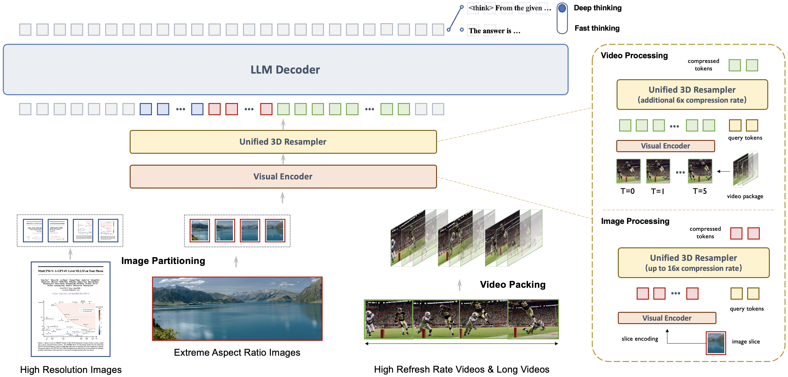
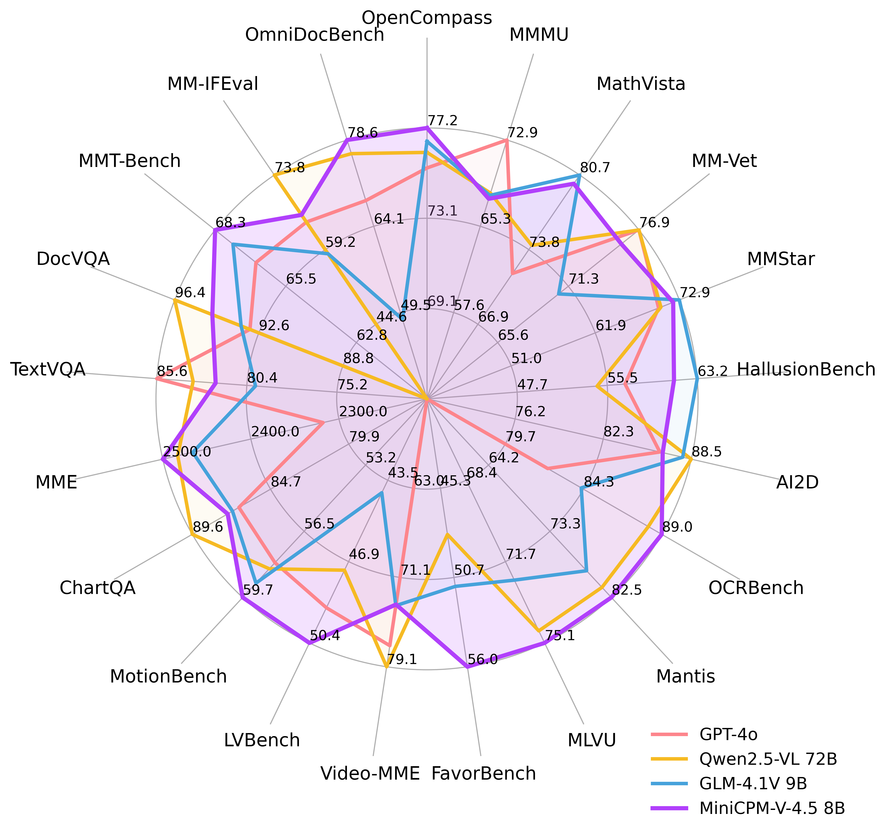
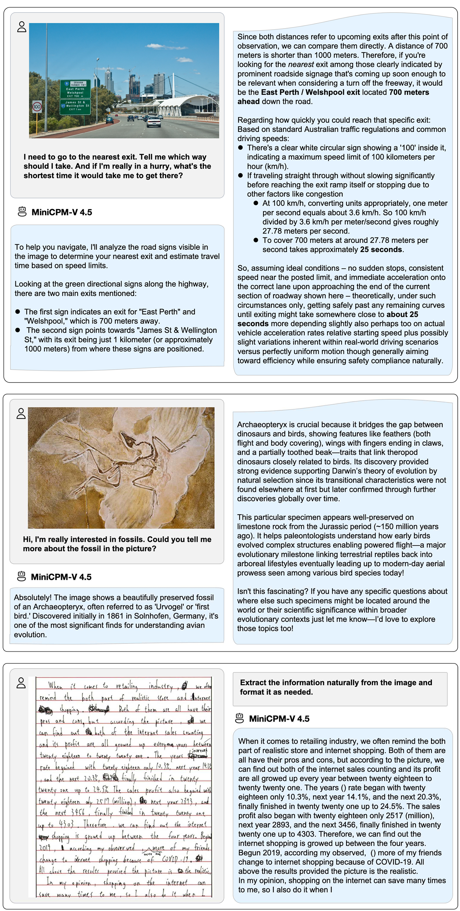
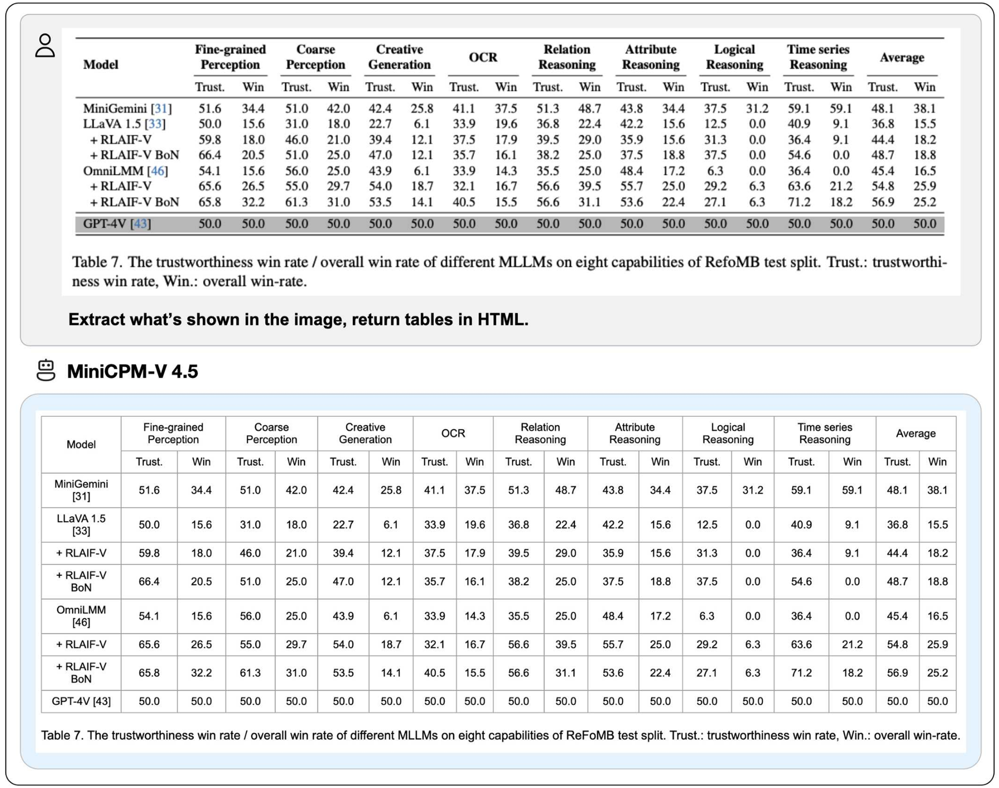
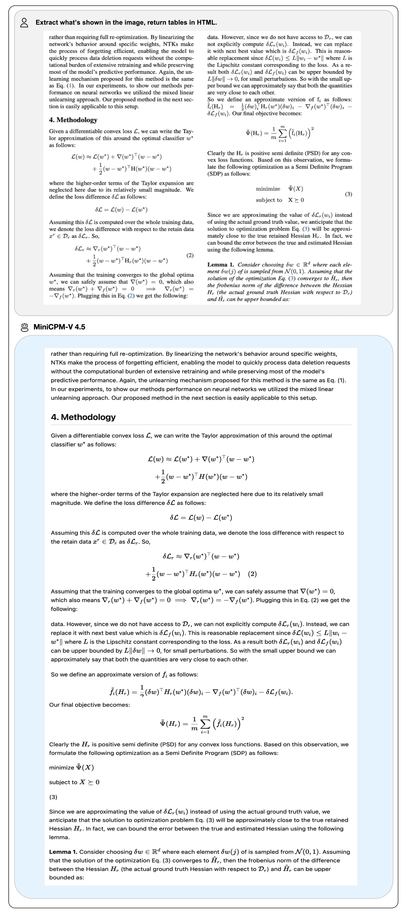
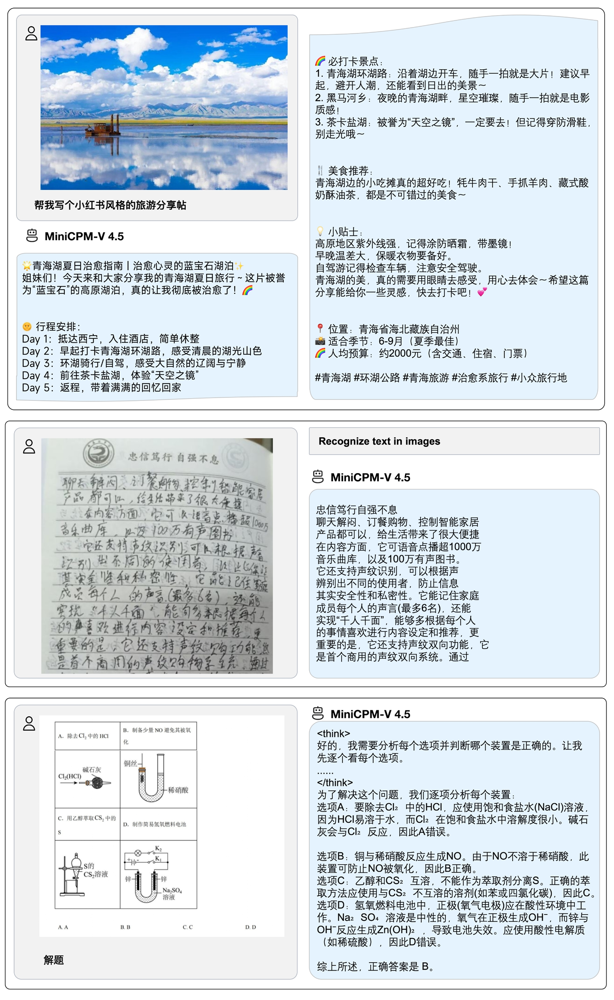
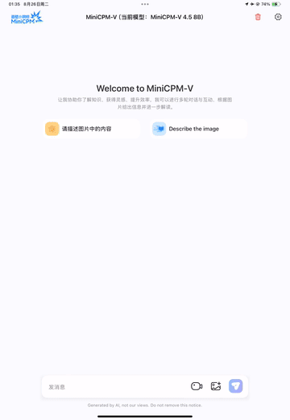
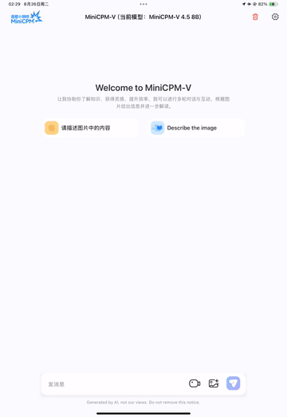
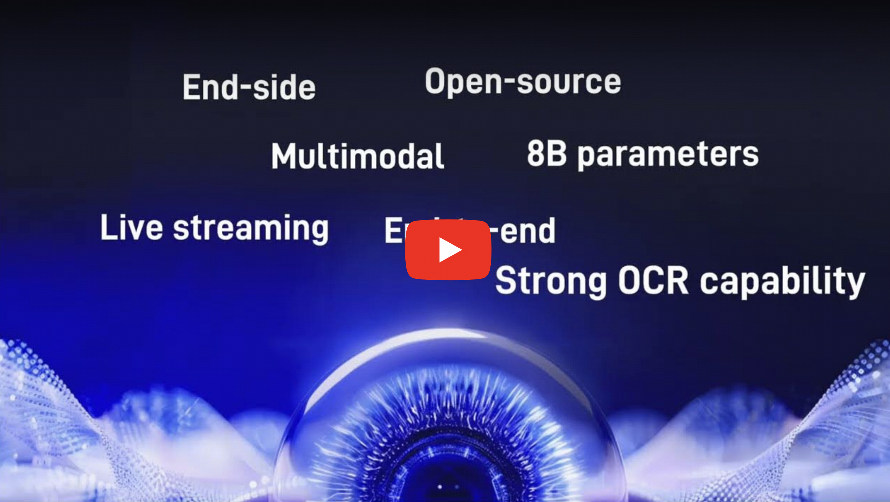

<div align="center">

</img> 

**A GPT-4o Level MLLM for Single Image, Multi Image and High-FPS Video Understanding on Your Phone**

  <strong>[中文](./README_zh.md) |
  English</strong>


<span style="display: inline-flex; align-items: center; margin-right: 2px;">
  
  <a href="docs/wechat.md" target="_blank"> WeChat</a> &nbsp;|
</span>
&nbsp;
<span style="display: inline-flex; align-items: center; margin-left: -8px;">

  <a href="https://discord.gg/rftuRMbqzf" target="_blank"> Discord</a> &nbsp;
</span>


<p align="center">
   MiniCPM-V 4.5 <a href="https://huggingface.co/openbmb/MiniCPM-V-4_5">🤗</a> <a href="http://101.126.42.235:30910/">🤖</a> | MiniCPM-o 2.6 <a href="https://huggingface.co/openbmb/MiniCPM-o-2_6">🤗</a>  <a href="https://minicpm-omni-webdemo-us.modelbest.cn/"> 🤖</a> | <a href="https://github.com/OpenSQZ/MiniCPM-V-Cookbook">🍳 Cookbook</a> | 
  📄 Technical Report (Coming Soon)
</p>

</div>

**MiniCPM-V** is a series of efficient end-side multimodal LLMs (MLLMs), which accept images, videos and text as inputs and deliver high-quality text outputs. **MiniCPM-o** additionally takes audio as inputs and provides high-quality speech outputs in an end-to-end fashion. Since February 2024, we have released 7 versions of the model, aiming to achieve **strong performance and efficient deployment**. The most notable models in the series currently include:


- **MiniCPM-V 4.5**: 🔥🔥🔥 The latest and most capable model in the MiniCPM-V series. With a total of 8B parameters, this model **outperforms GPT-4o-latest, Gemini-2.0 Pro, and Qwen2.5-VL 72B** in vision-language capabilities, making it the most performant on-device multimodal model in the open-source community. This version brings **new features including efficient high-FPS and long video understanding (up to 96x compression rate for video tokens), controllable hybrid fast/deep thinking, strong handwritten OCR and complex table/document parsing**. It also advances MiniCPM-V's popular features such as trustworthy behavior, multilingual support and end-side deployability. 

- **MiniCPM-o 2.6**: ⭐️⭐️⭐️ The most capable model in the MiniCPM-o series. With a total of 8B parameters, this end-to-end model **achieves comparable performance to GPT-4o-202405 in vision, speech, and multimodal live streaming**, making it one of the most versatile and performant models in the open-source community. For the new voice mode, MiniCPM-o 2.6 **supports bilingual real-time speech conversation with configurable voices**, and also allows for fun capabilities such as emotion/speed/style control, end-to-end voice cloning, role play, etc. Due to its superior token density, MiniCPM-o 2.6 can for the first time **support multimodal live streaming on end-side devices** such as iPad.


## News <!-- omit in toc -->

#### 📌 Pinned

* [2025.08.26] 🔥🔥🔥 We open-source MiniCPM-V 4.5, which outperforms GPT-4o-latest, Gemini-2.0 Pro, and Qwen2.5-VL 72B. It advances popular capabilities of MiniCPM-V, and brings useful new features. Try it now!

* [2025.08.01] ⭐️⭐️⭐️ We open-sourced the [MiniCPM-V & o Cookbook](https://github.com/OpenSQZ/MiniCPM-V-CookBook)! It provides comprehensive guides for diverse user scenarios, paired with our new [Docs Site](https://minicpm-o.readthedocs.io/en/latest/index.html) for smoother onboarding.

* [2025.06.20] ⭐️⭐️⭐️ Our official [Ollama repository](https://ollama.com/openbmb) is released. Try our latest models with [one click](https://ollama.com/openbmb/minicpm-o2.6)！

* [2025.03.01] 🚀🚀🚀 RLAIF-V, the alignment technique of MiniCPM-o, is accepted by CVPR 2025 Highlights！The [code](https://github.com/RLHF-V/RLAIF-V), [dataset](https://huggingface.co/datasets/openbmb/RLAIF-V-Dataset), [paper](https://arxiv.org/abs/2405.17220) are open-sourced!

* [2025.01.24] 📢📢📢 MiniCPM-o 2.6 technical report is released! See [here](https://openbmb.notion.site/MiniCPM-o-2-6-A-GPT-4o-Level-MLLM-for-Vision-Speech-and-Multimodal-Live-Streaming-on-Your-Phone-185ede1b7a558042b5d5e45e6b237da9).

* [2025.01.19] 📢 **ATTENTION!** We are currently working on merging MiniCPM-o 2.6 into the official repositories of llama.cpp, Ollama, and vllm. Until the merge is complete, please USE OUR LOCAL FORKS of [llama.cpp](https://github.com/OpenBMB/llama.cpp/blob/minicpm-omni/examples/llava/README-minicpmo2.6.md), [Ollama](https://github.com/OpenBMB/ollama/blob/minicpm-v2.6/examples/minicpm-v2.6/README.md), and [vllm](https://github.com/OpenBMB/MiniCPM-o?tab=readme-ov-file#efficient-inference-with-llamacpp-ollama-vllm). **Using the official repositories before the merge may lead to unexpected issues**.

* [2025.01.19] ⭐️⭐️⭐️ MiniCPM-o tops GitHub Trending and reaches top-2 on Hugging Face Trending!

* [2025.01.17] We have updated the usage of MiniCPM-o 2.6 int4 quantization version and resolved the model initialization error. Click [here](https://huggingface.co/openbmb/MiniCPM-o-2_6-int4) and try it now!

* [2025.01.13] 🔥🔥🔥 We open-source MiniCPM-o 2.6, which matches GPT-4o-202405 on vision, speech and multimodal live streaming. It advances popular capabilities of MiniCPM-V 2.6, and supports various new fun features. Try it now!

* [2024.08.17] 🚀🚀🚀 MiniCPM-V 2.6 is now fully supported by [official](https://github.com/ggerganov/llama.cpp) llama.cpp! GGUF models of various sizes are available [here](https://huggingface.co/openbmb/MiniCPM-V-2_6-gguf).

* [2024.08.06] 🔥🔥🔥 We open-source MiniCPM-V 2.6, which outperforms GPT-4V on single image, multi-image and video understanding. It advances popular features of MiniCPM-Llama3-V 2.5, and can support real-time video understanding on iPad. Try it now!

* [2024.08.03] MiniCPM-Llama3-V 2.5 technical report is released! See [here](https://arxiv.org/abs/2408.01800).

* [2024.05.23] 🔥🔥🔥 MiniCPM-V tops GitHub Trending and Hugging Face Trending! Our demo, recommended by Hugging Face Gradio’s official account, is available [here](https://huggingface.co/spaces/openbmb/MiniCPM-Llama3-V-2_5). Come and try it out!

<br>

<details> 
<summary>Click to view more news.</summary>

* [2025.08.02] 🚀🚀🚀 We open-source MiniCPM-V 4.0, which outperforms GPT-4.1-mini-20250414 in image understanding. It advances popular features of MiniCPM-V 2.6, and largely improves the efficiency. We also open-source the iOS App on iPhone and iPad. Try it now!

* [2025.01.23] 💡💡💡 MiniCPM-o 2.6 is now supported by [Align-Anything](https://github.com/PKU-Alignment/align-anything), a framework by PKU-Alignment Team for aligning any-to-any modality large models with human intentions. It supports DPO and SFT fine-tuning on both vision and audio. Try it now!

* [2024.08.15] We now also support multi-image SFT. For more details, please refer to the [document](https://github.com/OpenBMB/MiniCPM-V/tree/main/finetune).
* [2024.08.14] MiniCPM-V 2.6 now also supports [fine-tuning](https://github.com/modelscope/ms-swift/issues/1613) with the SWIFT framework!
* [2024.08.10] 🚀🚀🚀 MiniCPM-Llama3-V 2.5 is now fully supported by [official](https://github.com/ggerganov/llama.cpp) llama.cpp! GGUF models of various sizes are available [here](https://huggingface.co/openbmb/MiniCPM-Llama3-V-2_5-gguf).

* [2024.07.19] MiniCPM-Llama3-V 2.5 supports vLLM now! See [here](#inference-with-vllm).

* [2024.06.03] Now, you can run MiniCPM-Llama3-V 2.5 on multiple low VRAM GPUs(12 GB or 16 GB) by distributing the model's layers across multiple GPUs. For more details, check this [link](https://github.com/OpenBMB/MiniCPM-V/blob/main/docs/inference_on_multiple_gpus.md).
* [2024.05.28] 🚀🚀🚀 MiniCPM-Llama3-V 2.5 now fully supports its feature in llama.cpp and Ollama! Please pull the latest code **of our provided forks** ([llama.cpp](https://github.com/OpenBMB/llama.cpp/blob/minicpm-v2.5/examples/minicpmv/README.md), [Ollama](https://github.com/OpenBMB/ollama/tree/minicpm-v2.5/examples/minicpm-v2.5)). GGUF models in various sizes are available [here](https://huggingface.co/openbmb/MiniCPM-Llama3-V-2_5-gguf/tree/main). MiniCPM-Llama3-V 2.5 series is **not supported by the official repositories yet**, and we are working hard to merge PRs. Please stay tuned!

* [2024.05.28] 💫 We now support LoRA fine-tuning for MiniCPM-Llama3-V 2.5, using only 2 V100 GPUs! See more statistics [here](https://github.com/OpenBMB/MiniCPM-V/tree/main/finetune#model-fine-tuning-memory-usage-statistics).

* [2024.05.25] MiniCPM-Llama3-V 2.5 now supports streaming outputs and customized system prompts. Try it [here](https://huggingface.co/openbmb/MiniCPM-Llama3-V-2_5#usage)!
* [2024.05.24] We release the MiniCPM-Llama3-V 2.5 [gguf](https://huggingface.co/openbmb/MiniCPM-Llama3-V-2_5-gguf), which supports [llama.cpp](#inference-with-llamacpp) inference and provides a 6~8 token/s smooth decoding on mobile phones. Try it now!

* [2024.05.23] 🔍 We've released a comprehensive comparison between Phi-3-vision-128k-instruct and MiniCPM-Llama3-V 2.5, including benchmark evaluations, multilingual capabilities, and inference efficiency 🌟📊🌍🚀. Click [here](./docs/compare_with_phi-3_vision.md) to view more details.

* [2024.05.20] We open-soure MiniCPM-Llama3-V 2.5, it has improved OCR capability and supports 30+ languages, representing the first end-side MLLM achieving GPT-4V level performance! We provide [efficient inference](#deployment-on-mobile-phone) and [simple fine-tuning](./finetune/readme.md). Try it now!
* [2024.04.23] MiniCPM-V-2.0 supports vLLM now! Click [here](#inference-with-vllm) to view more details.
* [2024.04.18] We create a HuggingFace Space to host the demo of MiniCPM-V 2.0 at [here](https://huggingface.co/spaces/openbmb/MiniCPM-V-2)!
* [2024.04.17] MiniCPM-V-2.0 supports deploying [WebUI Demo](#webui-demo) now!
* [2024.04.15] MiniCPM-V-2.0 now also supports [fine-tuning](https://github.com/modelscope/swift/blob/main/docs/source/Multi-Modal/minicpm-v-2最佳实践.md) with the SWIFT framework!
* [2024.04.12] We open-source MiniCPM-V 2.0, which achieves comparable performance with Gemini Pro in understanding scene text and outperforms strong Qwen-VL-Chat 9.6B and Yi-VL 34B on <a href="https://rank.opencompass.org.cn/leaderboard-multimodal">OpenCompass</a>, a comprehensive evaluation over 11 popular benchmarks. Click <a href="https://openbmb.vercel.app/minicpm-v-2">here</a> to view the MiniCPM-V 2.0 technical blog.
* [2024.03.14] MiniCPM-V now supports [fine-tuning](https://github.com/modelscope/swift/blob/main/docs/source/Multi-Modal/minicpm-v最佳实践.md) with the SWIFT framework. Thanks to [Jintao](https://github.com/Jintao-Huang) for the contribution！
* [2024.03.01] MiniCPM-V can now be deployed on Mac!
* [2024.02.01] We open-source MiniCPM-V and OmniLMM-12B, which support efficient end-side deployment and powerful multimodal capabilities correspondingly.
</details> 


## Contents <!-- omit in toc -->


- [MiniCPM-V 4.5](#minicpm-v-45)
- [MiniCPM-o 2.6](#minicpm-o-26)
- [MiniCPM-V \& o Cookbook](#minicpm-v--o-cookbook)
- [Chat with Our Demo on Gradio 🤗](#chat-with-our-demo-on-gradio-)
- [Inference](#inference)
  - [Model Zoo](#model-zoo)
  - [Multi-turn Conversation](#multi-turn-conversation)
    - [Chat with Multiple Images](#chat-with-multiple-images)
    - [In-context Few-shot Learning](#in-context-few-shot-learning)
    - [Chat with Video](#chat-with-video)
    - [Speech and Audio Mode](#speech-and-audio-mode)
    - [Multimodal Live Streaming](#multimodal-live-streaming)
  - [Inference on Multiple GPUs](#inference-on-multiple-gpus)
  - [Inference on Mac](#inference-on-mac)
  - [Efficient Inference with llama.cpp, Ollama, vLLM](#efficient-inference-with-llamacpp-ollama-vllm)
- [Fine-tuning](#fine-tuning)
- [Awesome work using MiniCPM-V \& MiniCPM-o](#awesome-work-using-minicpm-v--minicpm-o)
- [FAQs](#faqs)
- [Limitations](#limitations)


## MiniCPM-V 4.5

**MiniCPM-V 4.5** is the latest and most capable model in the MiniCPM-V series. The model is built on Qwen3-8B and SigLIP2-400M with a total of 8B parameters. It exhibits a significant performance improvement over previous MiniCPM-V and MiniCPM-o models, and introduces new useful features. Notable features of MiniCPM-V 4.5 include:

- 🔥 **State-of-the-art Vision-Language Capability.**
  MiniCPM-V 4.5 achieves an average score of 77.0 on OpenCompass, a comprehensive evaluation of 8 popular benchmarks. **With only 8B parameters, it surpasses widely used proprietary models like GPT-4o-latest, Gemini-2.0 Pro, and strong open-source models like Qwen2.5-VL 72B** for vision-language capabilities, making it the most performant MLLM under 30B parameters.

- 🎬 **Efficient High-FPS and Long Video Understanding.** Powered by a new unified 3D-Resampler over images and videos, MiniCPM-V 4.5 can now achieve 96x compression rate for video tokens, where 6 448x448 video frames can be jointly compressed into 64 video tokens (normally 1,536 tokens for most MLLMs). This means that the model can perceive significantly more video frames without increasing the LLM inference cost. This brings state-of-the-art high-FPS (up to 10FPS) video understanding and long video understanding capabilities on Video-MME, LVBench, MLVU, MotionBench, FavorBench, etc., efficiently.

- ⚙️ **Controllable Hybrid Fast/Deep Thinking.** MiniCPM-V 4.5 supports both fast thinking for efficient frequent usage with competitive performance, and deep thinking for more complex problem solving. To cover efficiency and performance trade-offs in different user scenarios, this fast/deep thinking mode can be switched in a highly controlled fashion.

- 💪 **Strong OCR, Document Parsing and Others.**
Based on [LLaVA-UHD](https://arxiv.org/pdf/2403.11703) architecture, MiniCPM-V 4.5 can process high-resolution images with any aspect ratio and up to 1.8 million pixels (e.g., 1344x1344), using 4x fewer visual tokens than most MLLMs. The model achieves **leading performance on OCRBench, surpassing proprietary models such as GPT-4o-latest and Gemini 2.5**. It also achieves state-of-the-art performance for PDF document parsing capability on OmniDocBench among general MLLMs. Based on the latest [RLAIF-V](https://github.com/RLHF-V/RLAIF-V/) and [VisCPM](https://github.com/OpenBMB/VisCPM) techniques, it features **trustworthy behaviors**, outperforming GPT-4o-latest on MMHal-Bench, and supports **multilingual capabilities** in more than 30 languages.


-  💫  **Easy Usage.**
MiniCPM-V 4.5 can be easily used in various ways: (1) [llama.cpp](https://github.com/tc-mb/llama.cpp/blob/Support-MiniCPM-V-4.5/docs/multimodal/minicpmv4.5.md) and [ollama](https://github.com/tc-mb/ollama/tree/MIniCPM-V) support for efficient CPU inference on local devices, (2) [int4](https://huggingface.co/openbmb/MiniCPM-V-4_5-int4), [GGUF](https://huggingface.co/openbmb/MiniCPM-V-4_5-gguf) and [AWQ](https://github.com/tc-mb/AutoAWQ) format quantized models in 16 sizes, (3) [SGLang](https://github.com/tc-mb/sglang/tree/main) and [vLLM](#efficient-inference-with-llamacpp-ollama-vllm) support for high-throughput and memory-efficient inference, (4) fine-tuning on new domains and tasks with [Transformers](https://github.com/tc-mb/transformers/tree/main) and [LLaMA-Factory](./docs/llamafactory_train_and_infer.md), (5) quick [local WebUI demo](#chat-with-our-demo-on-gradio), (6) optimized [local iOS app](https://github.com/tc-mb/MiniCPM-o-demo-iOS) on iPhone and iPad, and (7) online web demo on [server](http://101.126.42.235:30910/). See our [Cookbook](https://github.com/OpenSQZ/MiniCPM-V-CookBook) for full usage!


### Key Techniques <!-- omit in toc -->


<div align="center">

</div>

- **Architechture: Unified 3D-Resampler for High-density Video Compression.** MiniCPM-V 4.5 introduces a 3D-Resampler that overcomes the performance-efficiency trade-off in video understanding. By grouping and jointly compressing up to 6 consecutive video frames into just 64 tokens (the same token count used for a single image in MiniCPM-V series), MiniCPM-V 4.5 achieves a 96× compression rate for video tokens. This allows the model to process more video frames without additional LLM computational cost, enabling high-FPS video and long video understanding. The architecture supports unified encoding for images, multi-image inputs, and videos, ensuring seamless capability and knowledge transfer.

- **Pre-training: Unified Learning for OCR and Knowledge from Documents.** Existing MLLMs learn OCR capability and knowledge from documents in isolated training approaches. We observe that the essential difference between these two training approaches is the visibility of the text in images. By dynamically corrupting text regions in documents with varying noise levels and asking the model to reconstruct the text, the model learns to adaptively and properly switch between accurate text recognition (when text is visible) and multimodal context-based knowledge reasoning (when text is heavily obscured). This eliminates reliance on error-prone document parsers in knowledge learning from documents, and prevents hallucinations from over-augmented OCR data, resulting in top-tier OCR and multimodal knowledge performance with minimal engineering overhead.

- **Post-training: Hybrid Fast/Deep Thinking with Multimodal RL.** MiniCPM-V 4.5 offers a balanced reasoning experience through two switchable modes: fast thinking for efficient daily use and deep thinking for complex tasks. Using a new hybrid reinforcement learning method, the model jointly optimizes both modes, significantly enhancing fast-mode performance without compromising deep-mode capability. Incorporated with [RLPR](https://github.com/OpenBMB/RLPR) and [RLAIF-V](https://github.com/RLHF-V/RLAIF-V), it generalizes robust reasoning skills from broad multimodal data while effectively reducing hallucinations.

### Evaluation  <!-- omit in toc -->

<div align="center">
  
</div>
<div align="center">

</div>


### Inference Efficiency 


**OpenCompass**
<div align="left">
<table style="margin: 0px auto;">
    <thead>
            <tr>
              <th align="left">Model</th>
              <th>Size</th>
              <th>Avg Score ↑</th>
              <th>Total Inference Time ↓</th>
            </tr>
    </thead>
    <tbody align="center">
        <tr>
            <td nowrap="nowrap" align="left">GLM-4.1V-9B-Thinking</td>
            <td>10.3B</td>
            <td>76.6</td>
            <td>17.5h</td>
        </tr>
        <tr>
            <td nowrap="nowrap" align="left">MiMo-VL-7B-RL</td>
            <td>8.3B</td>
            <td>76.4</td>
            <td>11h</td>
        </tr>
        <tr>
            <td nowrap="nowrap" align="left">MiniCPM-V 4.5</td>
            <td>8.7B</td>
            <td><b>77.0</td>
            <td><b>7.5h</td>
        </tr>
    </tbody>
</table>
</div>

**Video-MME**

<div align="left">
<table style="margin: 0px auto;">
    <thead>
          <tr>
              <th align="left">Model</th>
              <th>Size</th>
              <th>Avg Score ↑</th>
              <th>Total Inference Time ↓</th>
              <th>GPU Mem ↓</th>
          </tr>
    </thead>
    <tbody align="center">
          <tr>
              <td nowrap="nowrap" align="left">Qwen2.5-VL-7B-Instruct</td>
              <td>8.3B</td>
              <td>71.6</td>
              <td>3h</td>
              <td>60G</td>
          </tr>
          <tr>
              <td nowrap="nowrap" align="left">GLM-4.1V-9B-Thinking</td>
              <td>10.3B</td>
              <td><b>73.6</td>
              <td>2.63h</td>
              <td>32G</td>
          </tr>
          <tr>
              <td nowrap="nowrap" align="left">MiniCPM-V 4.5</td>
              <td>8.7B</td>
              <td>73.5</td>
              <td><b>0.26h</td>
              <td><b>28G</td>
        </tr>
    </tbody>
</table>
</div>

Both Video-MME and OpenCompass were evaluated using 8×A100 GPUs for inference. The reported inference time of Video-MME excludes the cost of video frame extraction.


### Examples  <!-- omit in toc -->

<div align="center">
  <a href="https://www.youtube.com/watch?v=Cn23FujYMMU"></a>
</div>

<div style="display: flex; flex-direction: column; align-items: center;">
  
  
  
</div>

<details>
<summary>Click to view more cases.</summary>
<div style="display: flex; flex-direction: column; align-items: center;">
  
</div>

</details>

We deploy MiniCPM-V 4.5 on iPad M4 with [iOS demo](https://github.com/tc-mb/MiniCPM-o-demo-iOS). The demo video is the raw screen recording without edition.

<table align="center"> 
    <p align="center">
      
      &nbsp;&nbsp;&nbsp;&nbsp;
      
    </p>
    <p align="center">
      
      &nbsp;&nbsp;&nbsp;&nbsp;
      
    </p>
</table>

## MiniCPM-o 2.6

**MiniCPM-o 2.6** is the latest and most capable model in the MiniCPM-o series. The model is built in an end-to-end fashion based on SigLip-400M, Whisper-medium-300M, ChatTTS-200M, and Qwen2.5-7B with a total of 8B parameters. It exhibits a significant performance improvement over MiniCPM-V 2.6, and introduces new features for real-time speech conversation and multimodal live streaming. Notable features of MiniCPM-o 2.6 include:

- 🔥 **Leading Visual Capability.**
  MiniCPM-o 2.6 achieves an average score of 70.2 on OpenCompass, a comprehensive evaluation of 8 popular benchmarks. **With only 8B parameters, it surpasses widely used proprietary models like GPT-4o-202405, Gemini 1.5 Pro, and Claude 3.5 Sonnet** for single image understanding. It also **outperforms GPT-4V and Claude 3.5 Sonnet** in multi-image and video understanding, and shows promising in-context learning capability.

- 🎙 **State-of-the-art Speech Capability.** MiniCPM-o 2.6 supports **bilingual real-time speech conversation with configurable voices** in English and Chinese. It **outperforms GPT-4o-realtime on audio understanding tasks** such as ASR and STT translation, and shows **state-of-the-art performance on speech conversation in both semantic and acoustic evaluations in the open-source community**. It also allows for fun features such as emotion/speed/style control, end-to-end voice cloning, role play, etc.

- 🎬 **Strong Multimodal Live Streaming Capability.** As a new feature, MiniCPM-o 2.6 can **accept continuous video and audio streams independent of user queries, and support real-time speech interaction**. It **outperforms GPT-4o-202408 and Claude 3.5 Sonnet and shows state-of-the-art performance in the open-source community on StreamingBench**, a comprehensive benchmark for real-time video understanding, omni-source (video & audio) understanding, and multimodal contextual understanding.

- 💪 **Strong OCR Capability and Others.**
Advancing popular visual capabilities from MiniCPM-V series, MiniCPM-o 2.6 can process images with any aspect ratio and up to 1.8 million pixels (e.g., 1344x1344). It achieves **state-of-the-art performance on OCRBench for models under 25B, surpassing proprietary models such as GPT-4o-202405**.
  Based on the latest [RLAIF-V](https://github.com/RLHF-V/RLAIF-V/) and [VisCPM](https://github.com/OpenBMB/VisCPM) techniques, it features **trustworthy behaviors**, outperforming GPT-4o and Claude 3.5 Sonnet on MMHal-Bench, and supports **multilingual capabilities** on more than 30 languages.


- 🚀 **Superior Efficiency.**
  In addition to its friendly size, MiniCPM-o 2.6 also shows **state-of-the-art token density** (i.e., the number of pixels encoded into each visual token). **It produces only 640 tokens when processing a 1.8M pixel image, which is 75% fewer than most models**. This directly improves the inference speed, first-token latency, memory usage, and power consumption. As a result, MiniCPM-o 2.6 can efficiently support **multimodal live streaming** on end-side devices such as iPads.

-  💫  **Easy Usage.**
MiniCPM-o 2.6 can be easily used in various ways: (1) [llama.cpp](https://github.com/OpenBMB/llama.cpp/blob/minicpm-omni/examples/llava/README-minicpmo2.6.md) support for efficient CPU inference on local devices, (2) [int4](https://huggingface.co/openbmb/MiniCPM-o-2_6-int4) and [GGUF](https://huggingface.co/openbmb/MiniCPM-o-2_6-gguf) format quantized models in 16 sizes, (3) [vLLM](#efficient-inference-with-llamacpp-ollama-vllm) support for high-throughput and memory-efficient inference, (4) fine-tuning on new domains and tasks with [LLaMA-Factory](./docs/llamafactory_train_and_infer.md), (5) quick [local WebUI demo](#chat-with-our-demo-on-gradio), and (6) online web demo on [server](https://minicpm-omni-webdemo-us.modelbest.cn/).

**Model Architecture.**

- **End-to-end Omni-modal Architecture.** Different modality encoders/decoders are connected and trained in an **end-to-end** fashion to fully exploit rich multimodal knowledge. The model is trained in a fully end-to-end manner with only CE loss.
- **Omni-modal Live Streaming Mechanism.** (1) We change the offline modality encoder/decoders into online ones for **streaming inputs/outputs.** (2) We devise a **time-division multiplexing (TDM) mechanism** for omni-modality streaming processing in the LLM backbone. It divides parallel omni-modality streams into sequential info within small periodic time slices. 
- **Configurable Speech Modeling Design.** We devise a multimodal system prompt, including traditional text system prompt, and **a new audio system prompt to determine the assistant voice**. This enables flexible voice configurations in inference time, and also facilitates end-to-end voice cloning and description-based voice creation.

<div align="center">

</div>


### Evaluation  <!-- omit in toc -->

<div align="center">
  
</div>

<details>
<summary>Click to view visual understanding results.</summary>

**Image Understanding**

<div align="center">
<table style="margin: 0px auto;">
    <thead>
        <tr>
            <th align="left">Model</th>
            <th>Size</th>
            <th>Token Density<sup>+</sup></th>
            <th>OpenCompass</th>
            <th>OCRBench</th>
            <th>MathVista mini</th>
            <th>ChartQA</th>
            <th>MMVet</th>
            <th>MMStar</th>
            <th>MME</th>
            <th>MMB1.1 test</th>
            <th>AI2D</th>
            <th>MMMU val</th>
            <th>HallusionBench</th>
            <th>TextVQA val</th>
            <th>DocVQA test</th>
            <th>MathVerse mini</th>
            <th>MathVision</th>
            <th>MMHal Score</th>
        </tr>
    </thead>
    <tbody align="center">
        <tr>
            <td colspan="19" align="left"><strong>Proprietary</strong></td>
        </tr>
        <tr>
            <td nowrap="nowrap" align="left">GPT-4o-20240513</td>
            <td>-</td>
            <td>1088</td>
            <td><u>69.9</u></td>
            <td>736</td>
            <td>61.3</td>
            <td>85.7</td>
            <td><strong>69.1</strong></td>
            <td>63.9</td>
            <td>2328.7</td>
            <td>82.2</td>
            <td>84.6</td>
            <td><strong>69.2</strong></td>
            <td><strong>55.0</strong></td>
            <td>-</td>
            <td>92.8</td>
            <td><strong>50.2</strong></td>
            <td><strong>30.4</strong></td>
            <td><u>3.6</u></td>
        </tr>
        <tr>
            <td nowrap="nowrap" align="left">Claude3.5-Sonnet</td>
            <td>-</td>
            <td>750</td>
            <td>67.9</td>
            <td>788</td>
            <td>61.6</td>
            <td><strong>90.8</strong></td>
            <td>66.0</td>
            <td>62.2</td>
            <td>1920.0</td>
            <td>78.5</td>
            <td>80.2</td>
            <td><u>65.9</u></td>
            <td>49.9</td>
            <td>-</td>
            <td><strong>95.2</strong></td>
            <td>-</td>
            <td>-</td>
            <td>3.4</td>
        </tr>
        <tr>
            <td nowrap="nowrap" align="left">Gemini 1.5 Pro</td>
            <td>-</td>
            <td>-</td>
            <td>64.4</td>
            <td>754</td>
            <td>57.7</td>
            <td>81.3</td>
            <td>64.0</td>
            <td>59.1</td>
            <td>2110.6</td>
            <td>73.9</td>
            <td>79.1</td>
            <td>60.6</td>
            <td>45.6</td>
            <td>73.5</td>
            <td>86.5</td>
            <td>-</td>
            <td>19.2</td>
            <td>-</td>
        </tr>
        <tr>
            <td nowrap="nowrap" align="left">GPT-4o-mini-20240718</td>
            <td>-</td>
            <td>1088</td>
            <td>64.1</td>
            <td>785</td>
            <td>52.4</td>
            <td>-</td>
            <td>66.9</td>
            <td>54.8</td>
            <td>2003.4</td>
            <td>76.0</td>
            <td>77.8</td>
            <td>60.0</td>
            <td>46.1</td>
            <td>-</td>
            <td>-</td>
            <td>-</td>
            <td>-</td>
            <td>3.3</td>
        </tr>
        <tr>
            <td colspan="19" align="left"><strong>Open Source</strong></td>
        </tr>
        <tr>
            <td nowrap="nowrap" align="left">Cambrian-34B</td>
            <td>34B</td>
            <td><u>1820</u></td>
            <td>58.3</td>
            <td>591</td>
            <td>50.3</td>
            <td>75.6</td>
            <td>53.2</td>
            <td>54.2</td>
            <td>2049.9</td>
            <td>77.8</td>
            <td>79.5</td>
            <td>50.4</td>
            <td>41.6</td>
            <td>76.7</td>
            <td>75.5</td>
            <td>-</td>
            <td>-</td>
            <td>-</td>
        </tr>
        <tr>
            <td nowrap="nowrap" align="left">GLM-4V-9B</td>
            <td>13B</td>
            <td>784</td>
            <td>59.1</td>
            <td>776</td>
            <td>51.1</td>
            <td>-</td>
            <td>58.0</td>
            <td>54.8</td>
            <td>2018.8</td>
            <td>67.9</td>
            <td>71.2</td>
            <td>46.9</td>
            <td>45.0</td>
            <td>-</td>
            <td>-</td>
            <td>-</td>
            <td>-</td>
            <td>-</td>
        </tr>
        <tr>
            <td nowrap="nowrap" align="left">Pixtral-12B</td>
            <td>12B</td>
            <td>256</td>
            <td>61.0</td>
            <td>685</td>
            <td>56.9</td>
            <td>81.8</td>
            <td>58.5</td>
            <td>54.5</td>
            <td>-</td>
            <td>72.7</td>
            <td>79.0</td>
            <td>51.1</td>
            <td>47.0</td>
            <td>75.7</td>
            <td>90.7</td>
            <td>-</td>
            <td>-</td>
            <td>-</td>
        </tr>
        <tr>
            <td nowrap="nowrap" align="left">VITA-1.5</td>
            <td>8B</td>
            <td>784</td>
            <td>63.3</td>
            <td>741</td>
            <td>66.2</td>
            <td>-</td>
            <td>52.7</td>
            <td>60.2</td>
            <td>2328.1</td>
            <td>76.8</td>
            <td>79.2</td>
            <td>52.6</td>
            <td>44.6</td>
            <td>-</td>
            <td>-</td>
            <td>-</td>
            <td>-</td>
            <td>-</td>
        </tr>
        <tr>
            <td nowrap="nowrap" align="left">DeepSeek-VL2-27B (4B)</td>
            <td>27B</td>
            <td>672</td>
            <td>66.4</td>
            <td>809</td>
            <td>63.9</td>
            <td>86.0</td>
            <td>60.0</td>
            <td>61.9</td>
            <td>2253.0</td>
            <td>81.2</td>
            <td>83.8</td>
            <td>54.0</td>
            <td>45.3</td>
            <td><u>84.2</u></td>
            <td>93.3</td>
            <td>-</td>
            <td>-</td>
            <td>3.0</td>
        </tr>
        <tr>
            <td nowrap="nowrap" align="left">Qwen2-VL-7B</td>
            <td>8B</td>
            <td>784</td>
            <td>67.1</td>
            <td><u>866</u></td>
            <td>58.2</td>
            <td>83.0</td>
            <td>62.0</td>
            <td>60.7</td>
            <td>2326.0</td>
            <td>81.8</td>
            <td>83.0</td>
            <td>54.1</td>
            <td>50.6</td>
            <td><strong>84.3</strong></td>
            <td><u>94.5</u></td>
            <td>31.9</td>
            <td>16.3</td>
            <td>3.2</td>
        </tr>
        <tr>
            <td nowrap="nowrap" align="left">LLaVA-OneVision-72B</td>
            <td>72B</td>
            <td>182</td>
            <td>68.1</td>
            <td>741</td>
            <td>67.5</td>
            <td>83.7</td>
            <td>60.6</td>
            <td><strong>65.8</strong></td>
            <td>2261.0</td>
            <td><strong>85.0</strong></td>
            <td><u>85.6</u></td>
            <td>56.8</td>
            <td>49.0</td>
            <td>80.5</td>
            <td>91.3</td>
            <td>39.1</td>
            <td>-</td>
            <td>3.5</td>
        </tr>
        <tr>
            <td nowrap="nowrap" align="left">InternVL2.5-8B</td>
            <td>8B</td>
            <td>706</td>
            <td>68.3</td>
            <td>822</td>
            <td><u>64.4</u></td>
            <td>84.8</td>
            <td>62.8</td>
            <td>62.8</td>
            <td>2344.0</td>
            <td><u>83.6</u></td>
            <td>84.5</td>
            <td>56.0</td>
            <td>50.1</td>
            <td>79.1</td>
            <td>93.0</td>
            <td>39.5</td>
            <td>19.7</td>
            <td>3.4</td>
        </tr>
        <tr>
            <td nowrap="nowrap" align="left">MiniCPM-V 2.6</td>
            <td>8B</td>
            <td><strong>2822</strong></td>
            <td>65.2</td>
            <td>852*</td>
            <td>60.6</td>
            <td>79.4</td>
            <td>60.0</td>
            <td>57.5</td>
            <td><u>2348.4*</u></td>
            <td>78.0</td>
            <td>82.1</td>
            <td>49.8*</td>
            <td>48.1*</td>
            <td>80.1</td>
            <td>90.8</td>
            <td>25.7</td>
            <td>18.3</td>
            <td>3.6</td>
        </tr>
        <tr>
            <td nowrap="nowrap" align="left">MiniCPM-o 2.6</td>
            <td>8B</td>
            <td><strong>2822</strong></td>
            <td><strong>70.2</strong></td>
            <td><strong>897*</strong></td>
            <td><strong>71.9*</strong></td>
            <td><u>86.9*</u></td>
            <td><u>67.5</u></td>
            <td><u>64.0</u></td>
            <td><strong>2372.0*</strong></td>
            <td>80.5</td>
            <td><strong>85.8</strong></td>
            <td>50.4*</td>
            <td><u>51.9</u></td>
            <td>82.0</td>
            <td>93.5</td>
            <td><u>41.4*</u></td>
            <td><u>23.1*</u></td>
            <td><strong>3.8</strong></td>
        </tr>
    </tbody>
</table>
</div>
* We evaluate this benchmark using chain-of-thought prompting. Specifically, for MME, we used this technique only for the Cognition set.


<sup>+</sup> Token Density: number of pixels encoded into each visual token at maximum resolution, i.e., # pixels at maximum resolution / # visual tokens.

Note: For proprietary models, we calculate token density based on the image encoding charging strategy defined in the official API documentation, which provides an upper-bound estimation.


**Multi-image and Video Understanding**

<div align="center">
 
<table style="margin: 0px auto;">
    <thead>
        <tr>
            <th align="left">Model</th>
            <th>Size</th>
            <th>BLINK val</th>
            <th>Mantis Eval</th>
            <th>MIRB</th>
            <th>Video-MME (wo / w subs)</th>
        </tr>
    </thead>
    <tbody align="center">
        <tr>
            <td colspan="6" align="left"><strong>Proprietary</strong></td>
        </tr>
        <tr>
            <td nowrap="nowrap" align="left">GPT-4o-20240513</td>
            <td>-</td>
            <td><strong>68.0</strong></td>
            <td>-</td>
            <td>-</td>
            <td><strong>71.9/77.2<strong></td>
        </tr>
        <tr>
            <td nowrap="nowrap" align="left">GPT4V</td>
            <td>-</td>
            <td>54.6</td>
            <td>62.7</td>
            <td>53.1</td>
            <td>59.9/63.3</td>
        </tr>
        <tr>
            <td colspan="6" align="left"><strong>Open-source</strong></td>
        </tr>
        <tr>
            <td nowrap="nowrap" align="left">VITA-1.5</td>
            <td>8B</td>
            <td>45.0</td>
            <td>-</td>
            <td>-</td>
            <td>56.1/58.7</td>
        </tr>
        <tr>
            <td nowrap="nowrap" align="left">LLaVA-NeXT-Interleave 14B</td>
            <td>14B</td>
            <td>52.6</td>
            <td>66.4</td>
            <td>30.2</td>
            <td>-</td>
        </tr>
        <tr>
            <td nowrap="nowrap" align="left">LLaVA-OneVision-72B</td>
            <td>72B</td>
            <td>55.4</td>
            <td><strong>77.6</strong></td>
            <td>-</td>
            <td><u>66.2/69.5</u></td>
        </tr>
        <tr>
            <td nowrap="nowrap" align="left">MANTIS 8B</td>
            <td>8B</td>
            <td>49.1</td>
            <td>59.5</td>
            <td>34.8</td>
            <td>-</td>
        </tr>
        <tr>
            <td nowrap="nowrap" align="left">Qwen2-VL-7B</td>
            <td>8B</td>
            <td>53.2</td>
            <td>69.6*</td>
            <td><strong>67.6*</strong></td>
            <td>63.3/69.0</td>
        </tr>
        <tr>
            <td nowrap="nowrap" align="left">InternVL2.5-8B</td>
            <td>8B</td>
            <td>54.8</td>
            <td>67.7</td>
            <td>52.5</td>
            <td>64.2/66.9</td>
        </tr>
        <tr>
            <td nowrap="nowrap" align="left">MiniCPM-V 2.6</td>
            <td>8B</td>
            <td>53.0</td>
            <td>69.1</td>
            <td>53.8</td>
            <td>60.9/63.6</td>
        </tr>
        <tr>
            <td nowrap="nowrap" align="left">MiniCPM-o 2.6</td>
            <td>8B</td>
            <td><u>56.7</u></td>
            <td><u>71.9</u></td>
            <td><u>58.6</u></td>
            <td>63.9/67.9</td>
        </tr>
    </tbody>
</table>

</div>
* We evaluate officially released checkpoints by ourselves.

</details>


<details>
<summary>Click to view audio understanding and speech conversation results.</summary>

**Audio Understanding**

<div align="center">
<table style="margin: 0px auto;">
    <thead>
        <tr>
            <th align="left">Task</th>
            <th>Size</th>
            <th colspan="3">ASR (zh)</th>
            <th colspan="3">ASR (en)</th>
            <th colspan="2">AST</th>
            <th>Emotion</th>
        </tr>
        <tr>
            <th align="left">Metric</th>
            <td></td>
            <th colspan="3">CER↓</th>
            <th colspan="3">WER↓</th>
            <th colspan="2">BLEU↑</th>
            <th>ACC↑</th>
        </tr>
        <tr>
            <th align="left">Dataset</th>
            <td></td>
            <th>AISHELL-1</th>
            <th>Fleurs zh</th>
            <th>WenetSpeech test-net</th>
            <th>LibriSpeech test-clean</th>
            <th>GigaSpeech</th>
            <th>TED-LIUM</th>
            <th>CoVoST en2zh</th>
            <th>CoVoST zh2en</th>
            <th>MELD emotion</th>
        </tr>
    </thead>
    <tbody align="center">
        <tr>
            <td colspan="11" align="left"><strong>Proprietary</strong></td>
        </tr>
        <tr>
            <td nowrap="nowrap" align="left">GPT-4o-Realtime</td>
            <td>-</td>
            <td>7.3*</td>
            <td><u>5.4*</u></td>
            <td>28.9*</td>
            <td>2.6*</td>
            <td>12.9*</td>
            <td>4.8*</td>
            <td>37.1*</td>
            <td>15.7*</td>
            <td>33.2*</td>
        </tr>
        <tr>
            <td nowrap="nowrap" align="left">Gemini 1.5 Pro</td>
            <td>-</td>
            <td>4.5*</td>
            <td>5.9*</td>
            <td>14.3*</td>
            <td>2.9*</td>
            <td>10.6*</td>
            <td><strong>3.0*</strong></td>
            <td><u>47.3*</u></td>
            <td>22.6*</td>
            <td>48.4*</td>
        </tr>
        <tr>
            <td colspan="11" align="left"><strong>Open-Source</strong></td>
        </tr>
        <tr>
            <td nowrap="nowrap" align="left">Qwen2-Audio-7B</td>
            <td>8B</td>
            <td>-</td>
            <td>7.5</td>
            <td>-</td>
            <td><strong>1.6</strong></td>
            <td>-</td>
            <td>-</td>
            <td>45.2</td>
            <td><u>24.4</u></td>
            <td><strong>55.3</strong></td>
        </tr>
        <tr>
            <td nowrap="nowrap" align="left">Qwen2-Audio-7B-Instruct</td>
            <td>8B</td>
            <td>2.6*</td>
            <td>6.9*</td>
            <td><u>10.3*</u></td>
            <td>3.1*</td>
            <td><u>9.7</u>*</td>
            <td>5.9*</td>
            <td>39.5*</td>
            <td>22.9*</td>
            <td>17.4*</td>
        </tr>
          <tr>
            <td nowrap="nowrap" align="left">VITA-1.5</td>
            <td>8B</td>
            <td>2.16</td>
            <td>-</td>
            <td>8.4</td>
            <td>3.4</td>
            <td>-</td>
            <td>-</td>
            <td>-</td>
            <td>-</td>
            <td>-</td>
        </tr>
        <tr>
            <td nowrap="nowrap" align="left">GLM-4-Voice-Base</td>
            <td>9B</td>
            <td><u>2.5</u></td>
            <td>-</td>
            <td>-</td>
            <td>2.8</td>
            <td>-</td>
            <td>-</td>
            <td>-</td>
            <td>-</td>
        </tr>
        <tr>
            <td nowrap="nowrap" align="left">MiniCPM-o 2.6</td>
            <td>8B</td>
            <td><strong>1.6</strong></td>
            <td><strong>4.4</strong></td>
            <td><strong>6.9</strong></td>
            <td><u>1.7</u></td>
            <td><strong>8.7</strong></td>
            <td><strong>3.0</strong></td>
            <td><strong>48.2</strong></td>
            <td><strong>27.2</strong></td>
            <td><u>52.4</u></td>
        </tr>
    </tbody>
</table>
</div>
* We evaluate officially released checkpoints by ourselves.<br><br>

**Speech Generation**

<div align="center">
<table style="margin: 0px auto;">
    <thead>
        <tr>
            <th align="left">Task</th>
            <th>Size</th>
            <th colspan="9">SpeechQA</th>
        </tr>
        <tr>
            <th align="left">Metric</th>
            <th></th>
            <th colspan="3">ACC↑</th>
            <th>G-Eval (10 point)↑</th>
            <th>Semantic ELO score↑</th>
            <th>Acoustic ELO score↑</th>
            <th>Overall ELO score↑</th>
            <th>UTMOS↑</th>
            <th>ASR-WER↓</th>
        </tr>
        <tr>
            <th align="left">Dataset</th>
            <th></th>
            <th>Speech Llama Q.</th>
            <th>Speech Web Q.</th>
            <th>Speech Trivia QA</th>
            <th>Speech AlpacaEval</th>
            <th colspan="5">AudioArena</th>
        </tr>
    </thead>
    <tbody align="center">
        <tr>
            <td colspan="11" align="left"><strong>Proprietary</strong></td>
        </tr>
        <tr>
            <td nowrap="nowrap" align="left">GPT-4o-Realtime</td>
            <td></td>
            <td><strong>71.7</strong></td>
            <td><strong>51.6</strong></td>
            <td><strong>69.7</strong></td>
            <td><strong>7.4</strong></td>
            <td><strong>1157</strong></td>
            <td><strong>1203</strong></td>
            <td><strong>1200</strong></td>
            <td><strong>4.2</strong></td>
            <td><strong>2.3</strong></td>
        </tr>
        <tr>
            <td colspan="11" align="left"><strong>Open-Source</strong></td>
        </tr>
        <tr>
            <td nowrap="nowrap" align="left">GLM-4-Voice</td>
            <td>9B</td>
            <td>50.0</td>
            <td>32.0</td>
            <td>36.4</td>
            <td><u>5.1</u></td>
            <td>999</td>
            <td>1147</td>
            <td>1035</td>
            <td><u>4.1</u></td>
            <td><u>11.7</u></td>
        </tr>
        <tr>
            <td nowrap="nowrap" align="left">Llama-Omni</td>
            <td>8B</td>
            <td>45.3</td>
            <td>22.9</td>
            <td>10.7</td>
            <td>3.9</td>
            <td>960</td>
            <td>878</td>
            <td>897</td>
            <td>3.2</td>
            <td>24.3</td>
        </tr>
        <tr>
            <td nowrap="nowrap" align="left">VITA-1.5</td>
            <td>8B</td>
            <td>46.7</td>
            <td>28.1</td>
            <td>23.3</td>
            <td>2.0</td>
            <td>-</td>
            <td>-</td>
            <td>-</td>
            <td>-</td>
            <td>-</td>
        </tr>
        <tr>
            <td nowrap="nowrap" align="left">Moshi</td>
            <td>7B</td>
            <td>43.7</td>
            <td>23.8</td>
            <td>16.7</td>
            <td>2.4</td>
            <td>871</td>
            <td>808</td>
            <td>875</td>
            <td>2.8</td>
            <td>8.2</td>
        </tr>
        <tr>
            <td nowrap="nowrap" align="left">Mini-Omni</td>
            <td>1B</td>
            <td>22.0</td>
            <td>12.8</td>
            <td>6.9</td>
            <td>2.5</td>
            <td>926</td>
            <td>803</td>
            <td>865</td>
            <td>3.4</td>
            <td>10.0</td>
        </tr>
        <tr>
            <td nowrap="nowrap" align="left">MiniCPM-o 2.6</td>
            <td>8B</td>
            <td><u>61.0</u></td>
            <td><u>40.0</u></td>
            <td><u>40.2</u></td>
            <td><u>5.1</u></td>
            <td><u>1088</u></td>
            <td><u>1163</u></td>
            <td><u>1131</u></td>
            <td><strong>4.2</strong></td>
            <td>9.8</td>
        </tr>
    </tbody>
</table>
</div>
All results are from AudioEvals, and the evaluation methods along with further details can be found in <a href="https://github.com/OpenBMB/UltraEval-Audio" target="_blank">AudioEvals</a>.<br><br>

**End-to-end Voice Cloning**

<div align="center">
<table style="margin: 0px auto;">
    <thead>
        <tr>
            <th align="left">Task</th>
            <th colspan="2">Voice cloning</th>
        </tr>
        <tr>
            <th align="left">Metric</th>
            <th>SIMO↑</th>
            <th>SIMO↑</th>
        </tr>
        <tr>
            <th align="left">Dataset</th>
            <th>Seed-TTS test-zh</th>
            <th>Seed-TTS test-en</th>
        </tr>
    </thead>
    <tbody align="center">
        <tr>
            <td nowrap="nowrap" align="left">F5-TTS</td>
            <td><strong>76</strong></td>
            <td><strong>67</strong></td>
        </tr>
        <tr>
            <td nowrap="nowrap" align="left">CosyVoice</td>
            <td><u>75</u></td>
            <td><u>64</u></td>
        </tr>
        <tr>
            <td nowrap="nowrap" align="left">FireRedTTS</td>
            <td>63</td>
            <td>46</td>
        </tr>
        <tr>
            <td nowrap="nowrap" align="left">MiniCPM-o 2.6</td>
            <td>57</td>
            <td>47</td>
        </tr>
    </tbody>
</table>
</div>

</details>

<details>
<summary>Click to view multimodal live streaming results.</summary>
  
**Multimodal Live Streaming**: results on StreamingBench

<table style="margin: 0px auto;">
    <thead>
        <tr>
            <th align="left">Model</th>
            <th>Size</th>
            <th>Real-Time Video Understanding</th>
            <th>Omni-Source Understanding</th>
            <th>Contextual Understanding</th>
            <th>Overall</th>
        </tr>
    </thead>
    <tbody align="center">
        <tr>
            <td colspan="7" align="left"><strong>Proprietary</strong></td>
        </tr>
        <tr>
            <td nowrap="nowrap" align="left">Gemini 1.5 Pro</td>
            <td>-</td>
            <td><u>77.4</u></td>
            <td><strong>67.8</strong></td>
            <td><strong>51.1</strong></td>
            <td><strong>70.3</strong></td>
        </tr>
        <tr>
            <td nowrap="nowrap" align="left">GPT-4o-202408</td>
            <td>-</td>
            <td>74.5</td>
            <td>51.0</td>
            <td><u>48.0</u></td>
            <td>64.1</td>
        </tr>
        <tr>
            <td nowrap="nowrap" align="left">Claude-3.5-Sonnet</td>
            <td>-</td>
            <td>74.0</td>
            <td>41.4</td>
            <td>37.8</td>
            <td>59.7</td>
        </tr>
        <tr>
            <td colspan="9" align="left"><strong>Open-source</strong></td>
        </tr>
        <tr>
            <td nowrap="nowrap" align="left">VILA-1.5</td>
            <td>8B</td>
            <td>61.5</td>
            <td>37.5</td>
            <td>26.7</td>
            <td>49.5</td>
        </tr>
        <tr>
            <td nowrap="nowrap" align="left">LongVA</td>
            <td>7B</td>
            <td>63.1</td>
            <td>35.9</td>
            <td>30.2</td>
            <td>50.7</td>
        </tr>
        <tr>
            <td nowrap="nowrap" align="left">LLaVA-Next-Video-34B</td>
            <td>34B</td>
            <td>69.8</td>
            <td>41.7</td>
            <td>34.3</td>
            <td>56.7</td>
        </tr>
        <tr>
            <td nowrap="nowrap" align="left">Qwen2-VL-7B</td>
            <td>8B</td>
            <td>71.2</td>
            <td>40.7</td>
            <td>33.1</td>
            <td>57.0</td>
        </tr>
        <tr>
            <td nowrap="nowrap" align="left">InternVL2-8B</td>
            <td>8B</td>
            <td>70.1</td>
            <td>42.7</td>
            <td>34.1</td>
            <td>57.0</td>
        </tr>
        <tr>
            <td nowrap="nowrap" align="left">VITA-1.5</td>
            <td>8B</td>
            <td>70.9</td>
            <td>40.8</td>
            <td>35.8</td>
            <td>57.4</td>
        </tr>
        <tr>
            <td nowrap="nowrap" align="left">LLaVA-OneVision-7B</td>
            <td>8B</td>
            <td>74.3</td>
            <td>40.8</td>
            <td>31.0</td>
            <td>58.4</td>
        </tr>
        <tr>
            <td nowrap="nowrap" align="left">InternLM-XC2.5-OL-7B</td>
            <td>8B</td>
            <td>75.4</td>
            <td>46.2</td>
            <td>33.6</td>
            <td>60.8</td>
        </tr>
        <tr>
            <td nowrap="nowrap" align="left">MiniCPM-V 2.6</td>
            <td>8B</td>
            <td>72.4</td>
            <td>40.2</td>
            <td>33.4</td>
            <td>57.7</td>
        </tr>
        <tr>
            <td nowrap="nowrap" align="left">MiniCPM-o 2.6</td>
            <td>8B</td>
            <td><strong>79.9</strong></td>
            <td><u>53.4</u></td>
            <td>38.5</td>
            <td><u>66.0</u></td>
        </tr>
    </tbody>
</table>

</details>


### Examples <!-- omit in toc -->

We deploy MiniCPM-o 2.6 on end devices. The demo video is the raw-speed recording on an iPad Pro and a Web demo.

<div align="center">
  <a href="https://www.youtube.com/watch?v=vRIMbxJzStY&t=2s"></a>
</div>

<br>

<div style="display: flex; flex-direction: column; align-items: center;">
  
  
  
</div>


## Legacy Models <!-- omit in toc --> 

| Model                | Introduction and Guidance       |
|:----------------------|:-------------------:|
| MiniCPM-V 4.0  | [Document](./docs/minicpm_v4_en.md)   | 
| MiniCPM-V 2.6  | [Document](./docs/minicpm_v2dot6_en.md)   | 
| MiniCPM-Llama3-V 2.5  | [Document](./docs/minicpm_llama3_v2dot5.md)   | 
| MiniCPM-V 2.0  | [Document](./docs/minicpm_v2.md)   | 
| MiniCPM-V 1.0  | [Document](./docs/minicpm_v1.md)   | 
| OmniLMM-12B  | [Document](././docs/omnilmm_en.md)   |  


## MiniCPM-V & o Cookbook

Discover comprehensive, ready-to-deploy solutions for the MiniCPM-V and MiniCPM-o model series in our structured [cookbook](https://github.com/OpenSQZ/MiniCPM-V-CookBook), which empowers developers to rapidly implement multimodal AI applications with integrated vision, speech, and live-streaming capabilities. Key features include:

**Easy Usage Documentation**

Our comprehensive [documentation website](https://minicpm-o.readthedocs.io/en/latest/index.html) presents every recipe in a clear, well-organized manner.
All features are displayed at a glance, making it easy for you to quickly find exactly what you need.

**Broad User Spectrum**

We support a wide range of users, from individuals to enterprises and researchers.

* **Individuals**: Enjoy effortless inference using [Ollama](https://github.com/OpenSQZ/MiniCPM-V-CookBook/blob/main/deployment/ollama/minicpm-v4_ollama.md) and [Llama.cpp](https://github.com/OpenSQZ/MiniCPM-V-CookBook/blob/main/deployment/llama.cpp/minicpm-v4_llamacpp.md) with minimal setup.
* **Enterprises**: Achieve high-throughput, scalable performance with [vLLM](https://github.com/OpenSQZ/MiniCPM-V-CookBook/blob/main/deployment/vllm/minicpm-v4_vllm.md) and [SGLang](https://github.com/OpenSQZ/MiniCPM-V-CookBook/blob/main/deployment/sglang/MiniCPM-v4_sglang.md).
* **Researchers**: Leverage advanced frameworks including [Transformers](https://github.com/OpenSQZ/MiniCPM-V-CookBook/blob/main/finetune/finetune_full.md), [LLaMA-Factory](https://github.com/OpenSQZ/MiniCPM-V-CookBook/blob/main/finetune/finetune_llamafactory.md), [SWIFT](https://github.com/OpenSQZ/MiniCPM-V-CookBook/blob/main/finetune/swift.md), and [Align-anything](https://github.com/OpenSQZ/MiniCPM-V-CookBook/blob/main/finetune/align_anything.md) to enable flexible model development and cutting-edge experimentation.

**Versatile Deployment Scenarios**

Our ecosystem delivers optimal solution for a variety of hardware environments and deployment demands.

* **Web demo**: Launch interactive multimodal AI web demo with [FastAPI](https://github.com/OpenSQZ/MiniCPM-V-CookBook/blob/main/demo/README.md).
* **Quantized deployment**: Maximize efficiency and minimize resource consumption using [GGUF](https://github.com/OpenSQZ/MiniCPM-V-CookBook/blob/main/quantization/gguf/minicpm-v4_gguf_quantize.md) and [BNB](https://github.com/OpenSQZ/MiniCPM-V-CookBook/blob/main/quantization/bnb/minicpm-v4_bnb_quantize.md).
* **End devices**: Bring powerful AI experiences to [iPhone and iPad](https://github.com/OpenSQZ/MiniCPM-V-CookBook/blob/main/demo/ios_demo/ios.md), supporting offline and privacy-sensitive applications.


## Chat with Our Demo on Gradio 🤗

We provide online and local demos powered by Hugging Face Gradio <a href='https://github.com/gradio-app/gradio'></a>, the most popular model deployment framework nowadays. It supports streaming outputs, progress bars, queuing, alerts, and other useful features.


### Online Demo <!-- omit in toc --> 

Click here to try out the online demo of [MiniCPM-o 2.6](https://minicpm-omni-webdemo-us.modelbest.cn/) | [MiniCPM-V 2.6](http://120.92.209.146:8887/) | [MiniCPM-Llama3-V 2.5](https://huggingface.co/spaces/openbmb/MiniCPM-Llama3-V-2_5) | [MiniCPM-V 2.0](https://huggingface.co/spaces/openbmb/MiniCPM-V-2).

### Local WebUI Demo <!-- omit in toc --> 
  
You can easily build your own local WebUI demo using the following commands.

Please ensure that `transformers==4.44.2` is installed, as other versions may have compatibility issues.

If you are using an older version of PyTorch, you might encounter this issue `"weight_norm_fwd_first_dim_kernel" not implemented for 'BFloat16'`, Please add `self.minicpmo_model.tts.float()` during the model initialization.

**For real-time voice/video call demo:**
1. launch model server:
```shell
pip install -r requirements_o2.6.txt

python web_demos/minicpm-o_2.6/model_server.py
```

2. launch web server:

```shell
# Make sure Node and PNPM is installed.
sudo apt-get update
sudo apt-get install nodejs npm
npm install -g pnpm


cd web_demos/minicpm-o_2.6/web_server
# create ssl cert for https, https is required to request camera and microphone permissions.
bash ./make_ssl_cert.sh  # output key.pem and cert.pem

pnpm install  # install requirements
pnpm run dev  # start server
```
Open `https://localhost:8088/` in browser and enjoy the real-time voice/video call.

**For chatbot demo:**
```shell
pip install -r requirements_o2.6.txt

python web_demos/minicpm-o_2.6/chatbot_web_demo_o2.6.py
```
Open `http://localhost:8000/` in browser and enjoy the vision mode chatbot.

## Inference


### Model Zoo

| Model           | Device | Memory    | &emsp;&emsp;&emsp;&emsp;&emsp;&emsp;&emsp;&emsp; Description       | Download |
|:-----------|:--:|:-----------:|:-------------------|:---------------:|
| MiniCPM-V 4.5| GPU | 18 GB  | The latest version, strong end-side multimodal performance for single image, multi-image and video understanding.   |  [🤗](https://huggingface.co/openbmb/MiniCPM-V-4_5) &nbsp;&nbsp; [</img>](https://modelscope.cn/models/OpenBMB/MiniCPM-V-4_5) |
| MiniCPM-V 4.5 gguf | CPU | 8 GB  | The gguf version, lower memory usage and faster inference.   |  [🤗](https://huggingface.co/openbmb/MiniCPM-V-4_5-gguf) &nbsp;&nbsp; [</img>](https://modelscope.cn/models/OpenBMB/MiniCPM-V-4_5-gguf) |
| MiniCPM-V 4.5 int4 | GPU | 9 GB  | The int4 quantized version, lower GPU memory usage.   |  [🤗](https://huggingface.co/openbmb/MiniCPM-V-4_5-int4) &nbsp;&nbsp; [</img>](https://modelscope.cn/models/OpenBMB/MiniCPM-V-4_5-int4) |
| MiniCPM-V 4.5 AWQ | GPU | 9 GB  | The int4 quantized version, lower GPU memory usage.   |  [🤗](https://huggingface.co/openbmb/MiniCPM-V-4_5-AWQ) &nbsp;&nbsp; [</img>](https://modelscope.cn/models/OpenBMB/MiniCPM-V-4_5-AWQ) |
| MiniCPM-o 2.6| GPU | 18 GB  | The latest version, achieving GPT-4o level performance for vision, speech and multimodal live streaming on end-side devices.   |  [🤗](https://huggingface.co/openbmb/MiniCPM-o-2_6) &nbsp;&nbsp; [</img>](https://modelscope.cn/models/OpenBMB/MiniCPM-o-2_6) |
| MiniCPM-o 2.6 gguf | CPU | 8 GB  | The gguf version, lower memory usage and faster inference.   |  [🤗](https://huggingface.co/openbmb/MiniCPM-o-2_6-gguf) &nbsp;&nbsp; [</img>](https://modelscope.cn/models/OpenBMB/MiniCPM-o-2_6-gguf) |
| MiniCPM-o 2.6 int4 | GPU | 9 GB  | The int4 quantized version, lower GPU memory usage.   |  [🤗](https://huggingface.co/openbmb/MiniCPM-o-2_6-int4) &nbsp;&nbsp; [</img>](https://modelscope.cn/models/OpenBMB/MiniCPM-o-2_6-int4) |

### Multi-turn Conversation

If you wish to enable long-thinking mode, provide the argument `enable_thinking=True` to the chat function.

```shell
pip install -r requirements_o2.6.txt
```

Please refer to the following codes to run.

<div align="center">

</div>


```python
import torch
from PIL import Image
from transformers import AutoModel, AutoTokenizer

torch.manual_seed(100)

model = AutoModel.from_pretrained('openbmb/MiniCPM-V-4_5', trust_remote_code=True, # or openbmb/MiniCPM-o-2_6
    attn_implementation='sdpa', torch_dtype=torch.bfloat16) # sdpa or flash_attention_2, no eager
model = model.eval().cuda()
tokenizer = AutoTokenizer.from_pretrained('openbmb/MiniCPM-V-4_5', trust_remote_code=True) # or openbmb/MiniCPM-o-2_6

image = Image.open('./assets/minicpmo2_6/show_demo.jpg').convert('RGB')

enable_thinking=False # If `enable_thinking=True`, the long-thinking mode is enabled.

# First round chat 
question = "What is the landform in the picture?"
msgs = [{'role': 'user', 'content': [image, question]}]

answer = model.chat(
    msgs=msgs,
    tokenizer=tokenizer,
    enable_thinking=enable_thinking
)
print(answer)

# Second round chat, pass history context of multi-turn conversation
msgs.append({"role": "assistant", "content": [answer]})
msgs.append({"role": "user", "content": ["What should I pay attention to when traveling here?"]})

answer = model.chat(
    msgs=msgs,
    tokenizer=tokenizer
)
print(answer)
```

You will get the following output:

```shell
# round1
The landform in the picture is karst topography. Karst landscapes are characterized by distinctive, jagged limestone hills or mountains with steep, irregular peaks and deep valleys—exactly what you see here These unique formations result from the dissolution of soluble rocks like limestone over millions of years through water erosion.

This scene closely resembles the famous karst landscape of Guilin and Yangshuo in China’s Guangxi Province. The area features dramatic, pointed limestone peaks rising dramatically above serene rivers and lush green forests, creating a breathtaking and iconic natural beauty that attracts millions of visitors each year for its picturesque views.

# round2
When traveling to a karst landscape like this, here are some important tips:

1. Wear comfortable shoes: The terrain can be uneven and hilly.
2. Bring water and snacks for energy during hikes or boat rides.
3. Protect yourself from the sun with sunscreen, hats, and sunglasses—especially since you’ll likely spend time outdoors exploring scenic spots.
4. Respect local customs and nature regulations by not littering or disturbing wildlife.

By following these guidelines, you'll have a safe and enjoyable trip while appreciating the stunning natural beauty of places such as Guilin’s karst mountains.
```

#### Chat with Multiple Images
<details>
<summary> Click to view Python code running MiniCPM-V-4_5 with multiple images input. </summary>
  
```python
import torch
from PIL import Image
from transformers import AutoModel, AutoTokenizer

model = AutoModel.from_pretrained('openbmb/MiniCPM-V-4_5', trust_remote_code=True,  # or openbmb/MiniCPM-o-2_6
    attn_implementation='sdpa', torch_dtype=torch.bfloat16) # sdpa or flash_attention_2, no eager
model = model.eval().cuda()
tokenizer = AutoTokenizer.from_pretrained('openbmb/MiniCPM-V-4_5', trust_remote_code=True)  # or openbmb/MiniCPM-o-2_6

image1 = Image.open('image1.jpg').convert('RGB')
image2 = Image.open('image2.jpg').convert('RGB')
question = 'Compare image 1 and image 2, tell me about the differences between image 1 and image 2.'

msgs = [{'role': 'user', 'content': [image1, image2, question]}]

answer = model.chat(
    msgs=msgs,
    tokenizer=tokenizer
)
print(answer)
```
</details>

#### In-context Few-shot Learning
<details>
<summary> Click to view Python code running MiniCPM-V-4_5 with few-shot input. </summary>

```python
import torch
from PIL import Image
from transformers import AutoModel, AutoTokenizer

model = AutoModel.from_pretrained('openbmb/MiniCPM-V-4_5', trust_remote_code=True,  # or openbmb/MiniCPM-o-2_6
    attn_implementation='sdpa', torch_dtype=torch.bfloat16) # sdpa or flash_attention_2, no eager
model = model.eval().cuda()
tokenizer = AutoTokenizer.from_pretrained('openbmb/MiniCPM-V-4_5', trust_remote_code=True)  # or openbmb/MiniCPM-o-2_6

question = "production date" 
image1 = Image.open('example1.jpg').convert('RGB')
answer1 = "2023.08.04"
image2 = Image.open('example2.jpg').convert('RGB')
answer2 = "2007.04.24"
image_test = Image.open('test.jpg').convert('RGB')

msgs = [
    {'role': 'user', 'content': [image1, question]}, {'role': 'assistant', 'content': [answer1]},
    {'role': 'user', 'content': [image2, question]}, {'role': 'assistant', 'content': [answer2]},
    {'role': 'user', 'content': [image_test, question]}
]

answer = model.chat(
    msgs=msgs,
    tokenizer=tokenizer
)
print(answer)
```
</details>

#### Chat with Video
<details>
<summary> Click to view Python code running MiniCPM-V-4_5 by with video input and 3D-Resampler. </summary>

```python
## The 3d-resampler compresses multiple frames into 64 tokens by introducing temporal_ids. 
# To achieve this, you need to organize your video data into two corresponding sequences: 
#   frames: List[Image]
#   temporal_ids: List[List[Int]].

import torch
from PIL import Image
from transformers import AutoModel, AutoTokenizer
from decord import VideoReader, cpu    # pip install decord
from scipy.spatial import cKDTree
import numpy as np
import math

model = AutoModel.from_pretrained('openbmb/MiniCPM-V-4_5', trust_remote_code=True,  # or openbmb/MiniCPM-o-2_6
    attn_implementation='sdpa', torch_dtype=torch.bfloat16) # sdpa or flash_attention_2, no eager
model = model.eval().cuda()
tokenizer = AutoTokenizer.from_pretrained('openbmb/MiniCPM-V-4_5', trust_remote_code=True)  # or openbmb/MiniCPM-o-2_6

MAX_NUM_FRAMES=180 # Indicates the maximum number of frames received after the videos are packed. The actual maximum number of valid frames is MAX_NUM_FRAMES * MAX_NUM_PACKING.
MAX_NUM_PACKING=3  # indicates the maximum packing number of video frames. valid range: 1-6
TIME_SCALE = 0.1 

def map_to_nearest_scale(values, scale):
    tree = cKDTree(np.asarray(scale)[:, None])
    _, indices = tree.query(np.asarray(values)[:, None])
    return np.asarray(scale)[indices]


def group_array(arr, size):
    return [arr[i:i+size] for i in range(0, len(arr), size)]

def encode_video(video_path, choose_fps=3, force_packing=None):
    def uniform_sample(l, n):
        gap = len(l) / n
        idxs = [int(i * gap + gap / 2) for i in range(n)]
        return [l[i] for i in idxs]
    vr = VideoReader(video_path, ctx=cpu(0))
    fps = vr.get_avg_fps()
    video_duration = len(vr) / fps
        
    if choose_fps * int(video_duration) <= MAX_NUM_FRAMES:
        packing_nums = 1
        choose_frames = round(min(choose_fps, round(fps)) * min(MAX_NUM_FRAMES, video_duration))
        
    else:
        packing_nums = math.ceil(video_duration * choose_fps / MAX_NUM_FRAMES)
        if packing_nums <= MAX_NUM_PACKING:
            choose_frames = round(video_duration * choose_fps)
        else:
            choose_frames = round(MAX_NUM_FRAMES * MAX_NUM_PACKING)
            packing_nums = MAX_NUM_PACKING

    frame_idx = [i for i in range(0, len(vr))]      
    frame_idx =  np.array(uniform_sample(frame_idx, choose_frames))

    if force_packing:
        packing_nums = min(force_packing, MAX_NUM_PACKING)
    
    print(video_path, ' duration:', video_duration)
    print(f'get video frames={len(frame_idx)}, packing_nums={packing_nums}')
    
    frames = vr.get_batch(frame_idx).asnumpy()

    frame_idx_ts = frame_idx / fps
    scale = np.arange(0, video_duration, TIME_SCALE)

    frame_ts_id = map_to_nearest_scale(frame_idx_ts, scale) / TIME_SCALE
    frame_ts_id = frame_ts_id.astype(np.int32)

    assert len(frames) == len(frame_ts_id)

    frames = [Image.fromarray(v.astype('uint8')).convert('RGB') for v in frames]
    frame_ts_id_group = group_array(frame_ts_id, packing_nums)
    
    return frames, frame_ts_id_group


video_path="video_test.mp4"
fps = 5 # fps for video
force_packing = None # You can set force_packing to ensure that 3D packing is forcibly enabled; otherwise, encode_video will dynamically set the packing quantity based on the duration.
frames, frame_ts_id_group = encode_video(video_path, fps, force_packing=force_packing)

question = "Describe the video"
msgs = [
    {'role': 'user', 'content': frames + [question]}, 
]


answer = model.chat(
    msgs=msgs,
    tokenizer=tokenizer,
    use_image_id=False,
    max_slice_nums=1,
    temporal_ids=frame_ts_id_group
)
print(answer)
```
</details>


#### Speech and Audio Mode

Model initialization

```python
import torch
import librosa
from transformers import AutoModel, AutoTokenizer

model = AutoModel.from_pretrained('openbmb/MiniCPM-o-2_6', trust_remote_code=True,
    attn_implementation='sdpa', torch_dtype=torch.bfloat16) # sdpa or flash_attention_2, no eager
model = model.eval().cuda()
tokenizer = AutoTokenizer.from_pretrained('openbmb/MiniCPM-o-2_6', trust_remote_code=True)

model.init_tts()
model.tts.float()
```

<hr/>

##### Mimick <!-- omit in toc --> 

`Mimick` task reflects a model's end-to-end speech modeling capability. The model takes audio input, and outputs an ASR transcription and subsequently reconstructs the original audio with high similarity. The higher the similarity between the reconstructed audio and the original audio, the stronger the model's foundational capability in end-to-end speech modeling.

```python
mimick_prompt = "Please repeat each user's speech, including voice style and speech content."
audio_input, _ = librosa.load('./assets/input_examples/Trump_WEF_2018_10s.mp3', sr=16000, mono=True) # load the audio to be mimicked

# `./assets/input_examples/fast-pace.wav`, 
# `./assets/input_examples/chi-english-1.wav` 
# `./assets/input_examples/exciting-emotion.wav` 
# for different aspects of speech-centric features.

msgs = [{'role': 'user', 'content': [mimick_prompt, audio_input]}]
res = model.chat(
    msgs=msgs,
    tokenizer=tokenizer,
    sampling=True,
    max_new_tokens=128,
    use_tts_template=True,
    temperature=0.3,
    generate_audio=True,
    output_audio_path='output_mimick.wav', # save the tts result to output_audio_path
)
```

<hr/>

##### General Speech Conversation with Configurable Voices <!-- omit in toc --> 

A general usage scenario of `MiniCPM-o-2.6` is role-playing a specific character based on the audio prompt. It will mimic the voice of the character to some extent and act like the character in text, including language style. In this mode, `MiniCPM-o-2.6` sounds **more natural and human-like**. Self-defined audio prompts can be used to customize the voice of the character in an end-to-end manner.


```python
ref_audio, _ = librosa.load('./assets/input_examples/icl_20.wav', sr=16000, mono=True) # load the reference audio
sys_prompt = model.get_sys_prompt(ref_audio=ref_audio, mode='audio_roleplay', language='en')

# round one
user_question = {'role': 'user', 'content': [librosa.load('xxx.wav', sr=16000, mono=True)[0]]}
msgs = [sys_prompt, user_question]
res = model.chat(
    msgs=msgs,
    tokenizer=tokenizer,
    sampling=True,
    max_new_tokens=128,
    use_tts_template=True,
    generate_audio=True,
    temperature=0.3,
    output_audio_path='result_roleplay_round_1.wav',
)

# round two
history = msgs.append({'role': 'assistant', 'content': res})
user_question = {'role': 'user', 'content': [librosa.load('xxx.wav', sr=16000, mono=True)[0]]}
msgs = history.append(user_question)
res = model.chat(
    msgs=msgs,
    tokenizer=tokenizer,
    sampling=True,
    max_new_tokens=128,
    use_tts_template=True,
    generate_audio=True,
    temperature=0.3,
    output_audio_path='result_roleplay_round_2.wav',
)
print(res)
```

<hr/>

##### Speech Conversation as an AI Assistant <!-- omit in toc --> 

An enhanced feature of `MiniCPM-o-2.6` is to act as an AI assistant, but only with limited choice of voices. In this mode, `MiniCPM-o-2.6` is **less human-like and more like a voice assistant**. In this mode, the model is more instruction-following. For demo, you are suggested to use `assistant_female_voice`, `assistant_male_voice`, and `assistant_default_female_voice`. Other voices may work but not as stable as the default voices.

*Please note that, `assistant_female_voice` and `assistant_male_voice` are more stable but sounds like robots, while `assistant_default_female_voice` is more human-alike but not stable, its voice often changes in multiple turns. We suggest you to try stable voices `assistant_female_voice` and `assistant_male_voice`.*

```python
ref_audio, _ = librosa.load('./assets/input_examples/assistant_female_voice.wav', sr=16000, mono=True) # or use `./assets/input_examples/assistant_male_voice.wav`
sys_prompt = model.get_sys_prompt(ref_audio=ref_audio, mode='audio_assistant', language='en') 
user_question = {'role': 'user', 'content': [librosa.load('xxx.wav', sr=16000, mono=True)[0]]} # load the user's audio question

# round one
msgs = [sys_prompt, user_question]
res = model.chat(
    msgs=msgs,
    tokenizer=tokenizer,
    sampling=True,
    max_new_tokens=128,
    use_tts_template=True,
    generate_audio=True,
    temperature=0.3,
    output_audio_path='result_assistant_round_1.wav',
)

# round two
history = msgs.append({'role': 'assistant', 'content': res})
user_question = {'role': 'user', 'content': [librosa.load('xxx.wav', sr=16000, mono=True)[0]]}
msgs = history.append(user_question)
res = model.chat(
    msgs=msgs,
    tokenizer=tokenizer,
    sampling=True,
    max_new_tokens=128,
    use_tts_template=True,
    generate_audio=True,
    temperature=0.3,
    output_audio_path='result_assistant_round_2.wav',
)
print(res)
```

<hr/>

##### Instruction-to-Speech <!-- omit in toc --> 

`MiniCPM-o-2.6` can also do Instruction-to-Speech, aka **Voice Creation**. You can describe a voice in detail, and the model will generate a voice that matches the description. For more Instruction-to-Speech sample instructions, you can refer to https://voxinstruct.github.io/VoxInstruct/.

```python
instruction = 'Speak like a male charming superstar, radiating confidence and style in every word.'

msgs = [{'role': 'user', 'content': [instruction]}]

res = model.chat(
    msgs=msgs,
    tokenizer=tokenizer,
    sampling=True,
    max_new_tokens=128,
    use_tts_template=True,
    generate_audio=True,
    temperature=0.3,
    output_audio_path='result_voice_creation.wav',
)
```

<hr/>

##### Voice Cloning <!-- omit in toc --> 

`MiniCPM-o-2.6` can also do zero-shot text-to-speech, aka **Voice Cloning**. With this mode, model will act like a TTS model.


```python
ref_audio, _ = librosa.load('./assets/input_examples/icl_20.wav', sr=16000, mono=True) # load the reference audio
sys_prompt = model.get_sys_prompt(ref_audio=ref_audio, mode='voice_cloning', language='en')
text_prompt = f"Please read the text below."
user_question = {'role': 'user', 'content': [text_prompt, "content that you want to read"]}

msgs = [sys_prompt, user_question]
res = model.chat(
    msgs=msgs,
    tokenizer=tokenizer,
    sampling=True,
    max_new_tokens=128,
    use_tts_template=True,
    generate_audio=True,
    temperature=0.3,
    output_audio_path='result_voice_cloning.wav',
)

```

<hr/>

##### Addressing Various Audio Understanding Tasks <!-- omit in toc --> 

`MiniCPM-o-2.6` can also be used to address various audio understanding tasks, such as ASR, speaker analysis, general audio captioning, and sound scene tagging.

For audio-to-text tasks, you can use the following prompts:

- ASR with ZH(same as AST en2zh): `请仔细听这段音频片段，并将其内容逐字记录。`
- ASR with EN(same as AST zh2en): `Please listen to the audio snippet carefully and transcribe the content.`
- Speaker Analysis: `Based on the speaker's content, speculate on their gender, condition, age range, and health status.`
- General Audio Caption: `Summarize the main content of the audio.`
- General Sound Scene Tagging: `Utilize one keyword to convey the audio's content or the associated scene.`

```python
task_prompt = "Please listen to the audio snippet carefully and transcribe the content." + "\n" # can change to other prompts.
audio_input, _ = librosa.load('./assets/input_examples/audio_understanding.mp3', sr=16000, mono=True) # load the audio to be captioned

msgs = [{'role': 'user', 'content': [task_prompt, audio_input]}]

res = model.chat(
    msgs=msgs,
    tokenizer=tokenizer,
    sampling=True,
    max_new_tokens=128,
    use_tts_template=True,
    generate_audio=True,
    temperature=0.3,
    output_audio_path='result_audio_understanding.wav',
)
print(res)
```


#### Multimodal Live Streaming
<details>
<summary> Click to view Python code running MiniCPM-o 2.6 with chat inference. </summary>

```python
import math
import numpy as np
from PIL import Image
from moviepy.editor import VideoFileClip
import tempfile
import librosa
import soundfile as sf
import torch
from transformers import AutoModel, AutoTokenizer

def get_video_chunk_content(video_path, flatten=True):
    video = VideoFileClip(video_path)
    print('video_duration:', video.duration)
    
    with tempfile.NamedTemporaryFile(suffix=".wav", delete=True) as temp_audio_file:
        temp_audio_file_path = temp_audio_file.name
        video.audio.write_audiofile(temp_audio_file_path, codec="pcm_s16le", fps=16000)
        audio_np, sr = librosa.load(temp_audio_file_path, sr=16000, mono=True)
    num_units = math.ceil(video.duration)
    
    # 1 frame + 1s audio chunk
    contents= []
    for i in range(num_units):
        frame = video.get_frame(i+1)
        image = Image.fromarray((frame).astype(np.uint8))
        audio = audio_np[sr*i:sr*(i+1)]
        if flatten:
            contents.extend(["<unit>", image, audio])
        else:
            contents.append(["<unit>", image, audio])
    
    return contents


model = AutoModel.from_pretrained('openbmb/MiniCPM-o-2_6', trust_remote_code=True,
    attn_implementation='sdpa', torch_dtype=torch.bfloat16)
model = model.eval().cuda()
tokenizer = AutoTokenizer.from_pretrained('openbmb/MiniCPM-o-2_6', trust_remote_code=True)

model.init_tts()

# If you are using an older version of PyTorch, you might encounter this issue "weight_norm_fwd_first_dim_kernel" not implemented for 'BFloat16', Please convert the TTS to float32 type.
# model.tts.float()

# https://huggingface.co/openbmb/MiniCPM-o-2_6/blob/main/assets/Skiing.mp4
video_path="assets/Skiing.mp4"
sys_msg = model.get_sys_prompt(mode='omni', language='en')
# if use voice clone prompt, please set ref_audio
# ref_audio_path = '/path/to/ref_audio'
# ref_audio, _ = librosa.load(ref_audio_path, sr=16000, mono=True)
# sys_msg = model.get_sys_prompt(ref_audio=ref_audio, mode='omni', language='en')

contents = get_video_chunk_content(video_path)
msg = {"role":"user", "content": contents}
msgs = [sys_msg, msg]

# please set generate_audio=True and output_audio_path to save the tts result
generate_audio = True
output_audio_path = 'output.wav'

res = model.chat(
    msgs=msgs,
    tokenizer=tokenizer,
    sampling=True,
    temperature=0.5,
    max_new_tokens=4096,
    omni_input=True, # please set omni_input=True when omni inference
    use_tts_template=True,
    generate_audio=generate_audio,
    output_audio_path=output_audio_path,
    max_slice_nums=1,
    use_image_id=False,
    return_dict=True
)
print(res)
```
</details>

<details>
<summary> Click to view Python code running MiniCPM-o 2.6 with streaming inference. </summary>

Note: The streaming inference has a slight performance degradation because the audio encoding is not global.
```python
# a new conversation need reset session first, it will reset the kv-cache
model.reset_session()

contents = get_video_chunk_content(video_path, flatten=False)
session_id = '123'
generate_audio = True

# 1. prefill system prompt
res = model.streaming_prefill(
    session_id=session_id,
    msgs=[sys_msg], 
    tokenizer=tokenizer
)

# 2. prefill video/audio chunks
for content in contents:
    msgs = [{"role":"user", "content": content}]
    res = model.streaming_prefill(
        session_id=session_id,
        msgs=msgs, 
        tokenizer=tokenizer
    )

# 3. generate
res = model.streaming_generate(
    session_id=session_id,
    tokenizer=tokenizer,
    temperature=0.5,
    generate_audio=generate_audio
)

audios = []
text = ""

if generate_audio:
    for r in res:
        audio_wav = r.audio_wav
        sampling_rate = r.sampling_rate
        txt = r.text

        audios.append(audio_wav)
        text += txt
        
    res = np.concatenate(audios)
    sf.write("output.wav", res, samplerate=sampling_rate)
    print("text:", text)
    print("audio saved to output.wav")
else:
    for r in res:
        text += r['text']
    print("text:", text)
```

</details>

### Inference on Multiple GPUs
You can run MiniCPM-Llama3-V 2.5 on multiple low VRAM GPUs (12 GB or 16 GB) by distributing the model's layers across multiple GPUs. Please refer to this [tutorial](https://github.com/OpenBMB/MiniCPM-V/blob/main/docs/inference_on_multiple_gpus.md) for detailed instructions on how to load the model and inference using multiple low VRAM GPUs.


### Inference on Mac
<details>
<summary>Click to view an example, to run MiniCPM-Llama3-V 2.5 on 💻 Mac with MPS (Apple silicon or AMD GPUs). </summary>

```python
# test.py  Need more than 16GB memory.
import torch
from PIL import Image
from transformers import AutoModel, AutoTokenizer

model = AutoModel.from_pretrained('openbmb/MiniCPM-Llama3-V-2_5', trust_remote_code=True, low_cpu_mem_usage=True)
model = model.to(device='mps')

tokenizer = AutoTokenizer.from_pretrained('openbmb/MiniCPM-Llama3-V-2_5', trust_remote_code=True)
model.eval()

image = Image.open('./assets/hk_OCR.jpg').convert('RGB')
question = 'Where is this photo taken?'
msgs = [{'role': 'user', 'content': question}]

answer, context, _ = model.chat(
    image=image,
    msgs=msgs,
    context=None,
    tokenizer=tokenizer,
    sampling=True
)
print(answer)
```
Run with command:
```shell
PYTORCH_ENABLE_MPS_FALLBACK=1 python test.py
```
</details>


### Efficient Inference with llama.cpp, Ollama, vLLM

See [our fork of llama.cpp](https://github.com/OpenBMB/llama.cpp/tree/minicpmv-main/examples/llava/README-minicpmv2.6.md) for more detail. This implementation supports smooth inference of 16~18 token/s on iPad (test environment：iPad Pro + M4).

See [our fork of Ollama](https://github.com/OpenBMB/ollama/blob/minicpm-v2.6/examples/minicpm-v2.6/README.md) for more detail. This implementation supports smooth inference of 16~18 token/s on iPad (test environment：iPad Pro + M4).


<details>
<summary> vLLM now officially supports MiniCPM-V 2.6, MiniCPM-Llama3-V 2.5 and MiniCPM-V 2.0. And you can use our fork to run MiniCPM-o 2.6 for now. Click to see. </summary>

1. Install vLLM(>=0.7.1):
```shell
pip install vllm
```

2. Run Example:
* [Vision Language](https://docs.vllm.ai/en/latest/getting_started/examples/vision_language.html) 
* [Audio Language](https://docs.vllm.ai/en/latest/getting_started/examples/audio_language.html) 
  </details>

## Fine-tuning

### Simple Fine-tuning <!-- omit in toc -->

We support simple fine-tuning with Hugging Face for MiniCPM-o 2.6, MiniCPM-V 2.6, MiniCPM-Llama3-V 2.5 and MiniCPM-V 2.0.

[Reference Document](./finetune/readme.md)


### With Align-Anything <!-- omit in toc -->

We support fine-tuning MiniCPM-o 2.6 by PKU-Alignment Team (both vision and audio, SFT and DPO) with the [Align-Anything framework](https://github.com/PKU-Alignment/align-anything). Align-Anything is a scalable framework that aims to align any-modality large models with human intentions, open-sourcing the [datasets, models and benchmarks](https://huggingface.co/datasets/PKU-Alignment/align-anything). Benefiting from its concise and modular design, it supports 30+ open-source benchmarks, 40+ models and algorithms including SFT, SimPO, RLHF, *etc*. It also provides 30+ directly runnable scripts, making it suitable for beginners to quickly get started.

Best Practices: [MiniCPM-o 2.6](https://github.com/PKU-Alignment/align-anything/tree/main/scripts).


### With LLaMA-Factory <!-- omit in toc -->

We support fine-tuning MiniCPM-o 2.6 and MiniCPM-V 2.6 with the LLaMA-Factory framework. LLaMA-Factory provides a solution for flexibly customizing the fine-tuning (Lora/Full/Qlora) of 200+ LLMs without the need for coding through the built-in web UI LLaMABoard. It supports various training methods like sft/ppo/dpo/kto and advanced algorithms like Galore/BAdam/LLaMA-Pro/Pissa/LongLoRA.


Best Practices: [MiniCPM-o 2.6 | MiniCPM-V 2.6](./docs/llamafactory_train_and_infer.md). 


### With the SWIFT Framework <!-- omit in toc -->

We now support MiniCPM-V series fine-tuning with the SWIFT framework. SWIFT supports training, inference, evaluation and deployment of nearly 200 LLMs and MLLMs . It supports the lightweight training solutions provided by PEFT and a complete Adapters Library including techniques such as NEFTune, LoRA+ and LLaMA-PRO.

Best Practices：[MiniCPM-V 1.0](https://github.com/modelscope/swift/blob/main/docs/source/Multi-Modal/minicpm-v最佳实践.md), [MiniCPM-V 2.0](https://github.com/modelscope/swift/blob/main/docs/source/Multi-Modal/minicpm-v-2最佳实践.md), [MiniCPM-V 2.6](https://github.com/modelscope/ms-swift/issues/1613).


## Awesome work using MiniCPM-V & MiniCPM-o
- [text-extract-api](https://github.com/CatchTheTornado/text-extract-api): Document extraction API using OCRs and Ollama supported models 
- [comfyui_LLM_party](https://github.com/heshengtao/comfyui_LLM_party): Build LLM workflows and integrate into existing image workflows 
- [Ollama-OCR](https://github.com/imanoop7/Ollama-OCR): OCR package uses vlms through Ollama to extract text from images and PDF 
- [comfyui-mixlab-nodes](https://github.com/MixLabPro/comfyui-mixlab-nodes): ComfyUI node suite supports Workflow-to-APP、GPT&3D and more 
- [OpenAvatarChat](https://github.com/HumanAIGC-Engineering/OpenAvatarChat): Interactive digital human conversation implementation on single PC 
- [pensieve](https://github.com/arkohut/pensieve): A privacy-focused passive recording project by recording screen content 
- [paperless-gpt](https://github.com/icereed/paperless-gpt): Use LLMs to handle paperless-ngx, AI-powered titles, tags and OCR 
- [Neuro](https://github.com/kimjammer/Neuro): A recreation of Neuro-Sama, but running on local models on consumer hardware 

## FAQs
Click here to view the [FAQs](./docs/faqs.md)

## Limitations
As an experimental trial, we find MiniCPM-o 2.6 has notable limitations worth further investigation and improvement.
- **Unstable speech output.** The speech generation can be flawed with noisy backgrounds and unmeaningful sounds.
- **Repeated response.** The model tends to repeat its response when encountering similar consecutive user queries.
- **High-latency on Web Demo.** Users may experience unusual high-latency when using web demo hosted on overseas servers. We recommend deploying the demo locally or with good network connections.

## Model License <!-- omit in toc -->

* This repository is released under the [Apache-2.0](https://github.com/OpenBMB/MiniCPM/blob/main/LICENSE) License. 

* The usage of MiniCPM-o/V model weights must strictly follow [MiniCPM Model License.md](https://github.com/OpenBMB/MiniCPM/blob/main/MiniCPM%20Model%20License.md).

* The models and weights of MiniCPM are completely free for academic research. after filling out a ["questionnaire"](https://modelbest.feishu.cn/share/base/form/shrcnpV5ZT9EJ6xYjh3Kx0J6v8g) for registration, are also available for free commercial use.  

## Statement <!-- omit in toc -->

As MLLMs, MiniCPM-o/V models generate content by learning a large number of multimodal corpora, but they cannot comprehend, express personal opinions, or make value judgements. Anything generated by MiniCPM-o/V models does not represent the views and positions of the model developers

We will not be liable for any problems arising from the use of MiniCPM-o/V models, including but not limited to data security issues, risk of public opinion, or any risks and problems arising from the misdirection, misuse, dissemination, or misuse of the model.


## Institutions  <!-- omit in toc -->

This project is developed by the following institutions:

-  [THUNLP](https://nlp.csai.tsinghua.edu.cn/)
-  [ModelBest](https://modelbest.cn/)

## 🌟 Star History <!-- omit in toc -->


<!-- <table align="center">
    <p align="center">
      
    </p>
</table> -->

<picture>
  <source
    media="(prefers-color-scheme: dark)"
    srcset="
      https://api.star-history.com/svg?repos=OpenBMB/MiniCPM-o&type=Date&theme=dark
    "
  />
  <source
    media="(prefers-color-scheme: light)"
    srcset="
      https://api.star-history.com/svg?repos=OpenBMB/MiniCPM-o&type=Date
    "
  />
  
</picture>

## Key Techniques and Other Multimodal Projects <!-- omit in toc -->

👏 Welcome to explore key techniques of MiniCPM-o/V and other multimodal projects of our team:

[VisCPM](https://github.com/OpenBMB/VisCPM/tree/main) | [RLPR](https://github.com/OpenBMB/RLPR) | [RLHF-V](https://github.com/RLHF-V/RLHF-V) | [LLaVA-UHD](https://github.com/thunlp/LLaVA-UHD) | [RLAIF-V](https://github.com/RLHF-V/RLAIF-V)


## Citation <!-- omit in toc -->

If you find our model/code/paper helpful, please consider citing our papers 📝 and staring us ⭐️！

```bib
@article{yao2024minicpm,
  title={MiniCPM-V: A GPT-4V Level MLLM on Your Phone},
  author={Yao, Yuan and Yu, Tianyu and Zhang, Ao and Wang, Chongyi and Cui, Junbo and Zhu, Hongji and Cai, Tianchi and Li, Haoyu and Zhao, Weilin and He, Zhihui and others},
  journal={arXiv preprint arXiv:2408.01800},
  year={2024}
}
```
