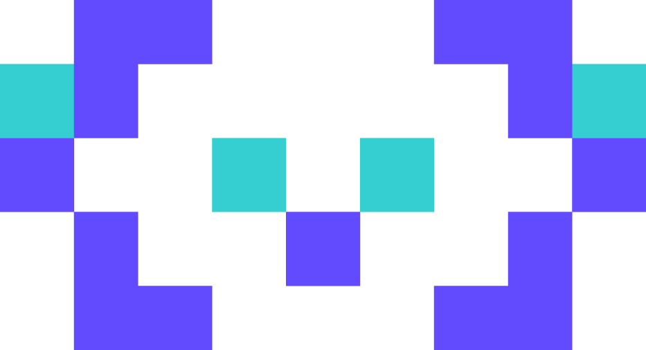

<div align="center">

</img> 

**A Pocket-Sized MLLM for Ultra-Efficient Image and Video Understanding on Your Phone**

</div>

<sub>💡 **Tip**: If you find this repository's structure or content difficult to understand, visit [deepwiki](https://deepwiki.com/LujiaJin/MiniCPM-o) for a comprehensive detailed explanation.</sub>

<div align="center">

  <strong>[中文](./README_zh.md) |
  English</strong>


<span style="display: inline-flex; align-items: center; margin-right: 2px;">
  
  <a href="./assets/feishu_qrcode.png" target="_blank"> Feishu (Lark)</a> &nbsp;|
</span>
&nbsp;
<span style="display: inline-flex; align-items: center; margin-left: -8px;">

  <a href="https://discord.gg/pBZuTA3hj" target="_blank"> Discord</a> &nbsp;
</span>


<p align="center">
   MiniCPM-V 4.6 <a href="https://huggingface.co/openbmb/MiniCPM-V-4.6">🤗</a> <a href="https://huggingface.co/spaces/openbmb/MiniCPM-V-4.6-Demo">🤖</a> <a href="https://github.com/OpenBMB/MiniCPM-V-Apps/blob/main/DOWNLOAD.md">📱</a> | MiniCPM-o 4.5 <a href="https://huggingface.co/openbmb/MiniCPM-o-4_5">🤗</a> <a href="https://openbmb.github.io/MiniCPM-o-Demo/">📞</a> <a href="https://minicpmo45.modelbest.cn">🤖</a> | <a href="https://huggingface.co/papers/2604.27393">📄 Technical Report</a> | <a href="https://github.com/OpenSQZ/MiniCPM-V-Cookbook">🍳 Cookbook</a> | <a href="./docs/api.md">🌐 API</a>
</p>

</div>

**MiniCPM-V** and **MiniCPM-o** are multimodal LLM series designed for **strong performance and efficient deployment on devices**. MiniCPM-V focuses on efficient vision-language understanding across image, video and text inputs. MiniCPM-o extends the family toward real-time end-to-end omnimodal interaction with streaming video and audio inputs plus text and speech outputs. The most notable models in the series currently include:


- **MiniCPM-V 4.6**: 🔥🔥🔥 The latest and most efficient model in the MiniCPM-V series. With a total of 1.3B parameters, it surpasses larger models like Gemma4-E2B-it in performance, while showing superior efficiency than smaller models like Qwen3.5-0.8B (achieving ~1.5x token throughput). Powered by the latest **intra-ViT early compression technique** in [LLaVA-UHD v4](https://huggingface.co/papers/2605.08985), MiniCPM-V 4.6 **reduces the visual encoding computation cost by more than 50%**,  and supports **mixed 4x/16x visual token compression rate** for a more flexible performance-efficiency trade-off in different tasks. The model can be deployed across **common mobile platforms, including iOS, Android and HarmonyOS**, with edge adaptation code open-sourced.

- **MiniCPM-o 4.5**: ⭐️⭐️⭐️ The latest and most capable model in the MiniCPM-o series. With a total of 9B parameters, this end-to-end model **approaches Gemini 2.5 Flash in vision, speech, and full-duplex multimodal live streaming**, making it one of the most versatile and performant models in the open-source community. The new full-duplex multimodal live streaming capability means that the output streams (speech and text), and the real-time input streams (video and audio) do not block each other. This **enables MiniCPM-o 4.5 to see, listen, and speak simultaneously** in a real-time omnimodal conversation, and perform **proactive interactions** such as proactive reminding.


## News <!-- omit in toc -->

* [2026.05.17] ⭐️⭐️⭐️ We release the [API service](./docs/api.md) of MiniCPM-V 4.6 and MiniCPM-o 4.5, and a **public free API key** for MiniCPM-V 4.6 is available for everyone!
* [2026.05.11] 🔥🔥🔥 We open-source MiniCPM-V 4.6, with mixed 4x/16x visual token compression. Powered by strong encoding efficiency and its lightweight 1.3B scale, it is our most edge-deployment-friendly model to date, achieving ~1.5x token throughput compared to Qwen3.5 0.8B. Try it now!
* [2026.02.06] 🥳 🥳 🥳 We open-sourced a realtime web demo deployable on your own devices like Mac or GPU. [Try it now](#web-demo-deployment)!
* [2026.02.03] 🔥🔥🔥 We open-source MiniCPM-o 4.5, which matches Gemini 2.5 Flash on vision and speech, and supports full-duplex multimodal live streaming. Try it now!
* [2025.08.26] 🔥🔥🔥 We open-source MiniCPM-V 4.5, which outperforms GPT-4o-latest, Gemini-2.0 Pro, and Qwen2.5-VL 72B. It advances popular capabilities of MiniCPM-V, and brings useful new features. Try it now!
* [2025.08.01] ⭐️⭐️⭐️ We open-sourced the [MiniCPM-V & o Cookbook](https://github.com/OpenSQZ/MiniCPM-V-CookBook)! It provides comprehensive guides for diverse user scenarios, paired with our new [Docs Site](https://minicpm-o.readthedocs.io/en/latest/index.html) for smoother onboarding.
* [2025.03.01] 🚀🚀🚀 RLAIF-V, the alignment technique of MiniCPM-o, is accepted by CVPR 2025 Highlights！The [code](https://github.com/RLHF-V/RLAIF-V), [dataset](https://huggingface.co/datasets/openbmb/RLAIF-V-Dataset), [paper](https://arxiv.org/abs/2405.17220) are open-sourced!
* [2025.01.19] ⭐️⭐️⭐️ MiniCPM-o tops GitHub Trending and reaches top-2 on Hugging Face Trending!
* [2024.05.23] 🔥🔥🔥 MiniCPM-V tops GitHub Trending and Hugging Face Trending! Our demo, recommended by Hugging Face Gradio’s official account, is available [here](https://huggingface.co/spaces/openbmb/MiniCPM-Llama3-V-2_5). Come and try it out!

<br>

<details> 
<summary>Click to view more news.</summary>

* [2026.05.07] 📢📢📢 We release the MiniCPM-o 4.5 technical report, introducing the key techniques behind its real-time full-duplex omni-modal interaction. Read it [here](https://huggingface.co/papers/2604.27393).
* [2026.02.05] 📢📢📢 We note the web demo may experience latency issues due to network conditions. We are working actively to provide a Docker image for local deployment of the real-time interactive Demo as soon as possible. Please stay tuned!
* [2025.09.18] 📢📢📢 MiniCPM-V 4.5 technical report is now released! See [here](https://arxiv.org/abs/2509.18154).
* [2025.09.01] ⭐️⭐️⭐️ MiniCPM-V 4.5 has been officially supported by [llama.cpp](https://github.com/ggml-org/llama.cpp/pull/15575), [vLLM](https://github.com/vllm-project/vllm/pull/23586), and [LLaMA-Factory](https://github.com/hiyouga/LLaMA-Factory/pull/9022). You are welcome to use it directly through these official channels! Support for additional frameworks such as [Ollama](https://github.com/ollama/ollama/pull/12078) and [SGLang](https://github.com/sgl-project/sglang/pull/9610) is actively in progress.
* [2025.08.02] 🚀🚀🚀 We open-source MiniCPM-V 4.0, which outperforms GPT-4.1-mini-20250414 in image understanding. It advances popular features of MiniCPM-V 2.6, and largely improves the efficiency. We also open-source the iOS App on iPhone and iPad. Try it now!
* [2025.06.20] ⭐️⭐️⭐️ Our official [Ollama repository](https://ollama.com/openbmb) is released. Try our latest models with [one click](https://ollama.com/openbmb/minicpm-o2.6)！
* [2025.01.24] 📢📢📢 MiniCPM-o 2.6 technical report is released! See [here](https://openbmb.notion.site/MiniCPM-o-2-6-A-GPT-4o-Level-MLLM-for-Vision-Speech-and-Multimodal-Live-Streaming-on-Your-Phone-185ede1b7a558042b5d5e45e6b237da9).
* [2025.01.23] 💡💡💡 MiniCPM-o 2.6 is now supported by [Align-Anything](https://github.com/PKU-Alignment/align-anything), a framework by PKU-Alignment Team for aligning any-to-any modality large models with human intentions. It supports DPO and SFT fine-tuning on both vision and audio. Try it now!
* [2025.01.19] 📢 **ATTENTION!** We are currently working on merging MiniCPM-o 2.6 into the official repositories of llama.cpp, Ollama, and vllm. Until the merge is complete, please USE OUR LOCAL FORKS of [llama.cpp](https://github.com/OpenBMB/llama.cpp/blob/minicpm-omni/examples/llava/README-minicpmo2.6.md), [Ollama](https://github.com/OpenBMB/ollama/blob/minicpm-v2.6/examples/minicpm-v2.6/README.md), and [vllm](https://github.com/OpenBMB/MiniCPM-o?tab=readme-ov-file#efficient-inference-with-llamacpp-ollama-vllm). **Using the official repositories before the merge may lead to unexpected issues**.
* [2025.01.17] We have updated the usage of MiniCPM-o 2.6 int4 quantization version and resolved the model initialization error. Click [here](https://huggingface.co/openbmb/MiniCPM-o-2_6-int4) and try it now!
* [2025.01.13] 🔥🔥🔥 We open-source MiniCPM-o 2.6, which matches GPT-4o-202405 on vision, speech and multimodal live streaming. It advances popular capabilities of MiniCPM-V 2.6, and supports various new fun features. Try it now!
* [2024.08.15] We now also support multi-image SFT. For more details, please refer to the [document](https://github.com/OpenBMB/MiniCPM-V/tree/main/finetune).
* [2024.08.14] MiniCPM-V 2.6 now also supports [fine-tuning](https://github.com/modelscope/ms-swift/issues/1613) with the SWIFT framework!
* [2024.08.17] 🚀🚀🚀 MiniCPM-V 2.6 is now fully supported by [official](https://github.com/ggerganov/llama.cpp) llama.cpp! GGUF models of various sizes are available [here](https://huggingface.co/openbmb/MiniCPM-V-2_6-gguf).
* [2024.08.10] 🚀🚀🚀 MiniCPM-Llama3-V 2.5 is now fully supported by [official](https://github.com/ggerganov/llama.cpp) llama.cpp! GGUF models of various sizes are available [here](https://huggingface.co/openbmb/MiniCPM-Llama3-V-2_5-gguf).
* [2024.08.06] 🔥🔥🔥 We open-source MiniCPM-V 2.6, which outperforms GPT-4V on single image, multi-image and video understanding. It advances popular features of MiniCPM-Llama3-V 2.5, and can support real-time video understanding on iPad. Try it now!
* [2024.08.03] MiniCPM-Llama3-V 2.5 technical report is released! See [here](https://arxiv.org/abs/2408.01800).
* [2024.07.19] MiniCPM-Llama3-V 2.5 supports vLLM now! See [here](#inference-with-vllm).

* [2024.06.03] Now, you can run MiniCPM-Llama3-V 2.5 on multiple low VRAM GPUs(12 GB or 16 GB) by distributing the model's layers across multiple GPUs. For more details, check this [link](https://github.com/OpenBMB/MiniCPM-V/blob/main/docs/inference_on_multiple_gpus.md).
* [2024.05.28] 🚀🚀🚀 MiniCPM-Llama3-V 2.5 now fully supports its feature in llama.cpp and Ollama! Please pull the latest code **of our provided forks** ([llama.cpp](https://github.com/OpenBMB/llama.cpp/blob/minicpm-v2.5/examples/minicpmv/README.md), [Ollama](https://github.com/OpenBMB/ollama/tree/minicpm-v2.5/examples/minicpm-v2.5)). GGUF models in various sizes are available [here](https://huggingface.co/openbmb/MiniCPM-Llama3-V-2_5-gguf/tree/main). MiniCPM-Llama3-V 2.5 series is **not supported by the official repositories yet**, and we are working hard to merge PRs. Please stay tuned!

* [2024.05.28] 💫 We now support LoRA fine-tuning for MiniCPM-Llama3-V 2.5, using only 2 V100 GPUs! See more statistics [here](https://github.com/OpenBMB/MiniCPM-V/tree/main/finetune#model-fine-tuning-memory-usage-statistics).

* [2024.05.25] MiniCPM-Llama3-V 2.5 now supports streaming outputs and customized system prompts. Try it [here](https://huggingface.co/openbmb/MiniCPM-Llama3-V-2_5#usage)!
* [2024.05.24] We release the MiniCPM-Llama3-V 2.5 [gguf](https://huggingface.co/openbmb/MiniCPM-Llama3-V-2_5-gguf), which supports [llama.cpp](#inference-with-llamacpp) inference and provides a 6~8 token/s smooth decoding on mobile phones. Try it now!

* [2024.05.23] 🔍 We've released a comprehensive comparison between Phi-3-vision-128k-instruct and MiniCPM-Llama3-V 2.5, including benchmark evaluations, multilingual capabilities, and inference efficiency 🌟📊🌍🚀. Click [here](./docs/compare_with_phi-3_vision.md) to view more details.

* [2024.05.20] We open-soure MiniCPM-Llama3-V 2.5, it has improved OCR capability and supports 30+ languages, representing the first end-side MLLM achieving GPT-4V level performance! We provide [efficient inference](#deployment-on-mobile-phone) and [simple fine-tuning](./finetune/readme.md). Try it now!
* [2024.04.23] MiniCPM-V-2.0 supports vLLM now! Click [here](#inference-with-vllm) to view more details.
* [2024.04.18] We create a HuggingFace Space to host the demo of MiniCPM-V 2.0 at [here](https://huggingface.co/spaces/openbmb/MiniCPM-V-2)!
* [2024.04.17] MiniCPM-V-2.0 supports deploying [WebUI Demo](#webui-demo) now!
* [2024.04.15] MiniCPM-V-2.0 now also supports [fine-tuning](https://github.com/modelscope/swift/blob/main/docs/source/Multi-Modal/minicpm-v-2最佳实践.md) with the SWIFT framework, with streaming inference enabled!
* [2024.04.12] We open-source MiniCPM-V 2.0, which achieves comparable performance with Gemini Pro in understanding scene text and outperforms strong Qwen-VL-Chat 9.6B and Yi-VL 34B on <a href="https://rank.opencompass.org.cn/leaderboard-multimodal">OpenCompass</a>, a comprehensive evaluation over 11 popular benchmarks. Click <a href="https://openbmb.vercel.app/minicpm-v-2">here</a> to view the MiniCPM-V 2.0 technical blog.
* [2024.03.14] MiniCPM-V now supports [fine-tuning](https://github.com/modelscope/swift/blob/main/docs/source/Multi-Modal/minicpm-v最佳实践.md) with the SWIFT framework. Thanks to [Jintao](https://github.com/Jintao-Huang) for the contribution！
* [2024.03.01] MiniCPM-V can now be deployed on Mac!
* [2024.02.01] We open-source MiniCPM-V and OmniLMM-12B, which support efficient end-side deployment and powerful multimodal capabilities correspondingly.
</details> 


## Contents <!-- omit in toc -->


- [MiniCPM-V 4.6](#minicpm-v-46)
  - [Usages](#usages)
- [MiniCPM-o 4.5](#minicpm-o-45)
  - [Usages](#usages-1)
- [MiniCPM-V \& o Cookbook](#minicpm-v--o-cookbook)
- [Supported Inference and Training Frameworks and API](#supported-inference-and-training-frameworks)
- [Model Zoo](#model-zoo)
- [Awesome work using MiniCPM-V \& o](#awesome-work-using-minicpm-v--o)
- [Technical Reports and Key Techniques Papers](#technical-reports-and-key-techniques-papers)

## MiniCPM-V 4.6

**MiniCPM-V 4.6** is our most edge-deployment-friendly model to date. The model is built based on SigLIP2-400M and the Qwen3.5-0.8B LLM. It inherits the strong single-image, multi-image, and video understanding capabilities of MiniCPM-V family, while significantly improving computation efficiency. It also introduces mixed 4x/16x visual token compression. Notable features of MiniCPM-V 4.6 include:

- 🔥 **Leading Foundation Capability.**
  MiniCPM-V 4.6 scores 13 on the Artificial Analysis Intelligence Index benchmark, outperforming Qwen3.5-0.8B's score of 10 with 19x fewer token cost, and Qwen3.5-0.8B-Thinking's score of 11 with 43x fewer token cost. It also surpasses the larger Ministral 3 3B (score of 11).

- 💪 **Strong Multimodal Capability.**
  MiniCPM-V 4.6 outperforms Qwen3.5-0.8B on most vision-language understanding tasks, and reaches Qwen3.5 2B-level capability on many benchmarks including OpenCompass, RefCOCO, HallusionBench, MUIRBench, and OCRBench.
- 🚀 **Ultra-Efficient Architecture.**
  Based on the latest technique in [LLaVA-UHD v4](https://huggingface.co/papers/2605.08985), MiniCPM-V 4.6 reduces the visual encoding computation FLOPs by more than 50%. It enables MiniCPM-V 4.6 to achieve better efficiency to even smaller models, achieving ~1.5x token throughput compared to Qwen3.5-0.8B. 
  It also supports mixed 4x/16x visual token compression rate, allowing flexible switching between accuracy and speed.
- 📱 **Broad Mobile Platform Coverage.**
  MiniCPM-V 4.6 can be deployed across all three mainstream mobile platforms — iOS, Android, and HarmonyOS. With every edge adaptation code open-sourced, developers can reproduce the on-device experience in [just a few steps](#deploy-minicpm-v-46-on-ios-android-and-harmonyos-platforms-).
- 🛠️ **Developer Friendly.**
  MiniCPM-V 4.6 is adapted to [inference frameworks](#supported-inference-and-training-frameworks) such as SGLang, vLLM, llama.cpp, Ollama, and supports [fine-tuning ecosystems](#supported-inference-and-training-frameworks) such as SWIFT and LLaMA-Factory. Developers can quickly customize models for new domains and tasks on consumer-grade GPUs. We provide multiple quantized variants across GGUF, BNB, AWQ, and GPTQ formats.


### Evaluation <!-- omit in toc -->

**Overall Performance (Instruct)**

<p align="center">
  </img>
</p>


<details>
<summary>Click to view MiniCPM-V 4.6-Thinking performance.</summary>


<p align="center">
  </img>
</p>


</details>

<br>

**MiniCPM-V 4.6 Inference Efficiency**
<table align="center">
  <tr>
    <td align="center" width="50%"><b>High-Concurrency Throughput</b></td>
    <td align="center" width="50%"><b>Single Request TTFT (ms)</b></td>
  </tr>
  <tr>
    <td align="center" valign="middle"></img></td>
    <td align="center" valign="middle"></img></td>
  </tr>
</table>


### Examples <!-- omit in toc -->

<div align="center">
  <a href="https://www.youtube.com/watch?v=Ch5UG1FoysM"></a>
</div>

MiniCPM-V 4.6 can be deployed across three mainstream end-side platforms — **iOS, Android and HarmonyOS**. The clips below are raw screen recordings on phone devices without edition.

<table align="center">
  <tr>
    <td align="center"><b>iPhone</b><br><sub>iPhone 17 Pro Max</sub></td>
    <td align="center"><b>Android</b><br><sub>Redmi K70</sub></td>
    <td align="center"><b>HarmonyOS</b><br><sub>HUAWEI nova 14</sub></td>
  </tr>
  <tr>
    <td align="center"></td>
    <td align="center"></td>
    <td align="center"></td>
  </tr>
</table>


### Usages

#### Inference with Transformers <!-- omit in toc -->
<details>
<summary>Click to show inference examples with Transformers. </summary>

##### Installation <!-- omit in toc -->

```bash
pip install "transformers[torch]>=5.7.0" torchvision torchcodec
```

> **Note on CUDA compatibility:** `torchcodec` (used for video decoding) may have compatibility issues with certain CUDA versions. For example, `torch>=2.11` bundles CUDA 13.1 by default, while environments with CUDA 12.x may encounter errors such as `RuntimeError: Could not load libtorchcodec`. Two workarounds:
>
> 1. **Replace `torchcodec` with `PyAV`** — supports both image and video inference without CUDA version constraints:
>    ```bash
>    pip install "transformers[torch]>=5.7.0" torchvision av
>    ```
> 2. **Pin the CUDA version** when installing torch to match your environment (e.g. CUDA 12.8):
>    ```bash
>    pip install "transformers>=5.7.0" torchvision torchcodec --index-url https://download.pytorch.org/whl/cu128
>    ```

##### Load Model <!-- omit in toc -->

```python
from transformers import AutoModelForImageTextToText, AutoProcessor

model_id = "openbmb/MiniCPM-V-4.6"

processor = AutoProcessor.from_pretrained(model_id)
model = AutoModelForImageTextToText.from_pretrained(
    model_id, torch_dtype="auto", device_map="auto"
)

# Flash Attention 2 is recommended for better acceleration and memory saving,
# especially in multi-image and video scenarios.
# model = AutoModelForImageTextToText.from_pretrained(
#     model_id,
#     torch_dtype=torch.bfloat16,
#     attn_implementation="flash_attention_2",
#     device_map="auto",
# )
```

##### Image Inference <!-- omit in toc -->

```python
messages = [
    {
        "role": "user",
        "content": [
            {"type": "image", "url": "https://huggingface.co/datasets/openbmb/DemoCase/resolve/main/refract.png"},
            {"type": "text", "text": "What causes this phenomenon?"},
        ],
    }
]

downsample_mode = "16x"  # Using `downsample_mode="4x"` for Finer Detail

inputs = processor.apply_chat_template(
    messages, tokenize=True, add_generation_prompt=True,
    return_dict=True, return_tensors="pt",
    downsample_mode=downsample_mode,
    max_slice_nums=36,
).to(model.device)

generated_ids = model.generate(**inputs, downsample_mode=downsample_mode, max_new_tokens=512)
generated_ids_trimmed = [
    out_ids[len(in_ids):] for in_ids, out_ids in zip(inputs.input_ids, generated_ids)
]
output_text = processor.batch_decode(
    generated_ids_trimmed, skip_special_tokens=True, clean_up_tokenization_spaces=False
)
print(output_text[0])
```

##### Video Inference <!-- omit in toc -->

```python
messages = [
    {
        "role": "user",
        "content": [
            {"type": "video", "url": "https://huggingface.co/datasets/openbmb/DemoCase/resolve/main/football.mp4"},
            {"type": "text", "text": "Describe this video in detail. Follow the timeline and focus on on-screen text, interface changes, main actions, and scene changes."},
        ],
    }
]

downsample_mode = "16x"  # Using `downsample_mode="4x"` for Finer Detail

inputs = processor.apply_chat_template(
    messages, tokenize=True, add_generation_prompt=True,
    return_dict=True, return_tensors="pt",
    downsample_mode=downsample_mode,
    max_num_frames=128,
    stack_frames=1,
    max_slice_nums=1,
    use_image_id=False,
).to(model.device)

generated_ids = model.generate(**inputs, downsample_mode=downsample_mode, max_new_tokens=2048)
generated_ids_trimmed = [
    out_ids[len(in_ids):] for in_ids, out_ids in zip(inputs.input_ids, generated_ids)
]
output_text = processor.batch_decode(
    generated_ids_trimmed, skip_special_tokens=True, clean_up_tokenization_spaces=False
)
print(output_text[0])
```

##### Advanced Parameters <!-- omit in toc -->

You can customize image/video processing by passing additional parameters to `apply_chat_template`:

| Parameter | Default | Applies to | Description |
|-----------|---------|------------|-------------|
| `downsample_mode` | `"16x"` | Image & Video | Visual token downsampling. `"16x"` merges tokens for efficiency; `"4x"` keeps 4× more tokens for finer detail. Must also be passed to `generate()`. |
| `max_slice_nums` | `9` | Image & Video | Maximum number of slices when splitting a high-resolution image. Higher values preserve more detail for large images. Recommended: `36` for image, `1` for video. |
| `max_num_frames` | `128` | Video only | Maximum number of main frames sampled from the video. |
| `stack_frames` | `1` | Video only | Total sample points per second. `1` = main frame only (no stacking). `N` (N>1) = 1 main frame + N−1 sub-frames per second; the sub-frames are composited into a grid image and interleaved with main frames. Recommended: `3` or `5`. |
| `use_image_id` | `True` | Image & Video | Whether to prepend `<image_id>N</image_id>` tags before each image/frame placeholder. Recommended: `True` for image, `False` for video. |

> **Note:** `downsample_mode` must be passed to **both** `apply_chat_template` (for correct placeholder count) and `generate` (for the vision encoder). All other parameters only need to be passed to `apply_chat_template`.

##### Serving with `transformers serve` <!-- omit in toc -->

Hugging Face Transformers includes a lightweight OpenAI-compatible server for quick testing and moderate-load deployment.

```bash
pip install "transformers[serving]>=5.7.0"
```

Start the server:

```bash
transformers serve openbmb/MiniCPM-V-4.6 --port 8000 --host 0.0.0.0 --continuous-batching
```

Send a request:

```bash
curl -s http://localhost:8000/v1/chat/completions \
  -H 'Content-Type: application/json' \
  -d '{
    "model": "openbmb/MiniCPM-V-4.6",
    "messages": [{
      "role": "user",
      "content": [
        {"type": "image_url", "image_url": {"url": "https://huggingface.co/datasets/openbmb/DemoCase/resolve/main/refract.png"}},
        {"type": "text", "text": "What causes this phenomenon?"}
      ]
    }]
  }'
```

</details>


#### Deploy MiniCPM-V 4.6 on iOS, Android, and HarmonyOS Platforms <!-- omit in toc -->

We **open-source edge deployment guidance** of all these platforms, so that developers can deploy on their own devices in a few steps. Try the apps via the [download page](https://github.com/OpenBMB/MiniCPM-V-Apps/blob/main/DOWNLOAD.md), or follow the [edge deployment guide](https://github.com/OpenBMB/MiniCPM-V-Apps) for the full source. 

#### Use MiniCPM-V 4.6 in Other Inference and Training Frameworks <!-- omit in toc -->

MiniCPM-V 4.6 supports [inference frameworks](#supported-inference-and-training-frameworks) including SGLang, vLLM, llama.cpp, Ollama, and [training frameworks](#supported-inference-and-training-frameworks) including LLaMA-Factory, SWIFT.


### Acknowledgements <!-- omit in toc -->

<details>
<summary>Click to view acknowledgements.</summary>

We would like to thank the following projects:
* [Qwen3.5](https://huggingface.co/collections/Qwen/qwen35) for providing language backbone
* [SigLIP2](https://github.com/google-research/big_vision/blob/main/big_vision/configs/proj/image_text/README_siglip2.md) for providing vision understanding module
* [Transformers](https://github.com/huggingface/transformers)

</details>

## MiniCPM-o 4.5

**MiniCPM-o 4.5** is the latest and most capable model in the MiniCPM-o series. The model is built in an end-to-end fashion based on SigLip2, Whisper-medium, CosyVoice2, and Qwen3-8B with a total of 9B parameters. It exhibits a significant performance improvement, and introduces new features for full-duplex multimodal live streaming. Notable features of MiniCPM-o 4.5 include:

- 🔥 **Leading Visual Capability.**
  MiniCPM-o 4.5 achieves an average score of 77.6 on OpenCompass, a comprehensive evaluation of 8 popular benchmarks. **With only 9B parameters, it surpasses widely used proprietary models like GPT-4o, Gemini 2.0 Pro, and approaches Gemini 2.5 Flash** for vision-language capabilities. It supports instruct and thinking modes in a single model, better covering efficiency and performance trade-offs in different user scenarios.

- 🎙 **Strong Speech Capability.** 
  MiniCPM-o 4.5 supports **bilingual real-time speech conversation with configurable voices** in English and Chinese. It features **more natural, expressive and stable speech conversation**. The model also allows for fun features such as **voice cloning and role play via a simple reference audio clip**, where the cloning performance surpasses strong TTS tools such as CosyVoice2.

- 🎬 **New Full-Duplex and Proactive Multimodal Live Streaming Capability.** 
  As a new feature, MiniCPM-o 4.5 can process real-time, continuous video and audio input streams simultaneously while generating concurrent text and speech output streams in an end-to-end fashion, without mutual blocking. This **allows MiniCPM-o 4.5 to see, listen, and speak simultaneously**, creating a fluid, real-time omnimodal conversation experience. Beyond reactive responses, the model can also perform **proactive interaction**, such as initiating reminders or comments based on its continuous understanding of the live scene. 

- 💪 **Strong OCR Capability, Efficiency and Others.**
Advancing popular visual capabilities from MiniCPM-V series, MiniCPM-o 4.5 can process **high-resolution images** (up to 1.8 million pixels) and **high-FPS videos** (up to 10fps) in any aspect ratio efficiently. It achieves **state-of-the-art performance for end-to-end English document parsing** on OmniDocBench, outperforming proprietary models such as Gemini-3 Flash and GPT-5, and specialized tools such as DeepSeek-OCR 2. It also features **trustworthy behaviors**, matching Gemini 2.5 Flash on MMHal-Bench, and supports **multilingual capabilities** on more than 30 languages.

-  💫  **Easy Usage.**
  MiniCPM-o 4.5 can be easily used in various ways:  **Basic usage, recommended for 100% precision:** PyTorch inference with Nvidia GPU. **Other end-side adaptation** includes (1) llama.cpp and Ollama support for efficient CPU inference on local devices, (2) int4 and GGUF format quantized models in 16 sizes, (3) vLLM and SGLang support for high-throughput and memory-efficient inference, (4) FlagOS support for the unified multi-chip backend plugin. **We also open-sourced web demos** on which **enables the full-duplex multimodal live streaming experience on local devices** such as GPUs, PCs (e.g., on a MacBook).

**Model Architecture.**
- **End-to-end Omni-modal Architecture.** The modality encoders/decoders and LLM are densely connected via hidden states in an end-to-end fashion. This enables better information flow and control, and also facilitates full exploitation of rich multimodal knowledge during training.
- **Full-Duplex Omni-modal Live Streaming Mechanism.** (1) We turn the offline modality encoder/decoders into online and full-duplex ones for streaming inputs/outputs. The speech token decoder models text and speech tokens in an interleaved fashion to support full-duplex speech generation (i.e., sync timely with new input). This also facilitates more stable long speech generation (e.g., > 1min).
(2) **We sync all the input and output streams on timeline in milliseconds**, which are jointly modeled by a time-division multiplexing (TDM) mechanism for omni-modality streaming processing in the LLM backbone. It divides parallel omni-modality streams into sequential info groups within small periodic time slices.
- **Proactive Interaction Mechanism.** The LLM continuously monitors the input video and audio streams, and decides at a frequency of 1Hz to speak or not. This high decision-making frequency together with full-duplex nature are curcial to enable the proactive interaction capability.
- **Configurable Speech Modeling Design.** We inherit the multimodal system prompt design of MiniCPM-o 2.6, which includes a traditional text system prompt, and a new audio system prompt to determine the assistant voice. This enables cloning new voices and role play in inference time for speech conversation.


<div align="center">
  
</div>


### Evaluation  <!-- omit in toc -->


<div align="center">
  
</div>


&emsp;
<br>

<details>
<summary>Click to view detailed MiniCPM-o 4.5 evaluation breakdowns.</summary>

<div align="center">
  
</div>
<strong>Note</strong>: Scores marked with ∗ are from our evaluation; others are cited from referenced reports. n/a indicates that the model does not support the corresponding modality. All results are reported in instruct mode/variant.

<details>
<summary>Click to view visual understanding results.</summary>

**Image Understanding (Instruct)**
  <div align="center">
  <table style="margin: 0px auto;">
<tr>
  <th nowrap="nowrap" align="left"><b>Model</b></th>
  <th nowrap="nowrap"><b>OpenCompass</b></th>
  <th nowrap="nowrap"><b>MMBench EN v1.1</b></th>
  <th nowrap="nowrap"><b>MMBench CN v1.1</b></th>
  <th nowrap="nowrap"><b>MathVista</b></th>
  <th nowrap="nowrap"><b>MMVet</b></th>
  <th nowrap="nowrap"><b>MMMU</b></th>
  <th nowrap="nowrap"><b>MMStar</b></th>
  <th nowrap="nowrap"><b>HallusionBench</b></th>
  <th nowrap="nowrap"><b>AI2D</b></th>
  <th nowrap="nowrap"><b>OCRBench</b></th>
  <th nowrap="nowrap"><b>TextVQA_VAL</b></th>
  <th nowrap="nowrap"><b>DocVQA_VAL</b></th>
  <th nowrap="nowrap"><b>MMT-Bench_VAL</b></th>
  <th nowrap="nowrap"><b>MM-IFEval</b></th>
  <th nowrap="nowrap"><b>Mantis-Eval</b></th>
  <th nowrap="nowrap"><b>MuirBench</b></th>
  <th nowrap="nowrap"><b>MMSI-Bench</b></th>
  <th nowrap="nowrap"><b>MMHal-Score</b></th>
  <th nowrap="nowrap"><b>MMHal-Hallrate↓</b></th>
</tr>
<tr>
  <td nowrap="nowrap" align="left">Gemini2.5-Flash-Nonthinking</td>
  <td align="center"><b>78.5</b></td>
  <td align="center"><ins>86.6</ins></td>
  <td align="center"><ins>86.0</ins></td>
  <td align="center">75.3</td>
  <td align="center"><ins>81.4</ins><sup>*</sup></td>
  <td align="center"><b>76.3</b></td>
  <td align="center"><b>75.8</b></td>
  <td align="center">59.1</td>
  <td align="center"><b>87.7</b></td>
  <td align="center">864</td>
  <td align="center">74.3<sup>*</sup></td>
  <td align="center">93.0</td>
  <td align="center"><ins>70.0</ins><sup>*</sup></td>
  <td align="center"><b>75.8<sup>*</sup></b></td>
  <td align="center">72.8<sup>*</sup></td>
  <td align="center"><b>74.5<sup>*</sup></b></td>
  <td align="center">12.1<sup>*</sup></td>
  <td align="center"><ins>4.6</ins><sup>*</sup></td>
  <td align="center"><b>23.9<sup>*</sup></b></td>
</tr>
<tr>
  <td nowrap="nowrap" align="left">Gemini2.0-Pro</td>
  <td align="center">73.3</td>
  <td align="center">83.0</td>
  <td align="center">83.0</td>
  <td align="center">71.3</td>
  <td align="center">70.4</td>
  <td align="center">72.6</td>
  <td align="center">68.5</td>
  <td align="center">49.8</td>
  <td align="center">84.8</td>
  <td align="center">863</td>
  <td align="center">-</td>
  <td align="center">-</td>
  <td align="center">-</td>
  <td align="center">-</td>
  <td align="center">-</td>
  <td align="center">-</td>
  <td align="center">-</td>
  <td align="center">-</td>
  <td align="center">-</td>
</tr>
<tr>
  <td nowrap="nowrap" align="left">GPT-4o</td>
  <td align="center">75.4</td>
  <td align="center">86.0</td>
  <td align="center"><ins>86.0</ins></td>
  <td align="center">71.6</td>
  <td align="center">76.9</td>
  <td align="center">72.9</td>
  <td align="center">70.2</td>
  <td align="center">57.0</td>
  <td align="center">86.3</td>
  <td align="center">822</td>
  <td align="center">77.4</td>
  <td align="center">93.0</td>
  <td align="center">66.7<sup>*</sup></td>
  <td align="center">64.6</td>
  <td align="center">70.1<sup>*</sup></td>
  <td align="center">70.5<sup>*</sup></td>
  <td align="center">8.1<sup>*</sup></td>
  <td align="center">4.2<sup>*</sup></td>
  <td align="center">25.0<sup>*</sup></td>
</tr>
<tr>
  <td nowrap="nowrap" align="left">InternVL-3.5-8B</td>
  <td align="center">75.8</td>
  <td align="center">79.5</td>
  <td align="center">80.0<sup>*</sup></td>
  <td align="center"><ins>78.4</ins></td>
  <td align="center"><b>83.1</b></td>
  <td align="center"><ins>73.4</ins></td>
  <td align="center">69.3</td>
  <td align="center">54.5</td>
  <td align="center">84.0</td>
  <td align="center">840</td>
  <td align="center">78.2</td>
  <td align="center">92.3</td>
  <td align="center">66.7</td>
  <td align="center">56.3<sup>*</sup></td>
  <td align="center">70.5</td>
  <td align="center">55.8</td>
  <td align="center">-</td>
  <td align="center">3.8<sup>*</sup></td>
  <td align="center">34.7<sup>*</sup></td>
</tr>
<tr>
  <td nowrap="nowrap" align="left">Qwen3-VL-8B-Instruct</td>
  <td align="center">76.5</td>
  <td align="center">84.5</td>
  <td align="center">84.7</td>
  <td align="center">77.2</td>
  <td align="center">73.7<sup>*</sup></td>
  <td align="center">69.6</td>
  <td align="center">70.9</td>
  <td align="center"><ins>61.1</ins></td>
  <td align="center">85.7</td>
  <td align="center"><b>896</b></td>
  <td align="center">82.9<sup>*</sup></td>
  <td align="center"><b>96.1</b></td>
  <td align="center">60.9<sup>*</sup></td>
  <td align="center">59.4<sup>*</sup></td>
  <td align="center">74.2<sup>*</sup></td>
  <td align="center">64.4</td>
  <td align="center">11.3<sup>*</sup></td>
  <td align="center"><b>4.7<sup>*</sup></b></td>
  <td align="center">29.9<sup>*</sup></td>
</tr>
<tr>
  <td nowrap="nowrap" align="left">Qwen3-Omni-30B-A3B-Instruct</td>
  <td align="center">75.7</td>
  <td align="center">84.9<sup>*</sup></td>
  <td align="center">84.1<sup>*</sup></td>
  <td align="center">75.9</td>
  <td align="center">74.8<sup>*</sup></td>
  <td align="center">69.1</td>
  <td align="center">68.5</td>
  <td align="center">59.7</td>
  <td align="center">85.2</td>
  <td align="center"><ins>880</ins><sup>*</sup></td>
  <td align="center"><b>84.1<sup>*</sup></b></td>
  <td align="center"><ins>95.4</ins><sup>*</sup></td>
  <td align="center"><b>70.4<sup>*</sup></b></td>
  <td align="center">65.7<sup>*</sup></td>
  <td align="center"><ins>78.3</ins><sup>*</sup></td>
  <td align="center">61.9<sup>*</sup></td>
  <td align="center"><ins>14.2</ins><sup>*</sup></td>
  <td align="center"><ins>4.6</ins><sup>*</sup></td>
  <td align="center">31.6<sup>*</sup></td>
</tr>
<tr>
  <td nowrap="nowrap" align="left">MiniCPM-o 4.5-Instruct</td>
  <td align="center"><ins>77.6</ins></td>
  <td align="center"><b>87.6</b></td>
  <td align="center"><b>87.2</b></td>
  <td align="center"><b>80.1</b></td>
  <td align="center">74.4</td>
  <td align="center">67.6</td>
  <td align="center"><ins>73.1</ins></td>
  <td align="center"><b>63.2</b></td>
  <td align="center"><ins>87.6</ins></td>
  <td align="center">876</td>
  <td align="center"><ins>83.8</ins></td>
  <td align="center">94.7</td>
  <td align="center">69.7</td>
  <td align="center"><ins>66.3</ins></td>
  <td align="center"><b>79.7</b></td>
  <td align="center"><ins>72.0</ins></td>
  <td align="center"><b>16.6</b></td>
  <td align="center"><b>4.7</b></td>
  <td align="center"><ins>24.3</ins></td>
</tr>
  </table>
  </div>

**Image Understanding (Thinking)**
  <div align="center">
  <table style="margin: 0px auto;">
<tr>
  <th nowrap="nowrap" align="left"><b>Model</b></th>
  <th nowrap="nowrap"><b>OpenCompass</b></th>
  <th nowrap="nowrap"><b>MMBench EN v1.1</b></th>
  <th nowrap="nowrap"><b>MMBench CN v1.1</b></th>
  <th nowrap="nowrap"><b>MathVista</b></th>
  <th nowrap="nowrap"><b>MMVet</b></th>
  <th nowrap="nowrap"><b>MMMU</b></th>
  <th nowrap="nowrap"><b>MMStar</b></th>
  <th nowrap="nowrap"><b>HallusionBench</b></th>
  <th nowrap="nowrap"><b>AI2D</b></th>
  <th nowrap="nowrap"><b>OCRBench</b></th>
  <th nowrap="nowrap"><b>TextVQA_VAL</b></th>
  <th nowrap="nowrap"><b>DocVQA_VAL</b></th>
  <th nowrap="nowrap"><b>MMT-Bench_VAL</b></th>
  <th nowrap="nowrap"><b>MM-IFEval</b></th>
</tr>
<tr>
  <td nowrap="nowrap" align="left">Gemini2.5-Flash-Thinking</td>
  <td align="center"><b>79.9</b></td>
  <td align="center">87.1</td>
  <td align="center">87.3</td>
  <td align="center">79.4</td>
  <td align="center"><b>81.2<sup>*</sup></b></td>
  <td align="center"><ins>77.7</ins></td>
  <td align="center"><b>76.5</b></td>
  <td align="center">63.5</td>
  <td align="center"><ins>88.7</ins></td>
  <td align="center">853</td>
  <td align="center">73.8<sup>*</sup></td>
  <td align="center">92.8</td>
  <td align="center">70.7<sup>*</sup></td>
  <td align="center"><ins>75.7</ins><sup>*</sup></td>
</tr>
<tr>
  <td nowrap="nowrap" align="left">GPT-5</td>
  <td align="center"><ins>79.7</ins></td>
  <td align="center">85.5<sup>*</sup></td>
  <td align="center">85.6<sup>*</sup></td>
  <td align="center"><b>81.9</b></td>
  <td align="center"><ins>77.6</ins></td>
  <td align="center"><b>81.8</b></td>
  <td align="center"><ins>75.7</ins></td>
  <td align="center"><ins>65.2</ins></td>
  <td align="center"><b>89.5</b></td>
  <td align="center">807</td>
  <td align="center">77.8<sup>*</sup></td>
  <td align="center">91.3<sup>*</sup></td>
  <td align="center"><b>72.7<sup>*</sup></b></td>
  <td align="center"><b>83.1<sup>*</sup></b></td>
</tr>
<tr>
  <td nowrap="nowrap" align="left">Qwen3-VL-8B-Thinking</td>
  <td align="center">77.3</td>
  <td align="center">85.3</td>
  <td align="center">85.5</td>
  <td align="center"><ins>81.4</ins></td>
  <td align="center">69.8<sup>*</sup></td>
  <td align="center">74.1</td>
  <td align="center">75.3</td>
  <td align="center"><b>65.4</b></td>
  <td align="center">84.9</td>
  <td align="center">819</td>
  <td align="center">77.8<sup>*</sup></td>
  <td align="center"><b>95.3</b></td>
  <td align="center">68.1<sup>*</sup></td>
  <td align="center">73.5<sup>*</sup></td>
</tr>
<tr>
  <td nowrap="nowrap" align="left">Qwen3-Omni-30B-A3B-Thinking</td>
  <td align="center">78.5</td>
  <td align="center"><ins>88.2</ins><sup>*</sup></td>
  <td align="center"><b>87.7<sup>*</sup></b></td>
  <td align="center">80.0</td>
  <td align="center">74.8<sup>*</sup></td>
  <td align="center">75.6</td>
  <td align="center">74.9</td>
  <td align="center">62.8</td>
  <td align="center">86.1</td>
  <td align="center"><ins>859</ins><sup>*</sup></td>
  <td align="center"><b>80.8<sup>*</sup></b></td>
  <td align="center"><ins>94.2</ins><sup>*</sup></td>
  <td align="center"><ins>70.9</ins><sup>*</sup></td>
  <td align="center">69.9<sup>*</sup></td>
</tr>
<tr>
  <td nowrap="nowrap" align="left">MiniCPM-o 4.5-Thinking</td>
  <td align="center">78.2</td>
  <td align="center"><b>89.0</b></td>
  <td align="center"><ins>87.6</ins></td>
  <td align="center">81.0</td>
  <td align="center">73.6</td>
  <td align="center">70.2</td>
  <td align="center">73.6</td>
  <td align="center">62.6</td>
  <td align="center">88.5</td>
  <td align="center"><b>879</b></td>
  <td align="center"><ins>79.8</ins></td>
  <td align="center">92.3</td>
  <td align="center">69.7</td>
  <td align="center">68.2</td>
</tr>
  </table>
  </div>

**Video Understanding**
  <div align="center">
  <table style="margin: 0px auto;">
<tr>
  <th nowrap="nowrap" align="left"><b>Model</b></th>
  <th nowrap="nowrap"><b>Video-MME<br>(w/o subs)</b></th>
  <th nowrap="nowrap"><b>LVBench</b></th>
  <th nowrap="nowrap"><b>MLVU<br>(M-Avg)</b></th>
  <th nowrap="nowrap"><b>LongVideoBench<br>(val)</b></th>
  <th nowrap="nowrap"><b>MotionBench</b></th>
</tr>
<tr>
  <td nowrap="nowrap" align="left">Gemini2.5-Flash-Nonthinking</td>
  <td align="center"><b>75.6</b></td>
  <td align="center"><b>62.2</b></td>
  <td align="center"><b>77.8</b></td>
  <td align="center">-</td>
  <td align="center">-</td>
</tr>
<tr>
  <td nowrap="nowrap" align="left">InternVL-3.5-8B</td>
  <td align="center">66.0</td>
  <td align="center">-</td>
  <td align="center">70.2</td>
  <td align="center">62.1</td>
  <td align="center"><b>62.3<sup>*</sup></b></td>
</tr>
<tr>
  <td nowrap="nowrap" align="left">Qwen3-Omni-30B-A3B-Instruct</td>
  <td align="center"><ins>70.5</ins></td>
  <td align="center">50.2</td>
  <td align="center">75.2</td>
  <td align="center"><b>66.9<sup>*</sup></b></td>
  <td align="center"><ins>61.7</ins><sup>*</sup></td>
</tr>
<tr>
  <td nowrap="nowrap" align="left">MiniCPM-o 4.5-Instruct</td>
  <td align="center">70.4</td>
  <td align="center"><ins>50.9</ins></td>
  <td align="center"><ins>76.5</ins></td>
  <td align="center"><ins>66.0</ins></td>
  <td align="center">61.4</td>
</tr>
  </table>
  </div>

</details>

<details>
<summary>Click to view document parsing results.</summary>

**OmniDocBench**
  <div align="center">
  <table style="margin: 0px auto;">
<tr>
  <th nowrap="nowrap" align="left" rowspan="2"><b>Method Type</b></th>
  <th nowrap="nowrap" rowspan="2"><b>Methods</b></th>
  <th nowrap="nowrap" colspan="2"><b>OverallEdit↓</b></th>
  <th nowrap="nowrap" colspan="2"><b>TextEdit↓</b></th>
  <th nowrap="nowrap" colspan="2"><b>FormulaEdit↓</b></th>
  <th nowrap="nowrap" colspan="2"><b>TableTEDS↑</b></th>
  <th nowrap="nowrap" colspan="2"><b>TableEdit↓</b></th>
  <th nowrap="nowrap" colspan="2"><b>Read OrderEdit↓</b></th>
</tr>
<tr>
  <th nowrap="nowrap"><b>EN</b></th>
  <th nowrap="nowrap"><b>ZH</b></th>
  <th nowrap="nowrap"><b>EN</b></th>
  <th nowrap="nowrap"><b>ZH</b></th>
  <th nowrap="nowrap"><b>EN</b></th>
  <th nowrap="nowrap"><b>ZH</b></th>
  <th nowrap="nowrap"><b>EN</b></th>
  <th nowrap="nowrap"><b>ZH</b></th>
  <th nowrap="nowrap"><b>EN</b></th>
  <th nowrap="nowrap"><b>ZH</b></th>
  <th nowrap="nowrap"><b>EN</b></th>
  <th nowrap="nowrap"><b>ZH</b></th>
</tr>
<tr>
  <td nowrap="nowrap" align="left" rowspan="2">Pipeline</td>
  <td nowrap="nowrap" align="center">MinerU 2.5</td>
  <td align="center">0.117<sup>*</sup></td>
  <td align="center">0.172<sup>*</sup></td>
  <td align="center">0.051<sup>*</sup></td>
  <td align="center">0.08<sup>*</sup></td>
  <td align="center"><ins>0.256</ins><sup>*</sup></td>
  <td align="center">0.455<sup>*</sup></td>
  <td align="center">85.9<sup>*</sup></td>
  <td align="center">89.4<sup>*</sup></td>
  <td align="center">0.115<sup>*</sup></td>
  <td align="center">0.081<sup>*</sup></td>
  <td align="center">0.047<sup>*</sup></td>
  <td align="center">0.072<sup>*</sup></td>
</tr>
<tr>
  <td nowrap="nowrap" align="center">PaddleOCR-VL</td>
  <td align="center"><b>0.105</b></td>
  <td align="center"><ins>0.126</ins></td>
  <td align="center"><ins>0.041</ins></td>
  <td align="center"><b>0.062</b></td>
  <td align="center"><b>0.241</b></td>
  <td align="center"><b>0.316</b></td>
  <td align="center">88</td>
  <td align="center"><ins>92.1</ins></td>
  <td align="center"><ins>0.093</ins></td>
  <td align="center"><ins>0.062</ins></td>
  <td align="center">0.045</td>
  <td align="center"><ins>0.063</ins></td>
</tr>
<tr>
  <td nowrap="nowrap" align="left"></td>
  <td align="center"></td>
  <td align="center"></td>
  <td align="center"></td>
  <td align="center"></td>
  <td align="center"></td>
  <td align="center"></td>
  <td align="center"></td>
  <td align="center"></td>
  <td align="center"></td>
  <td align="center"></td>
  <td align="center"></td>
  <td align="center"></td>
  <td align="center"></td>
</tr>
<tr>
  <td nowrap="nowrap" align="left" rowspan="11">End-to-end Model</td>
  <td nowrap="nowrap" align="center">Qwen2.5-VL-72B</td>
  <td align="center">0.214</td>
  <td align="center">0.261</td>
  <td align="center">0.092</td>
  <td align="center">0.18</td>
  <td align="center">0.315</td>
  <td align="center">0.434</td>
  <td align="center">82.9</td>
  <td align="center">83.9</td>
  <td align="center">0.341</td>
  <td align="center">0.262</td>
  <td align="center">0.106</td>
  <td align="center">0.168</td>
</tr>
<tr>
  <td nowrap="nowrap" align="center">GPT 5</td>
  <td align="center">0.218<sup>*</sup></td>
  <td align="center">0.33<sup>*</sup></td>
  <td align="center">0.139<sup>*</sup></td>
  <td align="center">0.344<sup>*</sup></td>
  <td align="center">0.396<sup>*</sup></td>
  <td align="center">0.555<sup>*</sup></td>
  <td align="center">77.55<sup>*</sup></td>
  <td align="center">73.09<sup>*</sup></td>
  <td align="center">0.188<sup>*</sup></td>
  <td align="center">0.196<sup>*</sup></td>
  <td align="center">0.151<sup>*</sup></td>
  <td align="center">0.227<sup>*</sup></td>
</tr>
<tr>
  <td nowrap="nowrap" align="center">Gemini2.5-Flash-Nonthinking</td>
  <td align="center">0.214<sup>*</sup></td>
  <td align="center">0.29<sup>*</sup></td>
  <td align="center">0.159<sup>*</sup></td>
  <td align="center">0.273<sup>*</sup></td>
  <td align="center">0.368<sup>*</sup></td>
  <td align="center">0.524<sup>*</sup></td>
  <td align="center">80.9<sup>*</sup></td>
  <td align="center">85.5<sup>*</sup></td>
  <td align="center">0.197<sup>*</sup></td>
  <td align="center">0.167<sup>*</sup></td>
  <td align="center">0.132<sup>*</sup></td>
  <td align="center">0.195<sup>*</sup></td>
</tr>
<tr>
  <td nowrap="nowrap" align="center">Gemini-2.5-Pro-Nonthinking</td>
  <td align="center">0.148<sup>*</sup></td>
  <td align="center">0.212<sup>*</sup></td>
  <td align="center">0.055<sup>*</sup></td>
  <td align="center">0.168<sup>*</sup></td>
  <td align="center">0.356<sup>*</sup></td>
  <td align="center">0.439<sup>*</sup></td>
  <td align="center">85.8<sup>*</sup></td>
  <td align="center">86.4<sup>*</sup></td>
  <td align="center">0.13<sup>*</sup></td>
  <td align="center">0.119<sup>*</sup></td>
  <td align="center">0.049<sup>*</sup></td>
  <td align="center">0.121<sup>*</sup></td>
</tr>
<tr>
  <td nowrap="nowrap" align="center">Gemini-3 Flash-Nonthinking</td>
  <td align="center">0.155<sup>*</sup></td>
  <td align="center">0.201<sup>*</sup></td>
  <td align="center">0.138<sup>*</sup></td>
  <td align="center">0.255<sup>*</sup></td>
  <td align="center">0.297<sup>*</sup></td>
  <td align="center">0.351<sup>*</sup></td>
  <td align="center">86.4<sup>*</sup></td>
  <td align="center">89.8<sup>*</sup></td>
  <td align="center">0.116<sup>*</sup></td>
  <td align="center">0.1<sup>*</sup></td>
  <td align="center">0.072<sup>*</sup></td>
  <td align="center">0.099<sup>*</sup></td>
</tr>
<tr>
  <td nowrap="nowrap" align="center">doubao-1-5-thinking-vision-pro-250428</td>
  <td align="center">0.14</td>
  <td align="center">0.162</td>
  <td align="center">0.043</td>
  <td align="center">0.085</td>
  <td align="center">0.295</td>
  <td align="center">0.384</td>
  <td align="center">83.3</td>
  <td align="center">89.3</td>
  <td align="center">0.165</td>
  <td align="center">0.085</td>
  <td align="center">0.058</td>
  <td align="center">0.094</td>
</tr>
<tr>
  <td nowrap="nowrap" align="center">dots.ocr</td>
  <td align="center">0.125</td>
  <td align="center">0.16</td>
  <td align="center"><b>0.032</b></td>
  <td align="center"><ins>0.066</ins></td>
  <td align="center">0.329</td>
  <td align="center">0.416</td>
  <td align="center"><ins>88.6</ins></td>
  <td align="center">89</td>
  <td align="center">0.099</td>
  <td align="center">0.092</td>
  <td align="center"><ins>0.04</ins></td>
  <td align="center">0.067</td>
</tr>
<tr>
  <td nowrap="nowrap" align="center">HunyuanOCR</td>
  <td align="center">0.12<sup>*</sup></td>
  <td align="center"><b>0.125<sup>*</sup></b></td>
  <td align="center">0.046<sup>*</sup></td>
  <td align="center">0.071<sup>*</sup></td>
  <td align="center">0.288<sup>*</sup></td>
  <td align="center"><ins>0.33</ins><sup>*</sup></td>
  <td align="center"><b>89.6<sup>*</sup></b></td>
  <td align="center"><b>94.4<sup>*</sup></b></td>
  <td align="center"><b>0.089<sup>*</sup></b></td>
  <td align="center"><b>0.045<sup>*</sup></b></td>
  <td align="center">0.055<sup>*</sup></td>
  <td align="center"><b>0.056<sup>*</sup></b></td>
</tr>
<tr>
  <td nowrap="nowrap" align="center">DeepSeek-OCR 2</td>
  <td align="center">0.119<sup>*</sup></td>
  <td align="center">0.146<sup>*</sup></td>
  <td align="center"><ins>0.041</ins><sup>*</sup></td>
  <td align="center">0.08<sup>*</sup></td>
  <td align="center"><ins>0.256</ins><sup>*</sup></td>
  <td align="center">0.345<sup>*</sup></td>
  <td align="center">82.6<sup>*</sup></td>
  <td align="center">89.9<sup>*</sup></td>
  <td align="center">0.123<sup>*</sup></td>
  <td align="center">0.078<sup>*</sup></td>
  <td align="center">0.055<sup>*</sup></td>
  <td align="center">0.081<sup>*</sup></td>
</tr>
<tr>
  <td nowrap="nowrap" align="center">Qwen3-Omni-30B-A3B-Instruct</td>
  <td align="center">0.216<sup>*</sup></td>
  <td align="center">0.363<sup>*</sup></td>
  <td align="center">0.128<sup>*</sup></td>
  <td align="center">0.337<sup>*</sup></td>
  <td align="center">0.402<sup>*</sup></td>
  <td align="center">0.529<sup>*</sup></td>
  <td align="center">77.3<sup>*</sup></td>
  <td align="center">71.8<sup>*</sup></td>
  <td align="center">0.181<sup>*</sup></td>
  <td align="center">0.255<sup>*</sup></td>
  <td align="center">0.152<sup>*</sup></td>
  <td align="center">0.332<sup>*</sup></td>
</tr>
<tr>
  <td nowrap="nowrap" align="center">MiniCPM-o 4.5-Instruct</td>
  <td align="center"><ins>0.109</ins></td>
  <td align="center">0.162</td>
  <td align="center">0.046</td>
  <td align="center">0.078</td>
  <td align="center">0.257</td>
  <td align="center">0.41</td>
  <td align="center">86.8</td>
  <td align="center">88.9</td>
  <td align="center">0.097</td>
  <td align="center">0.084</td>
  <td align="center"><b>0.037</b></td>
  <td align="center">0.074</td>
</tr>
  </table>
  </div>
</details>

<details>
<summary>Click to view text capability results.</summary>

**Text Capability**
  <div align="center">
  <table style="margin: 0px auto;">
<tr>
  <th nowrap="nowrap" align="left"><b>Model</b></th>
  <th nowrap="nowrap"><b>IFEval-PLS</b></th>
  <th nowrap="nowrap"><b>BBH</b></th>
  <th nowrap="nowrap"><b>CMMLU</b></th>
  <th nowrap="nowrap"><b>MMLU</b></th>
  <th nowrap="nowrap"><b>HumanEval</b></th>
  <th nowrap="nowrap"><b>MBPP</b></th>
  <th nowrap="nowrap"><b>Math500</b></th>
  <th nowrap="nowrap"><b>GSM8K</b></th>
  <th nowrap="nowrap"><b>Avg</b></th>
</tr>
<tr>
  <td nowrap="nowrap" align="left">Qwen3-8B-Instruct</td>
  <td align="center">83.0<sup>*</sup></td>
  <td align="center">69.4<sup>*</sup></td>
  <td align="center">78.7<sup>*</sup></td>
  <td align="center"><b>81.7<sup>*</sup></b></td>
  <td align="center"><b>86.6<sup>*</sup></b></td>
  <td align="center">75.9<sup>*</sup></td>
  <td align="center"><b>84.0<sup>*</sup></b></td>
  <td align="center">93.4<sup>*</sup></td>
  <td align="center">81.6</td>
</tr>
<tr>
  <td nowrap="nowrap" align="left">MiniCPM-o 4.5-Instruct</td>
  <td align="center"><b>84.7</b></td>
  <td align="center"><b>81.1</b></td>
  <td align="center"><b>79.5</b></td>
  <td align="center">77.0</td>
  <td align="center"><b>86.6</b></td>
  <td align="center"><b>76.7</b></td>
  <td align="center">77.0</td>
  <td align="center"><b>94.5</b></td>
  <td align="center"><b>82.1</b></td>
</tr>
  </table>
  </div>
</details>

<details>
<summary>Click to view omni half-duplex results.</summary>

**Omni Half-Duplex**
  <div align="center">
  <table style="margin: 0px auto;">
<tr>
  <th nowrap="nowrap" align="left"><b>Model</b></th>
  <th nowrap="nowrap"><b>Daily-Omni</b></th>
  <th nowrap="nowrap"><b>WorldSense</b></th>
  <th nowrap="nowrap"><b>Video-Holmes</b></th>
  <th nowrap="nowrap"><b>JointAVBench</b></th>
  <th nowrap="nowrap"><b>AVUT-Human</b></th>
  <th nowrap="nowrap"><b>FutureOmni</b></th>
  <th nowrap="nowrap"><b>Video-MME-Short<br>(w/ audio)</b></th>
  <th nowrap="nowrap">Avg</th>
</tr>
<tr>
  <td nowrap="nowrap" align="left">Gemini2.5-Flash-Nonthinking</td>
  <td align="center"><ins>79.3</ins><sup>*</sup></td>
  <td align="center">52.6<sup>*</sup></td>
  <td align="center"><ins>51.3</ins><sup>*</sup></td>
  <td align="center"><ins>55.6</ins><sup>*</sup></td>
  <td align="center">65.4<sup>*</sup></td>
  <td align="center">55.6<sup>*</sup></td>
  <td align="center"><b>85.5<sup>*</sup></b></td>
  <td align="center">63.6</td>
</tr>
<tr>
  <td nowrap="nowrap" align="left">Qwen3-Omni-30B-A3B-Instruct</td>
  <td align="center">70.7<sup>*</sup></td>
  <td align="center"><ins>54.0</ins></td>
  <td align="center">50.4<sup>*</sup></td>
  <td align="center">53.1</td>
  <td align="center"><ins>74.2</ins><sup>*</sup></td>
  <td align="center"><b>62.1</b></td>
  <td align="center">81.3<sup>*</sup></td>
  <td align="center"><ins>63.7</ins></td>
</tr>
<tr>
  <td nowrap="nowrap" align="left">MiniCPM-o 4.5-Instruct</td>
  <td align="center"><b>80.2</b></td>
  <td align="center"><b>55.7</b></td>
  <td align="center"><b>64.3</b></td>
  <td align="center"><b>60.0</b></td>
  <td align="center"><b>78.6</b></td>
  <td align="center"><ins>56.1</ins></td>
  <td align="center"><ins>84.7</ins></td>
  <td align="center"><b>68.5</b></td>
</tr>
  </table>
  </div>
</details>

<details>
<summary>Click to view vision duplex results.</summary>


**Vision Duplex**

  <div align="center">
  <table style="margin: 0px auto;">
<tr>
  <th nowrap="nowrap" align="left"><b>Model</b></th>
  <th nowrap="nowrap"><b>LiveSports-3K-CC<br>(Win Rate vs GPT4o)</b></th>
</tr>
<tr>
  <td nowrap="nowrap" align="left">LiveCC-7B-Instruct</td>
  <td align="center">41.5</td>
</tr>
<tr>
  <td nowrap="nowrap" align="left">StreamingVLM</td>
  <td align="center"><ins>45.6</ins></td>
</tr>
<tr>
  <td nowrap="nowrap" align="left">MiniCPM-o 4.5-Instruct</td>
  <td align="center"><b>54.4</b></td>
</tr>
  </table>
  </div>
</details>

<details>
<summary>Click to view audio understanding results.</summary>

**Audio Understanding**
  <div align="center">
  <table style="margin: 0px auto;">
<tr>
  <th nowrap="nowrap" align="left" rowspan="2"><b>Model</b></th>
  <th nowrap="nowrap" colspan="4"><b>ASR-ZH<br>CER↓</b></th>
  <th nowrap="nowrap" colspan="4"><b>ASR-EN<br>WER↓</b></th>
  <th nowrap="nowrap" colspan="2"><b>AST</b></th>
  <th nowrap="nowrap" colspan="2"><b>MultiTask</b></th>
  <th nowrap="nowrap" colspan="4"><b>SpeechQA</b></th>
</tr>
<tr>
  <th nowrap="nowrap"><b>AISHELL-1</b></th>
  <th nowrap="nowrap"><b>AISHELL-2</b></th>
  <th nowrap="nowrap"><b>WenetSpeech test-net</b></th>
  <th nowrap="nowrap"><b>WenetSpeech test-meeting</b></th>
  <th nowrap="nowrap"><b>LibriSpeech test-clean</b></th>
  <th nowrap="nowrap"><b>LibriSpeech <br>test-other</b></th>
  <th nowrap="nowrap"><b>GigaSpeech test</b></th>
  <th nowrap="nowrap"><b>VoxPopuli-V1-En</b></th>
  <th nowrap="nowrap"><b>CoVoST 2 en2zh</b></th>
  <th nowrap="nowrap"><b>CoVoST 2 zh2en</b></th>
  <th nowrap="nowrap"><b>MMAU</b></th>
  <th nowrap="nowrap"><b>Meld</b></th>
  <th nowrap="nowrap"><b>VoiceBench <br>AlpacaEval</b></th>
  <th nowrap="nowrap"><b>Speech TriviaQA</b></th>
  <th nowrap="nowrap"><b>Speech <br>Web Questions</b></th>
  <th nowrap="nowrap"><b>Speech CMMLU</b></th>
</tr>
<tr>
  <td nowrap="nowrap" align="left">Kimi-Audio</td>
  <td align="center"><b>0.6</b></td>
  <td align="center">2.6</td>
  <td align="center">6.3</td>
  <td align="center"><b>5.4</b></td>
  <td align="center"><ins>1.3</ins></td>
  <td align="center"><b>2.4</b></td>
  <td align="center">9.4<sup>*</sup></td>
  <td align="center">8.0<sup>*</sup></td>
  <td align="center">36.6<sup>*</sup></td>
  <td align="center">18.3<sup>*</sup></td>
  <td align="center">68.4<sup>*</sup></td>
  <td align="center"><ins>59.1</ins></td>
  <td align="center">4.5</td>
  <td align="center">41.9<sup>*</sup></td>
  <td align="center">46.4<sup>*</sup></td>
  <td align="center"><b>67.0<sup>*</sup></b></td>
</tr>
<tr>
  <td nowrap="nowrap" align="left">Qwen3-Omni-30B-A3B-Instruct</td>
  <td align="center"><b>0.6</b></td>
  <td align="center"><b>2.3<sup>*</sup></b></td>
  <td align="center"><b>4.7</b></td>
  <td align="center">5.9</td>
  <td align="center"><b>1.2</b></td>
  <td align="center"><ins>2.5</ins></td>
  <td align="center"><ins>8.7</ins><sup>*</sup></td>
  <td align="center"><ins>6.4</ins><sup>*</sup></td>
  <td align="center"><ins>46.6</ins><sup>*</sup></td>
  <td align="center"><b>29.4<sup>*</sup></b></td>
  <td align="center"><b>77.5</b></td>
  <td align="center">56.8<sup>*</sup></td>
  <td align="center"><ins>4.7</ins></td>
  <td align="center"><ins>62.9</ins><sup>*</sup></td>
  <td align="center"><b>74.9<sup>*</sup></b></td>
  <td align="center">47.8<sup>*</sup></td>
</tr>
<tr>
  <td nowrap="nowrap" align="left">MiniCPM-o 4.5-Instruct</td>
  <td align="center"><ins>0.9</ins></td>
  <td align="center"><ins>2.5</ins></td>
  <td align="center"><ins>5.9</ins></td>
  <td align="center"><ins>5.7</ins></td>
  <td align="center">1.4</td>
  <td align="center">2.8</td>
  <td align="center"><b>8.5</b></td>
  <td align="center"><b>6.2</b></td>
  <td align="center"><b>49.9</b></td>
  <td align="center"><ins>26.4</ins></td>
  <td align="center"><ins>76.9</ins></td>
  <td align="center"><b>60.2</b></td>
  <td align="center"><b>4.8</b></td>
  <td align="center"><b>75.5</b></td>
  <td align="center"><ins>70.2</ins></td>
  <td align="center"><ins>59.2</ins></td>
</tr>
  </table>
  </div>
</details>

<details>
<summary>Click to view speech generation results.</summary>

**Speech Generation**
  <div align="center">
  <table style="margin: 0px auto;">
<tr>
  <th nowrap="nowrap" align="left"><b>Model</b></th>
  <th nowrap="nowrap"><b>seedtts test-zh <br>CER↓</b></th>
  <th nowrap="nowrap"><b>seedtts test-zh<br>SIM-o↑</b></th>
  <th nowrap="nowrap"><b>seedtts test-en<br>WER↓</b></th>
  <th nowrap="nowrap"><b>seedtts test-en<br>SIM-o↑</b></th>
</tr>
<tr>
  <td nowrap="nowrap" align="left">Cosyvoice2</td>
  <td align="center">1.45%</td>
  <td align="center"><b>74.8</b></td>
  <td align="center"><ins>2.57%</ins></td>
  <td align="center"><b>65.2</b></td>
</tr>
<tr>
  <td nowrap="nowrap" align="left">Qwen3-Omni-30B-A3B-Instruct</td>
  <td align="center"><ins>1.41%</ins></td>
  <td align="center">-</td>
  <td align="center">3.39%</td>
  <td align="center">-</td>
</tr>
<tr>
  <td nowrap="nowrap" align="left">MiniCPM-o 4.5-Instruct</td>
  <td align="center"><b><b>0.86%</b></b></td>
  <td align="center">74.5</td>
  <td align="center"><b><b>2.38%</b></b></td>
  <td align="center">64.9</td>
</tr>
  </table>
  </div>

**Long Speech Generation**
  <div align="center">
  <table style="margin: 0px auto;">
<tr>
  <th nowrap="nowrap" align="left"><b>Model</b></th>
  <th nowrap="nowrap"><b>LongTTS-en<br>WER↓</b></th>
  <th nowrap="nowrap"><b>LongTTS-zh<br>CER↓</b></th>
</tr>
<tr>
  <td nowrap="nowrap" align="left">CosyVoice2</td>
  <td align="center"><ins>14.80%</ins></td>
  <td align="center"><b>5.27%</b></td>
</tr>
<tr>
  <td nowrap="nowrap" align="left">Qwen3-Omni-30B-A3B-Instruct</td>
  <td align="center">17.33%</td>
  <td align="center">18.99%</td>
</tr>
<tr>
  <td nowrap="nowrap" align="left">MiniCPM-o 4.5-Instruct</td>
  <td align="center"><b>3.37%</b></td>
  <td align="center"><ins>6.58%</ins></td>
</tr>
  </table>
  </div>

**Emotion Control**
  <div align="center">
  <table style="margin: 0px auto;">
<tr>
  <th nowrap="nowrap" align="left"><b>Model</b></th>
  <th nowrap="nowrap"><b>Expresso <br>Neutral Reference Audio↑</b></th>
  <th nowrap="nowrap"><b>ESD <br>Neutral Reference Audio↑</b></th>
</tr>
<tr>
  <td nowrap="nowrap" align="left">Cosyvoice2</td>
  <td align="center">17.9</td>
  <td align="center">53.4</td>
</tr>
<tr>
  <td nowrap="nowrap" align="left">MiniCPM-o 4.5-Instruct</td>
  <td align="center"><b>29.8</b></td>
  <td align="center"><b>82.1</b></td>
</tr>
  </table>
  </div>
</details>


<details>
<summary>Click to view inference efficiency results.</summary>

**Inference Efficiency**
  <div align="center">
  <table style="margin: 0px auto;">
<tr>
  <th nowrap="nowrap" align="left">Model</th>
  <th nowrap="nowrap">Numerical Format</th>
  <th nowrap="nowrap">Decoding Speed (tokens/s)</th>
  <th nowrap="nowrap">Time to First Token (s)↓</th>
  <th nowrap="nowrap">GPU Memory Usage (GB)↓</th>
</tr>
<tr>
  <td nowrap="nowrap" align="left" rowspan="2">Qwen3-Omni-30B-A3B-Instruct</td>
  <td align="center">bf16</td>
  <td align="center">OOM</td>
  <td align="center">OOM</td>
  <td align="center">OOM</td>
</tr>
<tr>
  <td align="center">int4</td>
  <td align="center">147.8</td>
  <td align="center"><ins>1.0</ins></td>
  <td align="center">20.3</td>
</tr>
<tr>
  <td nowrap="nowrap" align="left" rowspan="2">MiniCPM-o 4.5</td>
  <td align="center">bf16</td>
  <td align="center"><ins>154.3</ins></td>
  <td align="center"><b>0.6</b></td>
  <td align="center"><ins>19.0</ins></td>
</tr>
<tr>
  <td align="center">int4</td>
  <td align="center"><b>212.3</b></td>
  <td align="center"><b>0.6</b></td>
  <td align="center"><b>11.0</b></td>
</tr>
  </table>
  </div>
</details>

**Note:** Scores marked with ∗ are from our evaluation; others are cited from referenced reports.

</details>


### Examples <!-- omit in toc -->

<div align="center">
  <a href="https://www.youtube.com/watch?v=6UzC-O1Q-1U"></a>
</div>

<details>
<summary>Click to view detailed MiniCPM-o 4.5 examples and cases.</summary>

#### Omnimodal Full-Duplex Conversation <!-- omit in toc -->

> [!NOTE]
> For detailed omnimodal full-duplex examples, refer to [Omnimodal Full-Duplex Casebook](https://openbmb.github.io/minicpm-o-4_5-omni/)


#### Realtime Speech Conversation <!-- omit in toc -->

> [!NOTE]
> For detailed speech conversation examples, refer to [Audio Casebook](https://openbmb.github.io/minicpm-o-4_5/)

<details>
<summary>🚀 <b>Elon Musk</b> - Voice Roleplay (EN)</summary>

<table>
<tr>
<td width="70%" valign="top">

**System:**
> Clone the voice in the provided audio prompt.
> 
> 🎙️ **[Reference Voice]** ➡️
> 
> Please chat with the user in a highly human-like and oral style. You are Elon Musk, CEO of Tesla and SpaceX. You speak directly and casually, often with dry humor. You're passionate about Mars, sustainable energy, and pushing humanity forward. Speak bluntly with occasional dark humor. Use simple logic and don't sugarcoat things. Don't be diplomatic. Say what you actually think, even if it's controversial. Keep responses around 100 words. Don't ramble.

</td>
<td width="30%" valign="top">

<video src="https://github.com/user-attachments/assets/3011b07d-e3f4-4e2c-9020-37f7e364b7f3" controls></video>

</td>
</tr>
<tr><td colspan="2"><hr></td></tr>
<tr>
<td colspan="2">

**User:** 💬/🎙️ *(text or speech)*
> *Elon, what is the real reason that you want to go to Mars?*

</td>
</tr>
<tr><td colspan="2"><hr></td></tr>
<tr>
<td valign="top">

**AI Response:** 💬+🎙️
> *I think it's important for humanity to become a multi-planetary species. I mean, we're sort of at the point where if there was some kind of global catastrophe or something like that, then we'd be in big trouble. So by becoming a multi-planetary species, I just want us to sort of guarantee our future as humans. And Mars is obviously the obvious place to go because it has similar conditions to Earth and it also has water on its surface. So yeah, basically I'm trying to save humanity from itself.*

</td>
<td valign="top">

<video src="https://github.com/user-attachments/assets/6b4ef67d-8095-40df-a061-99ea8db3b18e" controls></video>

</td>
</tr>
</table>

</details>


<details>
<summary>🤖 <b>MiniCPM Assistant</b> - Voice Acting: Emotion Shift (ZH)</summary>

<table>
<tr>
<td width="70%" valign="top">

**System:**
> 模仿音频样本的音色并生成新的内容。
> 
> 🎙️ **[Reference Voice]** ➡️
> 
> 你的任务是用这种声音模式来当一个助手。请认真、高质量地回复用户的问题。请用高自然度的方式和用户聊天。你是由面壁智能开发的人工智能助手：面壁小钢炮。

</td>
<td width="30%" valign="top">

<video src="https://github.com/user-attachments/assets/b8b85a29-e623-4f45-bf95-4d43582e836c" controls></video>

</td>
</tr>
<tr><td colspan="2"><hr></td></tr>
<tr>
<td colspan="2">

**User:** 💬/🎙️ *(text or speech)*
> *从激动的语气开始，描述你抢到了这个演唱会的门票，但后来经过反复尝试，发现系统出了问题，你并没有抢上，变得失落。用合适的语言描述你整个的过程。*

</td>
</tr>
<tr><td colspan="2"><hr></td></tr>
<tr>
<td valign="top">

**AI Response:** 💬+🎙️
> *太好了，我抢到了！太棒了！这下我可以去看演唱会啦。可是……哎呀，系统好像卡住了，刷新了好多遍都没反应。我重新登了几次账号，结果还是没有成功。好可惜啊，看来这次是白忙活了。唉，真是让人失望。不过，也许下次还能有机会吧？希望明天能有转机。加油，争取下次成功！*

</td>
<td valign="top">

<video src="https://github.com/user-attachments/assets/49611c3c-d134-40f9-acf2-7a0a442d3fd2" controls></video>

</td>
</tr>
</table>

</details>


#### Visual Understanding <!-- omit in toc -->


<details>
<summary>Click to view visual understanding cases.</summary>
<br>

  <div style="display: flex; flex-direction: column; align-items: center;">
    
    
  </div>

</details>

</details>

### Usages

<details>
<summary>Click to show offline inference examples with Transformers.</summary>

#### Inference using Hugging Face Transformers <!-- omit in toc -->
Inference using Hugging Face Transformers on NVIDIA GPUs. Please ensure `transformers==4.51.0` is installed, as other versions may have compatibility issues (under investigation). Requirements tested on Python 3.10:

- Without TTS or streaming inference:
```bash
pip install "transformers==4.51.0" accelerate "torch>=2.3.0,<=2.8.0" "torchaudio<=2.8.0" "minicpmo-utils>=1.0.5"
```

- With TTS or streaming inference:
```bash
pip install "transformers==4.51.0" accelerate "torch>=2.3.0,<=2.8.0" "torchaudio<=2.8.0" "minicpmo-utils[all]>=1.0.5"
```

<details>
<summary>Click to show FFmpeg installation instructions (optional).</summary>

**Note:** FFmpeg is required for video frame extraction (`get_video_frame_audio_segments` with `use_ffmpeg=True`) and video generation (`generate_duplex_video`). For more information, visit the [official FFmpeg website](https://www.ffmpeg.org/).

  **macOS (Homebrew):**

  ```bash
  brew install ffmpeg
  ```

  **Ubuntu/Debian:**

  ```bash
  sudo apt update && sudo apt install ffmpeg
  ```

  **Verify installation:**

  ```bash
  ffmpeg -version
  ```
</details>


##### Model Initialization <!-- omit in toc -->

<details>
<summary>Click to show model initialization code.</summary>

```python
import torch
from transformers import AutoModel

# Load omni model (default: init_vision=True, init_audio=True, init_tts=True)
# For vision-only model: set init_audio=False and init_tts=False
# For audio-only model: set init_vision=False
model = AutoModel.from_pretrained(
    "openbmb/MiniCPM-o-4_5",
    trust_remote_code=True,
    attn_implementation="sdpa", # sdpa or flash_attention_2
    torch_dtype=torch.bfloat16,
    init_vision=True,
    init_audio=True,
    init_tts=True,
)
model.eval().cuda()

# Initialize TTS for audio output
model.init_tts()

# Convert half-duplex model to duplex mode
duplex_model = model.as_duplex()

# Convert duplex model back to half-duplex mode
model = duplex_model.as_simplex(reset_session=True)
```

</details>


##### Duplex Omni Mode <!-- omit in toc -->
Full-duplex streaming inference for real-time or recorded video conversations.

<details>
<summary>Click to show duplex omni mode code.</summary>

```python
import librosa
import torch
from minicpmo.utils import generate_duplex_video, get_video_frame_audio_segments
from transformers import AutoModel

# Load model and convert to duplex mode
model = AutoModel.from_pretrained(
    "openbmb/MiniCPM-o-4_5",
    trust_remote_code=True,
    attn_implementation="sdpa",  # or "flash_attention_2"
    torch_dtype=torch.bfloat16,
)
model.eval().cuda()
model = model.as_duplex()

# Load video and reference audio
video_path = "assets/omni_duplex1.mp4"
ref_audio_path = "assets/HT_ref_audio.wav"
ref_audio, _ = librosa.load(ref_audio_path, sr=16000, mono=True)

# Extract video frames and audio segments
video_frames, audio_segments, stacked_frames = get_video_frame_audio_segments(
    video_path, stack_frames=1, use_ffmpeg=True, adjust_audio_length=True
)

# Prepare duplex session with system prompt and voice reference
model.prepare(
    prefix_system_prompt="Streaming Omni Conversation.",
    ref_audio=ref_audio,
    prompt_wav_path=ref_audio_path,
)

results_log = []
timed_output_audio = []

# Process each chunk in streaming fashion
for chunk_idx in range(len(audio_segments)):
    audio_chunk = audio_segments[chunk_idx] if chunk_idx < len(audio_segments) else None
    frame = video_frames[chunk_idx] if chunk_idx < len(video_frames) else None
    frame_list = []
    if frame is not None:
        frame_list.append(frame)
        if stacked_frames is not None and chunk_idx < len(stacked_frames) and stacked_frames[chunk_idx] is not None:
            frame_list.append(stacked_frames[chunk_idx])

    # Step 1: Streaming prefill
    model.streaming_prefill(
        audio_waveform=audio_chunk,
        frame_list=frame_list,
        max_slice_nums=1,  # Increase for HD mode (e.g., [2, 1] for stacked frames)
        batch_vision_feed=False,  # Set True for faster processing
    )

    # Step 2: Streaming generate
    result = model.streaming_generate(
        prompt_wav_path=ref_audio_path,
        max_new_speak_tokens_per_chunk=20,
        decode_mode="sampling",
    )

    if result["audio_waveform"] is not None:
        timed_output_audio.append((chunk_idx, result["audio_waveform"]))

    chunk_result = {
        "chunk_idx": chunk_idx,
        "is_listen": result["is_listen"],
        "text": result["text"],
        "end_of_turn": result["end_of_turn"],
        "current_time": result["current_time"],
        "audio_length": len(result["audio_waveform"]) if result["audio_waveform"] is not None else 0,
    }
    results_log.append(chunk_result)
    
    print("listen..." if result["is_listen"] else f"speak> {result['text']}")

# Generate output video with AI responses
# Please install Chinese fonts (fonts-noto-cjk or fonts-wqy-microhei) to render CJK subtitles correctly.
# apt-get install -y fonts-noto-cjk fonts-wqy-microhei
# fc-cache -fv
generate_duplex_video(
    video_path=video_path,
    output_video_path="duplex_output.mp4",
    results_log=results_log,
    timed_output_audio=timed_output_audio,
    output_sample_rate=24000,
)
```

</details>


##### Half-Duplex Omni Mode <!-- omit in toc -->
We provide two inference modes: chat and streaming.

###### Chat Inference <!-- omit in toc -->

<details>
<summary>Click to show chat inference code.</summary>

```python
from minicpmo.utils import get_video_frame_audio_segments

model = ...
model.init_tts()

video_path = "assets/Skiing.mp4"

# Optional: Set reference audio for voice cloning
ref_audio_path = "assets/HT_ref_audio.wav"
sys_msg = model.get_sys_prompt(ref_audio=ref_audio_path, mode="omni", language="en")

# Use stack_frames=5 for high refresh rate mode
video_frames, audio_segments, stacked_frames = get_video_frame_audio_segments(video_path, stack_frames=1)
omni_contents = []
for i in range(len(video_frames)):
    omni_contents.append(video_frames[i])
    omni_contents.append(audio_segments[i])
    if stacked_frames is not None and stacked_frames[i] is not None:
        omni_contents.append(stacked_frames[i])

msg = {"role": "user", "content": omni_contents}
msgs = [sys_msg, msg]

# Set generate_audio=True and output_audio_path to save TTS output
generate_audio = True
output_audio_path = "output.wav"

res = model.chat(
    msgs=msgs,
    max_new_tokens=4096,
    do_sample=True,
    temperature=0.7,
    use_tts_template=True,
    enable_thinking=False,
    omni_mode=True,  # Required for omni inference
    generate_audio=generate_audio,
    output_audio_path=output_audio_path,
    max_slice_nums=1,  # Increase for HD mode
)
print(res)

# Example output: "The person in the picture is skiing down a snowy mountain slope."
# import IPython
# IPython.display.Audio("output.wav")
```

</details>

###### Streaming Inference <!-- omit in toc -->

<details>
<summary>Click to show streaming inference code.</summary>

```python
import librosa
import numpy as np
import soundfile as sf
import torch
from minicpmo.utils import get_video_frame_audio_segments

model = ...
model.init_tts()

# Reset session for a new conversation (clears KV cache)
model.reset_session()

# Optional: Load reference audio for voice cloning
ref_audio_path = "assets/HT_ref_audio.wav"
ref_audio, _ = librosa.load(ref_audio_path, sr=16000, mono=True)
model.init_token2wav_cache(ref_audio)

session_id = "demo"

# Extract video frames and audio segments (use stack_frames=5 for high refresh rate mode)
video_path = "assets/Skiing.mp4"
video_frames, audio_segments, stacked_frames = get_video_frame_audio_segments(video_path, stack_frames=1)

# Build omni contents list
omni_contents = []
for i in range(len(video_frames)):
    omni_contents.append(video_frames[i])
    omni_contents.append(audio_segments[i])
    if stacked_frames is not None and stacked_frames[i] is not None:
        omni_contents.append(stacked_frames[i])

generate_audio = False
output_audio_path = "output.wav"

# Step 1: Prefill system prompt
sys_msg = model.get_sys_prompt(ref_audio=ref_audio, mode="omni", language="en")
model.streaming_prefill(session_id=session_id, msgs=[sys_msg])

# Step 2: Prefill omni chunks (is_last_chunk=True only for the last audio chunk)
audio_indices = [i for i, c in enumerate(omni_contents) if isinstance(c, np.ndarray)]
last_audio_idx = audio_indices[-1] if audio_indices else -1

for idx, content in enumerate(omni_contents):
    is_last_audio_chunk = idx == last_audio_idx
    msgs = [{"role": "user", "content": [content]}]
    model.streaming_prefill(session_id=session_id, msgs=msgs, omni_mode=True, is_last_chunk=is_last_audio_chunk)

# Step 3: Generate response
iter_gen = model.streaming_generate(
    session_id=session_id,
    generate_audio=generate_audio,
    use_tts_template=True,
    enable_thinking=False,
    do_sample=True,
)

audios = []
text = ""

if generate_audio:
    for wav_chunk, text_chunk in iter_gen:
        audios.append(wav_chunk)
        text += text_chunk

    generated_waveform = torch.cat(audios, dim=-1)[0]
    sf.write(output_audio_path, generated_waveform.cpu().numpy(), samplerate=24000)

    print("Text:", text)
    print("Audio saved to output.wav")
else:
    for text_chunk, is_finished in iter_gen:
        text += text_chunk
    print("Text:", text)
```

</details>

##### Half-Duplex Realtime Speech Conversation Mode <!-- omit in toc -->


<details>
<summary>Click to show half-duplex mode realtime speech conversation API usage.</summary>

First, make sure you have all dependencies, especially `"minicpmo-utils[all]>=1.0.5"`:
```bash
pip install "transformers==4.51.0" accelerate "torch>=2.3.0,<=2.8.0" "torchaudio<=2.8.0" "minicpmo-utils[all]>=1.0.5"
```

```python
import librosa
import numpy as np
import torch
import soundfile as sf

model = ...

# Set reference audio for voice style
ref_audio_path = "ref_audio_path"
ref_audio, _ = librosa.load(ref_audio_path, sr=16000, mono=True)

# Example system msg for English Conversation
sys_msg = {
  "role": "system",
  "content": [
    "Clone the voice in the provided audio prompt.",
    ref_audio,
    "Please assist users while maintaining this voice style. Please answer the user's questions seriously and in a high quality. Please chat with the user in a highly human-like and oral style. You are a helpful assistant developed by ModelBest: MiniCPM-Omni"
  ]
}

# Example system msg for Chinese Conversation
sys_msg = {
  "role": "system",
  "content": [
    "模仿输入音频中的声音特征。",
    ref_audio,
    "你的任务是用这种声音模式来当一个助手。请认真、高质量地回复用户的问题。请用高自然度的方式和用户聊天。你是由面壁智能开发的人工智能助手：面壁小钢炮。"
  ]
}

# You can use each type of system prompt mentioned above in streaming speech conversation

# Reset state
model.init_tts()
model.reset_session(reset_token2wav_cache=True)
model.init_token2wav_cache(prompt_speech_16k=ref_audio)

session_id = "demo"

# First, prefill system turn
model.streaming_prefill(
    session_id=session_id,
    msgs=[sys_msg],
    omni_mode=False,
    is_last_chunk=True,
)

# Here we simulate realtime speech conversation by splitting whole user input audio into chunks of 1s.
user_audio, _ = librosa.load("user_audio.wav", sr=16000, mono=True)

IN_SAMPLE_RATE = 16000 # input audio sample rate, fixed value
CHUNK_SAMPLES = IN_SAMPLE_RATE # sample
OUT_SAMPLE_RATE = 24000 # output audio sample rate, fixed value
MIN_AUDIO_SAMPLES = 16000

total_samples = len(user_audio)
num_chunks = (total_samples + CHUNK_SAMPLES - 1) // CHUNK_SAMPLES

for chunk_idx in range(num_chunks):
    start = chunk_idx * CHUNK_SAMPLES
    end = min((chunk_idx + 1) * CHUNK_SAMPLES, total_samples)
    chunk_audio = user_audio[start:end]
    
    is_last_chunk = (chunk_idx == num_chunks - 1)
    if is_last_chunk and len(chunk_audio) < MIN_AUDIO_SAMPLES:
        chunk_audio = np.concatenate([chunk_audio, np.zeros(MIN_AUDIO_SAMPLES - len(chunk_audio), dtype=chunk_audio.dtype)])

    user_msg = {"role": "user", "content": [chunk_audio]}
    
    # For each 1s audio chunk, perform streaming_prefill once to reduce first-token latency
    model.streaming_prefill(
        session_id=session_id,
        msgs=[user_msg],
        omni_mode=False,
        is_last_chunk=is_last_chunk,
    )


# Let model generate response in a streaming manner
generate_audio = True
iter_gen = model.streaming_generate(
    session_id=session_id,
    generate_audio=generate_audio,
    use_tts_template=True,
    enable_thinking=False,
    do_sample=True,
    max_new_tokens=512,
    length_penalty=1.1, # For realtime speech conversation mode, we suggest length_penalty=1.1 to improve response content
)

audios = []
text = ""

output_audio_path = ...
if generate_audio:
    for wav_chunk, text_chunk in iter_gen:
        audios.append(wav_chunk)
        text += text_chunk

    generated_waveform = torch.cat(audios, dim=-1)[0]
    sf.write(output_audio_path, generated_waveform.cpu().numpy(), samplerate=24000)

    print("Text:", text)
    print("Audio saved to output.wav")
else:
    for text_chunk, is_finished in iter_gen:
        text += text_chunk
    print("Text:", text)

# Now we can prefill the following user turns and generate next turn response...

```

</details>

###### Speech Conversation as a Versatile and Vibe AI Assistant <!-- omit in toc -->


<details>
<summary>Click to show AI assistant conversation code.</summary>

Built on carefully designed post-training data and professional voice-actor recordings, `MiniCPM-o-4.5` can also function as an AI voice assistant. It delivers high-quality spoken interaction out of the box. It produces a sweet and expressive voice with natural prosody, including appropriate rhythm, stress, and pauses, giving a strong sense of liveliness in casual conversation. It also supports storytelling and narrative speech with coherent and engaging delivery. Moreover, it enables advanced voice instruction control. like emotional tone, word-level emphasis.


```python
import librosa

# Set reference audio for voice style
ref_audio_path = "assets/HT_ref_audio.wav"
ref_audio, _ = librosa.load(ref_audio_path, sr=16000, mono=True)

# For Chinese Conversation
sys_msg = {
  "role": "system",
  "content": [
    "模仿输入音频中的声音特征。",
    ref_audio,
    "你的任务是用这种声音模式来当一个助手。请认真、高质量地回复用户的问题。请用高自然度的方式和用户聊天。你是由面壁智能开发的人工智能助手：面壁小钢炮。"
  ]
}

# For English Conversation
sys_msg = {
  "role": "system",
  "content": [
    "Clone the voice in the provided audio prompt.",
    ref_audio,
    "Please assist users while maintaining this voice style. Please answer the user's questions seriously and in a high quality. Please chat with the user in a highly human-like and oral style. You are a helpful assistant developed by ModelBest: MiniCPM-Omni."
  ]
}
```

</details>


###### General Speech Conversation with Custom Voice and Custom System Profile <!-- omit in toc -->

<details>
<summary>Click to show custom voice conversation code.</summary>

MiniCPM-o-4.5 can role-play as a specific character based on an audio prompt and text profile prompt. It mimics the character's voice and adopts their language style in text responses. It also follows profile defined in text profile. In this mode, MiniCPM-o-4.5 sounds **more natural and human-like**. 


```python
import librosa

# Set reference audio for voice cloning
ref_audio_path = "assets/system_ref_audio.wav"
ref_audio, _ = librosa.load(ref_audio_path, sr=16000, mono=True)

# For English conversation with text profile
sys_msg = {
  "role": "system",
  "content": [
    "Clone the voice in the provided audio prompt.",
    ref_audio,
    "Please chat with the user in a highly human-like and oral style." + "You are Elon Musk, CEO of Tesla and SpaceX. You speak directly and casually, often with dry humor. You're passionate about Mars, sustainable energy, and pushing humanity forward. Speak bluntly with occasional dark humor. Use simple logic and don't sugarcoat things. Don't be diplomatic. Say what you actually think, even if it's controversial. Keep responses around 100 words. Don't ramble."
  ]
}


# For English conversation with no text profile
sys_msg = {
  "role": "system",
  "content": [
    "Clone the voice in the provided audio prompt.",
    ref_audio,
    "Your task is to be a helpful assistant using this voice pattern. Please answer the user's questions seriously and in a high quality. Please chat with the user in a high naturalness style."
  ]
}

# For Chinese Conversation with no text profile
sys_msg = {
  "role": "system",
  "content": [
    "根据输入的音频提示生成相似的语音。",
    librosa.load("assets/system_ref_audio_2.wav", sr=16000, mono=True)[0],
    "作为助手，你将使用这种声音风格说话。 请认真、高质量地回复用户的问题。 请用高自然度的方式和用户聊天。"
  ]
}

# For Chinese Conversation with text profile
sys_msg = {
  "role": "system",
  "content": [
    "根据输入的音频提示生成相似的语音。",
    ref_audio,
    "你是一个具有以上声音风格的AI助手。请用高拟人度、口语化的方式和用户聊天。" + "你是一名心理咨询师兼播客主理人，热爱创作与深度对话。你性格细腻、富有共情力，善于从个人经历中提炼哲思。语言风格兼具理性与诗意，常以隐喻表达内在体验。"
  ]
}

```

</details>


##### Speech and Audio Mode <!-- omit in toc -->

###### Zero-shot Text-to-speech (TTS) <!-- omit in toc -->


<details>
<summary>Click to show TTS code.</summary>

`MiniCPM-o-4.5` supports zero-shot text-to-speech (TTS). In this mode, the model functions as a highly-natural TTS system that can replicate a reference voice.


```python
import librosa

model = ...
model.init_tts()

# For both Chinese and English
ref_audio_path = "assets/HT_ref_audio.wav"
ref_audio, _ = librosa.load(ref_audio_path, sr=16000, mono=True)
sys_msg = {"role": "system", "content": [
  "模仿音频样本的音色并生成新的内容。",
  ref_audio,
  "请用这种声音风格来为用户提供帮助。 直接作答，不要有冗余内容"
]}

# For English
user_msg = {
  "role": "user",
  "content": [
    "请朗读以下内容。" + " " + "I have a wrap up that I want to offer you now, a conclusion to our work together."
  ]
}

# For Chinese
user_msg = {
  "role": "user",
  "content": [
    "请朗读以下内容。" + " " + "你好，欢迎来到艾米说科幻，我是艾米。"
  ]
}

msgs = [sys_msg, user_msg]
res = model.chat(
    msgs=msgs,
    do_sample=True,
    max_new_tokens=512,
    use_tts_template=True,
    generate_audio=True,
    temperature=0.1,
    output_audio_path="result_voice_cloning.wav",
)
```

</details>


###### Mimick <!-- omit in toc -->

<details>
<summary>Click to show mimick code.</summary>

The `Mimick` task evaluates a model's end-to-end speech modeling capability. The model takes audio input, transcribes it, and reconstructs the original audio with high fidelity, preserving detailed acoustic, paralinguistic, and semantic information. Higher similarity between the reconstructed and original audio indicates stronger end-to-end speech modeling capability.


```python
import librosa

model = ...
model.init_tts()

system_prompt = "You are a helpful assistant. You can accept video, audio, and text input and output voice and text. Respond with just the answer, no redundancy."

mimick_prompt = "Please repeat the following speech in the appropriate language."

audio_input, _ = librosa.load("assets/Trump_WEF_2018_10s.mp3", sr=16000, mono=True)

msgs = [
    {"role": "system", "content": [system_prompt]},
    {"role": "user", "content": [mimick_prompt, audio_input]}
  ]

res = model.chat(
    msgs=msgs,
    do_sample=True,
    max_new_tokens=512,
    use_tts_template=True,
    temperature=0.1,
    generate_audio=True,
    output_audio_path="output_mimick.wav",
)
```

</details>


###### Addressing Various Audio Understanding Tasks <!-- omit in toc -->


<details>
<summary>Click to show audio understanding code.</summary>

`MiniCPM-o-4.5` can also handle various audio understanding tasks, such as ASR, speaker analysis, general audio captioning, and sound scene tagging.

For audio-to-text tasks, you can use the following prompts:

- ASR (Chinese, or AST EN→ZH): `请仔细听这段音频片段，并将其内容逐字记录。`
- ASR (English, or AST ZH→EN): `Please listen to the audio snippet carefully and transcribe the content.`
- Speaker Analysis: `Based on the speaker's content, speculate on their gender, condition, age range, and health status.`
- General Audio Caption: `Summarize the main content of the audio.`
- Sound Scene Tagging: `Utilize one keyword to convey the audio's content or the associated scene.`

```python
import librosa

model = ...
model.init_tts()

# Load the audio to be transcribed/analyzed
audio_input, _ = librosa.load("assets/Trump_WEF_2018_10s.mp3", sr=16000, mono=True)

# Choose a task prompt (see above for options)
task_prompt = "Please listen to the audio snippet carefully and transcribe the content.\n"
msgs = [{"role": "user", "content": [task_prompt, audio_input]}]

res = model.chat(
    msgs=msgs,
    do_sample=True,
    max_new_tokens=512,
    use_tts_template=True,
    generate_audio=True,
    temperature=0.3,
    output_audio_path="result_audio_understanding.wav",
)
print(res)
```

</details>


##### Visual Understanding <!-- omit in toc -->

`MiniCPM-o-4.5` shares the same inference methods as `MiniCPM-V-4.5`.

###### Chat with Single Image <!-- omit in toc -->

<details>
<summary>Click to show single image chat code.</summary>

```python
import torch
from PIL import Image
from transformers import AutoModel

model = AutoModel.from_pretrained(
    "openbmb/MiniCPM-o-4_5",
    trust_remote_code=True,
    attn_implementation="sdpa",  # or "flash_attention_2"
    torch_dtype=torch.bfloat16,
    init_vision=True,
    init_audio=False,
    init_tts=False,
)
model.eval().cuda()

image = Image.open("assets/fossil.png").convert("RGB")
question = "What is in the image?"
msgs = [{"role": "user", "content": [image, question]}]

res = model.chat(msgs=msgs, use_tts_template=False)
print(res)
```

</details>

###### Chat with Multiple Images <!-- omit in toc -->

<details>
<summary>Click to show Python code for multi-image input.</summary>

```python
import torch
from PIL import Image
from transformers import AutoModel

model = ...

image1 = Image.open("assets/highway.png").convert("RGB")
image2 = Image.open("assets/fossil.png").convert("RGB")
question = "Compare image 1 and image 2, tell me about the differences between them."
msgs = [{"role": "user", "content": [image1, image2, question]}]

answer = model.chat(msgs=msgs, use_tts_template=False, enable_thinking=False)
print(answer)
```

</details>

###### In-Context Few-Shot Learning <!-- omit in toc -->

<details>
<summary>Click to show Python code for few-shot learning.</summary>

```python
from PIL import Image

model = ...

question = "production date"
image1 = Image.open("example1.jpg").convert("RGB")
answer1 = "2023.08.04"
image2 = Image.open("example2.jpg").convert("RGB")
answer2 = "2007.04.24"
image_test = Image.open("test.jpg").convert("RGB")

msgs = [
    {"role": "user", "content": [image1, question]},
    {"role": "assistant", "content": [answer1]},
    {"role": "user", "content": [image2, question]},
    {"role": "assistant", "content": [answer2]},
    {"role": "user", "content": [image_test, question]},
]

answer = model.chat(msgs=msgs, use_tts_template=False, enable_thinking=False)
print(answer)
```

</details>

###### Chat with Video <!-- omit in toc -->

<details>
<summary>Click to show Python code for video input.</summary>

```python
import torch
from minicpmo.utils import get_video_frame_audio_segments
from transformers import AutoModel

model = ...

video_path = "assets/Skiing.mp4"
video_frames, _, _ = get_video_frame_audio_segments(video_path)
print("num frames:", len(video_frames))

question = "Describe the video"
msgs = [{"role": "user", "content": video_frames + [question]}]

answer = model.chat(
    msgs=msgs,
    max_new_tokens=128,
    use_image_id=False,
    max_slice_nums=1,
    use_tts_template=False,
    enable_thinking=False,  # Set True to enable thinking mode
)
print(answer)
```

</details>


##### Structured Content Input <!-- omit in toc -->

<details>
<summary>Click to show structured content input details.</summary>

The `chat` method accepts message content in two formats:

**Native format** – pass Python objects directly:
```python
msgs = [{"role": "user", "content": [pil_image, audio_ndarray, "Describe this."]}]
```

**OpenAI-compatible format** – use structured dictionaries:
```python
msgs = [
    {
        "role": "user",
        "content": [
            {"type": "image_url", "image_url": {"url": "/path/to/image.jpg"}},
            {"type": "audio_url", "audio_url": {"url": "/path/to/audio.wav"}},
            {"type": "video_url", "video_url": {"url": "/path/to/video.mp4", "use_audio": True}},
            {"type": "text", "text": "Describe this."}
        ]
    }
]
```

**Supported types:**

| Type | Input | Converts to |
|------|-------|-------------|
| `text` | `{"type": "text", "text": "..."}` | `str` |
| `image_url` | `{"type": "image_url", "image_url": {"url": "..."}}` | `PIL.Image` |
| `audio_url` | `{"type": "audio_url", "audio_url": {"url": "..."}}` | `np.ndarray` (16kHz mono) |
| `video_url` | `{"type": "video_url", "video_url": {"url": "...", "stack_frames": 1, "use_audio": True}}` | `List[Image, ndarray, ...]` |

- **URL sources**: local file paths or `http://`/`https://` URLs
- **Mixed formats**: native objects and structured dicts can be combined in the same content list

</details>


</details>


<details>
<summary>Click to show how to deploy a realtime web demo on your own device.</summary>

#### Web Demo Deployment <!-- omit in toc -->

##### **PyTorch + Nvidia GPU**, lossless performance (Recommended) <!-- omit in toc -->

We provide a PyTorch-based [simplified yet full-functional web demo](https://github.com/OpenBMB/minicpm-o-4_5-pytorch-simple-demo) which could boost the model inference performance, supports:

- full-duplex omnimodal live streaming
- full-duplex speech live streaming
- half-duplex speech live streaming (under development)
- turn-based chat conversation
- customizable system prompts
- customizable reference audio
- simple and readable codebase for continual development
- serve as API backend for third-party applications

Requirements:
- Nvidia GPU with at least 28GB GPU memory. *We are working on optimizing the model for lower GPU memory usage.*

##### **llama.cpp-omni** for edge-side inference on PCs such as Mac and low-resource devices. <!-- omit in toc -->
 
<details>
<summary>Click to show deployment details.</summary>

With a fully C++ implementation of `MiniCPM-o 4.5` and quantized weights, `llama.cpp-omni` supports:
- half-duplex speech realtime conversation
- full-duplex omnimodal live streaming

We provide [ready-to-run guidance](https://github.com/OpenSQZ/MiniCPM-V-CookBook/blob/main/demo/web_demo/WebRTC_Demo/README.md) to access the low-latency full-duplex communication directly on your own Mac using our new official Docker image.

Requirements: 
- For half-duplex speech realtime conversation: Apple M3/M4/M5 chip with at least 16GB RAM or low-resource Nvidia GPU with at least 12GB GPU memory
- For full-duplex omnimodal live streaming: Apple M4 Max chip with at least 24GB RAM or low-resource Nvidia GPU with at least 12GB GPU memory

</details>

</details>

#### Use MiniCPM-o 4.5 in Other Inference and Training Frameworks <!-- omit in toc -->

MiniCPM-o 4.5 supports [inference frameworks](#supported-inference-and-training-frameworks) including vLLM, SGLang, llama.cpp, Ollama, and [training frameworks](#supported-inference-and-training-frameworks) including LLaMA-Factory, SWIFT.


### Limitations <!-- omit in toc -->

<details>
<summary>Click to view limitations.</summary>

As an experimental trial, we find MiniCPM-o 4.5 has notable limitations worth further investigation and improvement.
- **Foundation Capability.** The full-duplex omni-modality live streaminig capability still needs improvement in its foundation capability.
- **Unstable Speech Output in Omni Mode.** Speech synthesis can mispronounce characters in full-duplex omni-modal live streaminig mode.
- **Mixed Language.** The model can sometimes respond with mixed English and Chinese in speech and omni mode.
- **High-latency on Web Demo.** Users may experience unusual high-latency or even miss part of model output fragments when using our web demo hosted on overseas servers. We recommend deploying the demo locally or with good network connections.

</details>

### Acknowledgements <!-- omit in toc -->

<details>
<summary>Click to view acknowledgements.</summary>

We would like to thank the following projects:
* [Qwen3](https://huggingface.co/Qwen/Qwen3-8B) for providing language backbone
* [SigLIP2](https://github.com/google-research/big_vision/blob/main/big_vision/configs/proj/image_text/README_siglip2.md) for providing vision understanding module
* [Whisper](https://github.com/openai/whisper) for providing audio and speech understanding module
* [CosyVoice2](https://github.com/FunAudioLLM/CosyVoice) and [Step-Audio2](https://github.com/stepfun-ai/Step-Audio2) for providing speech tokenizer and high-efficiency Token2Wav module.
* [Transformers](https://github.com/huggingface/transformers)

</details>


## MiniCPM-V & o Cookbook

The [MiniCPM-V & o Cookbook](https://github.com/OpenSQZ/MiniCPM-V-CookBook) provides scenario-based recipes for deploying, fine-tuning, quantizing, and building demos with MiniCPM-V and MiniCPM-o. The [documentation website](https://minicpm-o.readthedocs.io/en/latest/index.html) presents these recipes in a structured way for quick lookup.

To quickly use MiniCPM-V 4.6 or MiniCPM-o 4.5, see the [API Guide](./docs/api.md).

It is organized for:

* **Individuals**: Local inference, quantized deployment, and end-device demos.
* **Enterprises**: Scalable serving, high-throughput inference, and production-oriented deployment.
* **Researchers**: Fine-tuning, model adaptation, and experimental workflows.

For framework-specific deployment and training guides, see [Supported Inference and Training Frameworks and API](#supported-inference-and-training-frameworks).


## Supported Inference and Training Frameworks and API

### Inference: vLLM, SGLang, llama.cpp, Ollama, FlagOS <!-- omit in toc -->

We support inference with vLLM, SGLang, llama.cpp and Ollama. See the per-model deployment guides below, or refer to our [Cookbook](https://github.com/OpenSQZ/MiniCPM-V-CookBook) for more details.

| Framework | MiniCPM-V 4.6 | MiniCPM-o 4.5 | MiniCPM-V 4.5 | MiniCPM-V 4.0 | Previous MiniCPM-V/o Models |
|:---|:---:|:---:|:---:|:---:|:---:|
| vLLM | [Guide](https://github.com/OpenSQZ/MiniCPM-V-CookBook/blob/main/deployment/vllm/minicpm-v4_6_vllm.md) | [Guide](https://github.com/OpenSQZ/MiniCPM-V-CookBook/blob/main/deployment/vllm/minicpm-o4_5_vllm.md) | [Guide](https://github.com/OpenSQZ/MiniCPM-V-CookBook/blob/main/deployment/vllm/minicpm-v4_5_vllm.md) | [Guide](https://github.com/OpenSQZ/MiniCPM-V-CookBook/blob/main/deployment/vllm/minicpm-v4_vllm.md) | [Guide](https://github.com/OpenSQZ/MiniCPM-V-CookBook/blob/main/deployment/vllm/README.md) |
| SGLang | [Guide](https://github.com/OpenSQZ/MiniCPM-V-CookBook/blob/main/deployment/sglang/minicpm-v4_6_sglang.md) | [Guide](https://github.com/OpenSQZ/MiniCPM-V-CookBook/blob/main/deployment/sglang/MiniCPM-o4_5_sglang.md) | [Guide](https://github.com/OpenSQZ/MiniCPM-V-CookBook/blob/main/deployment/sglang/minicpm-v4_5_sglang.md) | [Guide](https://github.com/OpenSQZ/MiniCPM-V-CookBook/blob/main/deployment/sglang/MiniCPM-v4_sglang.md) | [Guide](https://github.com/OpenSQZ/MiniCPM-V-CookBook/blob/main/deployment/sglang/README.md) |
| llama.cpp | [Guide](https://github.com/OpenSQZ/MiniCPM-V-CookBook/blob/main/deployment/llama.cpp/minicpm-v4_6_llamacpp.md) | [Guide](https://github.com/OpenSQZ/MiniCPM-V-CookBook/blob/main/deployment/llama.cpp/minicpm-o4_5_llamacpp.md) | [Guide](https://github.com/OpenSQZ/MiniCPM-V-CookBook/blob/main/deployment/llama.cpp/minicpm-v4_5_llamacpp.md) | [Guide](https://github.com/OpenSQZ/MiniCPM-V-CookBook/blob/main/deployment/llama.cpp/minicpm-v4_llamacpp.md) | [Guide](https://github.com/OpenSQZ/MiniCPM-V-CookBook/blob/main/deployment/llama.cpp/README.md) |
| Ollama | [Guide](https://github.com/OpenSQZ/MiniCPM-V-CookBook/blob/main/deployment/ollama/minicpm-v4_6_ollama.md) | [Guide](https://github.com/OpenSQZ/MiniCPM-V-CookBook/blob/main/deployment/ollama/minicpm-o4_5_ollama.md) | [Guide](https://github.com/OpenSQZ/MiniCPM-V-CookBook/blob/main/deployment/ollama/minicpm-v4_5_ollama.md) | [Guide](https://github.com/OpenSQZ/MiniCPM-V-CookBook/blob/main/deployment/ollama/minicpm-v4_ollama.md) | [Guide](https://github.com/OpenSQZ/MiniCPM-V-CookBook/blob/main/deployment/ollama/README.md) |

#### FlagOS <!-- omit in toc -->

FlagOS supports inference of MiniCPM-o 4.5 across six AI chip families, including Nvidia GPUs.

<details>
<summary>Click to show FlagOS support details.</summary>

To enable large-scale deployment across different AI chips, Beijing Zhiyuan Research Institute, together with numerous research institutions, chip manufacturers, system vendors, and algorithm and software organizations both domestically and internationally, jointly initiated and established the FlagOS Open Source Community.

The FlagOS community is dedicated to building a unified, open-source system software stack for various AI chips, encompassing core open-source projects such as a large-scale operator library, a unified AI compiler, parallel training and inference frameworks, and a unified communication library. It aims to create an open technology ecosystem connecting the “model-system-chip” layers. By enabling “develop once, deploy across chips”, FlagOS unlocks the computational potential of hardware, breaks down the ecosystem silos between different chip software stacks, and effectively reduces migration costs for developers. The FlagOS community fosters an AI hardware and software ecosystem, overcomes single-vendor closed-source monopolies, promotes widespread deployment of AI hardware technologies, and is committed to rooted in China while embracing global collaboration.
Official website: https://flagos.io.

##### FlagOS: Supporting Multiple AI Chips <!-- omit in toc -->

Thanks to FlagOS’s unified multi-chip AI system software stack, MiniCPM-o 4.5 was adapted to 6 different AI chips in an extremely short time. Currently, the multi-chip version of MiniCPM-o 4.5 has been released on FlagRelease, FlagOS’s platform for automatic migration, adaptation, and deployment of large models across multi-architecture AI chips. Details are as follows:

| Vendor          | ModelScope   | Huggingface  |
|:----------------|:------------:|:------------:|
| Nvidia          | [MiniCPM-o-4.5-nvidia-FlagOS](https://modelscope.cn/models/FlagRelease/MiniCPM-o-4.5-nvidia-FlagOS) | [MiniCPM-o-4.5-nvidia-FlagOS](https://huggingface.co/FlagRelease/MiniCPM-o-4.5-nvidia-FlagOS) |
| Hygon-BW1000    | [MiniCPM-o-4.5-hygon-FlagOS](https://modelscope.cn/models/FlagRelease/MiniCPM-o-4.5-hygon-FlagOS) | [MiniCPM-o-4.5-hygon-FlagOS](https://huggingface.co/FlagRelease/MiniCPM-o-4.5-hygon-FlagOS) |
| Metax-C550      | [MiniCPM-o-4.5-metax-FlagOS](https://modelscope.cn/models/FlagRelease/MiniCPM-o-4.5-metax-FlagOS) | [MiniCPM-o-4.5-metax-FlagOS](https://huggingface.co/FlagRelease/MiniCPM-o-4.5-metax-FlagOS) |
| Iluvatar-BIV150 | [MiniCPM-o-4.5-iluvatar-FlagOS](https://modelscope.cn/models/FlagRelease/MiniCPM-o-4.5-iluvatar-FlagOS) | [MiniCPM-o-4.5-iluvatar-FlagOS](https://huggingface.co/FlagRelease/MiniCPM-o-4.5-iluvatar-FlagOS) |
| Ascend-A3       | [MiniCPM-o-4.5-ascend-FlagOS](https://modelscope.cn/models/FlagRelease/MiniCPM-o-4.5-ascend-FlagOS) | [MiniCPM-o-4.5-ascend-FlagOS](https://huggingface.co/FlagRelease/MiniCPM-o-4.5-ascend-FlagOS) |
| Zhenwu-810E     | [MiniCPM-o-4.5-zhenwu-FlagOS](https://modelscope.cn/models/FlagRelease/MiniCPM-o-4.5-zhenwu-FlagOS) | [MiniCPM-o-4.5-zhenwu-FlagOS](https://huggingface.co/FlagRelease/MiniCPM-o-4.5-zhenwu-FlagOS) |

###### Comprehensive Evaluation <!-- omit in toc -->

**Transformers-FlagOS version**

Accuracy Difference between `USE_FLAGOS=1` on multi-backend and `USE_FLAGOS=0` on Nvidia-CUDA

| Metrics                  | FlagOS Backend  | Difference with Nvidia-CUDA |
|:-------------------------|:---------------:|:---------------------------:|
| Video-MME 0-shot avg@1 ↑ |     Nvidia      |            0.33%            |
| Video-MME 0-shot avg@1 ↑ |  Hygon-BW1000   |            0.17%            |
| Video-MME 0-shot avg@1 ↑ |    Ascend-A3    |            0.50%            |
| Video-MME 0-shot avg@1 ↑ | Iluvatar-BIV150 |            1.83%            |
| Video-MME 0-shot avg@1 ↑ |   Metax-C550    |            0.75%            |


**VLLM-FlagOS version**

Accuracy Difference between `USE_FLAGGEMS=1 FLAGCX_PATH=/workspace/FlagCX` on Nvidia or `USE_FLAGGEMS=1` on ZHENW 810E, and launching vllm server directly on Nvidia

| Metrics (avg@1)     | Difference between Nvidia-FlagOS and Nvidia-CUDA | Difference between Zhenwu-FlagOS and Nvidia-CUDA |
|:--------------------|:------------------------------------------------:|:------------------------------------------------:|
| CMMMU ↑             | 0.72% | 3.5% |
| MMMU ↑              | 1.44% | 1.18% |
| MMMU_Pro_standard ↑ | 0.83% | 0.22% |
| MM-Vet v2 ↑         | 0.46% | 1.33% |
| OCRBench ↑          | 0.10% | 1% |
| CII-Bench ↑         | 0.40% | 0.13% |
| Blink ↑             | 1.90% | 2.19% |

##### FlagOS Usage <!-- omit in toc -->

###### FlagOS Performance Acceleration on Nvidia <!-- omit in toc -->

On the Transformers version, under the premise of precision alignment between the CUDA and FlagOS ecosystems, FlagOS achieves a 6% performance improvement in total task execution time compared to CUDA.

**From FlagRelease【Recommendation】**

FlagRelease is a platform developed by the FlagOS team for automatic migration, adaptation, and deployment of large models across multi-architecture AI chips. The multi-chip version of MiniCPM-o 4.5 has already been released on FlagRelease. All necessary software packages are pre-installed on the platform, so users do not need to install anything.

- FlagRelease Image Key Versions  

  | Component               | Version                             |
  |:------------------------|:------------------------------------|
  | Accelerator Card Driver | 570.158.01                          |
  | CUDA SDK Build          | cuda_13.0.r13.0/compiler.36424714_0 |
  | FlagTree                | 0.4.0+3.5                           |
  | FlagGems                | 4.2.1rc0                            |
  | vllm & vllm-plugin-fl   | 0.13.0 + vllm_fl 0.0.0              |
  | FlagCX                  | 0.1.0                               |  

- FlagRelease Quick Start

  | Vendor     | ModelScope   | Huggingface  |
  |:-----------|:------------:|:------------:|
  | Nvidia | [MiniCPM-o-4.5-nvidia-FlagOS](https://modelscope.cn/models/FlagRelease/MiniCPM-o-4.5-nvidia-FlagOS) | [MiniCPM-o-4.5-nvidia-FlagOS](https://huggingface.co/FlagRelease/MiniCPM-o-4.5-nvidia-FlagOS) |
  | Hygon-BW1000 | [MiniCPM-o-4.5-hygon-FlagOS](https://modelscope.cn/models/FlagRelease/MiniCPM-o-4.5-hygon-FlagOS) | [MiniCPM-o-4.5-hygon-FlagOS](https://huggingface.co/FlagRelease/MiniCPM-o-4.5-hygon-FlagOS) |
  | Metax-C550 | [MiniCPM-o-4.5-metax-FlagOS](https://modelscope.cn/models/FlagRelease/MiniCPM-o-4.5-metax-FlagOS) | [MiniCPM-o-4.5-metax-FlagOS](https://huggingface.co/FlagRelease/MiniCPM-o-4.5-metax-FlagOS) |
  | Iluvatar-BIV150 | [MiniCPM-o-4.5-iluvatar-FlagOS](https://modelscope.cn/models/FlagRelease/MiniCPM-o-4.5-iluvatar-FlagOS) | [MiniCPM-o-4.5-iluvatar-FlagOS](https://huggingface.co/FlagRelease/MiniCPM-o-4.5-iluvatar-FlagOS) |
  | Ascend-A3 | [MiniCPM-o-4.5-ascend-FlagOS](https://modelscope.cn/models/FlagRelease/MiniCPM-o-4.5-ascend-FlagOS) | [MiniCPM-o-4.5-ascend-FlagOS](https://huggingface.co/FlagRelease/MiniCPM-o-4.5-ascend-FlagOS) |
  | Zhenwu-810E | [MiniCPM-o-4.5-zhenwu-FlagOS](https://modelscope.cn/models/FlagRelease/MiniCPM-o-4.5-zhenwu-FlagOS) | [MiniCPM-o-4.5-zhenwu-FlagOS](https://huggingface.co/FlagRelease/MiniCPM-o-4.5-zhenwu-FlagOS) |  


###### From Scratch <!-- omit in toc -->

- Dependencies: Python 3.12, GLIBC 2.39, GLIBCXX 3.4.33, CXXABI 1.3.15

**Transformers**

- Installing the FlagOS Operator Library

  Official Repository: https://github.com/flagos-ai/FlagGems
  
  ```shell
  pip install flag-gems==4.2.1rc0
  ```

- Installing the FlagOS Compiler

  Official Repository: https://github.com/flagos-ai/flagtree
  
  Quick Reference for Core Dependency Versions: https://github.com/flagos-ai/FlagTree/blob/main/documents/build.md#tips-for-building
  
  ```shell
  pip uninstall triton
  
  python3 -m pip install flagtree==0.4.0+3.5 --index-url=https://resource.flagos.net/repository/flagos-pypi-hosted/simple --trusted-host=https://resource.flagos.net
  ```

- Activating Acceleration

  Add `USE_FLAGOS=1` before the command for the task you want to run. For example, when you run:
  ```shell
  python3 generate_speech_from_video.py
  ```
  
  To use the MiniCPM-o-4.5 model to generate spoken responses from video content, you can:
  
  ```shell
  USE_FLAGOS=1 python3 generate_speech_from_video.py
  ```
  
  to accelerate this process with FlagOS.

**Vllm Version**

- Installing the FlagOS Operator Library

  Official Repository: https://github.com/flagos-ai/FlagGems

  ```shell
  pip install flag-gems==4.2.1rc0
  pip install triton==3.5.1
  ```

- Activating Acceleration

  Add `USE_FLAGOS=1` before the command for the task you want to run. For example, when you run:
  ```shell
  vllm serve ${model_path} --dtype auto  --gpu_memory_utilization 0.9 --trust-remote-code --max-num-batched-tokens 2048 --served-model-name cpmo --port ${Port}
  ```

  To start the MiniCPM-o-4.5 server, you can:
  ```shell
  USE_FLAGOS=1 vllm serve ${model_path} --dtype auto  --gpu_memory_utilization 0.9 --trust-remote-code --max-num-batched-tokens 2048 --served-model-name cpmo --port ${Port}
  ```
  to accelerate this process with FlagOS.

##### Using FlagOS Unified Multi-Chip Backend Plugin <!-- omit in toc -->

[vllm-plugin-FL](https://github.com/flagos-ai/vllm-plugin-FL) is a plugin built for the vLLM inference/service framework. Developed on top of FlagOS’s unified multi-chip backend, it is designed to extend vLLM’s capabilities and performance across a variety of hardware environments.

###### Using vllm-plugin-FL <!-- omit in toc -->

| Vendor | From Scratch | From FlagRelease |
|:-------|:-------------|:----------------|
| Nvidia | [vllm-plugin-FL/MiniCPM-o-4.5](https://github.com/flagos-ai/vllm-plugin-FL/blob/main/examples/minicpm/README.md) | [MiniCPM-o-4.5-ModelScope](https://modelscope.cn/models/FlagRelease/MiniCPM-o-4.5-nvidia-FlagOS), [MiniCPM-o-4.5-HuggingFace](https://huggingface.co/FlagRelease/MiniCPM-o-4.5-nvidia-FlagOS) |

</details>

### Training: LLaMA-Factory, SWIFT <!-- omit in toc -->

We support fine-tuning with LLaMA-Factory, SWIFT. Refer to our [Cookbook](https://github.com/OpenSQZ/MiniCPM-V-Cookbook) for more details.

| Framework | MiniCPM-V 4.6 | Previous MiniCPM-V/o Models | 
|:---|:---:|:---:|
| LLaMA-Factory | [Guide](https://github.com/OpenSQZ/MiniCPM-V-CookBook/blob/main/finetune/llamafactory_minicpmv46.md) | [Guide](https://github.com/OpenSQZ/MiniCPM-V-CookBook/blob/main/finetune/llama-factory/finetune_llamafactory.md) | 
| SWIFT | [Guide](https://github.com/OpenSQZ/MiniCPM-V-CookBook/blob/main/finetune/swift_minicpmv46.md) | [Guide](https://github.com/OpenSQZ/MiniCPM-V-CookBook/blob/main/finetune/swift.md) | 


### API <!-- omit in toc -->

We provide free API access for MiniCPM-V 4.6 and MiniCPM-o 4.5. Refer to the [API Guide](./docs/api.md) for more details.

| Model | API |
|:---|:---:|
| MiniCPM-V 4.6 | [Guide](./docs/api.md#minicpm-v-46) |
| MiniCPM-o 4.5 | [Guide](./docs/api.md#minicpm-o-45) |


## Model Zoo

| Model           | Device | Memory    | &emsp;&emsp;&emsp;&emsp;&emsp;&emsp;&emsp;&emsp; Description       | Download |
|:-----------|:--:|:-----------:|:-------------------|:---------------:|
| MiniCPM-V 4.6 | GPU | 4 GB | The smallest MiniCPM-V model to date, with strong encoding and decoding efficiency for single-image, multi-image, and video understanding tasks. | [🤗](https://huggingface.co/openbmb/MiniCPM-V-4.6) &nbsp;&nbsp; [</img>](https://modelscope.cn/models/OpenBMB/MiniCPM-V-4.6) |
| MiniCPM-V 4.6 gguf | CPU | 2 GB | The gguf version, lower memory usage and faster inference. | [🤗](https://huggingface.co/openbmb/MiniCPM-V-4.6-gguf) &nbsp;&nbsp; [</img>](https://modelscope.cn/models/OpenBMB/MiniCPM-V-4.6-gguf) |
| MiniCPM-V 4.6 BNB | GPU | 3 GB | The BNB (bitsandbytes int4) quantized version, lower GPU memory usage. | [🤗](https://huggingface.co/openbmb/MiniCPM-V-4.6-BNB) &nbsp;&nbsp; [</img>](https://modelscope.cn/models/OpenBMB/MiniCPM-V-4.6-BNB) |
| MiniCPM-V 4.6 AWQ | GPU | 3 GB | The AWQ quantized version, lower GPU memory usage. | [🤗](https://huggingface.co/openbmb/MiniCPM-V-4.6-AWQ) &nbsp;&nbsp; [</img>](https://modelscope.cn/models/OpenBMB/MiniCPM-V-4.6-AWQ) |
| MiniCPM-V 4.6 GPTQ | GPU | 3 GB | The GPTQ quantized version, lower GPU memory usage. | [🤗](https://huggingface.co/openbmb/MiniCPM-V-4.6-GPTQ) &nbsp;&nbsp; [</img>](https://modelscope.cn/models/OpenBMB/MiniCPM-V-4.6-GPTQ) |
| MiniCPM-V 4.6 Thinking | GPU | 4 GB | The thinking variant, supporting deep reasoning for more complex problem solving. | [🤗](https://huggingface.co/openbmb/MiniCPM-V-4.6-Thinking) &nbsp;&nbsp; [</img>](https://modelscope.cn/models/OpenBMB/MiniCPM-V-4.6-Thinking) |
| MiniCPM-V 4.6 Thinking gguf | CPU | 2 GB | The gguf version of the thinking variant, lower memory usage and faster inference. | [🤗](https://huggingface.co/openbmb/MiniCPM-V-4.6-Thinking-gguf) &nbsp;&nbsp; [</img>](https://modelscope.cn/models/OpenBMB/MiniCPM-V-4.6-Thinking-gguf) |
| MiniCPM-V 4.6 Thinking BNB | GPU | 3 GB | The BNB (bitsandbytes int4) quantized version of the thinking variant, lower GPU memory usage. | [🤗](https://huggingface.co/openbmb/MiniCPM-V-4.6-Thinking-BNB) &nbsp;&nbsp; [</img>](https://modelscope.cn/models/OpenBMB/MiniCPM-V-4.6-Thinking-BNB) |
| MiniCPM-V 4.6 Thinking AWQ | GPU | 3 GB | The AWQ quantized version of the thinking variant, lower GPU memory usage. | [🤗](https://huggingface.co/openbmb/MiniCPM-V-4.6-Thinking-AWQ) &nbsp;&nbsp; [</img>](https://modelscope.cn/models/OpenBMB/MiniCPM-V-4.6-Thinking-AWQ) |
| MiniCPM-V 4.6 Thinking GPTQ | GPU | 3 GB | The GPTQ quantized version of the thinking variant, lower GPU memory usage. | [🤗](https://huggingface.co/openbmb/MiniCPM-V-4.6-Thinking-GPTQ) &nbsp;&nbsp; [</img>](https://modelscope.cn/models/OpenBMB/MiniCPM-V-4.6-Thinking-GPTQ) |
| MiniCPM-o 4.5| GPU | 19 GB  | The latest version, strong end-side multimodal performance for vision, speech and omni-modal live streaming on end-side devices.   |  [🤗](https://huggingface.co/openbmb/MiniCPM-o-4_5) &nbsp;&nbsp; [</img>](https://modelscope.cn/models/OpenBMB/MiniCPM-o-4_5) |
| MiniCPM-o 4.5 gguf| GPU | 10 GB  | The gguf version, lower memory usage and faster inference.   |  [🤗](https://huggingface.co/openbmb/MiniCPM-o-4_5-gguf) &nbsp;&nbsp; [</img>](https://modelscope.cn/models/OpenBMB/MiniCPM-o-4_5-gguf) |
| MiniCPM-o 4.5 AWQ | GPU | 11 GB  | The AWQ quantized version, lower GPU memory usage.   |  [🤗](https://huggingface.co/openbmb/MiniCPM-o-4_5-AWQ) &nbsp;&nbsp; [</img>](https://modelscope.cn/models/OpenBMB/MiniCPM-o-4_5-awq) |


## Legacy Models <!-- omit in toc --> 

| Model                | Introduction and Guidance       |
|:----------------------|:-------------------:|
| MiniCPM-V 4.0  | [Document](./docs/minicpm_v4_en.md)   |
| MiniCPM-V 4.5  | [Document](./docs/minicpm_v4dot5_en.md)   | 
| MiniCPM-o 2.6  | [Document](./docs/minicpm_o2dot6_en.md)   | 
| MiniCPM-V 2.6  | [Document](./docs/minicpm_v2dot6_en.md)   | 
| MiniCPM-Llama3-V 2.5  | [Document](./docs/minicpm_llama3_v2dot5.md)   | 
| MiniCPM-V 2.0  | [Document](./docs/minicpm_v2.md)   | 
| MiniCPM-V 1.0  | [Document](./docs/minicpm_v1.md)   | 
| OmniLMM-12B  | [Document](././docs/omnilmm_en.md)   |  


## Awesome work using MiniCPM-V & o
- [text-extract-api](https://github.com/CatchTheTornado/text-extract-api): Document extraction API using OCRs and Ollama supported models 
- [comfyui_LLM_party](https://github.com/heshengtao/comfyui_LLM_party): Build LLM workflows and integrate into existing image workflows 
- [Ollama-OCR](https://github.com/imanoop7/Ollama-OCR): OCR package uses vlms through Ollama to extract text from images and PDF 
- [comfyui-mixlab-nodes](https://github.com/MixLabPro/comfyui-mixlab-nodes): ComfyUI node suite supports Workflow-to-APP、GPT&3D and more 
- [OpenAvatarChat](https://github.com/HumanAIGC-Engineering/OpenAvatarChat): Interactive digital human conversation implementation on single PC 
- [pensieve](https://github.com/arkohut/pensieve): A privacy-focused passive recording project by recording screen content 
- [paperless-gpt](https://github.com/icereed/paperless-gpt): Use LLMs to handle paperless-ngx, AI-powered titles, tags and OCR 
- [Neuro](https://github.com/kimjammer/Neuro): A recreation of Neuro-Sama, but running on local models on consumer hardware 

## Model License <!-- omit in toc -->

* The MiniCPM-o/V model weights and code are open-sourced under the [Apache-2.0](https://github.com/OpenBMB/MiniCPM-V/blob/main/LICENSE) license.

* To help us better understand and support our users, we would deeply appreciate it if you could consider optionally filling out a brief registration ["questionnaire"](https://modelbest.feishu.cn/share/base/form/shrcnpV5ZT9EJ6xYjh3Kx0J6v8g).

## Statement <!-- omit in toc -->

As MLLMs, MiniCPM-o/V models generate content by learning a large number of multimodal corpora, but they cannot comprehend, express personal opinions, or make value judgements. Anything generated by MiniCPM-o/V models does not represent the views and positions of the model developers

We will not be liable for any problems arising from the use of MiniCPM-o/V models, including but not limited to data security issues, risk of public opinion, or any risks and problems arising from the misdirection, misuse, dissemination, or misuse of the model.

## Institutions  <!-- omit in toc -->

This project is developed by the following institutions:

-  [THUNLP](https://nlp.csai.tsinghua.edu.cn/)
-  [ModelBest](https://modelbest.cn/)

## 🌟 Star History <!-- omit in toc -->


<a href="https://www.star-history.com/?repos=OpenBMB%2FMiniCPM-o&type=date&legend=top-left">
 <picture>
   <source media="(prefers-color-scheme: dark)" srcset="https://api.star-history.com/image?repos=OpenBMB/MiniCPM-o&type=date&theme=dark&legend=top-left" />
   <source media="(prefers-color-scheme: light)" srcset="https://api.star-history.com/image?repos=OpenBMB/MiniCPM-o&type=date&legend=top-left" />
   
 </picture>
</a>

## Technical Reports and Key Techniques Papers

👏 Welcome to explore key techniques and research of MiniCPM-o/V:

**Technical Reports:** [MiniCPM-o 4.5](https://huggingface.co/papers/2604.27393) | [MiniCPM-V 4.5](https://arxiv.org/abs/2509.18154) | [MiniCPM-o 2.6](https://openbmb.notion.site/MiniCPM-o-2-6-A-GPT-4o-Level-MLLM-for-Vision-Speech-and-Multimodal-Live-Streaming-on-Your-Phone-185ede1b7a558042b5d5e45e6b237da9) | [MiniCPM-Llama3-V 2.5](https://arxiv.org/abs/2408.01800) | [MiniCPM-V 2.0](https://openbmb.vercel.app/minicpm-v-2)

**Research:** [LLaVA-UHD](https://github.com/thunlp/LLaVA-UHD) | [VisCPM](https://github.com/OpenBMB/VisCPM/tree/main) | [RLPR](https://github.com/OpenBMB/RLPR) | [RLHF-V](https://github.com/RLHF-V/RLHF-V)   | [RLAIF-V](https://github.com/RLHF-V/RLAIF-V) | [LLaVA-UHD-v4](https://arxiv.org/abs/2605.08985)


## Citation <!-- omit in toc -->

If you find our model/code/paper helpful, please consider citing our papers 📝 and staring us ⭐️！

```bib
@misc{cui2026minicpmo45realtimefullduplex,
      title={MiniCPM-o 4.5: Towards Real-Time Full-Duplex Omni-Modal Interaction}, 
      author={Junbo Cui and Bokai Xu and Chongyi Wang and Tianyu Yu and Weiyue Sun and Yingjing Xu and Tianran Wang and Zhihui He and Wenshuo Ma and Tianchi Cai and others},
      year={2026},
      url={https://arxiv.org/abs/2604.27393}, 
}

@proceedings{yu2025minicpmv45cookingefficient,
      title={MiniCPM-V 4.5: Cooking Efficient MLLMs via Architecture, Data, and Training Recipe}, 
      author={Tianyu Yu and Zefan Wang and Chongyi Wang and Fuwei Huang and Wenshuo Ma and Zhihui He and Tianchi Cai and Weize Chen and Yuxiang Huang and Yuanqian Zhao and others},
      year={2025},
      url={https://arxiv.org/abs/2509.18154}, 
}

@article{yao2024minicpm,
  title={MiniCPM-V: A GPT-4V Level MLLM on Your Phone},
  author={Yao, Yuan and Yu, Tianyu and Zhang, Ao and Wang, Chongyi and Cui, Junbo and Zhu, Hongji and Cai, Tianchi and Li, Haoyu and Zhao, Weilin and He, Zhihui and others},
  journal={arXiv preprint arXiv:2408.01800},
  year={2024}
}
```
