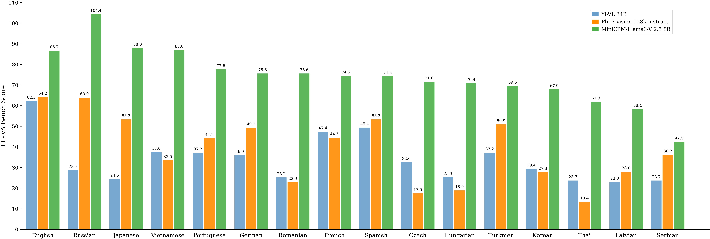
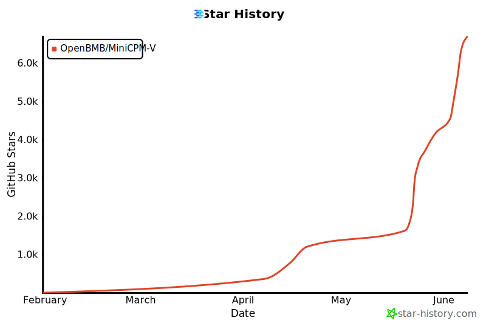

<div align="center">

</img> 

**A GPT-4V Level Multimodal LLM on Your Phone**

  <strong>[中文](./README_zh.md) |
  English</strong>

Join our <a href="docs/wechat.md" target="_blank"> 💬 WeChat</a> 


<p align="center">
  MiniCPM-Llama3-V  2.5  <a href="https://huggingface.co/openbmb/MiniCPM-Llama3-V-2_5/">🤗</a> <a href="https://huggingface.co/spaces/openbmb/MiniCPM-Llama3-V-2_5">🤖</a> |
  MiniCPM-V 2.0  <a href="https://huggingface.co/openbmb/MiniCPM-V-2/">🤗</a> <a href="https://huggingface.co/spaces/openbmb/MiniCPM-V-2">🤖</a> |
  <a href="https://openbmb.vercel.app/minicpm-v-2-en"> Technical Blog </a>
</p>

</div>


**MiniCPM-V** is a series of end-side multimodal LLMs (MLLMs) designed for vision-language understanding. The models take image and text as inputs and provide high-quality text outputs. Since February 2024, we have released 4 versions of the model, aiming to achieve **strong performance and efficient deployment**. The most notable models in this series currently include:

- **MiniCPM-Llama3-V 2.5**: 🔥🔥🔥 The latest and most capable model in the MiniCPM-V series. With a total of 8B parameters, the model **surpasses proprietary models such as GPT-4V-1106, Gemini Pro, Qwen-VL-Max and Claude 3** in overall performance. Equipped with the enhanced OCR and instruction-following capability, the model can also support multimodal conversation for **over 30 languages** including English, Chinese, French, Spanish, German etc. With help of quantization, compilation optimizations, and several efficient inference techniques on CPUs and NPUs, MiniCPM-Llama3-V 2.5 can be **efficiently deployed on end-side devices**.

- **MiniCPM-V 2.0**: The lightest model in the MiniCPM-V series. With 2B parameters, it surpasses larger models such as Yi-VL 34B, CogVLM-Chat 17B, and Qwen-VL-Chat 10B in overall performance. It can accept image inputs of any aspect ratio and up to 1.8 million pixels (e.g., 1344x1344), achieving comparable performance with Gemini Pro in understanding scene-text and matches GPT-4V in low hallucination rates.


## News <!-- omit in toc -->

#### 📌 Pinned

* [2024.05.28] 🚀🚀🚀 MiniCPM-Llama3-V 2.5 now fully supports its feature in llama.cpp and ollama! Please pull the latest code **of our provided forks** ([llama.cpp](https://github.com/OpenBMB/llama.cpp/blob/minicpm-v2.5/examples/minicpmv/README.md), [ollama](https://github.com/OpenBMB/ollama/tree/minicpm-v2.5/examples/minicpm-v2.5)). GGUF models in various sizes are available [here](https://huggingface.co/openbmb/MiniCPM-Llama3-V-2_5-gguf/tree/main). MiniCPM-Llama3-V 2.5 series is **not supported by the official repositories yet**, and we are working hard to merge PRs. Please stay tuned!
* [2024.05.28] 💫 We now support LoRA fine-tuning for MiniCPM-Llama3-V 2.5, using only 2 V100 GPUs! See more statistics [here](https://github.com/OpenBMB/MiniCPM-V/tree/main/finetune#model-fine-tuning-memory-usage-statistics).
* [2024.05.23] 🔍 We've released a comprehensive comparison between Phi-3-vision-128k-instruct and MiniCPM-Llama3-V 2.5, including benchmarks evaluations, multilingual capabilities, and inference efficiency 🌟📊🌍🚀. Click [here](./docs/compare_with_phi-3_vision.md) to view more details.
* [2024.05.23] 🔥🔥🔥 MiniCPM-V tops GitHub Trending and Hugging Face Trending! Our demo, recommended by Hugging Face Gradio’s official account, is available [here](https://huggingface.co/spaces/openbmb/MiniCPM-Llama3-V-2_5). Come and try it out!

<br>

* [2024.06.03] Now, you can run MiniCPM-Llama3-V 2.5 on multiple low VRAM GPUs(12 GB or 16 GB) by distributing the model's layers across multiple GPUs. For more details, Check this [link](https://github.com/OpenBMB/MiniCPM-V/blob/main/docs/inference_on_multiple_gpus.md).
* [2024.05.25] MiniCPM-Llama3-V 2.5 now supports streaming outputs and customized system prompts. Try it [here](https://huggingface.co/openbmb/MiniCPM-Llama3-V-2_5#usage)!
* [2024.05.24] We release the MiniCPM-Llama3-V 2.5 [gguf](https://huggingface.co/openbmb/MiniCPM-Llama3-V-2_5-gguf), which supports [llama.cpp](#inference-with-llamacpp) inference and provides a 6~8 token/s smooth decoding on mobile phones. Try it now!
* [2024.05.20] We open-soure MiniCPM-Llama3-V 2.5, it has improved OCR capability and supports 30+ languages, representing the first end-side MLLM achieving GPT-4V level performance! We provide [efficient inference](#deployment-on-mobile-phone) and [simple fine-tuning](./finetune/readme.md). Try it now!
* [2024.04.23] MiniCPM-V-2.0 supports vLLM now! Click [here](#vllm) to view more details.
* [2024.04.18] We create a HuggingFace Space to host the demo of MiniCPM-V 2.0 at [here](https://huggingface.co/spaces/openbmb/MiniCPM-V-2)!
* [2024.04.17] MiniCPM-V-2.0 supports deploying [WebUI Demo](#webui-demo) now!
* [2024.04.15] MiniCPM-V-2.0 now also supports [fine-tuning](https://github.com/modelscope/swift/blob/main/docs/source/Multi-Modal/minicpm-v-2最佳实践.md) with the SWIFT framework!
* [2024.04.12] We open-source MiniCPM-V 2.0, which achieves comparable performance with Gemini Pro in understanding scene text and outperforms strong Qwen-VL-Chat 9.6B and Yi-VL 34B on <a href="https://rank.opencompass.org.cn/leaderboard-multimodal">OpenCompass</a>, a comprehensive evaluation over 11 popular benchmarks. Click <a href="https://openbmb.vercel.app/minicpm-v-2">here</a> to view the MiniCPM-V 2.0 technical blog.
* [2024.03.14] MiniCPM-V now supports [fine-tuning](https://github.com/modelscope/swift/blob/main/docs/source/Multi-Modal/minicpm-v最佳实践.md) with the SWIFT framework. Thanks to [Jintao](https://github.com/Jintao-Huang) for the contribution！
* [2024.03.01] MiniCPM-V now can be deployed on Mac!
* [2024.02.01] We open-source MiniCPM-V and OmniLMM-12B, which support efficient end-side deployment and powerful multimodal capabilities correspondingly.


## Contents <!-- omit in toc -->


- [MiniCPM-Llama3-V 2.5](#minicpm-llama3-v-25)
- [MiniCPM-V 2.0](#minicpm-v-20)
- [Chat with Our Demo on Gradio](#chat-with-our-demo-on-gradio)
- [Install](#install)
- [Inference](#inference)
  - [Model Zoo](#model-zoo)
  - [Multi-turn Conversation](#multi-turn-conversation)
  - [Inference on Mac](#inference-on-mac)
  - [Deployment on Mobile Phone](#deployment-on-mobile-phone)
  - [Inference with llama.cpp](#inference-with-llamacpp)
  - [Inference with vLLM](#inference-with-vllm)
- [Fine-tuning](#fine-tuning)
- [TODO](#todo)
- [🌟 Star History](#-star-history)
- [Citation](#citation)

## MiniCPM-Llama3-V 2.5

**MiniCPM-Llama3-V 2.5** is the latest model in the MiniCPM-V series. The model is built on SigLip-400M and Llama3-8B-Instruct with a total of 8B parameters. It exhibits a significant performance improvement over MiniCPM-V 2.0. Notable features of MiniCPM-Llama3-V 2.5 include:

- 🔥 **Leading Performance.**
  MiniCPM-Llama3-V 2.5 has achieved an average score of 65.1 on OpenCompass, a comprehensive evaluation over 11 popular benchmarks. **With only 8B parameters, it surpasses widely used proprietary models like GPT-4V-1106, Gemini Pro, Claude 3 and Qwen-VL-Max** and greatly outperforms other Llama 3-based MLLMs.

- 💪 **Strong OCR Capabilities.**
  MiniCPM-Llama3-V 2.5 can process images with any aspect ratio and up to 1.8 million pixels (e.g., 1344x1344), achieving a **700+ score on OCRBench, surpassing proprietary models such as GPT-4o, GPT-4V-0409, Qwen-VL-Max and Gemini Pro**. Based on recent user feedback, MiniCPM-Llama3-V 2.5 has now enhanced full-text OCR extraction, table-to-markdown conversion, and other high-utility capabilities, and has further strengthened its instruction-following and complex reasoning abilities, enhancing multimodal interaction experiences.

- 🏆 **Trustworthy Behavior.**
  Leveraging the latest [RLAIF-V](https://github.com/RLHF-V/RLAIF-V/) method (the newest technique in the [RLHF-V](https://github.com/RLHF-V) [CVPR'24] series), MiniCPM-Llama3-V 2.5 exhibits more trustworthy behavior. It achieves a **10.3%** hallucination rate on Object HalBench, lower than GPT-4V-1106 (13.6%), achieving the best-level performance within the open-source community. [Data released](https://huggingface.co/datasets/openbmb/RLAIF-V-Dataset).

- 🌏 **Multilingual Support.**
  Thanks to the strong multilingual capabilities of Llama 3 and the cross-lingual generalization technique from [VisCPM](https://github.com/OpenBMB/VisCPM), MiniCPM-Llama3-V 2.5 extends its bilingual (Chinese-English) multimodal capabilities to **over 30 languages including German, French, Spanish, Italian, Korean etc.** [All Supported Languages](./assets/minicpm-llama-v-2-5_languages.md).

- 🚀 **Efficient Deployment.**
  MiniCPM-Llama3-V 2.5 systematically employs **model quantization, CPU optimizations, NPU optimizations and compilation optimizations**, achieving high-efficiency deployment on end-side devices. For mobile phones with Qualcomm chips, we have integrated the NPU acceleration framework QNN into llama.cpp for the first time. After systematic optimization, MiniCPM-Llama3-V 2.5 has realized a **150x acceleration in end-side MLLM image encoding** and a **3x speedup in language decoding**.

-  💫  **Easy Usage.**
MiniCPM-Llama3-V 2.5 can be easily used in various ways: (1) [llama.cpp](https://github.com/OpenBMB/llama.cpp/blob/minicpm-v2.5/examples/minicpmv/README.md) and [ollama](https://github.com/OpenBMB/ollama/tree/minicpm-v2.5/examples/minicpm-v2.5) support for efficient CPU inference on local devices, (2) [GGUF](https://huggingface.co/openbmb/MiniCPM-Llama3-V-2_5-gguf) format quantized models in 16 sizes, (3) efficient [LoRA](https://github.com/OpenBMB/MiniCPM-V/tree/main/finetune#lora-finetuning) fine-tuning with only 2 V100 GPUs, (4) [streaming output](https://huggingface.co/openbmb/MiniCPM-Llama3-V-2_5#usage), (5) quick local WebUI demo setup with [Gradio](https://github.com/OpenBMB/MiniCPM-V/blob/main/web_demo_2.5.py) and [Streamlit](https://github.com/OpenBMB/MiniCPM-V/blob/main/web_demo_streamlit-2_5.py), and (6) interactive demos on [HuggingFace Spaces](https://huggingface.co/spaces/openbmb/MiniCPM-Llama3-V-2_5).

### Evaluation  <!-- omit in toc -->

<div align="center">
    
</div>
<details>
<summary>Click to view results on TextVQA, DocVQA, OCRBench, OpenCompass, MME, MMBench, MMMU, MathVista, LLaVA Bench, RealWorld QA, Object HalBench. </summary>
<div align="center">

<table style="margin: 0px auto;">
    <thead>
        <tr>
            <th align="left">Model</th>
            <th>Size</th>
            <th>OCRBench</th>
            <th>TextVQA val</th>
            <th>DocVQA test</th>
            <th>Open-Compass</th>
            <th>MME</th>
            <th>MMB test (en)</th>
            <th>MMB test (cn)</th>
            <th>MMMU val</th>
            <th>Math-Vista</th>
            <th>LLaVA Bench</th>
            <th>RealWorld QA</th>
            <th>Object HalBench</th>
        </tr>
    </thead>
    <tbody align="center">
        <tr>
            <td colspan="14" align="left"><strong>Proprietary</strong></td>
        </tr>
        <tr>
            <td nowrap="nowrap" align="left">Gemini Pro</td>
            <td>-</td>
            <td>680</td>
            <td>74.6</td>
            <td>88.1</td>
            <td>62.9</td>
            <td>2148.9</td>
            <td>73.6</td>
            <td>74.3</td>
            <td>48.9</td>
            <td>45.8</td>
            <td>79.9</td>
            <td>60.4</td>
            <td>-</td>
        </tr>
        <tr>
            <td nowrap="nowrap" align="left">GPT-4V (2023.11.06)</td>
            <td>-</td>
            <td>645</td>
            <td>78.0</td>
            <td>88.4</td>
            <td>63.5</td>
            <td>1771.5</td>
            <td>77.0</td>
            <td>74.4</td>
            <td>53.8</td>
            <td>47.8</td>
            <td>93.1</td>
            <td>63.0</td>
            <td>86.4</td>
        </tr>
        <tr>
            <td colspan="14" align="left"><strong>Open-source</strong></td>
        </tr>
        <tr>
            <td nowrap="nowrap" align="left">Mini-Gemini</td>
            <td>2.2B</td>
            <td>-</td>
            <td>56.2</td>
            <td>34.2*</td>
            <td>-</td>
            <td>1653.0</td>
            <td>-</td>
            <td>-</td>
            <td>31.7</td>
            <td>-</td>
            <td>-</td>
            <td>-</td>
            <td>-</td>
        </tr>
        <tr>
            <td nowrap="nowrap" align="left">Qwen-VL-Chat</td>
            <td>9.6B</td>
            <td>488</td>
            <td>61.5</td>
            <td>62.6</td>
            <td>51.6</td>
            <td>1860.0</td>
            <td>61.8</td>
            <td>56.3</td>
            <td>37.0</td>
            <td>33.8</td>
            <td>67.7</td>
            <td>49.3</td>
            <td>56.2</td>
        </tr>
        <tr>
            <td nowrap="nowrap" align="left">DeepSeek-VL-7B</td>
            <td>7.3B</td>
            <td>435</td>
            <td>64.7*</td>
            <td>47.0*</td>
            <td>54.6</td>
            <td>1765.4</td>
            <td>73.8</td>
            <td>71.4</td>
            <td>38.3</td>
            <td>36.8</td>
            <td>77.8</td>
            <td>54.2</td>
            <td>-</td>
        </tr>        
        <tr>
            <td nowrap="nowrap" align="left">Yi-VL-34B</td>
            <td>34B</td>
            <td>290</td>
            <td>43.4*</td>
            <td>16.9*</td>
            <td>52.2</td>
            <td><strong>2050.2</strong></td>
            <td>72.4</td>
            <td>70.7</td>
            <td>45.1</td>
            <td>30.7</td>
            <td>62.3</td>
            <td>54.8</td>
            <td>79.3</td>
        </tr>
        <tr>
            <td nowrap="nowrap" align="left">CogVLM-Chat</td>
            <td>17.4B</td>
            <td>590</td>
            <td>70.4</td>
            <td>33.3*</td>
            <td>54.2</td>
            <td>1736.6</td>
            <td>65.8</td>
            <td>55.9</td>
            <td>37.3</td>
            <td>34.7</td>
            <td>73.9</td>
            <td>60.3</td>
            <td>73.6</td>
        </tr>
        <tr>
            <td nowrap="nowrap" align="left">TextMonkey</td>
            <td>9.7B</td>
            <td>558</td>
            <td>64.3</td>
            <td>66.7</td>
            <td>-</td>
            <td>-</td>
            <td>-</td>
            <td>-</td>
            <td>-</td>
            <td>-</td>
            <td>-</td>
            <td>-</td>
            <td>-</td>
        </tr>
        <tr>
          <td nowrap="nowrap" align="left">Idefics2</td>
          <td>8.0B</td>
          <td>-</td>
          <td>73.0</td>
          <td>74.0</td>
          <td>57.2</td>
          <td>1847.6</td>
          <td>75.7</td>
          <td>68.6</td>
          <td>45.2</td>
          <td>52.2</td>
          <td>49.1</td>
          <td>60.7</td>
          <td>-</td>
        </tr>
        <tr>
            <td nowrap="nowrap" align="left">Bunny-LLama-3-8B</td>
            <td>8.4B</td>
            <td>-</td>
            <td>-</td>
            <td>-</td>
            <td>54.3</td>
            <td>1920.3</td>
            <td>77.0</td>
            <td>73.9</td>
            <td>41.3</td>
            <td>31.5</td>
            <td>61.2</td>
            <td>58.8</td>
            <td>-</td>
        </tr>
        <tr>
            <td nowrap="nowrap" align="left">LLaVA-NeXT Llama-3-8B</td>
            <td>8.4B</td>
            <td>-</td>
            <td>-</td>
            <td>78.2</td>
            <td>-</td>
            <td>1971.5</td>
            <td>-</td>
            <td>-</td>
            <td>41.7</td>
            <td>37.5</td>
            <td>80.1</td>
            <td>60.0</td>
            <td>-</td>
        </tr>
        <tr>
            <td nowrap="nowrap" align="left">Phi-3-vision-128k-instruct</td>
            <td>4.2B</td>
            <td>639*</td>
            <td>70.9</td>
            <td>-</td>
            <td>-</td>
            <td>1537.5*</td>
            <td>-</td>
            <td>-</td>
            <td>40.4</td>
            <td>44.5</td>
            <td>64.2*</td>
            <td>58.8*</td>
            <td>-</td>
        </tr>
        <tr style="background-color: #e6f2ff;">
            <td nowrap="nowrap" align="left">MiniCPM-V 1.0</td>
            <td>2.8B</td>
            <td>366</td>
            <td>60.6</td>
            <td>38.2</td>
            <td>47.5</td>
            <td>1650.2</td>
            <td>64.1</td>
            <td>62.6</td>
            <td>38.3</td>
            <td>28.9</td>
            <td>51.3</td>
            <td>51.2</td>
            <td>78.4</td>
        </tr>
        <tr style="background-color: #e6f2ff;">
            <td nowrap="nowrap" align="left">MiniCPM-V 2.0</td>
            <td>2.8B</td>
            <td>605</td>
            <td>74.1</td>
            <td>71.9</td>
            <td>54.5</td>
            <td>1808.6</td>
            <td>69.1</td>
            <td>66.5</td>
            <td>38.2</td>
            <td>38.7</td>
            <td>69.2</td>
            <td>55.8</td>
            <td>85.5</td>
        </tr>
        <tr style="background-color: #e6f2ff;">
            <td nowrap="nowrap" align="left">MiniCPM-Llama3-V 2.5</td>
            <td>8.5B</td>
            <td><strong>725</strong></td>
            <td><strong>76.6</strong></td>
            <td><strong>84.8</strong></td>
            <td><strong>65.1</strong></td>
            <td>2024.6</td>
            <td><strong>77.2</strong></td>
            <td><strong>74.2</strong></td>
            <td><strong>45.8</strong></td>
            <td><strong>54.3</strong></td>
            <td><strong>86.7</strong></td>
            <td><strong>63.5</strong></td>
            <td><strong>89.7</strong></td>
        </tr>
    </tbody>
</table>


</div>
* We evaluate the officially released checkpoint by ourselves.

</details>

<div align="center">
    
    <br>
    Evaluation results of multilingual LLaVA Bench
</div>

### Examples <!-- omit in toc -->

<table align="center" >
  <p align="center" > 
  
  </p>
</table>

We deploy MiniCPM-Llama3-V 2.5 on end devices. The demo video is the raw screen recording on a Xiaomi 14 Pro without edition.

<table align="center">
    <p align="center">
      
      
    </p>
</table>

<table align="center">
    <p align="center">
      
    </p>
</table>

## MiniCPM-V 2.0

<details>
<summary>Click to view more details of MiniCPM-V 2.0</summary>


**MiniCPM-V 2.0** is an efficient version with promising performance for deployment. The model is built based on SigLip-400M and [MiniCPM-2.4B](https://github.com/OpenBMB/MiniCPM/), connected by a perceiver resampler. Our latest version, MiniCPM-V 2.0 has several notable features. 

- 🔥 **State-of-the-art Performance.** 

  MiniCPM-V 2.0 achieves **state-of-the-art performance** on multiple benchmarks (including OCRBench, TextVQA, MME, MMB, MathVista, etc) among models under 7B parameters. It even **outperforms strong Qwen-VL-Chat 9.6B, CogVLM-Chat 17.4B, and Yi-VL 34B on OpenCompass, a comprehensive evaluation over 11 popular benchmarks**. Notably, MiniCPM-V 2.0 shows **strong OCR capability**, achieving **comparable performance to Gemini Pro in scene-text understanding**, and **state-of-the-art performance on OCRBench** among open-source models.

- 🏆 **Trustworthy Behavior.** 

  LMMs are known for suffering from hallucination, often generating text not factually grounded in images. MiniCPM-V 2.0 is **the first end-side LMM aligned via multimodal RLHF for trustworthy behavior** (using the recent [RLHF-V](https://rlhf-v.github.io/) [CVPR'24] series technique). This allows the model to **match GPT-4V in preventing hallucinations** on Object HalBench.

- 🌟 **High-Resolution Images at Any Aspect Raito.**

  MiniCPM-V 2.0 can accept **1.8 million pixels (e.g., 1344x1344) images at any aspect ratio**. This enables better perception of fine-grained visual information such as small objects and optical characters, which is achieved via a recent technique from [LLaVA-UHD](https://arxiv.org/pdf/2403.11703.pdf).

- ⚡️ **High Efficiency.** 

  MiniCPM-V 2.0 can be **efficiently deployed on most GPU cards and personal computers**, and **even on end devices such as mobile phones**. For visual encoding, we compress the image representations into much fewer tokens via a perceiver resampler. This allows MiniCPM-V 2.0 to operate with **favorable memory cost and speed during inference even when dealing with high-resolution images**.

- 🙌 **Bilingual Support.** 

  MiniCPM-V 2.0 **supports strong bilingual multimodal capabilities in both English and Chinese**. This is enabled by generalizing multimodal capabilities across languages, a technique from [VisCPM](https://arxiv.org/abs/2308.12038) [ICLR'24].

### Examples <!-- omit in toc -->

<table align="center">
    <p align="center">
      
    </p>
</table>

We deploy MiniCPM-V 2.0 on end devices. The demo video is the raw screen recording on a Xiaomi 14 Pro without edition.

<table align="center">
    <p align="center">
      
      
    </p>
</table>

</details>

## Legacy Models <!-- omit in toc --> 

| Model                | Introduction and Guidance       |
|:----------------------|:-------------------:|
| MiniCPM-V 1.0  | [Document](./minicpm_v1.md)   | 
| OmniLMM-12B  | [Document](./omnilmm_en.md)   |  


## Chat with Our Demo on Gradio

We provide online and local demos powered by HuggingFace [Gradio](https://github.com/gradio-app/gradio), the most popular model deployment framework nowadays. It supports streaming outputs, progress bars, queuing, alerts,  and other useful features.


### Online Demo <!-- omit in toc --> 

Click here to try out the online demo of [MiniCPM-Llama3-V 2.5](https://huggingface.co/spaces/openbmb/MiniCPM-Llama3-V-2_5) ｜ [MiniCPM-V 2.0](https://huggingface.co/spaces/openbmb/MiniCPM-V-2) on HuggingFace Spaces.

### Local WebUI Demo <!-- omit in toc --> 
  
You can easily build your own local WebUI demo with Gradio using the following commands.
  
```shell
pip install -r requirements.txt
```
  
```shell
# For NVIDIA GPUs, run:
python web_demo_2.5.py --device cuda

# For Mac with MPS (Apple silicon or AMD GPUs), run:
PYTORCH_ENABLE_MPS_FALLBACK=1 python web_demo_2.5.py --device mps
```


## Install

1. Clone this repository and navigate to the source folder

```bash
git clone https://github.com/OpenBMB/MiniCPM-V.git
cd MiniCPM-V
```

2. Create conda environment

```Shell
conda create -n MiniCPM-V python=3.10 -y
conda activate MiniCPM-V
```

3. Install dependencies

```shell
pip install -r requirements.txt
```

## Inference


### Model Zoo

| Model           | Device | Memory    | &emsp;&emsp;&emsp;&emsp;&emsp;&emsp;&emsp;&emsp; Description       | Download |
|:-----------|:--:|:-----------:|:-------------------|:---------------:|
| MiniCPM-Llama3-V 2.5 | GPU | 19 GB | The lastest version, achieving state-of-the end-side multimodal performance.   |  [🤗](https://huggingface.co/openbmb/MiniCPM-Llama3-V-2_5/) &nbsp;&nbsp; [</img>](https://modelscope.cn/models/OpenBMB/MiniCPM-Llama3-V-2_5) |
| MiniCPM-Llama3-V 2.5 gguf | CPU  | 5 GB | The gguf version, lower memory usage and faster inference.   |  [🤗](https://huggingface.co/openbmb/MiniCPM-Llama3-V-2_5-gguf) &nbsp;&nbsp;[</img>](https://modelscope.cn/models/OpenBMB/MiniCPM-Llama3-V-2_5-gguf) |
| MiniCPM-Llama3-V 2.5 int4 | GPU | 8 GB | The int4 quantized version，lower GPU memory usage. |  [🤗](https://huggingface.co/openbmb/MiniCPM-Llama3-V-2_5-int4/) &nbsp;&nbsp; [</img>](https://modelscope.cn/models/OpenBMB/MiniCPM-Llama3-V-2_5-int4) |
| MiniCPM-V 2.0 | GPU | 8 GB | Light version, balance the performance the computation cost.   |  [🤗](https://huggingface.co/openbmb/MiniCPM-V-2) &nbsp;&nbsp; [</img>](https://modelscope.cn/models/OpenBMB/MiniCPM-V-2) |
| MiniCPM-V 1.0 | GPU | 7 GB | Lightest version, achieving the fastest inference. |   [🤗](https://huggingface.co/openbmb/MiniCPM-V) &nbsp;&nbsp; [</img>](https://modelscope.cn/models/OpenBMB/MiniCPM-V) |

### Multi-turn Conversation

Please refer to the following codes to run.

<div align="center">

</div>


```python
from chat import MiniCPMVChat, img2base64
import torch
import json

torch.manual_seed(0)

chat_model = MiniCPMVChat('openbmb/MiniCPM-Llama3-V-2_5')

im_64 = img2base64('./assets/airplane.jpeg')

# First round chat 
msgs = [{"role": "user", "content": "Tell me the model of this aircraft."}]

inputs = {"image": im_64, "question": json.dumps(msgs)}
answer = chat_model.chat(inputs)
print(answer)

# Second round chat 
# pass history context of multi-turn conversation
msgs.append({"role": "assistant", "content": answer})
msgs.append({"role": "user", "content": "Introduce something about Airbus A380."})

inputs = {"image": im_64, "question": json.dumps(msgs)}
answer = chat_model.chat(inputs)
print(answer)
```

You will get the following output:

```
"The aircraft in the image is an Airbus A380, which can be identified by its large size, double-deck structure, and the distinctive shape of its wings and engines. The A380 is a wide-body aircraft known for being the world's largest passenger airliner, designed for long-haul flights. It has four engines, which are characteristic of large commercial aircraft. The registration number on the aircraft can also provide specific information about the model if looked up in an aviation database."

"The Airbus A380 is a double-deck, wide-body, four-engine jet airliner made by Airbus. It is the world's largest passenger airliner and is known for its long-haul capabilities. The aircraft was developed to improve efficiency and comfort for passengers traveling over long distances. It has two full-length passenger decks, which can accommodate more passengers than a typical single-aisle airplane. The A380 has been operated by airlines such as Lufthansa, Singapore Airlines, and Emirates, among others. It is widely recognized for its unique design and significant impact on the aviation industry."
```


### Inference on Mac
<details>
<summary>Click to view an example, to run MiniCPM-Llama3-V 2.5 on 💻 Mac with MPS (Apple silicon or AMD GPUs). </summary>

```python
# test.py  Need more than 16GB memory.
import torch
from PIL import Image
from transformers import AutoModel, AutoTokenizer

model = AutoModel.from_pretrained('openbmb/MiniCPM-Llama3-V-2_5', trust_remote_code=True, low_cpu_mem_usage=True)
model = model.to(device='mps')

tokenizer = AutoTokenizer.from_pretrained('openbmb/MiniCPM-Llama3-V-2_5', trust_remote_code=True)
model.eval()

image = Image.open('./assets/hk_OCR.jpg').convert('RGB')
question = 'Where is this photo taken?'
msgs = [{'role': 'user', 'content': question}]

answer, context, _ = model.chat(
    image=image,
    msgs=msgs,
    context=None,
    tokenizer=tokenizer,
    sampling=True
)
print(answer)
```
Run with command:
```shell
PYTORCH_ENABLE_MPS_FALLBACK=1 python test.py
```
</details>

### Deployment on Mobile Phone
MiniCPM-Llama3-V 2.5 and MiniCPM-V 2.0 can be deployed on mobile phones with Android operating systems. 🚀 Click [MiniCPM-Llama3-V 2.5](http://minicpm.modelbest.cn/android/modelbest-release-20240528_182155.apk) / [MiniCPM-V 2.0](https://github.com/OpenBMB/mlc-MiniCPM) to install apk.

### Inference with llama.cpp<a id="inference-with-llamacpp"></a>
MiniCPM-Llama3-V 2.5 can run with llama.cpp now! See our fork of [llama.cpp](https://github.com/OpenBMB/llama.cpp/tree/minicpm-v2.5/examples/minicpmv) for more detail. This implementation supports smooth inference of 6~8 token/s on mobile phones (test environment：Xiaomi 14 pro + Snapdragon 8 Gen 3).

### Inference with vLLM<a id="vllm"></a>

<details>
<summary>Click to see how to inference MiniCPM-V 2.0 with vLLM (MiniCPM-Llama3-V 2.5 coming soon) </summary>
Because our pull request to vLLM is still waiting for reviewing, we fork this repository to build and test our vLLM demo. Here are the steps:

1. Clone our version of vLLM:
```shell
git clone https://github.com/OpenBMB/vllm.git
```
2. Install vLLM:
```shell
cd vllm
pip install -e .
```
3. Install timm: 
```shell
pip install timm==0.9.10
```
4. Run our demo:
```shell
python examples/minicpmv_example.py 
```
</details>

## Fine-tuning

### Simple Fine-tuning <!-- omit in toc -->

We support simple fine-tuning with Hugging Face for MiniCPM-V 2.0 and MiniCPM-Llama3-V 2.5.

[Reference Document](./finetune/readme.md)

### With the SWIFT Framework <!-- omit in toc -->

We now support MiniCPM-V series fine-tuning with the SWIFT framework. SWIFT supports training, inference, evaluation and deployment of nearly 200 LLMs and MLLMs . It supports the lightweight training solutions provided by PEFT and a complete Adapters Library including techniques such as NEFTune, LoRA+ and LLaMA-PRO.

Best Practices：[MiniCPM-V 1.0](https://github.com/modelscope/swift/blob/main/docs/source/Multi-Modal/minicpm-v最佳实践.md), [MiniCPM-V 2.0](https://github.com/modelscope/swift/blob/main/docs/source/Multi-Modal/minicpm-v-2最佳实践.md)


## TODO

- [x] MiniCPM-V fine-tuning support
- [ ] Code release for real-time interactive assistant

## Model License <!-- omit in toc -->

* This repository is released under the [Apache-2.0](https://github.com/OpenBMB/MiniCPM/blob/main/LICENSE) License. 

* The usage of MiniCPM-V model weights must strictly follow [MiniCPM Model License.md](https://github.com/OpenBMB/MiniCPM/blob/main/MiniCPM%20Model%20License.md).

* The models and weights of MiniCPM are completely free for academic research. after filling out a ["questionnaire"](https://modelbest.feishu.cn/share/base/form/shrcnpV5ZT9EJ6xYjh3Kx0J6v8g) for registration, are also available for free commercial use.
  

## Statement <!-- omit in toc -->

As LMMs, MiniCPM-V models (including OmniLMM) generate contents by learning a large amount of multimodal corpora, but they cannot comprehend, express personal opinions or make value judgement. Anything generated by MiniCPM-V models does not represent the views and positions of the model developers

We will not be liable for any problems arising from the use of MiniCPMV-V models, including but not limited to data security issues, risk of public opinion, or any risks and problems arising from the misdirection, misuse, dissemination or misuse of the model.


## Institutions  <!-- omit in toc -->

This project is developed by the following institutions:

-  [THUNLP](https://nlp.csai.tsinghua.edu.cn/)
-  [ModelBest](https://modelbest.cn/)
-  [Zhihu](https://www.zhihu.com/ )

## Other Multimodal Projects from Our Team <!-- omit in toc -->

👏 Welcome to explore other multimodal projects of our team:

[VisCPM](https://github.com/OpenBMB/VisCPM/tree/main) | [RLHF-V](https://github.com/RLHF-V/RLHF-V) | [LLaVA-UHD](https://github.com/thunlp/LLaVA-UHD) | [RLAIF-V](https://github.com/RLHF-V/RLAIF-V)

## 🌟 Star History


<table align="center">
    <p align="center">
      
    </p>
</table>

<!-- <picture>
  <source
    media="(prefers-color-scheme: dark)"
    srcset="
      https://api.star-history.com/svg?repos=OpenBMB/MiniCPM-V&type=Date&theme=dark
    "
  />
  <source
    media="(prefers-color-scheme: light)"
    srcset="
      https://api.star-history.com/svg?repos=OpenBMB/MiniCPM-V&type=Date
    "
  />
  
</picture> -->

## Citation

If you find our model/code/paper helpful, please consider cite our papers 📝 and star us ⭐️！

```bib
@article{yu2023rlhf,
  title={Rlhf-v: Towards trustworthy mllms via behavior alignment from fine-grained correctional human feedback},
  author={Yu, Tianyu and Yao, Yuan and Zhang, Haoye and He, Taiwen and Han, Yifeng and Cui, Ganqu and Hu, Jinyi and Liu, Zhiyuan and Zheng, Hai-Tao and Sun, Maosong and others},
  journal={arXiv preprint arXiv:2312.00849},
  year={2023}
}
@article{viscpm,
    title={Large Multilingual Models Pivot Zero-Shot Multimodal Learning across Languages}, 
    author={Jinyi Hu and Yuan Yao and Chongyi Wang and Shan Wang and Yinxu Pan and Qianyu Chen and Tianyu Yu and Hanghao Wu and Yue Zhao and Haoye Zhang and Xu Han and Yankai Lin and Jiao Xue and Dahai Li and Zhiyuan Liu and Maosong Sun},
    journal={arXiv preprint arXiv:2308.12038},
    year={2023}
}
@article{xu2024llava-uhd,
  title={{LLaVA-UHD}: an LMM Perceiving Any Aspect Ratio and High-Resolution Images},
  author={Xu, Ruyi and Yao, Yuan and Guo, Zonghao and Cui, Junbo and Ni, Zanlin and Ge, Chunjiang and Chua, Tat-Seng and Liu, Zhiyuan and Huang, Gao},
  journal={arXiv preprint arXiv:2403.11703},
  year={2024}
}
@article{yu2024rlaifv,
  title={RLAIF-V: Aligning MLLMs through Open-Source AI Feedback for Super GPT-4V Trustworthiness}, 
  author={Yu, Tianyu and Zhang, Haoye and Yao, Yuan and Dang, Yunkai and Chen, Da and Lu, Xiaoman and Cui, Ganqu and He, Taiwen and Liu, Zhiyuan and Chua, Tat-Seng and Sun, Maosong},
  journal={arXiv preprint arXiv:2405.17220},
  year={2024}
}
```
