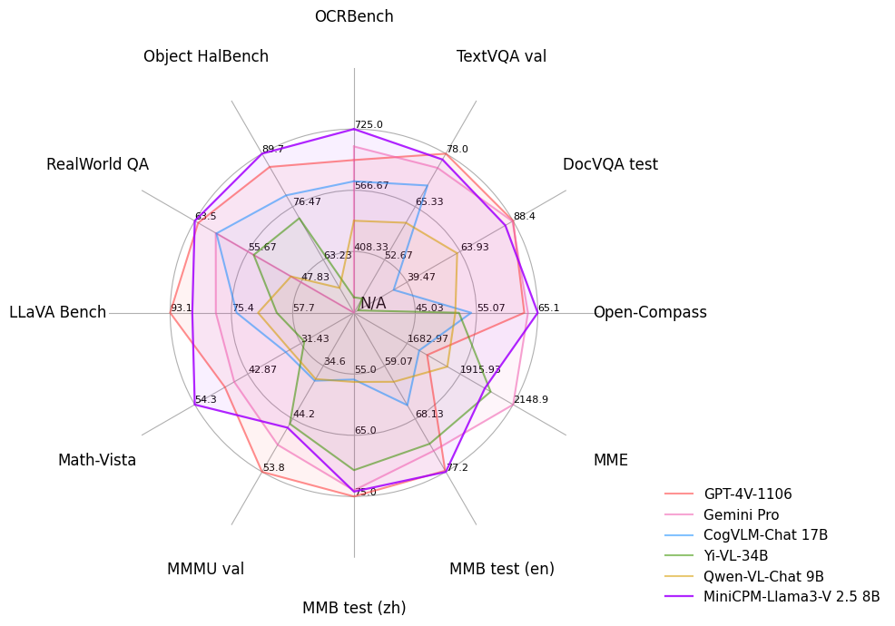

<div align="center">

<!-- <!-- <h1 style="color: #33A6B8; font-family: Helvetica"> OmniLMM </h1> -->

</img> 

**端侧可用的 GPT-4V 级单图、多图、视频多模态大模型**

  <strong>中文 |
  [English](./README_en.md)</strong>

 加入我们的 <a href="docs/wechat.md" target="_blank"> 💬 微信社区</a> 

<p align="center">
  MiniCPM-V 2.6 <a href="https://huggingface.co/openbmb/MiniCPM-V-2_6">🤗</a> <a href="https://huggingface.co/spaces/openbmb/MiniCPM-V-2_6">🤖</a> | MiniCPM-Llama3-V 2.5  <a href="https://huggingface.co/openbmb/MiniCPM-Llama3-V-2_5/">🤗</a> <a href="https://huggingface.co/spaces/openbmb/MiniCPM-Llama3-V-2_5">🤖</a> |
  <a href=https://arxiv.org/abs/2408.01800>MiniCPM-Llama3-V 2.5 技术报告</a> 
</p>


</div>


**MiniCPM-V**是面向图文理解的端侧多模态大模型系列。该系列模型接受图像和文本输入，并提供高质量的文本输出。自2024年2月以来，我们共发布了5个版本模型，旨在实现**领先的性能和高效的部署**，目前该系列最值得关注的模型包括：


- **MiniCPM-V 2.6**: 🔥🔥🔥 MiniCPM-V系列的最新、性能最佳模型。总参数量 8B，单图、多图和视频理解性能**超越了 GPT-4V**。在单图理解上，它取得了优于 **GPT-4o mini、Gemini 1.5 Pro 和 Claude 3.5 Sonnet**等商用闭源模型的表现，并进一步优化了 MiniCPM-Llama3-V 2.5 的 OCR、可信行为、多语言支持以及端侧部署等诸多特性。基于其领先的视觉 token 密度，MiniCPM-V 2.6 成为了首个支持在 iPad 等端侧设备上进行实时视频理解的多模态大模型。

- **MiniCPM-V 2.0**：MiniCPM-V系列的最轻量级模型。总参数量2B，多模态综合性能超越 Yi-VL 34B、CogVLM-Chat 17B、Qwen-VL-Chat 10B 等更大参数规模的模型，可接受 180 万像素的任意长宽比图像输入，实现了和 Gemini Pro 相近的场景文字识别能力以及和 GPT-4V 相匹的低幻觉率。


## 更新日志 <!-- omit in toc -->

#### 📌 置顶
* [2024.08.15] MiniCPM-V 2.6 现在支持多图像 SFT。有关更多详细信息，请参阅[finetune/README.md](https://github.com/OpenBMB/MiniCPM-V/tree/main/finetune)
* [2024.08.14] MiniCPM-V 2.6 现在可以通过 SWIFT 框架 [微调](https://github.com/modelscope/ms-swift/issues/1613) 了！
* [2024.08.10] 🚀🚀🚀 llama.cpp [官方仓库](https://github.com/ggerganov/llama.cpp)正式支持 MiniCPM-Llama3-V 2.5 啦！点击[这里](https://huggingface.co/openbmb/MiniCPM-Llama3-V-2_5-gguf/tree/main)查看各种大小的 GGUF 版本。但还请使用者注意 MiniCPM-V 2.6 仍然需要**拉取我们最新的 fork 来使用**：[llama.cpp](https://github.com/OpenBMB/llama.cpp/blob/minicpmv-main/examples/llava/README-minicpmv2.6.md) 。我们将继续积极推进将这些功能合并到 llama.cpp 官方仓库
* [2024.08.06] 🔥🔥🔥 我们开源了 MiniCPM-V 2.6，该模型在单图、多图和视频理解方面取得了优于 GPT-4V 的表现。我们还进一步提升了 MiniCPM-Llama3-V 2.5 的多项亮点能力，并首次支持了 iPad 上的实时视频理解。欢迎试用！
* [2024.08.03] MiniCPM-Llama3-V 2.5 技术报告已发布！欢迎点击[这里](https://arxiv.org/abs/2408.01800)查看。
* [2024.07.19] MiniCPM-Llama3-V 2.5 现已支持[vLLM](#vllm-部署-) ！
* [2024.05.28] 💫 我们现在支持 MiniCPM-Llama3-V 2.5 的 LoRA 微调，更多内存使用统计信息可以在[这里](https://github.com/OpenBMB/MiniCPM-V/tree/main/finetune#model-fine-tuning-memory-usage-statistics)找到。
* [2024.05.23] 🔍 我们添加了Phi-3-vision-128k-instruct 与 MiniCPM-Llama3-V 2.5的全面对比，包括基准测试评估、多语言能力和推理效率 🌟📊🌍🚀。点击[这里](./docs/compare_with_phi-3_vision.md)查看详细信息。
* [2024.05.23] 🔥🔥🔥 MiniCPM-V 在 GitHub Trending 和 Hugging Face Trending 上登顶！MiniCPM-Llama3-V 2.5 Demo 被 Hugging Face 的 Gradio 官方账户推荐，欢迎点击[这里](https://huggingface.co/spaces/openbmb/MiniCPM-Llama3-V-2_5)体验！


<br>

<details> 
<summary>点击查看完整更新日志。</summary>

* [2024.06.03] 现在，你可以利用多张低显存显卡（12G/16G）进行GPU串行推理。详情请参见该[文档](https://github.com/OpenBMB/MiniCPM-V/blob/main/docs/inference_on_multiple_gpus.md)配置。
* [2024.05.28] 💥 MiniCPM-Llama3-V 2.5 现在在 llama.cpp 和 ollama 中完全支持其功能！**请拉取我们最新的 fork 来使用**：[llama.cpp](https://github.com/OpenBMB/llama.cpp/blob/minicpm-v2.5/examples/minicpmv/README.md) & [ollama](https://github.com/OpenBMB/ollama/tree/minicpm-v2.5/examples/minicpm-v2.5)。我们还发布了各种大小的 GGUF 版本，请点击[这里](https://huggingface.co/openbmb/MiniCPM-Llama3-V-2_5-gguf/tree/main)查看。请注意，**目前官方仓库尚未支持 MiniCPM-Llama3-V 2.5**，我们也正积极推进将这些功能合并到 llama.cpp & ollama 官方仓库，敬请关注！
* [2024.05.25] MiniCPM-Llama3-V 2.5 [支持流式输出和自定义系统提示词](https://huggingface.co/openbmb/MiniCPM-Llama3-V-2_5#usage)了，欢迎试用!
* [2024.05.24] 我们开源了 MiniCPM-Llama3-V 2.5 [gguf](https://huggingface.co/openbmb/MiniCPM-Llama3-V-2_5-gguf)，支持 [llama.cpp](#llamacpp-部署) 推理！实现端侧 6-8 tokens/s 的流畅解码，欢迎试用！
* [2024.05.20] 我们开源了 MiniCPM-Llama3-V 2.5，增强了 OCR 能力，支持 30 多种语言，并首次在端侧实现了 GPT-4V 级的多模态能力！我们提供了[高效推理](#手机端部署)和[简易微调](./finetune/readme.md)的支持，欢迎试用！
* [2024.04.23] 我们增加了MiniCPM-V 2.0对 [vLLM](#vllm-部署-) 的支持，欢迎体验！
* [2024.04.18] 我们在 HuggingFace Space 新增了 MiniCPM-V 2.0 的 [demo](https://huggingface.co/spaces/openbmb/MiniCPM-V-2)，欢迎体验！
* [2024.04.17] MiniCPM-V 2.0 现在支持用户部署本地 [WebUI Demo](#本地webui-demo部署) 了，欢迎试用!
* [2024.04.15] MiniCPM-V 2.0 现在可以通过 SWIFT 框架 [微调](https://github.com/modelscope/swift/blob/main/docs/source/Multi-Modal/minicpm-v-2最佳实践.md) 了，支持流式输出!
* [2024.04.12] 我们开源了 MiniCPM-V 2.0，该模型刷新了 OCRBench 开源模型最佳成绩，在场景文字识别能力上比肩 Gemini Pro，同时还在综合了 11 个主流多模态大模型评测基准的 <a href="https://rank.opencompass.org.cn/leaderboard-multimodal">OpenCompass</a> 榜单上超过了 Qwen-VL-Chat 10B、CogVLM-Chat 17B 和 Yi-VL 34B 等更大参数规模的模型！点击<a href="https://openbmb.vercel.app/minicpm-v-2">这里</a>查看 MiniCPM-V 2.0 技术博客。
* [2024.03.14] MiniCPM-V 现在支持 SWIFT 框架下的[微调](https://github.com/modelscope/swift/blob/main/docs/source/Multi-Modal/minicpm-v最佳实践.md)了，感谢 [Jintao](https://github.com/Jintao-Huang) 的贡献！
* [2024.03.01] MiniCPM-V 现在支持在 Mac 电脑上进行部署！
* [2024.02.01] 我们开源了 MiniCPM-V 和 OmniLMM-12B，分别可以支持高效的端侧部署和同规模领先的多模态能力！
</details>


## 目录 <!-- omit in toc -->

- [MiniCPM-V 2.6](#minicpm-v-26)
- [MiniCPM-Llama3-V 2.5](#minicpm-llama3-v-25)
- [MiniCPM-V 2.0](#minicpm-v-20)
- [Gradio Demo 🤗](#gradio-demo-)
- [安装](#安装)
- [推理](#推理)
  - [模型库](#模型库)
  - [多轮对话](#多轮对话)
    - [多图理解](#多图理解)
    - [少样本上下文学习](#少样本上下文学习)
    - [视频理解](#视频理解)
  - [多卡推理](#多卡推理)
  - [Mac 推理](#mac-推理)
  - [手机端部署](#手机端部署)
  - [本地WebUI Demo部署](#本地webui-demo部署)
  - [llama.cpp 部署](#llamacpp-部署)
  - [ollama 部署](#ollama-部署)
  - [vLLM 部署 ](#vllm-部署-)
- [微调](#微调)
- [FAQs](#faqs)

## MiniCPM-V 2.6

**MiniCPM-V 2.6** 是 MiniCPM-V 系列中最新、性能最佳的模型。该模型基于 SigLip-400M 和 Qwen2-7B 构建，共 8B 参数。与 MiniCPM-Llama3-V 2.5 相比，MiniCPM-V 2.6 性能提升显著，并引入了多图和视频理解的新功能。MiniCPM-V 2.6 的主要特点包括：


- 🔥 **领先的性能。**
  MiniCPM-V 2.6 在最新版本 OpenCompass 榜单上（综合 8 个主流多模态评测基准）平均得分 65.2，**以8B量级的大小在单图理解方面超越了 GPT-4o mini、GPT-4V、Gemini 1.5 Pro 和 Claude 3.5 Sonnet 等主流商用闭源多模态大模型**。

- 🖼️ **多图理解和上下文学习。**
  MiniCPM-V 2.6 还支持**多图对话和推理**。它在 Mantis-Eval、BLINK、Mathverse mv 和 Sciverse mv 等主流多图评测基准中取得了**最佳水平**，并展现出了优秀的上下文学习能力。

- 🎬 **视频理解。**
  MiniCPM-V 2.6 还可以**接受视频输入**，进行对话和提供涵盖时序和空间信息的详细视频描述。模型在 有/无字幕 评测场景下的 Video-MME 表现均超过了 **GPT-4V、Claude 3.5 Sonnet 和 LLaVA-NeXT-Video-34B**等商用闭源模型。

- 💪 **强大的 OCR 能力及其他功能。**
  MiniCPM-V 2.6 可以处理任意长宽比的图像，像素数可达 180 万（如 1344x1344）。在 OCRBench 上取得**最佳水平，超过 GPT-4o、GPT-4V 和 Gemini 1.5 Pro 等商用闭源模型**。基于最新的 [RLAIF-V](https://github.com/RLHF-V/RLAIF-V/) 和 [VisCPM](https://github.com/OpenBMB/VisCPM) 技术，其具备了**可信的多模态行为**，在 Object HalBench 上的幻觉率显著低于 GPT-4o 和 GPT-4V，并支持英语、中文、德语、法语、意大利语、韩语等**多种语言**。

- 🚀 **卓越的效率。**
  除了对个人用户友好的模型大小，MiniCPM-V 2.6 还表现出**最先进的视觉 token 密度**（即每个视觉 token 编码的像素数量）。它**仅需 640 个 token 即可处理 180 万像素图像，比大多数模型少 75%**。这一特性优化了模型的推理速度、首 token 延迟、内存占用和功耗。因此，MiniCPM-V 2.6 可以支持 iPad 等终端设备上的高效**实时视频理解**。

- 💫 **易于使用。**
  MiniCPM-V 2.6 可以通过多种方式轻松使用：(1) [llama.cpp](https://github.com/OpenBMB/llama.cpp/blob/minicpmv-main/examples/llava/README-minicpmv2.6.md) 和 [ollama](https://github.com/OpenBMB/ollama/blob/minicpm-v2.6/examples/minicpm-v2.6/README.md) 支持在本地设备上进行高效的 CPU 推理，(2) [int4](https://huggingface.co/openbmb/MiniCPM-V-2_6-int4) 和 [GGUF](https://huggingface.co/openbmb/MiniCPM-V-2_6-gguf) 格式的量化模型，有 16 种尺寸，(3) [vLLM](#vllm-部署-) 支持高吞吐量和内存高效的推理，(4) 针对新领域和任务进行微调，(5) 使用 [Gradio](#本地-webui-demo-) 快速设置本地 WebUI 演示，(6) 在线[demo](https://huggingface.co/spaces/openbmb/MiniCPM-V-2_6)即可体验。

### 性能评估  <!-- omit in toc -->
<div align="center">
    
</div>

<details>
<summary>点击查看 OpenCompass, MME, MMVet, OCRBench, MMMU, MathVista, MMB, AI2D, TextVQA, DocVQA, HallusionBench, Object HalBench 上的单图评测结果详情。 </summary>
<div align="center">

<table style="margin: 0px auto;">
    <thead>
        <tr>
            <th align="left">Model</th>
            <th>Size</th>
            <th>Token Density<sup>+</sup></th>
            <th>OpenCompass</th>
            <th>MME</th>
            <th>MMVet</th>
            <th>OCRBench</th>
            <th>MMMU val</th>
            <th>MathVista mini</th>
            <th>MMB1.1 test</th>
            <th>AI2D</th>
            <th>TextVQA val</th>
            <th>DocVQA test</th>
            <th>HallusionBench</th>
            <th>Object HalBench</th>
        </tr>
    </thead>
    <tbody align="center">
        <tr>
            <td colspan="15" align="left"><strong>Proprietary</strong></td>
        </tr>
        <tr>
            <td nowrap="nowrap" align="left">GPT-4o</td>
            <td>-</td>
            <td>1088</td>
            <td>69.9</td>
            <td>2328.7</td>
            <td>69.1</td>
            <td>736</td>
            <td>69.2</td>
            <td>61.3</td>
            <td>82.2</td>
            <td>84.6</td>
            <td>-</td>
            <td>92.8</td>
            <td>55.0</td>
            <td>17.6</td>
        </tr>
        <tr>
            <td nowrap="nowrap" align="left">Claude 3.5 Sonnet</td>
            <td>-</td>
            <td>750</td>
            <td>67.9</td>
            <td>1920.0</td>
            <td>66.0</td>
            <td>788</td>
            <td>65.9</td>
            <td>61.6</td>
            <td>78.5</td>
            <td>80.2</td>
            <td>-</td>
            <td>95.2</td>
            <td>49.9</td>
            <td>13.8</td>
        </tr>
        <tr>
            <td nowrap="nowrap" align="left">Gemini 1.5 Pro</td>
            <td>-</td>
            <td>-</td>
            <td>64.4</td>
            <td>2110.6</td>
            <td>64.0</td>
            <td>754</td>
            <td>60.6</td>
            <td>57.7</td>
            <td>73.9</td>
            <td>79.1</td>
            <td>73.5</td>
            <td>86.5</td>
            <td>45.6</td>
            <td>-</td>
        </tr>
        <tr>
            <td nowrap="nowrap" align="left">GPT-4o mini</td>
            <td>-</td>
            <td>1088</td>
            <td>64.1</td>
            <td>2003.4</td>
            <td>66.9</td>
            <td>785</td>
            <td>60.0</td>
            <td>52.4</td>
            <td>76.0</td>
            <td>77.8</td>
            <td>-</td>
            <td>-</td>
            <td>46.1</td>
            <td>12.4</td>
        </tr>
        <tr>
            <td nowrap="nowrap" align="left">GPT-4V</td>
            <td>-</td>
            <td>1088</td>
            <td>63.5</td>
            <td>2070.2</td>
            <td>67.5</td>
            <td>656</td>
            <td>61.7</td>
            <td>54.7</td>
            <td>79.8</td>
            <td>78.6</td>
            <td>78.0</td>
            <td>87.2</td>
            <td>43.9</td>
            <td>14.2</td>
        </tr>
        <tr>
            <td nowrap="nowrap" align="left">Step-1V</td>
            <td>-</td>
            <td>-</td>
            <td>59.5</td>
            <td>2206.4</td>
            <td>63.3</td>
            <td>625</td>
            <td>49.9</td>
            <td>44.8</td>
            <td>78.0</td>
            <td>79.2</td>
            <td>71.6</td>
            <td>-</td>
            <td>48.4</td>
            <td>-</td>
        </tr>
        <tr>
            <td nowrap="nowrap" align="left">Qwen-VL-Max</td>
            <td>-</td>
            <td>784</td>
            <td>58.3</td>
            <td>2281.7</td>
            <td>61.8</td>
            <td>684</td>
            <td>52.0</td>
            <td>43.4</td>
            <td>74.6</td>
            <td>75.7</td>
            <td>79.5</td>
            <td>93.1</td>
            <td>41.2</td>
            <td>13.4</td>
        </tr>
        <tr>
            <td colspan="15" align="left"><strong>Open-source</strong></td>
        </tr>
        <tr>
            <td nowrap="nowrap" align="left">LLaVA-NeXT-Yi-34B</td>
            <td>34B</td>
            <td>157</td>
            <td>55.0</td>
            <td>2006.5</td>
            <td>50.7</td>
            <td>574</td>
            <td>48.8</td>
            <td>40.4</td>
            <td>77.8</td>
            <td>78.9</td>
            <td>69.3</td>
            <td>-</td>
            <td>34.8</td>
            <td>12.6</td>
        </tr>
        <tr>
            <td nowrap="nowrap" align="left">Mini-Gemini-HD-34B</td>
            <td>34B</td>
            <td>157</td>
            <td>-</td>
            <td>2141</td>
            <td>59.3</td>
            <td>518</td>
            <td>48.0</td>
            <td>43.3</td>
            <td>-</td>
            <td>80.5</td>
            <td>74.1</td>
            <td>78.9</td>
            <td>-</td>
            <td>-</td>
        </tr>
        <tr>
            <td nowrap="nowrap" align="left">Cambrian-34B</td>
            <td>34B</td>
            <td>1820</td>
            <td>58.3</td>
            <td>2049.9</td>
            <td>53.2</td>
            <td>591</td>
            <td>50.4</td>
            <td>50.3</td>
            <td>77.8</td>
            <td>79.5</td>
            <td>76.7</td>
            <td>75.5</td>
            <td>41.6</td>
            <td>14.7</td>
        </tr>
        <tr>
            <td nowrap="nowrap" align="left">GLM-4V-9B</td>
            <td>13B</td>
            <td>784</td>
            <td>59.1</td>
            <td>2018.8</td>
            <td>58.0</td>
            <td>776</td>
            <td>46.9</td>
            <td>51.1</td>
            <td>67.9</td>
            <td>71.2</td>
            <td>-</td>
            <td>-</td>
            <td>45.0</td>
            <td>-</td>
        </tr>
        <tr>
            <td nowrap="nowrap" align="left">InternVL2-8B</td>
            <td>8B</td>
            <td>706</td>
            <td>64.1</td>
            <td>2215.1</td>
            <td>54.3</td>
            <td>794</td>
            <td><strong>51.2</strong></td>
            <td>58.3</td>
            <td><strong>79.4</strong></td>
            <td><strong>83.6</strong></td>
            <td>77.4</td>
            <td><strong>91.6</strong></td>
            <td>45.0</td>
            <td>21.3</td>
        </tr>
        <tr>
            <td nowrap="nowrap" align="left">MiniCPM-Llama-V 2.5</td>
            <td>8B</td>
            <td>1882</td>
            <td>58.8</td>
            <td>2024.6</td>
            <td>52.8</td>
            <td>725</td>
            <td>45.8</td>
            <td>54.3</td>
            <td>72.0</td>
            <td>78.4</td>
            <td>76.6</td>
            <td>84.8</td>
            <td>42.4</td>
            <td>10.3</td>
        </tr>
        <tr style="background-color: #e6f2ff;">
            <td nowrap="nowrap" align="left">MiniCPM-V 2.6</td>
            <td>8B</td>
            <td><strong>2822</strong></td>
            <td><strong>65.2</strong></td>
            <td><strong>2348.4</strong>*</td>
            <td><strong>60.0</strong></td>
            <td><strong>852</strong>*</td>
            <td>49.8*</td>
            <td><strong>60.6</strong></td>
            <td>78.0</td>
            <td>82.1</td>
            <td><strong>80.1<strong></td>
            <td>90.8</td>
            <td><strong>48.1</strong>*</td>
            <td><strong>8.2</strong></td>
        </tr>
    </tbody>
</table>

</div>
* 我们使用思维链提示词来评估这些基准。

<sup>+</sup> Token Density：每个视觉 token 在最大分辨率下编码的像素数，即最大分辨率下的像素数 / 视觉 token 数。

注意：闭源模型的 Token Density 由 API 收费方式估算得到。
</details>


<details>
<summary>点击查看 Mantis Eval, BLINK, Mathverse mv, Sciverse mv, MIRB 上的多图评测结果详情。</summary>
<div align="center">
 
<table style="margin: 0px auto;">
    <thead>
        <tr>
            <th align="left">Model</th>
            <th>Size</th>
            <th>Mantis Eval</th>
            <th>BLINK val</th>
            <th>Mathverse mv</th>
            <th>Sciverse mv</th>
            <th>MIRB</th>
        </tr>
    </thead>
    <tbody align="center">
        <tr>
            <td colspan="7" align="left"><strong>Proprietary</strong></td>
        </tr>
        <tr>
            <td nowrap="nowrap" align="left">GPT-4V</td>
            <td>-</td>
            <td>62.7</td>
            <td>54.6</td>
            <td>60.3</td>
            <td>66.9</td>
            <td>53.1</td>
        </tr>
        <tr>
            <td nowrap="nowrap" align="left">LLaVA-NeXT-Interleave-14B</td>
            <td>14B</td>
            <td>66.4</td>
            <td>52.6</td>
            <td>32.7</td>
            <td>30.2</td>
            <td>-</td>
        </tr>
        <tr>
            <td colspan="7" align="left"><strong>Open-source</strong></td>
        </tr>
        <tr>
            <td nowrap="nowrap" align="left">Emu2-Chat</td>
            <td>37B</td>
            <td>37.8</td>
            <td>36.2</td>
            <td>-</td>
            <td>27.2</td>
            <td>-</td>
        </tr>
        <tr>
            <td nowrap="nowrap" align="left">CogVLM</td>
            <td>17B</td>
            <td>45.2</td>
            <td>41.1</td>
            <td>-</td>
            <td>-</td>
            <td>-</td>
        </tr>
        <tr>
            <td nowrap="nowrap" align="left">VPG-C</td>
            <td>7B</td>
            <td>52.4</td>
            <td>43.1</td>
            <td>24.3</td>
            <td>23.1</td>
            <td>-</td>
        </tr>
        <tr>
            <td nowrap="nowrap" align="left">VILA 8B</td>
            <td>8B</td>
            <td>51.2</td>
            <td>39.3</td>
            <td>-</td>
            <td>36.5</td>
            <td>-</td>
        </tr>
        <tr>
            <td nowrap="nowrap" align="left">InternLM-XComposer-2.5</td>
            <td>8B</td>
            <td>53.1*</td>
            <td>48.9</td>
            <td>32.1*</td>
            <td>-</td>
            <td>42.5</td>
        </tr>
        <tr>
            <td nowrap="nowrap" align="left">InternVL2-8B</td>
            <td>8B</td>
            <td>59.0*</td>
            <td>50.9</td>
            <td>30.5*</td>
            <td>34.4*</td>
            <td><strong>56.9*</strong></td>
        </tr>
        <tr style="background-color: #e6f2ff;">
            <td nowrap="nowrap" align="left">MiniCPM-V 2.6</td>
            <td>8B</td>
            <td><strong>69.1</strong></td>
            <td><strong>53.0</strong></td>
            <td><strong>84.9</strong></td>
            <td><strong>74.9</strong></td>
            <td>53.8</td>
        </tr>
    </tbody>
</table>


</div>
* 正式开源模型权重的评测结果。
</details>

<details>
<summary>点击查看 Video-MME 和 Video-ChatGPT 上的视频评测结果详情。</summary>
<div align="center">

<table style="margin: 0px auto;">
    <thead>
        <tr>
            <th align="left">Model</th>
            <th>Size</th>
            <th colspan="2">Video-MME</th>
            <th colspan="5">Video-ChatGPT</th>
        </tr>
        <tr>
            <th align="left"></th>
            <th></th>
            <th>w/o subs</th>
            <th>w subs</th>
            <th>Correctness</th>
            <th>Detail</th>
            <th>Context</th>
            <th>Temporal</th>
            <th>Consistency</th>
        </tr>
    </thead>
    <tbody align="center">
        <tr>
            <td colspan="9" align="left"><strong>Proprietary</strong></td>
        </tr>
        <tr>
            <td nowrap="nowrap" align="left">Claude 3.5 Sonnet</td>
            <td>-</td>
            <td>60.0</td>
            <td>-</td>
            <td>-</td>
            <td>-</td>
            <td>-</td>
            <td>-</td>
            <td>-</td>
        </tr>
        <tr>
            <td nowrap="nowrap" align="left">GPT-4V</td>
            <td>-</td>
            <td>59.9</td>
            <td>-</td>
            <td>-</td>
            <td>-</td>
            <td>-</td>
            <td>-</td>
            <td>-</td>
        </tr>
        <tr>
            <td colspan="9" align="left"><strong>Open-source</strong></td>
        </tr>
        <tr>
            <td nowrap="nowrap" align="left">LLaVA-NeXT-7B</td>
            <td>7B</td>
            <td>-</td>
            <td>-</td>
            <td>3.39</td>
            <td>3.29</td>
            <td>3.92</td>
            <td>2.60</td>
            <td>3.12</td>
        </tr>
        <tr>
            <td nowrap="nowrap" align="left">LLaVA-NeXT-34B</td>
            <td>34B</td>
            <td>-</td>
            <td>-</td>
            <td>3.29</td>
            <td>3.23</td>
            <td>3.83</td>
            <td>2.51</td>
            <td>3.47</td>
        </tr>
        <tr>
            <td nowrap="nowrap" align="left">CogVLM2-Video</td>
            <td>12B</td>
            <td>-</td>
            <td>-</td>
            <td>3.49</td>
            <td><strong>3.46</strong></td>
            <td>3.23</td>
            <td><strong>2.98</strong></td>
            <td><strong>3.64</strong></td>
        </tr>
        <tr>
            <td nowrap="nowrap" align="left">LongVA</td>
            <td>7B</td>
            <td>52.4</td>
            <td>54.3</td>
            <td>3.05</td>
            <td>3.09</td>
            <td>3.77</td>
            <td>2.44</td>
            <td><strong>3.64</strong></td>
        </tr>
        <tr>
            <td nowrap="nowrap" align="left">InternVL2-8B</td>
            <td>8B</td>
            <td>54.0</td>
            <td>56.9</td>
            <td>-</td>
            <td>-</td>
            <td>-</td>
            <td>-</td>
            <td>-</td>
        </tr>
        <tr>
            <td nowrap="nowrap" align="left">InternLM-XComposer-2.5</td>
            <td>8B</td>
            <td>55.8</td>
            <td>-</td>
            <td>-</td>
            <td>-</td>
            <td>-</td>
            <td>-</td>
            <td>-</td>
        </tr>
        <tr>
            <td nowrap="nowrap" align="left">LLaVA-NeXT-Video</td>
            <td>32B</td>
            <td>60.2</td>
            <td>63.0</td>
            <td>3.48</td>
            <td>3.37</td>
            <td><strong>3.95</strong></td>
            <td>2.64</td>
            <td>3.28</td>
        </tr>
        <tr style="background-color: #e6f2ff;">
            <td nowrap="nowrap" align="left">MiniCPM-V 2.6</td>
            <td>8B</td>
            <td><strong>60.9</strong></td>
            <td><strong>63.6</strong></td>
            <td><strong>3.59</strong></td>
            <td>3.28</td>
            <td>3.93</td>
            <td>2.73</td>
            <td>3.62</td>
        </tr>
    </tbody>
</table>
</div>
</details>


<details>
<summary>点击查看 TextVQA, VizWiz, VQAv2, OK-VQA上的少样本评测结果详情。</summary>
<div align="center">

<table style="margin: 0px auto;">
    <thead>
        <tr>
            <th align="left">Model</th>
            <th>Size</th>
            <th>Shot</th>
            <th>TextVQA val</th>
            <th>VizWiz test-dev</th>
            <th>VQAv2 test-dev</th>
            <th>OK-VQA val</th>
        </tr>
    </thead>
    <tbody align="center">
        <tr>
            <td align="left" nowrap="nowrap" rowspan="3">Flamingo</td>
            <td rowspan="3">80B</td>
            <td>0*</td>
            <td>35.0</td>
            <td>31.6</td>
            <td>56.3</td>
            <td>40.6</td>
        </tr>
        <tr>
            <td>4</td>
            <td>36.5</td>
            <td>39.6</td>
            <td>63.1</td>
            <td><strong>57.4</strong></td>
        </tr>
        <tr>
            <td>8</td>
            <td>37.3</td>
            <td>44.8</td>
            <td>65.6</td>
            <td>57.5</td>
        </tr>
        <tr>
            <td align="left" nowrap="nowrap" rowspan="3">IDEFICS</td>
            <td rowspan="3">80B</td>
            <td>0*</td>
            <td>30.9</td>
            <td>36.0</td>
            <td>60.0</td>
            <td>45.2</td>
        </tr>
        <tr>
            <td>4</td>
            <td>34.3</td>
            <td>40.4</td>
            <td>63.6</td>
            <td>52.4</td>
        </tr>
        <tr>
            <td>8</td>
            <td>35.7</td>
            <td>46.1</td>
            <td>64.8</td>
            <td>55.1</td>
        </tr>
        <tr>
            <td align="left" nowrap="nowrap" rowspan="3">OmniCorpus</td>
            <td rowspan="3">7B</td>
            <td>0*</td>
            <td>43.0</td>
            <td>49.8</td>
            <td>63.2</td>
            <td>45.5</td>
        </tr>
        <tr>
            <td>4</td>
            <td>45.4</td>
            <td>51.3</td>
            <td>64.5</td>
            <td>46.5</td>
        </tr>
        <tr>
            <td>8</td>
            <td>45.6</td>
            <td>52.2</td>
            <td>64.7</td>
            <td>46.6</td>
        </tr>
        <tr>
            <td align="left" nowrap="nowrap" rowspan="3">Emu2</td>
            <td rowspan="3">37B</td>
            <td>0</td>
            <td>26.4</td>
            <td>40.4</td>
            <td>33.5</td>
            <td>26.7</td>
        </tr>
        <tr>
            <td>4</td>
            <td>48.2</td>
            <td>54.6</td>
            <td>67.0</td>
            <td>53.2</td>
        </tr>
        <tr>
            <td>8</td>
            <td>49.3</td>
            <td>54.7</td>
            <td>67.8</td>
            <td>54.1</td>
        </tr>
        <tr>
            <td align="left" nowrap="nowrap" rowspan="2">MM1</td>
            <td rowspan="2">30B</td>
            <td>0</td>
            <td>26.2</td>
            <td>40.4</td>
            <td>48.9</td>
            <td>26.7</td>
        </tr>
        <tr>
            <td>8</td>
            <td>49.3</td>
            <td>54.7</td>
            <td><strong>70.9</strong></td>
            <td>54.1</td>
        </tr>
        <tr style="background-color: #e6f2ff;">
            <td align="left" nowrap="nowrap" rowspan="3">MiniCPM-V 2.6<sup>+</sup></td>
            <td rowspan="3">8B</td>
            <td>0</td>
            <td>43.9</td>
            <td>33.8</td>
            <td>45.4</td>
            <td>23.9</td>
        </tr>
        <tr style="background-color: #e6f2ff;">
            <td>4</td>
            <td>63.6</td>
            <td>60.5</td>
            <td>65.5</td>
            <td>50.1</td>
        </tr>
        <tr style="background-color: #e6f2ff;">
            <td>8</td>
            <td><strong>64.6</strong></td>
            <td><strong>63.4</strong></td>
            <td>68.2</td>
            <td>51.4</td>
        </tr>
    </tbody>
</table>


</div>
* 使用 Flamingo 方式 zero image shot 和 two additional text shots 评估零样本性能。

<sup>+</sup> 我们在没有进行监督微调 (SFT) 的情况下评估预训练的模型权重 (ckpt)。
</details>

### 典型示例 <!-- omit in toc -->

<div style="display: flex; flex-direction: column; align-items: center;">
  
  
  
  
  
</div>
<details>
  <summary>点击查看更多示例。</summary>
  <div style="display: flex; flex-direction: column; align-items: center;">
    
    
  </div>
</details>

我们将 MiniCPM-V 2.6 部署在iPad Pro上，并录制了以下演示视频。

<table align="center"> 
    <p align="center">
      
      &nbsp;&nbsp;&nbsp;&nbsp;
      
    </p>
</table>

<table align="center">
    <p align="center">
      <video src="https://github.com/user-attachments/assets/21f4b818-ede1-4822-920e-91281725c830" width="360" /> </video>
      <!-- <video src="https://github.com/user-attachments/assets/c835f757-206b-4d9c-8e36-70d67b453628" width="360" /> </video> -->
    </p>
</table>

## MiniCPM-Llama3-V 2.5

<details>
<summary>查看 MiniCPM-Llama3-V 2.5 的详细信息</summary>

**MiniCPM-Llama3-V 2.5** 是 MiniCPM-V 系列的最新版本模型，基于 SigLip-400M 和 Llama3-8B-Instruct 构建，共 8B 参数量，相较于 MiniCPM-V 2.0 性能取得较大幅度提升。MiniCPM-Llama3-V 2.5 值得关注的特点包括：

- 🔥 **领先的性能。**
  MiniCPM-Llama3-V 2.5 在综合了 11 个主流多模态大模型评测基准的 OpenCompass 榜单上平均得分 65.1，**以 8B 量级的大小超过了 GPT-4V-1106、Gemini Pro、Claude 3、Qwen-VL-Max 等主流商用闭源多模态大模型**，大幅超越基于Llama 3构建的其他多模态大模型。

- 💪 **优秀的 OCR 能力。**
  MiniCPM-Llama3-V 2.5 可接受 180 万像素的任意宽高比图像输入，**OCRBench 得分达到 725，超越 GPT-4o、GPT-4V、Gemini Pro、Qwen-VL-Max 等商用闭源模型**，达到最佳水平。基于近期用户反馈建议，MiniCPM-Llama3-V 2.5 增强了全文 OCR 信息提取、表格图像转 markdown 等高频实用能力，并且进一步加强了指令跟随、复杂推理能力，带来更好的多模态交互体感。

- 🏆 **可信行为。** 
  借助最新的 [RLAIF-V](https://github.com/RLHF-V/RLAIF-V/) 对齐技术（[RLHF-V](https://github.com/RLHF-V/) [CVPR'24]系列的最新技术），MiniCPM-Llama3-V 2.5 具有更加可信的多模态行为，在 Object HalBench 的幻觉率降低到了 **10.3%**，显著低于 GPT-4V-1106 (13.6%)，达到开源社区最佳水平。[数据集已发布](https://huggingface.co/datasets/openbmb/RLAIF-V-Dataset)。

- 🌏 **多语言支持。**
  得益于 Llama 3 强大的多语言能力和 VisCPM 的跨语言泛化技术，MiniCPM-Llama3-V 2.5 在中英双语多模态能力的基础上，仅通过少量翻译的多模态数据的指令微调，高效泛化支持了**德语、法语、西班牙语、意大利语、韩语等 30+ 种语言**的多模态能力，并表现出了良好的多语言多模态对话性能。[查看所有支持语言](./assets/minicpm-llama-v-2-5_languages.md)

- 🚀 **高效部署。**
  MiniCPM-Llama3-V 2.5 较为系统地通过**模型量化、CPU、NPU、编译优化**等高效加速技术，实现高效的终端设备部署。对于高通芯片的移动手机，我们首次将 NPU 加速框架 QNN 整合进了 llama.cpp。经过系统优化后，MiniCPM-Llama3-V 2.5 实现了多模态大模型端侧**语言解码速度 3 倍加速**、**图像编码 150 倍加速**的巨大提升。

- 💫 **易于使用。**
  MiniCPM-Llama3-V 2.5 可以通过多种方式轻松使用：（1）[llama.cpp](https://github.com/OpenBMB/llama.cpp/blob/minicpm-v2.5/examples/minicpmv/README.md) 和 [ollama](https://github.com/OpenBMB/ollama/tree/minicpm-v2.5/examples/minicpm-v2.5) 支持在本地设备上进行高效的 CPU 推理；（2）提供 16 种尺寸的 [GGUF](https://huggingface.co/openbmb/MiniCPM-Llama3-V-2_5-gguf) 格式量化模型；（3）仅需 2 张 V100 GPU 即可进行高效的 [LoRA](https://github.com/OpenBMB/MiniCPM-V/tree/main/finetune#lora-finetuning) 微调；（	4）支持[流式输出](https://huggingface.co/openbmb/MiniCPM-Llama3-V-2_5#usage)；（5）快速搭建 [Gradio](https://github.com/OpenBMB/MiniCPM-V/blob/main/web_demo_2.5.py) 和 [Streamlit](https://github.com/OpenBMB/MiniCPM-V/blob/main/web_demo_streamlit-2_5.py) 本地 WebUI demo；（	6.）[HuggingFace Spaces](https://huggingface.co/spaces/openbmb/MiniCPM-Llama3-V-2_5) 交互式 demo。

### 性能评估 <!-- omit in toc -->

<div align="center">
    
</div>
<details>
<summary>TextVQA, DocVQA, OCRBench, OpenCompass MultiModal Avg Score, MME, MMBench, MMMU, MathVista, LLaVA Bench, RealWorld QA, Object HalBench上的详细评测结果。 </summary>
<div align="center">

<table style="margin: 0px auto;">
    <thead>
        <tr>
            <th align="left">Model</th>
            <th>Size</th>
            <th>OCRBench</th>
            <th>TextVQA val</th>
            <th>DocVQA test</th>
            <th>Open-Compass</th>
            <th>MME</th>
            <th>MMB test (en)</th>
            <th>MMB test (cn)</th>
            <th>MMMU val</th>
            <th>Math-Vista</th>
            <th>LLaVA Bench</th>
            <th>RealWorld QA</th>
            <th>Object HalBench</th>
        </tr>
    </thead>
            <tbody align="center">
        <tr>
            <td colspan="14" align="left"><strong>Proprietary</strong></td>
        </tr>
        <tr>
            <td nowrap="nowrap" align="left">Gemini Pro</td>
            <td>-</td>
            <td>680</td>
            <td>74.6</td>
            <td>88.1</td>
            <td>62.9</td>
            <td>2148.9</td>
            <td>73.6</td>
            <td>74.3</td>
            <td>48.9</td>
            <td>45.8</td>
            <td>79.9</td>
            <td>60.4</td>
            <td>-</td>
        </tr>
        <tr>
            <td nowrap="nowrap" align="left">GPT-4V (2023.11.06)</td>
            <td>-</td>
            <td>645</td>
            <td>78.0</td>
            <td>88.4</td>
            <td>63.5</td>
            <td>1771.5</td>
            <td>77.0</td>
            <td>74.4</td>
            <td>53.8</td>
            <td>47.8</td>
            <td>93.1</td>
            <td>63.0</td>
            <td>86.4</td>
        </tr>
        <tr>
            <td colspan="14" align="left"><strong>Open-source</strong></td>
        </tr>
        <tr>
            <td nowrap="nowrap" align="left">Mini-Gemini</td>
            <td>2.2B</td>
            <td>-</td>
            <td>56.2</td>
            <td>34.2*</td>
            <td>-</td>
            <td>1653.0</td>
            <td>-</td>
            <td>-</td>
            <td>31.7</td>
            <td>-</td>
            <td>-</td>
            <td>-</td>
            <td>-</td>
        </tr>
        <tr>
            <td nowrap="nowrap" align="left">Qwen-VL-Chat</td>
            <td>9.6B</td>
            <td>488</td>
            <td>61.5</td>
            <td>62.6</td>
            <td>51.6</td>
            <td>1860.0</td>
            <td>61.8</td>
            <td>56.3</td>
            <td>37.0</td>
            <td>33.8</td>
            <td>67.7</td>
            <td>49.3</td>
            <td>56.2</td>
        </tr>
        <tr>
            <td nowrap="nowrap" align="left">DeepSeek-VL-7B</td>
            <td>7.3B</td>
            <td>435</td>
            <td>64.7*</td>
            <td>47.0*</td>
            <td>54.6</td>
            <td>1765.4</td>
            <td>73.8</td>
            <td>71.4</td>
            <td>38.3</td>
            <td>36.8</td>
            <td>77.8</td>
            <td>54.2</td>
            <td>-</td>
        </tr>        
        <tr>
            <td nowrap="nowrap" align="left">Yi-VL-34B</td>
            <td>34B</td>
            <td>290</td>
            <td>43.4*</td>
            <td>16.9*</td>
            <td>52.2</td>
            <td><strong>2050.2</strong></td>
            <td>72.4</td>
            <td>70.7</td>
            <td>45.1</td>
            <td>30.7</td>
            <td>62.3</td>
            <td>54.8</td>
            <td>79.3</td>
        </tr>
        <tr>
            <td nowrap="nowrap" align="left">CogVLM-Chat</td>
            <td>17.4B</td>
            <td>590</td>
            <td>70.4</td>
            <td>33.3*</td>
            <td>54.2</td>
            <td>1736.6</td>
            <td>65.8</td>
            <td>55.9</td>
            <td>37.3</td>
            <td>34.7</td>
            <td>73.9</td>
            <td>60.3</td>
            <td>73.6</td>
        </tr>
        <tr>
            <td nowrap="nowrap" align="left">TextMonkey</td>
            <td>9.7B</td>
            <td>558</td>
            <td>64.3</td>
            <td>66.7</td>
            <td>-</td>
            <td>-</td>
            <td>-</td>
            <td>-</td>
            <td>-</td>
            <td>-</td>
            <td>-</td>
            <td>-</td>
            <td>-</td>
        </tr>
        <tr>
          <td nowrap="nowrap" align="left">Idefics2</td>
          <td>8.0B</td>
          <td>-</td>
          <td>73.0</td>
          <td>74.0</td>
          <td>57.2</td>
          <td>1847.6</td>
          <td>75.7</td>
          <td>68.6</td>
          <td>45.2</td>
          <td>52.2</td>
          <td>49.1</td>
          <td>60.7</td>
          <td>-</td>
        </tr>
        <tr>
            <td nowrap="nowrap" align="left">Bunny-LLama-3-8B</td>
            <td>8.4B</td>
            <td>-</td>
            <td>-</td>
            <td>-</td>
            <td>54.3</td>
            <td>1920.3</td>
            <td>77.0</td>
            <td>73.9</td>
            <td>41.3</td>
            <td>31.5</td>
            <td>61.2</td>
            <td>58.8</td>
            <td>-</td>
        </tr>
        <tr>
            <td nowrap="nowrap" align="left">LLaVA-NeXT Llama-3-8B</td>
            <td>8.4B</td>
            <td>-</td>
            <td>-</td>
            <td>-</td>
            <td>-</td>
            <td>1971.5</td>
            <td>-</td>
            <td>-</td>
            <td>41.7</td>
            <td>-</td>
            <td>80.1</td>
            <td>60.0</td>
            <td>-</td>
        </tr>
        <tr>
            <td nowrap="nowrap" align="left">Phi-3-vision-128k-instruct</td>
            <td>4.2B</td>
            <td>639*</td>
            <td>70.9</td>
            <td>-</td>
            <td>-</td>
            <td>1537.5*</td>
            <td>-</td>
            <td>-</td>
            <td>40.4</td>
            <td>44.5</td>
            <td>64.2*</td>
            <td>58.8*</td>
            <td>-</td>
        </tr>
        <tr style="background-color: #e6f2ff;">
            <td nowrap="nowrap" align="left">MiniCPM-V 1.0</td>
            <td>2.8B</td>
            <td>366</td>
            <td>60.6</td>
            <td>38.2</td>
            <td>47.5</td>
            <td>1650.2</td>
            <td>64.1</td>
            <td>62.6</td>
            <td>38.3</td>
            <td>28.9</td>
            <td>51.3</td>
            <td>51.2</td>
            <td>78.4</td>
        </tr>
        <tr style="background-color: #e6f2ff;">
            <td nowrap="nowrap" align="left">MiniCPM-V 2.0</td>
            <td>2.8B</td>
            <td>605</td>
            <td>74.1</td>
            <td>71.9</td>
            <td>54.5</td>
            <td>1808.6</td>
            <td>69.1</td>
            <td>66.5</td>
            <td>38.2</td>
            <td>38.7</td>
            <td>69.2</td>
            <td>55.8</td>
            <td>85.5</td>
        </tr>
        <tr style="background-color: #e6f2ff;">
            <td nowrap="nowrap" align="left">MiniCPM-Llama3-V 2.5</td>
            <td>8.5B</td>
            <td><strong>725</strong></td>
            <td><strong>76.6</strong></td>
            <td><strong>84.8</strong></td>
            <td><strong>65.1</strong></td>
            <td>2024.6</td>
            <td><strong>77.2</strong></td>
            <td><strong>74.2</strong></td>
            <td><strong>45.8</strong></td>
            <td><strong>54.3</strong></td>
            <td><strong>86.7</strong></td>
            <td><strong>63.5</strong></td>
            <td><strong>89.7</strong></td>
        </tr>
    </tbody>
</table>

</div>
* 正式开源模型权重的评测结果。
</details>

<div align="center">
    
    <br>
    多语言LLaVA Bench评测结果
</div>


### 典型示例 <!-- omit in toc -->
<table align="center">
    <p align="center">
      
    </p>
</table>


</details>

## MiniCPM-V 2.0

<details>
<summary>查看 MiniCPM-V 2.0 的详细信息</summary>

**MiniCPM-V 2.0**可以高效部署到终端设备。该模型基于 SigLip-400M 和 [MiniCPM-2.4B](https://github.com/OpenBMB/MiniCPM/)构建，通过perceiver resampler连接。其特点包括：

- 🔥 **优秀的性能。**

  MiniCPM-V 2.0 在多个测试基准（如 OCRBench, TextVQA, MME, MMB, MathVista 等）中实现了 7B 以下模型的**最佳性能**。**在综合了 11 个主流多模态大模型评测基准的 OpenCompass 榜单上超过了 Qwen-VL-Chat 9.6B、CogVLM-Chat 17.4B 和 Yi-VL 34B 等更大参数规模的模型**。MiniCPM-V 2.0 还展现出**领先的 OCR 能力**，在场景文字识别能力上**接近 Gemini Pro**，OCRBench 得分达到**开源模型第一**。
  

- 🏆 **可信行为。** 

  多模态大模型深受幻觉问题困扰，模型经常生成和图像中的事实不符的文本。MiniCPM-V 2.0 是 **第一个通过多模态 RLHF 对齐的端侧多模态大模型**（借助 [RLHF-V](https://rlhf-v.github.io/) [CVPR'24] 系列技术）。该模型在 [Object HalBench](https://arxiv.org/abs/2312.00849) 达到**和 GPT-4V 相仿**的性能。


- 🌟 **高清图像高效编码。**

  MiniCPM-V 2.0 可以接受 **180 万像素的任意长宽比图像输入**（基于最新的[LLaVA-UHD](https://arxiv.org/pdf/2403.11703.pdf) 技术），这使得模型可以感知到小物体、密集文字等更加细粒度的视觉信息。 


- ⚡️ **高效部署。**

  MiniCPM-V 2.0 可以**高效部署在大多数消费级显卡和个人电脑上**，包括**移动手机等终端设备**。在视觉编码方面，我们通过perceiver resampler将图像表示压缩为更少的 token。这使得 MiniCPM-V 2.0 即便是**面对高分辨率图像，也能占用较低的存储并展现优秀的推理速度**。

- 🙌 **双语支持。**

  MiniCPM-V 2.0 **提供领先的中英双语多模态能力支持**。
  该能力通过 [VisCPM](https://arxiv.org/abs/2308.12038) [ICLR'24] 论文中提出的多模态能力的跨语言泛化技术实现。

### 典型示例 <!-- omit in toc -->


<table align="center">
    <p align="center">
      
    </p>
</table>

我们将 MiniCPM-V 2.0 部署在小米 14 Pro 上，并录制了以下演示视频，未经任何视频剪辑。

<table align="center">
    <p align="center">
      
      
    </p>
</table>

</details>


<a id='legacy-models'></a>

## 历史版本模型  <!-- omit in toc -->


| 模型                | 介绍信息和使用教程       |
|:----------------------|:-------------------:|
| MiniCPM-V 1.0  | [文档](./minicpm_v1.md)   | 
| OmniLMM-12B  | [文档](./omnilmm.md)   |  


## Gradio Demo 🤗

我们提供由 Hugging Face Gradio <a href='https://github.com/gradio-app/gradio'></a> 支持的在线和本地 Demo。Gradio 是目前最流行的模型部署框架，支持流式输出、进度条、process bars 和其他常用功能。

### Online Demo <!-- omit in toc --> 

欢迎试用 Online Demo: [MiniCPM-V 2.6](https://huggingface.co/spaces/openbmb/MiniCPM-V-2_6) | [MiniCPM-Llama3-V 2.5](https://huggingface.co/spaces/openbmb/MiniCPM-Llama3-V-2_5) | [MiniCPM-V 2.0](https://huggingface.co/spaces/openbmb/MiniCPM-V-2) 。

### 本地 WebUI Demo <!-- omit in toc --> 

您可以使用以下命令轻松构建自己的本地 WebUI Demo。

```shell
pip install -r requirements.txt
```

```shell
# 对于 NVIDIA GPU，请运行：
python web_demo_2.6.py --device cuda

```


## 安装

1. 克隆我们的仓库并跳转到相应目录

```bash
git clone https://github.com/OpenBMB/MiniCPM-V.git
cd MiniCPM-V
```

1. 创建 conda 环境

```Shell
conda create -n MiniCPMV python=3.10 -y
conda activate MiniCPMV
```

3. 安装依赖

```shell
pip install -r requirements.txt
```

## 推理

### 模型库

| 模型           | 设备 | 资源     | &emsp;&emsp;&emsp;&emsp;&emsp;&emsp;&emsp;&emsp; 简介       | 下载链接 |
|:--------------|:-:|:----------:|:-------------------|:---------------:|
| MiniCPM-V 2.6| GPU | 17 GB  | 最新版本，提供最佳的端侧单图、多图、视频理解能力。   |  [🤗](https://huggingface.co/openbmb/MiniCPM-V-2_6) &nbsp;&nbsp; [</img>](https://modelscope.cn/models/OpenBMB/MiniCPM-V-2_6) |
| MiniCPM-V 2.6 gguf | CPU | 6 GB  | gguf 版本，更低的内存占用和更高的推理效率。   |  [🤗](https://huggingface.co/openbmb/MiniCPM-V-2_6-gguf) &nbsp;&nbsp; [</img>](https://modelscope.cn/models/OpenBMB/MiniCPM-V-2_6-gguf) |
| MiniCPM-V 2.6 int4 | GPU | 7 GB  | int4量化版，更低显存占用。   |  [🤗](https://huggingface.co/openbmb/MiniCPM-V-2_6-int4) &nbsp;&nbsp; [</img>](https://modelscope.cn/models/OpenBMB/MiniCPM-V-2_6-int4) |
| MiniCPM-Llama3-V 2.5| GPU | 19 GB  | 提供出色的端侧多模态理解能力。   |  [🤗](https://huggingface.co/openbmb/MiniCPM-Llama3-V-2_5/) &nbsp;&nbsp; [</img>](https://modelscope.cn/models/OpenBMB/MiniCPM-Llama3-V-2_5) |
| MiniCPM-Llama3-V 2.5 gguf | CPU  | 6 GB | gguf 版本，更低的内存占用和更高的推理效率。  |  [🤗](https://huggingface.co/openbmb/MiniCPM-Llama3-V-2_5-gguf) &nbsp;&nbsp; [</img>](https://modelscope.cn/models/OpenBMB/MiniCPM-Llama3-V-2_5-gguf) |
| MiniCPM-Llama3-V 2.5 int4 | GPU | 8 GB | int4量化版，更低显存占用。   |  [🤗](https://huggingface.co/openbmb/MiniCPM-Llama3-V-2_5-int4/) &nbsp;&nbsp; [</img>](https://modelscope.cn/models/OpenBMB/MiniCPM-Llama3-V-2_5-int4) |
| MiniCPM-V 2.0 | GPU | 8 GB  | 轻量级版本，平衡计算开销和多模态理解能力。   |  [🤗](https://huggingface.co/openbmb/MiniCPM-V-2) &nbsp;&nbsp; [</img>](https://modelscope.cn/models/OpenBMB/MiniCPM-V-2) |
| MiniCPM-V 1.0 | GPU | 7 GB | 最轻量版本， 提供最快的推理速度。    |   [🤗](https://huggingface.co/openbmb/MiniCPM-V) &nbsp;&nbsp; [</img>](https://modelscope.cn/models/OpenBMB/MiniCPM-V) |

更多[历史版本模型](#legacy-models)

### 多轮对话

请参考以下代码进行推理。

<div align="center">

</div>


```python
import torch
from PIL import Image
from transformers import AutoModel, AutoTokenizer

torch.manual_seed(0)

model = AutoModel.from_pretrained('openbmb/MiniCPM-V-2_6', trust_remote_code=True,
    attn_implementation='sdpa', torch_dtype=torch.bfloat16) # sdpa or flash_attention_2, no eager
model = model.eval().cuda()
tokenizer = AutoTokenizer.from_pretrained('openbmb/MiniCPM-V-2_6', trust_remote_code=True)

image = Image.open('./assets/airplane.jpeg').convert('RGB')

# First round chat 
question = "Tell me the model of this aircraft."
msgs = [{'role': 'user', 'content': [image, question]}]

answer = model.chat(
    image=None,
    msgs=msgs,
    tokenizer=tokenizer
)
print(answer)

# Second round chat 
# pass history context of multi-turn conversation
msgs.append({"role": "assistant", "content": [answer]})
msgs.append({"role": "user", "content": ["Introduce something about Airbus A380."]})

answer = model.chat(
    image=None,
    msgs=msgs,
    tokenizer=tokenizer
)
print(answer)
```

可以得到以下输出:

```
"The aircraft in the image is an Airbus A380, which can be identified by its large size, double-deck structure, and the distinctive shape of its wings and engines. The A380 is a wide-body aircraft known for being the world's largest passenger airliner, designed for long-haul flights. It has four engines, which are characteristic of large commercial aircraft. The registration number on the aircraft can also provide specific information about the model if looked up in an aviation database."

"The Airbus A380 is a double-deck, wide-body, four-engine jet airliner made by Airbus. It is the world's largest passenger airliner and is known for its long-haul capabilities. The aircraft was developed to improve efficiency and comfort for passengers traveling over long distances. It has two full-length passenger decks, which can accommodate more passengers than a typical single-aisle airplane. The A380 has been operated by airlines such as Lufthansa, Singapore Airlines, and Emirates, among others. It is widely recognized for its unique design and significant impact on the aviation industry."
```

#### 多图理解
<details>
<summary> 点击查看使用 MiniCPM-V 2.6 进行多图理解的Python示例 </summary>
  
```python
import torch
from PIL import Image
from transformers import AutoModel, AutoTokenizer

model = AutoModel.from_pretrained('openbmb/MiniCPM-V-2_6', trust_remote_code=True,
    attn_implementation='sdpa', torch_dtype=torch.bfloat16) # sdpa or flash_attention_2, no eager
model = model.eval().cuda()
tokenizer = AutoTokenizer.from_pretrained('openbmb/MiniCPM-V-2_6', trust_remote_code=True)

image1 = Image.open('image1.jpg').convert('RGB')
image2 = Image.open('image2.jpg').convert('RGB')
question = 'Compare image 1 and image 2, tell me about the differences between image 1 and image 2.'

msgs = [{'role': 'user', 'content': [image1, image2, question]}]

answer = model.chat(
    image=None,
    msgs=msgs,
    tokenizer=tokenizer
)
print(answer)
```
</details>

#### 少样本上下文学习

<details>
<summary> 点击查看使用 MiniCPM-V 2.6 进行few-shot推理的Python示例 </summary>

```python
import torch
from PIL import Image
from transformers import AutoModel, AutoTokenizer

model = AutoModel.from_pretrained('openbmb/MiniCPM-V-2_6', trust_remote_code=True,
    attn_implementation='sdpa', torch_dtype=torch.bfloat16) # sdpa or flash_attention_2, no eager
model = model.eval().cuda()
tokenizer = AutoTokenizer.from_pretrained('openbmb/MiniCPM-V-2_6', trust_remote_code=True)

question = "production date" 
image1 = Image.open('example1.jpg').convert('RGB')
answer1 = "2023.08.04"
image2 = Image.open('example2.jpg').convert('RGB')
answer2 = "2007.04.24"
image_test = Image.open('test.jpg').convert('RGB')

msgs = [
    {'role': 'user', 'content': [image1, question]}, {'role': 'assistant', 'content': [answer1]},
    {'role': 'user', 'content': [image2, question]}, {'role': 'assistant', 'content': [answer2]},
    {'role': 'user', 'content': [image_test, question]}
]

answer = model.chat(
    image=None,
    msgs=msgs,
    tokenizer=tokenizer
)
print(answer)
```
</details>

#### 视频理解
<details>
<summary> 点击查看使用 MiniCPM-V 2.6 进行视频理解的Python示例 </summary>

```python
import torch
from PIL import Image
from transformers import AutoModel, AutoTokenizer
from decord import VideoReader, cpu    # pip install decord

model = AutoModel.from_pretrained('openbmb/MiniCPM-V-2_6', trust_remote_code=True,
    attn_implementation='sdpa', torch_dtype=torch.bfloat16) # sdpa or flash_attention_2, no eager
model = model.eval().cuda()
tokenizer = AutoTokenizer.from_pretrained('openbmb/MiniCPM-V-2_6', trust_remote_code=True)

MAX_NUM_FRAMES=64 # if cuda OOM set a smaller number

def encode_video(video_path):
    def uniform_sample(l, n):
        gap = len(l) / n
        idxs = [int(i * gap + gap / 2) for i in range(n)]
        return [l[i] for i in idxs]

    vr = VideoReader(video_path, ctx=cpu(0))
    sample_fps = round(vr.get_avg_fps() / 1)  # FPS
    frame_idx = [i for i in range(0, len(vr), sample_fps)]
    if len(frame_idx) > MAX_NUM_FRAMES:
        frame_idx = uniform_sample(frame_idx, MAX_NUM_FRAMES)
    frames = vr.get_batch(frame_idx).asnumpy()
    frames = [Image.fromarray(v.astype('uint8')) for v in frames]
    print('num frames:', len(frames))
    return frames

video_path="video_test.mp4"
frames = encode_video(video_path)
question = "Describe the video"
msgs = [
    {'role': 'user', 'content': frames + [question]}, 
]

# Set decode params for video
params = {}
params["use_image_id"] = False
params["max_slice_nums"] = 2 # 如果cuda OOM且视频分辨率大于448*448可设为1

answer = model.chat(
    image=None,
    msgs=msgs,
    tokenizer=tokenizer,
    **params
)
print(answer)
```
</details>


### 多卡推理
您可以通过将模型的层分布在多个低显存显卡（12 GB 或 16 GB）上，运行 MiniCPM-Llama3-V 2.5。请查看该[教程](https://github.com/OpenBMB/MiniCPM-V/blob/main/docs/inference_on_multiple_gpus.md)，详细了解如何使用多张低显存显卡载入模型并进行推理。


### Mac 推理
<details>
<summary>点击查看 MiniCPM-Llama3-V 2.5 / MiniCPM-V 2.0 基于Mac MPS运行 (Apple silicon 或 AMD GPUs)的示例。 </summary>

```python
# test.py    Need more than 16GB memory to run.
import torch
from PIL import Image
from transformers import AutoModel, AutoTokenizer

model = AutoModel.from_pretrained('openbmb/MiniCPM-Llama3-V-2_5', trust_remote_code=True, low_cpu_mem_usage=True)
model = model.to(device='mps')

tokenizer = AutoTokenizer.from_pretrained('openbmb/MiniCPM-Llama3-V-2_5', trust_remote_code=True)
model.eval()

image = Image.open('./assets/hk_OCR.jpg').convert('RGB')
question = 'Where is this photo taken?'
msgs = [{'role': 'user', 'content': question}]

answer, context, _ = model.chat(
    image=image,
    msgs=msgs,
    context=None,
    tokenizer=tokenizer,
    sampling=True
)
print(answer)
```
运行:
```shell
PYTORCH_ENABLE_MPS_FALLBACK=1 python test.py
```
</details>


### 手机端部署
MiniCPM-V 2.0 可运行在Android手机上，点击[MiniCPM-V 2.0](https://github.com/OpenBMB/mlc-MiniCPM)安装apk使用; 

### 本地WebUI Demo部署
<details>
<summary>点击查看本地WebUI demo 在 NVIDIA GPU、Mac等不同设备部署方法 </summary>
  
```shell
pip install -r requirements.txt
```
  
```shell
# For NVIDIA GPUs, run:
python web_demo_2.6.py --device cuda
```
</details>

### llama.cpp 部署<a id="llamacpp-部署"></a>
MiniCPM-V 2.6 现在支持llama.cpp啦! 用法请参考[我们的fork llama.cpp](https://github.com/OpenBMB/llama.cpp/tree/minicpmv-main/examples/llava/README-minicpmv2.6.md)， 在iPad上可以支持 16~18 token/s 的流畅推理（测试环境：iPad Pro + M4）。

### ollama 部署<a id="ollama-部署"></a>
MiniCPM-V 2.6 现在支持ollama啦! 用法请参考[我们的fork ollama](https://github.com/OpenBMB/ollama/blob/minicpm-v2.6/examples/minicpm-v2.6/README.md)， 在iPad上可以支持 16~18 token/s 的流畅推理（测试环境：iPad Pro + M4）。

### vLLM 部署 <a id='vllm'></a>
<details>
<summary>点击查看, vLLM 现已官方支持MiniCPM-V 2.6、MiniCPM-Llama3-V 2.5 和 MiniCPM-V 2.0  </summary>

1. 安装 vLLM(>=0.5.4):
```shell
pip install vllm
```
3. 安装 timm 库: （可选，MiniCPM-V 2.0需安装）
```shell
pip install timm=0.9.10
```
4. 运行示例代码:（注意：如果使用本地路径的模型，请确保模型代码已更新到Hugging Face上的最新版)
```python
from transformers import AutoTokenizer
from PIL import Image
from vllm import LLM, SamplingParams

MODEL_NAME = "openbmb/MiniCPM-V-2_6"
# Also available for previous models
# MODEL_NAME = "openbmb/MiniCPM-Llama3-V-2_5"
# MODEL_NAME = "HwwwH/MiniCPM-V-2"

image = Image.open("xxx.png").convert("RGB")
tokenizer = AutoTokenizer.from_pretrained(MODEL_NAME, trust_remote_code=True)
llm = LLM(
    model=MODEL_NAME,
    trust_remote_code=True,
    gpu_memory_utilization=1,
    max_model_len=2048
)

messages = [{
    "role":
    "user",
    "content":
    # Number of images
    "(<image>./</image>)" + \
    "\nWhat is the content of this image?" 
}]
prompt = tokenizer.apply_chat_template(
    messages,
    tokenize=False,
    add_generation_prompt=True
)

# Single Inference
inputs = {
    "prompt": prompt,
    "multi_modal_data": {
        "image": image
        # Multi images, the number of images should be equal to that of `(<image>./</image>)`
        # "image": [image, image] 
    },
}
# Batch Inference
# inputs = [{
#     "prompt": prompt,
#     "multi_modal_data": {
#         "image": image
#     },
# } for _ in 2]


# 2.6
stop_tokens = ['<|im_end|>', '<|endoftext|>']
stop_token_ids = [tokenizer.convert_tokens_to_ids(i) for i in stop_tokens]
# 2.0
# stop_token_ids = [tokenizer.eos_id]
# 2.5
# stop_token_ids = [tokenizer.eos_id, tokenizer.eot_id]

sampling_params = SamplingParams(
    stop_token_ids=stop_token_ids, 
    use_beam_search=True,
    temperature=0, 
    best_of=3,
    max_tokens=1024
)

outputs = llm.generate(inputs, sampling_params=sampling_params)

print(outputs[0].outputs[0].text)
```
4. [点击此处](https://modelbest.feishu.cn/wiki/C2BWw4ZP0iCDy7kkCPCcX2BHnOf?from=from_copylink)查看带视频推理和其他有关 `vLLM` 的信息。

</details>


## 微调

### 简易微调 <!-- omit in toc -->

我们支持使用 Huggingface Transformers 库简易地微调 MiniCPM-V 2.0 和 MiniCPM-Llama3-V 2.5 模型。

[参考文档](./finetune/readme.md)

### 使用 SWIFT 框架 <!-- omit in toc -->

我们支持使用 SWIFT 框架微调 MiniCPM-V 系列模型。SWIFT 支持近 200 种大语言模型和多模态大模型的训练、推理、评测和部署。支持 PEFT 提供的轻量训练方案和完整的 Adapters 库支持的最新训练技术如 NEFTune、LoRA+、LLaMA-PRO 等。 

参考文档：[MiniCPM-V 1.0](https://github.com/modelscope/swift/blob/main/docs/source/Multi-Modal/minicpm-v最佳实践.md)，[MiniCPM-V 2.0](https://github.com/modelscope/swift/blob/main/docs/source/Multi-Modal/minicpm-v-2最佳实践.md) [MiniCPM-V 2.6](https://github.com/modelscope/ms-swift/issues/1613).

## FAQs
点击查看 [FAQs](./docs/faqs.md)


## 模型协议 <!-- omit in toc -->

* 本仓库中代码依照 [Apache-2.0](https://github.com/OpenBMB/MiniCPM/blob/main/LICENSE) 协议开源
* MiniCPM-V 模型权重的使用则需要遵循 [“MiniCPM模型商用许可协议.md”](https://github.com/OpenBMB/MiniCPM/blob/main/MiniCPM%E6%A8%A1%E5%9E%8B%E5%95%86%E7%94%A8%E8%AE%B8%E5%8F%AF%E5%8D%8F%E8%AE%AE.md)。
* MiniCPM 模型权重对学术研究完全开放，在填写[“问卷”](https://modelbest.feishu.cn/share/base/form/shrcnpV5ZT9EJ6xYjh3Kx0J6v8g)进行登记后亦允许免费商业使用。

## 声明 <!-- omit in toc -->

作为多模态大模型，MiniCPM-V 系列模型（包括 OmniLMM）通过学习大量的多模态数据来生成内容，但它无法理解、表达个人观点或价值判断，它所输出的任何内容都不代表模型开发者的观点和立场。

因此用户在使用本项目的系列模型生成的内容时，应自行负责对其进行评估和验证。如果由于使用本项目的系列开源模型而导致的任何问题，包括但不限于数据安全问题、公共舆论风险，或模型被误导、滥用、传播或不当利用所带来的任何风险和问题，我们将不承担任何责任。


## 机构 <!-- omit in toc -->

本项目由以下机构共同开发：

-  [清华大学自然语言处理实验室](https://nlp.csai.tsinghua.edu.cn/)
-  [面壁智能](https://modelbest.cn/)
-  [知乎](https://www.zhihu.com/ )

## 🌟 Star History <!-- omit in toc -->


<table align="center">
    <p align="center">
      
    </p>
</table>

<!-- <picture>
  <source
    media="(prefers-color-scheme: dark)"
    srcset="
      https://api.star-history.com/svg?repos=OpenBMB/MiniCPM-V&type=Date&theme=dark
    "
  />
  <source
    media="(prefers-color-scheme: light)"
    srcset="
      https://api.star-history.com/svg?repos=OpenBMB/MiniCPM-V&type=Date
    "
  />
  
</picture> -->

## 支持技术和其他多模态项目 <!-- omit in toc -->

👏 欢迎了解 MiniCPM-V 背后的支持技术和更多我们的多模态项目！

[VisCPM](https://github.com/OpenBMB/VisCPM/tree/main) | [RLHF-V](https://github.com/RLHF-V/RLHF-V) | [LLaVA-UHD](https://github.com/thunlp/LLaVA-UHD) | [RLAIF-V](https://github.com/RLHF-V/RLAIF-V)


## 引用 <!-- omit in toc -->

如果您觉得我们模型/代码/论文有帮助，请给我们 ⭐ 和 引用 📝，感谢！

```bib
@article{yao2024minicpm,
  title={MiniCPM-V: A GPT-4V Level MLLM on Your Phone},
  author={Yao, Yuan and Yu, Tianyu and Zhang, Ao and Wang, Chongyi and Cui, Junbo and Zhu, Hongji and Cai, Tianchi and Li, Haoyu and Zhao, Weilin and He, Zhihui and others},
  journal={arXiv preprint arXiv:2408.01800},
  year={2024}
}
```
