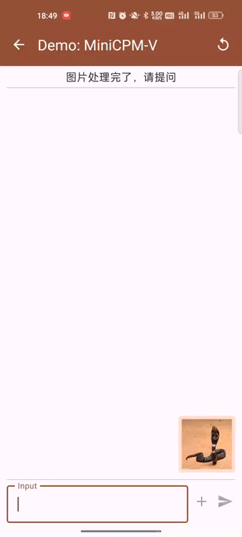

<div align="center">

<!-- <!-- <h1 style="color: #33A6B8; font-family: Helvetica"> OmniLMM </h1> -->

</img> 

**性能领先且部署高效的多模态大模型**
<p align="center">
  OmniLMM-3B  <a href="https://huggingface.co/openbmb/MiniCPM-V/">🤗</a> <a href="http://120.92.209.146:80/">🤖</a> |
  OmniLMM-12B <a href="https://huggingface.co/openbmb/OmniLMM-12B/">🤗</a> <a href="http://120.92.209.146:8081">🤖</a>
</p>

</div>


**OmniLMM** 是面向图文理解的开源多模态大模型系列。该系列模型接受图像和文本输入，并提供高质量的文本输出。我们发布了两个版本的 OmniLMM，旨在实现**领先的性能和高效的部署**：

- **OmniLMM-12B**：相比同规模其他模型在多个基准测试中具有领先性能。

- **OmniLMM-3B**：可在终端设备上部署并具备先进的多模态对话能力。

[English Document](./README.md)

## 目录
<!-- TOC -->

- [目录](#目录)
- [OmniLMM-12B](#omnilmm-12b)
  - [评测结果](#评测结果)
  - [典型示例](#典型示例)
- [OmniLMM-3B](#omnilmm-3b)
  - [性能评估](#性能评估)
  - [部署示例](#部署示例)
- [Demo](#demo)
- [安装](#安装)
- [推理](#推理)
  - [模型库](#模型库)
  - [多轮对话](#多轮对话)
  - [手机端部署](#手机端部署)
- [未来计划](#未来计划)
- [模型协议](#模型协议)
- [声明](#声明)
- [机构](#机构)

<!-- /TOC -->
<!-- /TOC -->
## OmniLMM-12B
**OmniLMM-12B** 是当前系列中性能最佳的版本。该模型基于EVA02-5B和Zephyr-7B-β初始化构建，并使用perceiver resampler连接，采用了课程学习的方法在多模态数据上进行训练。该模型具有三个特点：

- 🔥 **性能领先。**

  OmniLMM-12B 相比其他同规模模型在多个基准测试中取得**领先的性能**（包括 MME、MMBench、SEED-Bench 等），模型掌握了较为丰富的多模态世界知识。

- 🏆 **行为可信。**

  多模态大模型的幻觉问题备受关注，模型经常生成和图像中的事实不符的文本（例如，确信地描述图片中并不存在的物体）。OmniLMM-12B是 **第一个通过多模态 RLHF 对齐的综合能力优秀的开源多模态大模型**（借助最新的 [RLHF-V](https://rlhf-v.github.io/) 技术）。该模型在 [MMHal-Bench](https://huggingface.co/datasets/Shengcao1006/MMHal-Bench) 幻觉评测基准上达到**开源模型最佳水平**，并在 [Object HalBench](https://arxiv.org/abs/2312.00849) 中**优于GPT-4V**。

- 🕹 **实时多模态交互。**

  我们尝试结合OmniLMM-12B和GPT-3.5 (纯文本模型) ，实现**实时多模态交互助手**。该模型接受来自摄像头的视频流，并借助工具处理语音输入输出。虽然还很初步，我们发现该模型无需视频编辑可以**复现Gemini演示视频中的一些有趣例子**。

### 评测结果

<div align="center">
    
</div>
<details>
<summary> MME, MMBench, MMMU, MMBench, MMHal-Bench, Object HalBench, SeedBench, LLaVA Bench W, MathVista 上的详细评测结果. </summary>

<table>
<thead>
  <tr>
    <th align="left">Model</th>
    <th>Size</th>
    <th>MME</th>
    <th nowrap="nowrap">MMB dev (en)</th>
    <th nowrap="nowrap" >MMMU val</th>
    <th nowrap="nowrap" >MMHal-Bench</th>
    <th nowrap="nowrap" >Object HalBench</th>
    <th nowrap="nowrap" >SeedBench-I</th>
    <th>MathVista</th>
    <th nowrap="nowrap" >LLaVA Bench W</th>
  </tr>
</thead>
<tbody align="center">
  <tr>
    <td align="left">GPT-4V†</td>
    <td>-</td>
    <td>1409</td>
    <td>75.1 </td>
    <td>56.8</td>
    <td>3.53 / 70.8</td>
    <td>86.4 / 92.7</td>
    <td>71.6 </td>
    <td>47.8 </td>
    <td>93.1 </td>
  </tr>
  <tr>
    <td nowrap="nowrap" align="left">Qwen-VL-Plus†</td>
    <td>-</td>
    <td>1681</td>
    <td>66.2 </td>
    <td>45.2</td>
    <td>- </td>
    <td>- </td>
    <td>65.7 </td>
    <td>36.0 </td>
    <td>73.7 </td>
  </tr>
  <tr>
    <td align="left">Yi-VL 6B</td>
    <td align="right">6.7B </td>
    <td>- </td>
    <td>68.2 </td>
    <td>39.1 </td>
    <td>- </td>
    <td>- </td>
    <td>66.1 </td>
    <td>28.0 </td>
    <td>39.9 </td>
  </tr>
  <tr>
    <td nowrap="nowrap" align="left" >Qwen-VL-Chat</td>
    <td align="right">9.6B</td>
    <td>1488</td>
    <td>60.6 </td>
    <td>35.9</td>
    <td>2.93 / 59.4</td>
    <td>56.2 / 80.0</td>
    <td>64.8 </td>
    <td>33.8 </td>
    <td>67.7 </td>
  </tr>
  <tr>
    <td align="left" >CogVLM</td>
    <td align="right">17.4B</td>
    <td>1438</td>
    <td>63.7 </td>
    <td>32.1 </td>
    <td>2.68 / 52.1 </td>
    <td>73.6 / 87.4 </td>
    <td>68.8 </td>
    <td>34.7 </td>
    <td>73.9 </td>
  </tr>
  <tr>
    <td align="left" >LLaVA 1.5</td>
    <td align="right">13.6B </td>
    <td>1531 </td>
    <td>68.2 </td>
    <td>36.4 </td>
    <td>2.71 / 51.0 </td>
    <td>53.7 / 77.4 </td>
    <td>68.1 </td>
    <td>26.4 </td>
    <td>64.6 </td>
  </tr>
  <tr>
    <td nowrap="nowrap" align="left" ><b>OmniLMM-12B</b></td>
    <td align="right">11.6B </td>
    <td>1637 </td>
    <td>71.6 </td>
    <td>40.7 </td>
    <td>3.45 / 68.8 </td>
    <td>90.3 / 95.5 </td>
    <td>71.1 </td>
    <td>34.9 </td>
    <td>72.0 </td>
  </tr>
</tbody>
</table>
<small>†: 闭源模型</small>
</br>
</details>

### 典型示例

<table align="center" >
  <p align="center" > 
    
  </p>
</table>


我们结合 OmniLMM-12B 和 ChatGPT-3.5 (纯文本模型) 尝试构建 **实时多模态交互助手**. OmniLMM-12B 将视频帧转为对应的图像描述并输入给ChatGPT-3.5来生成对用户指令的响应。演示视频未经编辑。

<div align="center" >
  <video controls src="https://github.com/OpenBMB/OmniLMM/assets/157115220/c1fd3562-1ab1-4534-8139-79e9137b5398" type="video/mp4" width=80%/>
</div>

## OmniLMM-3B

**OmniLMM-3B**（即 MiniCPM-V）可以高效部署到终端设备。该模型基于 SigLip-400M 和 [MiniCPM-2.4B](https://github.com/OpenBMB/MiniCPM/)构建，通过perceiver resampler连接。OmniLMM-3B的特点包括：

- ⚡️ **高效部署。**

  OmniLMM-3B 可以**高效部署在大多数 GPU 和个人电脑上**，包括**移动手机等终端设备**。在视觉编码方面，我们通过perceiver resampler将图像表示压缩为64个token，远远少于基于MLP架构的其他多模态大模型（通常大于512个token）。这使得 OmniLMM-3B 在推理期间**存储占用更低并且速度更快**。

- 🔥 **优秀的性能。**

  OmniLMM-3B 在多个测试基准中实现了同规模**最佳性能**，超过了基于Phi-2构建的多模态大模型。该模型甚至在部分基准中实现了**与9.6B Qwen-VL-Chat匹配或更好的性能**。

- 🙌 **双语支持。**

  OmniLMM-3B 是**第一个支持中英双语的端侧多模态大模型**。
  该能力通过ICLR 2024 spotlight [论文](https://arxiv.org/abs/2308.12038)中提出的多模态能力的跨语言泛化技术实现。

### 性能评估

<div align="center">

<table style="margin: 0px auto;">
<thead>
  <tr>
    <th align="left">Model</th>
    <th>Size</th>
    <th>MME</th>
    <th nowrap="nowrap" >MMB dev (en)</th>
    <th nowrap="nowrap" >MMB dev (zh)</th>
    <th nowrap="nowrap" >MMMU val</th>
    <th nowrap="nowrap" >CMMMU val</th>
  </tr>
</thead>
<tbody align="center">
  <tr>
    <td align="left">LLaVA-Phi</td>
    <td align="right">3B</td>
    <td>1335</td>
    <td>59.8</td>
    <td>- </td>
    <td>- </td>
    <td>- </td>
  </tr>
  <tr>
    <td nowrap="nowrap" align="left">MobileVLM</td>
    <td align="right">3B</td>
    <td>1289</td>
    <td>59.6</td>
    <td>- </td>
    <td>- </td>
    <td>- </td>
  </tr>
  <tr>
    <td nowrap="nowrap" align="left" >Imp-v1</td>
    <td align="right">3B</td>
    <td>1434</td>
    <td>66.5</td>
    <td>- </td>
    <td>- </td>
    <td>- </td>
  </tr>
  <tr>
    <td align="left" >Qwen-VL-Chat</td>
    <td align="right" >9.6B</td>
    <td>1487</td>
    <td>60.6 </td>
    <td>56.7 </td>
    <td>35.9 </td>
    <td>30.7 </td>
  </tr>
  <tr>
    <td nowrap="nowrap" align="left" >CogVLM</td>
    <td align="right">17.4B </td>
    <td>1438 </td>
    <td>63.7 </td>
    <td>53.8 </td>
    <td>32.1 </td>
    <td>- </td>
  </tr>
  <tr>
    <td nowrap="nowrap" align="left" ><b>OmniLMM-3B</b></td>
    <td align="right">3B </td>
    <td>1452 </td>
    <td>67.3 </td>
    <td>61.9 </td>
    <td>34.7 </td>
    <td>32.1 </td>
  </tr>
</tbody>
</table>

</div>

### 部署示例

我们在手机上部署了OmniLMM-3B。演示视频是OnePlus 9R上的原始录屏结果。

<table align="center" >
  <p align="center" > 
    
  </p>
</table>

## Demo

欢迎通过以下链接使用我们的网页端推理服务： [OmniLMM-12B](http://120.92.209.146:8081) ｜ [OmniLMM-3B](http://120.92.209.146:80).

## 安装

1. 克隆我们的仓库并跳转到相应目录

```bash
git clone https://github.com/OpenBMB/OmniLMM.git
cd OmniLMM
```

1. 创建 conda 环境

```Shell
conda create -n OmniLMM python=3.10 -y
conda activate OmniLMM
```

3. 安装依赖

```shell
pip install -r requirements.txt
```

## 推理

### 模型库

| 模型                | 简介       | 下载链接 |
|:----------------------|:-------------------|:---------------:|
| OmniLMM-12B | 性能最强的版本                   |  [🤗](https://huggingface.co/openbmb/OmniLMM-12B) &nbsp;&nbsp;  [</img>](https://modelscope.cn/models/OpenBMB/OmniLMM-12B/files) |
| OmniLMM-3B  | 支持端侧高效部署，性能优秀          |  [🤗](https://huggingface.co/openbmb/MiniCPM-V) &nbsp;&nbsp;  [</img>](https://modelscope.cn/models/OpenBMB/MiniCPM-V/files) |


### 多轮对话

请参考以下代码使用 `OmniLMM` 进行推理。

<div align="center">

</div>


```python
from chat import OmniLMMChat, img2base64

chat_model = OmniLMMChat('openbmb/OmniLMM-12B') # or 'openbmb/MiniCPM-V'

im_64 = img2base64('./assets/worldmap_ck.jpg')

# First round chat 
msgs = [{"role": "user", "content": "What is interesting about this image?"}]

inputs = {"image": im_64, "question": json.dumps(msgs)}
answer = chat_model.process(inputs)
print(answer)

# Second round chat 
# pass history context of multi-turn conversation
msgs.append({"role": "assistant", "content": answer})
msgs.append({"role": "user", "content": "Where is China in the image"})

inputs = {"image": im_64, "question": json.dumps(msgs)}
answer = chat_model.process(inputs)
print(answer)
```

可以得到以下输出:
```
"The interesting aspect of this image is the shape of the chicken nuggets on the pan. The nuggets are shaped like the continents of the world, which is an unusual and creative way to present the food. It adds a fun and playful element to the meal, making it more visually appealing and engaging."

"In the image, China is located on the right side of the pan. It is one of the nuggets shaped like the continents of the world, and its placement on the right side of the pan is consistent with its geographical location in the real world"
```
### 手机端部署
OmniLMM-3B (即MiniCPM-V) 目前可以部署在Android和Harmony操作系统的手机上。 🚀 点击[这里](https://github.com/OpenBMB/mlc-MiniCPM)开始手机端部署。


## 未来计划

- [ ] 支持模型微调
- [ ] 本地用户图形界面部署
- [ ] 实时多模态交互代码开源


## 模型协议

本仓库中代码依照 Apache-2.0 协议开源

OmniLMM 模型权重的使用遵循 “[通用模型许可协议-来源说明-宣传限制-商业授权](https://github.com/OpenBMB/General-Model-License/blob/main/通用模型许可协议-来源说明-宣传限制-商业授权.md)”。

OmniLMM 模型权重对学术研究完全开放。

如需将模型用于商业用途，请联系 cpm@modelbest.cn 来获取书面授权，登记后可以免费商业使用。


## 声明

作为多模态大模型，OmniLMM 通过学习大量的多模态数据来生成内容，但它无法理解、表达个人观点或价值判断，它所输出的任何内容都不代表模型开发者的观点和立场。

因此用户在使用 OmniLMM 生成的内容时，应自行负责对其进行评估和验证。如果由于使用 OmniLMM 开源模型而导致的任何问题，包括但不限于数据安全问题、公共舆论风险，或模型被误导、滥用、传播或不当利用所带来的任何风险和问题，我们将不承担任何责任。


## 机构

本项目由以下机构共同开发：

-  [清华大学自然语言处理实验室](https://nlp.csai.tsinghua.edu.cn/)
-  [面壁智能](https://modelbest.cn/)
-  [知乎](https://www.zhihu.com/ )

