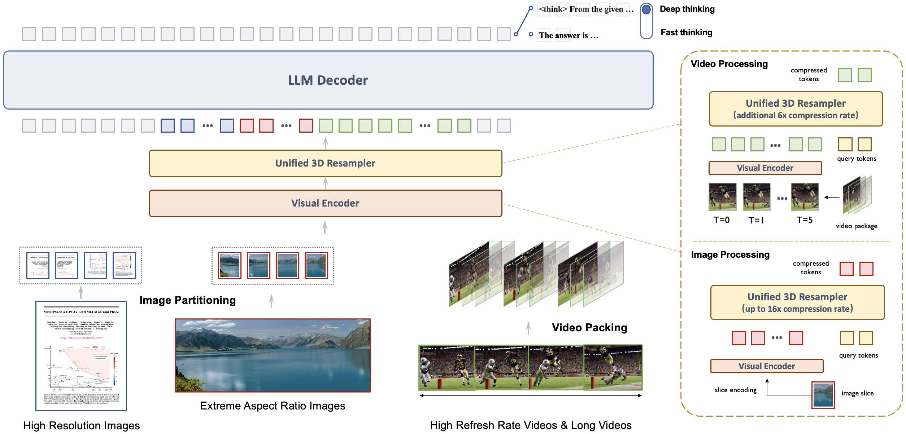
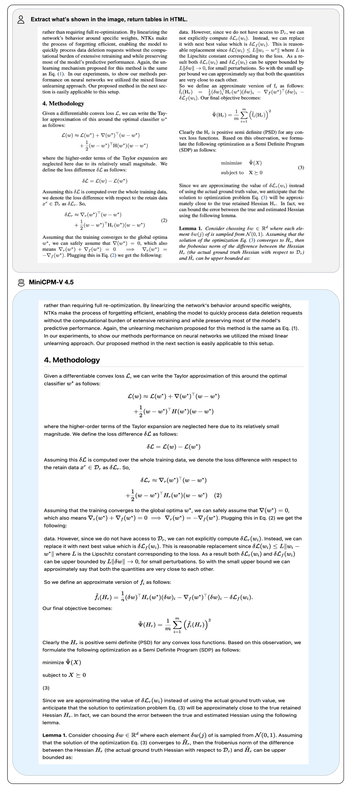
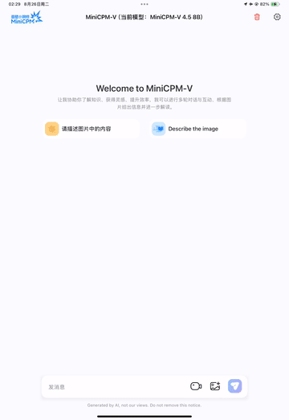

<div align="center">

</img> 


**端侧可用的 GPT-4o 级视觉、语音、多模态实时流式大模型**

  <strong>中文 |
  [English](./README.md)</strong>


 <span style="display: inline-flex; align-items: center; margin-right: 2px;">
   <a href="docs/wechat.md" target="_blank"> 微信社区</a> &nbsp;|
 </span>
  <span style="display: inline-flex; align-items: center; margin-left: 2px;">
   <a href="https://github.com/OpenSQZ/MiniCPM-V-CookBook" target="_blank">&nbsp;🍳 使用指南</a >&nbsp;
 </span>

  <br>
  <p align="center">
  MiniCPM-V 4.5 <a href="https://huggingface.co/openbmb/MiniCPM-V-4_5">🤗</a>  <a href="http://101.126.42.235:30910/"> 🤖</a> | MiniCPM-o 2.6 <a href="https://huggingface.co/openbmb/MiniCPM-o-2_6">🤗</a> <a href="https://minicpm-omni-webdemo-us.modelbest.cn/"> 🤖</a> | 
  📄 技术报告 [即将推出]
</p>

</div>


**MiniCPM-V** 端侧多模态大模型系列可以以端到端方式，接受图像、视频、文本、音频作为输入，并生成高质量文本和语音输出。**MiniCPM-o** 进一步支持端到端的语音输入输出。自2024年2月以来，我们以实现高性能和高效部署为目标，发布了7个版本的模型。目前系列中最值得关注的模型包括：

- **MiniCPM-V 4.5**：🔥🔥🔥 MiniCPM-V 系列中最新、最强大的模型。总参数量 8B，在**视觉能力上超越了 GPT-4o-latest、Gemini-2.0 Pro 以及 Qwen2.5-VL 72B**，成为开源社区中性能最强的端侧多模态模型。本版本带来了全新特性，**包括高效的高帧率与长视频理解（视频 token 压缩率最高可达 96 倍）、可控的快思考/深思考模式、出色的手写体 OCR 与复杂表格/文档解析能力**。同时，它进一步强化了 MiniCPM-V 系列广受欢迎的特性，如可靠性、多语言支持与端侧可部署性。

- **MiniCPM-o 2.6**: ⭐️⭐️⭐️  MiniCPM-o 系列中性能最佳模型。总参数量 8B，**视觉、语音和多模态流式能力达到了 GPT-4o-202405 级别**，是开源社区中模态支持最丰富、性能最佳的模型之一。在新的语音模式中，MiniCPM-o 2.6 **支持可配置声音的中英双语语音对话，还具备情感/语速/风格控制、端到端声音克隆、角色扮演等进阶能力**。模型也进一步提升了 MiniCPM-V 2.6 的 **OCR、可信行为、多语言支持和视频理解等视觉能力**。基于其领先的视觉 token 密度，MiniCPM-V 2.6 成为了**首个支持在 iPad 等端侧设备上进行多模态实时流式交互**的多模态大模型。


## 更新日志 <!-- omit in toc -->

#### 📌 置顶

* [2025.08.26] 🔥🔥🔥 我们开源了 MiniCPM-V 4.5，其视觉性能超越了 GPT-4o-latest、Gemini-2.0 Pro 和 Qwen2.5-VL 72B。它不仅延续并强化了 MiniCPM-V 的热门能力，还带来了诸多实用的新功能。欢迎试用！


* [2025.08.05] 🚀🚀🚀 我们开源了 MiniCPM-V 4.0，该模型在图像理解能力上超越了 GPT-4.1-mini-20250414。该模型不仅继承了 MiniCPM-V 2.6 的众多实用特性，还大幅提升了推理效率。我们还同步开源了适用于 iPhone 和 iPad 的 iOS 应用，欢迎试用！


* [2025.08.01] 🔥🔥🔥 我们开源了 [MiniCPM-V & o Cookbook](https://github.com/OpenSQZ/MiniCPM-V-CookBook)，提供针对不同人群的全场景使用指南，配合最新的[文档网站](https://minicpm-o.readthedocs.io/en/latest/index.html)上手更轻松！

* [2025.06.20] ⭐️⭐️⭐️ MiniCPM-o 的 Ollama [官方仓库](https://ollama.com/openbmb)正式支持 MiniCPM-o 2.6 等模型啦，欢迎[一键使用](https://ollama.com/openbmb/minicpm-o2.6)！

* [2025.03.01] 🚀🚀🚀 MiniCPM-o 系列的对齐技术 RLAIF-V 被 CVPR 2025 接收了！其[代码](https://github.com/RLHF-V/RLAIF-V)、[数据](https://huggingface.co/datasets/openbmb/RLAIF-V-Dataset)、[论文](https://arxiv.org/abs/2405.17220)均已开源。

* [2025.01.24] 📢📢📢 MiniCPM-o 2.6 技术报告已发布! 欢迎点击[这里](https://openbmb.notion.site/MiniCPM-o-2-6-A-GPT-4o-Level-MLLM-for-Vision-Speech-and-Multimodal-Live-Streaming-on-Your-Phone-185ede1b7a558042b5d5e45e6b237da9)查看.

* [2025.01.23] 💡💡💡 MiniCPM-o 2.6 现在已被北大团队开发的 [Align-Anything](https://github.com/PKU-Alignment/align-anything)，一个用于对齐全模态大模型的框架集成，支持 DPO 和 SFT 在视觉和音频模态上的微调。欢迎试用！

* [2025.01.19] 📢 **注意!** 我们正在努力将 MiniCPM-o 2.6 的支持合并到 llama.cpp、Ollama、vLLM 的官方仓库，但还未完成。请大家暂时先使用我们提供的 fork 来进行部署：[llama.cpp](https://github.com/OpenBMB/llama.cpp/blob/minicpm-omni/examples/llava/README-minicpmo2.6.md)、[Ollama](https://github.com/OpenBMB/ollama/blob/minicpm-v2.6/examples/minicpm-v2.6/README.md)、[vllm](https://github.com/OpenBMB/MiniCPM-o?tab=readme-ov-file#efficient-inference-with-llamacpp-ollama-vllm)。 **合并完成前，使用官方仓库可能会导致不可预期的问题**。

* [2025.01.19] ⭐️⭐️⭐️ MiniCPM-o 在 GitHub Trending 上登顶， Hugging Face Trending 上也达到了第二！

* [2025.01.17] 我们更新了 MiniCPM-o 2.6 int4 量化版本的使用方式，解决了模型初始化的问题，欢迎点击[这里](https://huggingface.co/openbmb/MiniCPM-o-2_6-int4)试用！

* [2025.01.13] 🔥🔥🔥 我们开源了 MiniCPM-o 2.6，该模型视觉、语音和多模态流式能力达到了 GPT-4o-202405 级别，进一步优化了 MiniCPM-V 2.6 的众多亮点能力，还支持了很多有趣的新功能。欢迎试用！

* [2024.08.17] 🚀🚀🚀 llama.cpp [官方仓库](https://github.com/ggerganov/llama.cpp)正式支持 MiniCPM-V 2.6 啦！点击[这里](https://huggingface.co/openbmb/MiniCPM-V-2_6-gguf)查看各种大小的 GGUF 版本。

* [2024.08.06] 🔥🔥🔥 我们开源了 MiniCPM-V 2.6，该模型在单图、多图和视频理解方面取得了优于 GPT-4V 的表现。我们还进一步提升了 MiniCPM-Llama3-V 2.5 的多项亮点能力，并首次支持了 iPad 上的实时视频理解。欢迎试用！

* [2024.08.03] MiniCPM-Llama3-V 2.5 技术报告已发布！欢迎点击[这里](https://arxiv.org/abs/2408.01800)查看。

* [2024.05.23] 🔥🔥🔥 MiniCPM-V 在 GitHub Trending 和 Hugging Face Trending 上登顶！MiniCPM-Llama3-V 2.5 Demo 被 Hugging Face 的 Gradio 官方账户推荐，欢迎点击[这里](https://huggingface.co/spaces/openbmb/MiniCPM-Llama3-V-2_5)体验！


<br>

<details> 
<summary>点击查看完整更新日志。</summary>

* [2024.08.15] MiniCPM-V 2.6 现在支持多图像 SFT。有关更多详细信息，请参阅[微调文档](https://github.com/OpenBMB/MiniCPM-V/tree/main/finetune)
* [2024.08.14] MiniCPM-V 2.6 现在可以通过 SWIFT 框架 [微调](https://github.com/modelscope/ms-swift/issues/1613) 了！
* [2024.08.10] 🚀🚀🚀 llama.cpp [官方仓库](https://github.com/ggerganov/llama.cpp)正式支持 MiniCPM-Llama3-V 2.5 啦！点击[这里](https://huggingface.co/openbmb/MiniCPM-Llama3-V-2_5-gguf/tree/main)查看各种大小的 GGUF 版本。
* [2024.07.19] MiniCPM-Llama3-V 2.5 现已支持[vLLM](#vllm-部署-) ！
* [2024.06.03] 现在，你可以利用多张低显存显卡（12G/16G）进行GPU串行推理。详情请参见该[文档](https://github.com/OpenBMB/MiniCPM-V/blob/main/docs/inference_on_multiple_gpus.md)配置。
* [2024.05.28] 💫 我们现在支持 MiniCPM-Llama3-V 2.5 的 LoRA 微调，更多内存使用统计信息可以在[这里](https://github.com/OpenBMB/MiniCPM-V/tree/main/finetune#model-fine-tuning-memory-usage-statistics)找到。
* [2024.05.28] 💥 MiniCPM-Llama3-V 2.5 现在在 llama.cpp 和 Ollama 中完全支持其功能！**请拉取我们最新的 fork 来使用**：[llama.cpp](https://github.com/OpenBMB/llama.cpp/blob/minicpm-v2.5/examples/minicpmv/README.md) & [ollama](https://github.com/OpenBMB/ollama/tree/minicpm-v2.5/examples/minicpm-v2.5)。我们还发布了各种大小的 GGUF 版本，请点击[这里](https://huggingface.co/openbmb/MiniCPM-Llama3-V-2_5-gguf/tree/main)查看。请注意，**目前官方仓库尚未支持 MiniCPM-Llama3-V 2.5**，我们也正积极推进将这些功能合并到 llama.cpp & ollama 官方仓库，敬请关注！
* [2024.05.25] MiniCPM-Llama3-V 2.5 [支持流式输出和自定义系统提示词](https://huggingface.co/openbmb/MiniCPM-Llama3-V-2_5#usage)了，欢迎试用!
* [2024.05.24] 我们开源了 MiniCPM-Llama3-V 2.5 [gguf](https://huggingface.co/openbmb/MiniCPM-Llama3-V-2_5-gguf)，支持 [llama.cpp](#llamacpp-部署) 推理！实现端侧 6-8 tokens/s 的流畅解码，欢迎试用！
* [2024.05.23] 🔍 我们添加了Phi-3-vision-128k-instruct 与 MiniCPM-Llama3-V 2.5的全面对比，包括基准测试评估、多语言能力和推理效率 🌟📊🌍🚀。点击[这里](./docs/compare_with_phi-3_vision.md)查看详细信息。
* [2024.05.20] 我们开源了 MiniCPM-Llama3-V 2.5，增强了 OCR 能力，支持 30 多种语言，并首次在端侧实现了 GPT-4V 级的多模态能力！我们提供了[高效推理](#手机端部署)和[简易微调](./finetune/readme.md)的支持，欢迎试用！
* [2024.04.23] 我们增加了MiniCPM-V 2.0对 [vLLM](#vllm-部署-) 的支持，欢迎体验！
* [2024.04.18] 我们在 HuggingFace Space 新增了 MiniCPM-V 2.0 的 [demo](https://huggingface.co/spaces/openbmb/MiniCPM-V-2)，欢迎体验！
* [2024.04.17] MiniCPM-V 2.0 现在支持用户部署本地 [WebUI Demo](#本地webui-demo部署) 了，欢迎试用!
* [2024.04.15] MiniCPM-V 2.0 现在可以通过 SWIFT 框架 [微调](https://github.com/modelscope/swift/blob/main/docs/source/Multi-Modal/minicpm-v-2最佳实践.md) 了，支持流式输出!
* [2024.04.12] 我们开源了 MiniCPM-V 2.0，该模型刷新了 OCRBench 开源模型最佳成绩，在场景文字识别能力上比肩 Gemini Pro，同时还在综合了 11 个主流多模态大模型评测基准的 <a href="https://rank.opencompass.org.cn/leaderboard-multimodal">OpenCompass</a> 榜单上超过了 Qwen-VL-Chat 10B、CogVLM-Chat 17B 和 Yi-VL 34B 等更大参数规模的模型！点击<a href="https://openbmb.vercel.app/minicpm-v-2">这里</a>查看 MiniCPM-V 2.0 技术博客。
* [2024.03.14] MiniCPM-V 现在支持 SWIFT 框架下的[微调](https://github.com/modelscope/swift/blob/main/docs/source/Multi-Modal/minicpm-v最佳实践.md)了，感谢 [Jintao](https://github.com/Jintao-Huang) 的贡献！
* [2024.03.01] MiniCPM-V 现在支持在 Mac 电脑上进行部署！
* [2024.02.01] 我们开源了 MiniCPM-V 和 OmniLMM-12B，分别可以支持高效的端侧部署和同规模领先的多模态能力！
</details>


## 目录 <!-- omit in toc -->

- [MiniCPM-V 4.5](#minicpm-v-45)
- [MiniCPM-o 2.6](#minicpm-o-26)
- [Chat with Our Demo on Gradio 🤗](#chat-with-our-demo-on-gradio-)
- [推理](#推理)
  - [模型库](#模型库)
  - [多轮对话](#多轮对话)
    - [多图对话](#多图对话)
    - [少样本上下文对话](#少样本上下文对话)
    - [视频对话](#视频对话)
    - [语音对话](#语音对话)
    - [多模态流式交互](#多模态流式交互)
  - [多卡推理](#多卡推理)
  - [Mac 推理](#mac-推理)
  - [基于 llama.cpp、Ollama、vLLM 的高效推理](#基于-llamacppollamavllm-的高效推理)
- [微调](#微调)
- [MiniCPM-V \& o 使用手册](#minicpm-v--o-使用手册)
- [基于 MiniCPM-V \& MiniCPM-o 的更多项目](#基于-minicpm-v--minicpm-o-的更多项目)
- [FAQs](#faqs)
- [模型局限性](#模型局限性)


## MiniCPM-V 4.5


**MiniCPM-V 4.5** 是 MiniCPM-V 系列中最新、最强大的模型。该模型基于 Qwen3-8B 与 SigLIP2-400M 构建，总参数量为 8B。其在性能上较前代 MiniCPM-V 与 MiniCPM-o 有显著提升，并引入了一系列全新的实用特性。其主要亮点包括：


- 🔥 **领先的视觉理解能力**
  MiniCPM-V 4.5 在 OpenCompass 综合评测（涵盖 8 个主流评测基准）中取得了 77.0 的高分。**在仅 8B 参数的情况下超越了广泛使用的闭源模型（如 GPT-4o-latest、Gemini-2.0 Pro）以及强大的开源模型（如 Qwen2.5-VL 72B）**，成为 30B 参数规模以下最强的多模态大模型。

- 🎬 **高效的高帧率与长视频理解** 
  借助全新的图像-视频统一 3D-Resampler，MiniCPM-V 4.5 能够实现 96 倍视频 token 压缩率，即将 6 帧 448x448 视频帧联合压缩为 64 个 token（大多数多模态大模型需约 1536 个 token）。这意味着模型在语言模型推理成本不增加的情况下，可以感知显著更多的视频帧，从而实现业界领先的 高帧率（最高 10FPS）视频理解与长视频理解，并在 Video-MME、LVBench、MLVU、MotionBench、FavorBench 等基准上高效率地展现出色性能。

- ⚙️ **可控的快思考 / 深思考模式**  
  MiniCPM-V 4.5 同时支持 快思考（用于高频高效推理，性能具竞争力）与 深思考（用于复杂问题求解）。用户可根据不同场景对效率与性能的权衡，自由切换两种模式，实现高度可控的推理过程。

- 💪 **优秀的 OCR、文档解析与多语言能力**
  基于 [LLaVA-UHD](https://arxiv.org/pdf/2403.11703) 架构，MiniCPM-V 4.5 能处理任意长宽比、最高达 180 万像素（如 1344x1344） 的高分辨率图像，同时使用的视觉 token 数仅为多数 MLLM 的 1/4。其在 OCRBench 上取得超越 GPT-4o-latest 与 Gemini 2.5 等闭源模型的性能，并在 OmniDocBench 上展现了业界顶尖的 PDF 文档解析能力。借助最新的 [RLAIF-V](https://github.com/RLHF-V/RLAIF-V/) 和 [VisCPM](https://github.com/OpenBMB/VisCPM) 技术，模型在可靠性上表现优异，在 MMHal-Bench 上超越 GPT-4o-latest，并支持 30+ 种语言的多语言能力。

-  💫 **便捷易用的部署方式**
  MiniCPM-V 4.5 提供丰富灵活的使用方式：(1) [llama.cpp](https://github.com/tc-mb/llama.cpp/blob/master/docs/multimodal/minicpmo4.5.md) 与 [ollama](https://github.com/tc-mb/ollama/tree/MIniCPM-V) 支持本地 CPU 高效推理；(2) 提供 [int4](https://huggingface.co/openbmb/MiniCPM-V-4_5-int4)、[GGUF](https://huggingface.co/openbmb/MiniCPM-V-4_5-gguf)、[AWQ](https://github.com/tc-mb/AutoAWQ) 等 16 种规格的量化模型；(3)兼容 SGLang 与 [vLLM](#efficient-inference-with-llamacpp-ollama-vllm) (4) 借助 [Transformers](https://github.com/tc-mb/transformers/tree/main) 与 [LLaMA-Factory](./docs/llamafactory_train_and_infer.md) 在新领域与任务上进行微调；(5) 快速启动本地 [WebUI demo](#chat-with-our-demo-on-gradio)；(6) 优化适配的 [iOS 本地应用](https://github.com/tc-mb/MiniCPM-o-demo-iOS)，可在 iPhone 与 iPad 上高效运行；(7) 在线 [Web demo](http://101.126.42.235:30910/) 体验。更多使用方式请见 [Cookbook](https://github.com/OpenSQZ/MiniCPM-V-CookBook)。

### 技术亮点 <!-- omit in toc -->

- **架构：图像-视频统一的高密度视觉压缩 3D-Resampler**。 MiniCPM-V 4.5 在架构上引入了 3D-Resampler，成功突破了视频理解任务中性能与效率难以兼得的瓶颈。该方法能够将多达 6 帧连续视频帧压缩为仅 64 个 token（与 MiniCPM-V 系列中单张图像所用的 token 数相同），从而实现 96× 的视频 token 压缩率。这使得模型在语言模型计算成本不增加的情况下，可以处理更多的视频帧，从而实现高帧率视频理解和长视频理解。该架构统一支持单图、多图和视频的编码处理，确保了能力与知识的无缝迁移。

- **学习机制：OCR与文档知识的统一学习**。现有多模态大模型一般在不同训练阶段分别单独训练 OCR 能力与文档知识。我们发现这两个训练过程的本质差异在于图像中文本的可见性。通过动态对文档文本区域施加不同强度的噪声干扰，并要求模型重建文本，使其学会自适应地在准确文本识别（当文本清晰时）与基于多模态上下文的知识推理（当文本严重遮挡时）之间切换。这种方法使得 MiniCPM-V 在文档知识学习中摆脱了对高错误率的文档解析器的依赖，同时避免了过度增强的 OCR 数据产生的幻觉问题，以最小工程开销实现了顶尖的 OCR 与多模态知识处理性能。

- **后训练优化：基于多模态强化学习的混合快思考/深度思考模式**。 MiniCPM-V 4.5 通过两种可切换推理模式提供均衡的体验：面向高效日常应用的快速思考模式，以及处理复杂任务的深度思考模式。采用新颖的混合强化学习方法，模型可联合优化两种模式，在保持深度模式能力的同时显著提升快速模式性能。结合 [RLPR](https://github.com/OpenBMB/RLPR) 和 [RLAIF-V](https://github.com/RLHF-V/RLAIF-V) 技术，该模型可以从海量多模态数据中泛化出强大的推理能力，并有效减少幻觉现象。

<div align="center">

</div>

### 性能评估 <!-- omit in toc -->

<div align="center">
  
</div>
<div align="center">

</div>


### 推理效率


**OpenCompass**
<div align="left">
<table style="margin: 0px auto;">
    <thead>
            <tr>
              <th align="left">Model</th>
              <th>Size</th>
              <th>Avg Score ↑</th>
              <th>Total Inference Time ↓</th>
            </tr>
    </thead>
    <tbody align="center">
        <tr>
            <td nowrap="nowrap" align="left">GLM-4.1V-9B-Thinking</td>
            <td>10.3B</td>
            <td>76.6</td>
            <td>17.5h</td>
        </tr>
        <tr>
            <td nowrap="nowrap" align="left">MiMo-VL-7B-RL</td>
            <td>8.3B</td>
            <td>76.4</td>
            <td>11h</td>
        </tr>
        <tr>
            <td nowrap="nowrap" align="left">MiniCPM-V 4.5</td>
            <td>8.7B</td>
            <td><b>77.0</td>
            <td><b>7.5h</td>
        </tr>
    </tbody>
</table>
</div>

**Video-MME**

<div align="left">
<table style="margin: 0px auto;">
    <thead>
          <tr>
              <th align="left">Model</th>
              <th>Size</th>
              <th>Avg Score ↑</th>
              <th>Total Inference Time ↓</th>
              <th>GPU Mem ↓</th>
          </tr>
    </thead>
    <tbody align="center">
          <tr>
              <td nowrap="nowrap" align="left">Qwen2.5-VL-7B-Instruct</td>
              <td>8.3B</td>
              <td>71.6</td>
              <td>3h</td>
              <td>60G</td>
          </tr>
          <tr>
              <td nowrap="nowrap" align="left">GLM-4.1V-9B-Thinking</td>
              <td>10.3B</td>
              <td><b>73.6</td>
              <td>2.63h</td>
              <td>32G</td>
          </tr>
          <tr>
              <td nowrap="nowrap" align="left">MiniCPM-V 4.5</td>
              <td>8.7B</td>
              <td>73.5</td>
              <td><b>0.26h</td>
              <td><b>28G</td>
        </tr>
    </tbody>
</table>


OpenCompass 和 Video-MME 均采用 A100*8卡 推理，其中 Video-MME 的推理时间未统计视频抽帧时间

### 典型示例 <!-- omit in toc -->
<div align="center">
  <a href="https://www.youtube.com/watch?v=Cn23FujYMMU"></a>
</div>

<div style="display: flex; flex-direction: column; align-items: center;">
  
  
</div>

<details>
<summary>点击查看更多示例</summary>
<div style="display: flex; flex-direction: column; align-items: center;">
  
  
</div>
</details>


我们使用 [iOS demo](https://github.com/tc-mb/MiniCPM-o-demo-iOS) 将 MiniCPM-V 4.5 部署在 iPad M4 ，并录制以下演示录屏，视频未经任何编辑。

<table align="center"> 
    <p align="center">
      
      &nbsp;&nbsp;&nbsp;&nbsp;
      
    </p>
    <p align="center">
      
      &nbsp;&nbsp;&nbsp;&nbsp;
      
    </p>
</table>


## MiniCPM-o 2.6


MiniCPM-o 2.6 是 MiniCPM-o 系列的最新、性能最佳模型。该模型基于 SigLip-400M、Whisper-medium-300M、ChatTTS-200M 和 Qwen2.5-7B 构建，共 8B 参数，通过端到端方式训练和推理。相比 MiniCPM-V 2.6，该模型在性能上有了显著提升，并支持了实时语音对话和多模态流式交互的新功能。MiniCPM-o 2.6 的主要特性包括：


- 🔥 **领先的视觉能力。**
MiniCPM-o 2.6 在 OpenCompass 榜单上（综合 8 个主流多模态评测基准）平均得分 70.2，**以 8B 量级的大小在单图理解方面超越了 GPT-4o-202405、Gemini 1.5 Pro 和 Claude 3.5 Sonnet 等主流商用闭源多模态大模型**。此外，它的多图和视频理解表现也**优于 GPT-4V 和 Claude 3.5 Sonnet**，并展现出了优秀的上下文学习能力。

- 🎙 **出色的语音能力。**
MiniCPM-o 2.6 **支持可配置声音的中英双语实时对话**。MiniCPM-o 2.6 在语音理解任务（如 ASR 和 STT 等）**优于 GPT-4o-realtime**，并在语音对话的语义和声学评估中展现了**开源模型中最高的语音生成性能**。它还支持情绪/语速/风格控制、语音克隆、角色扮演等进阶能力。

- 🎬 **强大的多模态流式交互能力。**
作为一项新功能，MiniCPM-o 2.6 能够**接受连续的视频和音频流，并和用户进行实时语音交互**。在针对实时视频理解、全模态视音频理解、多模态上下文理解的综合评测基准 StreamingBench 中，MiniCPM-o 2.6 取得开源社区最佳水平，并**超过了 GPT-4o-202408 和 Claude 3.5 Sonnet**。

- 💪 **强大的 OCR 能力及其他功能。**
MiniCPM-o 2.6 进一步优化了 MiniCPM-V 2.6 的众多视觉理解能力，其可以处理任意长宽比的图像，像素数可达 180 万（如 1344x1344）。在 OCRBench 上取得**25B 以下最佳水平，超过 GPT-4o-202405 等商用闭源模型**。基于最新的 [RLHF-V](https://rlhf-v.github.io/)、[RLAIF-V](https://github.com/RLHF-V/RLAIF-V/) 和 [VisCPM](https://github.com/OpenBMB/VisCPM) 技术，其具备了**可信的多模态行为**，在 MMHal-Bench 上超过了 GPT-4o 和 Claude 3.5，并支持英语、中文、德语、法语、意大利语、韩语等**30多种语言**。

- 🚀 **卓越的效率。**
除了对个人用户友好的模型大小，MiniCPM-o 2.6 还表现出**最先进的视觉 token 密度**（即每个视觉 token 编码的像素数量）。它**仅需 640 个 token 即可处理 180 万像素图像，比大多数模型少 75%**。这一特性优化了模型的推理速度、首 token 延迟、内存占用和功耗。因此，MiniCPM-o 2.6 可以支持 iPad 等终端设备上的高效**多模态实时流式交互**。


- 💫 **易于使用。**
MiniCPM-o 2.6 可以通过多种方式轻松使用：(1) [llama.cpp](https://github.com/OpenBMB/llama.cpp/blob/minicpm-omni/examples/llava/README-minicpmo2.6.md) 支持在本地设备上进行高效的 CPU 推理，(2) [int4](https://huggingface.co/openbmb/MiniCPM-V-2_6-int4) 和 [GGUF](https://huggingface.co/openbmb/MiniCPM-V-2_6-gguf) 格式的量化模型，有 16 种尺寸，(3) [vLLM](#基于-llamacppollamavllm-的高效推理) 支持高吞吐量和内存高效的推理，(4) 通过[LLaMA-Factory](./docs/llamafactory_train_and_infer.md)框架针对新领域和任务进行微调，(5) 使用 [Gradio](#本地-webui-demo-) 快速设置本地 WebUI 演示，(6) 部署于服务器的在线 [demo](https://minicpm-omni-webdemo-us.modelbest.cn/)。

**模型架构。**

- **端到端全模态架构。** 通过**端到端**的方式连接和训练不同模态的编/解码模块以充分利用丰富的多模态知识。模型完全使用 CE 损失端到端训练。
- **全模态流式机制。** (1) 我们将不同模态的离线编/解码器改造为适用于**流式输入/输出**的在线模块。 (2) 我们针对大语言模型基座设计了**时分复用的全模态流式信息处理机制**，将平行的不同模态的信息流拆分重组为周期性时间片序列。
- **可配置的声音方案。** 我们设计了新的多模态系统提示，包含传统文本系统提示词，和**用于指定模型声音的语音系统提示词**。模型可在推理时灵活地通过文字或语音样例控制声音风格，并支持端到端声音克隆和音色创建等高级能力。

<div align="center">

</div>

<br>


### 性能评估  <!-- omit in toc -->

<div align="center">
  
</div>

<details>
<summary>点击查看视觉理解能力详细评测结果。</summary>

**图像理解能力**

<div align="center">
<table style="margin: 0px auto;">
    <thead>
        <tr>
            <th align="left">Model</th>
            <th>Size</th>
            <th>Token Density<sup>+</sup></th>
            <th>OpenCompass</th>
            <th>OCRBench</th>
            <th>MathVista mini</th>
            <th>ChartQA</th>
            <th>MMVet</th>
            <th>MMStar</th>
            <th>MME</th>
            <th>MMB1.1 test</th>
            <th>AI2D</th>
            <th>MMMU val</th>
            <th>HallusionBench</th>
            <th>TextVQA val</th>
            <th>DocVQA test</th>
            <th>MathVerse mini</th>
            <th>MathVision</th>
            <th>MMHal Score</th>
        </tr>
    </thead>
    <tbody align="center">
        <tr>
            <td colspan="19" align="left"><strong>Proprietary</strong></td>
        </tr>
        <tr>
            <td nowrap="nowrap" align="left">GPT-4o-20240513</td>
            <td>-</td>
            <td>1088</td>
            <td><u>69.9</u></td>
            <td>736</td>
            <td>61.3</td>
            <td>85.7</td>
            <td><strong>69.1</strong></td>
            <td>63.9</td>
            <td>2328.7</td>
            <td>82.2</td>
            <td>84.6</td>
            <td><strong>69.2</strong></td>
            <td><strong>55.0</strong></td>
            <td>-</td>
            <td>92.8</td>
            <td><strong>50.2</strong></td>
            <td><strong>30.4</strong></td>
            <td><u>3.6</u></td>
        </tr>
        <tr>
            <td nowrap="nowrap" align="left">Claude3.5-Sonnet</td>
            <td>-</td>
            <td>750</td>
            <td>67.9</td>
            <td>788</td>
            <td>61.6</td>
            <td><strong>90.8</strong></td>
            <td>66.0</td>
            <td>62.2</td>
            <td>1920.0</td>
            <td>78.5</td>
            <td>80.2</td>
            <td><u>65.9</u></td>
            <td>49.9</td>
            <td>-</td>
            <td><strong>95.2</strong></td>
            <td>-</td>
            <td>-</td>
            <td>3.4</td>
        </tr>
        <tr>
            <td nowrap="nowrap" align="left">Gemini 1.5 Pro</td>
            <td>-</td>
            <td>-</td>
            <td>64.4</td>
            <td>754</td>
            <td>57.7</td>
            <td>81.3</td>
            <td>64.0</td>
            <td>59.1</td>
            <td>2110.6</td>
            <td>73.9</td>
            <td>79.1</td>
            <td>60.6</td>
            <td>45.6</td>
            <td>73.5</td>
            <td>86.5</td>
            <td>-</td>
            <td>19.2</td>
            <td>-</td>
        </tr>
        <tr>
            <td nowrap="nowrap" align="left">GPT-4o-mini-20240718</td>
            <td>-</td>
            <td>1088</td>
            <td>64.1</td>
            <td>785</td>
            <td>52.4</td>
            <td>-</td>
            <td>66.9</td>
            <td>54.8</td>
            <td>2003.4</td>
            <td>76.0</td>
            <td>77.8</td>
            <td>60.0</td>
            <td>46.1</td>
            <td>-</td>
            <td>-</td>
            <td>-</td>
            <td>-</td>
            <td>3.3</td>
        </tr>
        <tr>
            <td colspan="19" align="left"><strong>Open Source</strong></td>
        </tr>
        <tr>
            <td nowrap="nowrap" align="left">Cambrian-34B</td>
            <td>34B</td>
            <td><u>1820</u></td>
            <td>58.3</td>
            <td>591</td>
            <td>50.3</td>
            <td>75.6</td>
            <td>53.2</td>
            <td>54.2</td>
            <td>2049.9</td>
            <td>77.8</td>
            <td>79.5</td>
            <td>50.4</td>
            <td>41.6</td>
            <td>76.7</td>
            <td>75.5</td>
            <td>-</td>
            <td>-</td>
            <td>-</td>
        </tr>
        <tr>
            <td nowrap="nowrap" align="left">GLM-4V-9B</td>
            <td>13B</td>
            <td>784</td>
            <td>59.1</td>
            <td>776</td>
            <td>51.1</td>
            <td>-</td>
            <td>58.0</td>
            <td>54.8</td>
            <td>2018.8</td>
            <td>67.9</td>
            <td>71.2</td>
            <td>46.9</td>
            <td>45.0</td>
            <td>-</td>
            <td>-</td>
            <td>-</td>
            <td>-</td>
            <td>-</td>
        </tr>
        <tr>
            <td nowrap="nowrap" align="left">Pixtral-12B</td>
            <td>12B</td>
            <td>256</td>
            <td>61.0</td>
            <td>685</td>
            <td>56.9</td>
            <td>81.8</td>
            <td>58.5</td>
            <td>54.5</td>
            <td>-</td>
            <td>72.7</td>
            <td>79.0</td>
            <td>51.1</td>
            <td>47.0</td>
            <td>75.7</td>
            <td>90.7</td>
            <td>-</td>
            <td>-</td>
            <td>-</td>
        </tr>
        <tr>
            <td nowrap="nowrap" align="left">DeepSeek-VL2-27B (4B)</td>
            <td>27B</td>
            <td>672</td>
            <td>66.4</td>
            <td>809</td>
            <td>63.9</td>
            <td>86.0</td>
            <td>60.0</td>
            <td>61.9</td>
            <td>2253.0</td>
            <td>81.2</td>
            <td>83.8</td>
            <td>54.0</td>
            <td>45.3</td>
            <td><u>84.2</u></td>
            <td>93.3</td>
            <td>-</td>
            <td>-</td>
            <td>3.0</td>
        </tr>
        <tr>
            <td nowrap="nowrap" align="left">Qwen2-VL-7B</td>
            <td>8B</td>
            <td>784</td>
            <td>67.1</td>
            <td><u>866</u></td>
            <td>58.2</td>
            <td>83.0</td>
            <td>62.0</td>
            <td>60.7</td>
            <td>2326.0</td>
            <td>81.8</td>
            <td>83.0</td>
            <td>54.1</td>
            <td>50.6</td>
            <td><strong>84.3</strong></td>
            <td><u>94.5</u></td>
            <td>31.9</td>
            <td>16.3</td>
            <td>3.2</td>
        </tr>
        <tr>
            <td nowrap="nowrap" align="left">LLaVA-OneVision-72B</td>
            <td>72B</td>
            <td>182</td>
            <td>68.1</td>
            <td>741</td>
            <td>67.5</td>
            <td>83.7</td>
            <td>60.6</td>
            <td><strong>65.8</strong></td>
            <td>2261.0</td>
            <td><strong>85.0</strong></td>
            <td><u>85.6</u></td>
            <td>56.8</td>
            <td>49.0</td>
            <td>80.5</td>
            <td>91.3</td>
            <td>39.1</td>
            <td>-</td>
            <td>3.5</td>
        </tr>
        <tr>
            <td nowrap="nowrap" align="left">InternVL2.5-8B</td>
            <td>8B</td>
            <td>706</td>
            <td>68.3</td>
            <td>822</td>
            <td><u>64.4</u></td>
            <td>84.8</td>
            <td>62.8</td>
            <td>62.8</td>
            <td>2344.0</td>
            <td><u>83.6</u></td>
            <td>84.5</td>
            <td>56.0</td>
            <td>50.1</td>
            <td>79.1</td>
            <td>93.0</td>
            <td>39.5</td>
            <td>19.7</td>
            <td>3.4</td>
        </tr>
        <tr>
            <td nowrap="nowrap" align="left">MiniCPM-V 2.6</td>
            <td>8B</td>
            <td><strong>2822</strong></td>
            <td>65.2</td>
            <td>852*</td>
            <td>60.6</td>
            <td>79.4</td>
            <td>60.0</td>
            <td>57.5</td>
            <td><u>2348.4*</u></td>
            <td>78.0</td>
            <td>82.1</td>
            <td>49.8*</td>
            <td>48.1*</td>
            <td>80.1</td>
            <td>90.8</td>
            <td>25.7</td>
            <td>18.3</td>
            <td>3.6</td>
        </tr>
        <tr>
            <td nowrap="nowrap" align="left">MiniCPM-o 2.6</td>
            <td>8B</td>
            <td><strong>2822</strong></td>
            <td><strong>70.2</strong></td>
            <td><strong>897*</strong></td>
            <td><strong>71.9*</strong></td>
            <td><u>86.9*</u></td>
            <td><u>67.5</u></td>
            <td><u>64.0</u></td>
            <td><strong>2372.0*</strong></td>
            <td>80.5</td>
            <td><strong>85.8</strong></td>
            <td>50.4*</td>
            <td><u>51.9</u></td>
            <td>82.0</td>
            <td>93.5</td>
            <td><u>41.4*</u></td>
            <td><u>23.1*</u></td>
            <td><strong>3.8</strong></td>
        </tr>
    </tbody>
</table>
</div>
* 我们使用思维链提示词来评估这些基准，对于 MME 我们只在 Cognition 任务上使用了思维链。
+ Token Density：每个视觉 token 在最大分辨率下编码的像素数，即最大分辨率下的像素数 / 视觉 token 数。

注意：闭源模型的 Token Density 由 API 收费方式估算得到。

**多图和视频理解能力**

<div align="center">
 
<table style="margin: 0px auto;">
    <thead>
        <tr>
            <th align="left">Model</th>
            <th>Size</th>
            <th>BLINK val</th>
            <th>Mantis Eval</th>
            <th>MIRB</th>
            <th>Video-MME (wo / w subs)</th>
        </tr>
    </thead>
    <tbody align="center">
        <tr>
            <td colspan="6" align="left"><strong>Proprietary</strong></td>
        </tr>
        <tr>
            <td nowrap="nowrap" align="left">GPT-4o-20240513</td>
            <td>-</td>
            <td><strong>68</strong></td>
            <td>-</td>
            <td>-</td>
            <td><strong>71.9/77.2<strong></td>
        </tr>
        <tr>
            <td nowrap="nowrap" align="left">GPT4V</td>
            <td>-</td>
            <td>54.6</td>
            <td>62.7</td>
            <td>53.1</td>
            <td>59.9/63.3</td>
        </tr>
        <tr>
            <td colspan="6" align="left"><strong>Open-source</strong></td>
        </tr>
        <tr>
            <td nowrap="nowrap" align="left">LLaVA-NeXT-Interleave 14B</td>
            <td>14B</td>
            <td>52.6</td>
            <td>66.4</td>
            <td>30.2</td>
            <td>-</td>
        </tr>
        <tr>
            <td nowrap="nowrap" align="left">LLaVA-OneVision-72B</td>
            <td>72B</td>
            <td>55.4</td>
            <td><strong>77.6</strong></td>
            <td>-</td>
            <td><u>66.2/69.5</u></td>
        </tr>
        <tr>
            <td nowrap="nowrap" align="left">MANTIS 8B</td>
            <td>8B</td>
            <td>49.1</td>
            <td>59.5</td>
            <td>34.8</td>
            <td>-</td>
        </tr>
        <tr>
            <td nowrap="nowrap" align="left">Qwen2-VL-7B</td>
            <td>8B</td>
            <td>53.2</td>
            <td>69.6*</td>
            <td><strong>67.6*</strong></td>
            <td>63.3/69.0</td>
        </tr>
        <tr>
            <td nowrap="nowrap" align="left">InternVL2.5-8B</td>
            <td>8B</td>
            <td>54.8</td>
            <td>67.7</td>
            <td>52.5</td>
            <td>64.2/66.9</td>
        </tr>
        <tr>
            <td nowrap="nowrap" align="left">MiniCPM-V 2.6</td>
            <td>8B</td>
            <td>53</td>
            <td>69.1</td>
            <td>53.8</td>
            <td>60.9/63.6</td>
        </tr>
        <tr>
            <td nowrap="nowrap" align="left">MiniCPM-o 2.6</td>
            <td>8B</td>
            <td><u>56.7</u></td>
            <td><u>71.9</u></td>
            <td><u>58.6</u></td>
            <td>63.9/67.9</td>
        </tr>
    </tbody>
</table>

</div>
* 正式开源模型权重的评测结果。

</details>


<details>
<summary>点击查看语音理解和生成能力的详细评测结果。</summary>

**语音理解能力**

<div align="center">
<table style="margin: 0px auto;">
    <thead>
        <tr>
            <th align="left">Task</th>
            <th>Size</th>
            <th colspan="3">ASR (zh)</th>
            <th colspan="3">ASR (en)</th>
            <th colspan="2">AST</th>
            <th>Emotion</th>
        </tr>
        <tr>
            <th align="left">Metric</th>
            <td></td>
            <th colspan="3">CER↓</th>
            <th colspan="3">WER↓</th>
            <th colspan="2">BLEU↑</th>
            <th>ACC↑</th>
        </tr>
        <tr>
            <th align="left">Dataset</th>
            <td></td>
            <th>AISHELL-1</th>
            <th>Fleurs zh</th>
            <th>WenetSpeech test-net</th>
            <th>LibriSpeech test-clean</th>
            <th>GigaSpeech</th>
            <th>TED-LIUM</th>
            <th>CoVoST en2zh</th>
            <th>CoVoST zh2en</th>
            <th>MELD emotion</th>
        </tr>
    </thead>
    <tbody align="center">
        <tr>
            <td colspan="11" align="left"><strong>Proprietary</strong></td>
        </tr>
        <tr>
            <td nowrap="nowrap" align="left">GPT-4o-Realtime</td>
            <td>-</td>
            <td>7.3*</td>
            <td><u>5.4*</u></td>
            <td>28.9*</td>
            <td>2.6*</td>
            <td>12.9*</td>
            <td>4.8*</td>
            <td>37.1*</td>
            <td>15.7*</td>
            <td>33.2*</td>
        </tr>
        <tr>
            <td nowrap="nowrap" align="left">Gemini 1.5 Pro</td>
            <td>-</td>
            <td>4.5*</td>
            <td>5.9*</td>
            <td>14.3*</td>
            <td>2.9*</td>
            <td>10.6*</td>
            <td><strong>3.0*</strong></td>
            <td><u>47.3*</u></td>
            <td>22.6*</td>
            <td>48.4*</td>
        </tr>
        <tr>
            <td colspan="11" align="left"><strong>Open-Source</strong></td>
        </tr>
        <tr>
            <td nowrap="nowrap" align="left">Qwen2-Audio-7B</td>
            <td>8B</td>
            <td>-</td>
            <td>7.5</td>
            <td>-</td>
            <td><strong>1.6</strong></td>
            <td>-</td>
            <td>-</td>
            <td>45.2</td>
            <td><u>24.4</u></td>
            <td><strong>55.3</strong></td>
        </tr>
        <tr>
            <td nowrap="nowrap" align="left">Qwen2-Audio-7B-Instruct</td>
            <td>8B</td>
            <td>2.6*</td>
            <td>6.9*</td>
            <td><u>10.3*</u></td>
            <td>3.1*</td>
            <td><u>9.7</u>*</td>
            <td>5.9*</td>
            <td>39.5*</td>
            <td>22.9*</td>
            <td>17.4*</td>
        </tr>
        <tr>
            <td nowrap="nowrap" align="left">GLM-4-Voice-Base</td>
            <td>9B</td>
            <td><u>2.5</u></td>
            <td>-</td>
            <td>-</td>
            <td>2.8</td>
            <td>-</td>
            <td>-</td>
            <td>-</td>
            <td>-</td>
        </tr>
        <tr>
            <td nowrap="nowrap" align="left">MiniCPM-o 2.6</td>
            <td>8B</td>
            <td><strong>1.6</strong></td>
            <td><strong>4.4</strong></td>
            <td><strong>6.9</strong></td>
            <td><u>1.7</u></td>
            <td><strong>8.7</strong></td>
            <td><strong>3.0</strong></td>
            <td><strong>48.2</strong></td>
            <td><strong>27.2</strong></td>
            <td><u>52.4</u></td>
        </tr>
    </tbody>
</table>
</div>
* 正式开源模型权重的评测结果。<br><br>

**语音生成能力。**

<div align="center">
<table style="margin: 0px auto;">
    <thead>
        <tr>
            <th align="left">Task</th>
            <th>Size</th>
            <th colspan="9">SpeechQA</th>
        </tr>
        <tr>
            <th align="left">Metric</th>
            <th></th>
            <th colspan="3">ACC↑</th>
            <th>G-Eval (10 point)↑</th>
            <th>Semantic ELO score↑</th>
            <th>Acoustic ELO score↑</th>
            <th>Overall ELO score↑</th>
            <th>UTMOS↑</th>
            <th>ASR-WER↓</th>
        </tr>
        <tr>
            <th align="left">Dataset</th>
            <th></th>
            <th>Speech Llama Q.</th>
            <th>Speech Web Q.</th>
            <th>Speech Trivia QA</th>
            <th>Speech AlpacaEval</th>
            <th colspan="5">AudioArena</th>
        </tr>
    </thead>
    <tbody align="center">
        <tr>
            <td colspan="11" align="left"><strong>Proprietary</strong></td>
        </tr>
        <tr>
            <td nowrap="nowrap" align="left">GPT-4o-Realtime</td>
            <td></td>
            <td><strong>71.7</strong></td>
            <td><strong>51.6</strong></td>
            <td><strong>69.7</strong></td>
            <td><strong>7.4</strong></td>
            <td><strong>1157</strong></td>
            <td><strong>1203</strong></td>
            <td><strong>1200</strong></td>
            <td><strong>4.2</strong></td>
            <td><strong>2.3</strong></td>
        </tr>
        <tr>
            <td colspan="11" align="left"><strong>Open-Source</strong></td>
        </tr>
        <tr>
            <td nowrap="nowrap" align="left">GLM-4-Voice</td>
            <td>9B</td>
            <td>50.0</td>
            <td>32.0</td>
            <td>36.4</td>
            <td><u>5.1</u></td>
            <td>999</td>
            <td>1147</td>
            <td>1035</td>
            <td><u>4.1</u></td>
            <td><u>11.7</u></td>
        </tr>
        <tr>
            <td nowrap="nowrap" align="left">Llama-Omni</td>
            <td>8B</td>
            <td>45.3</td>
            <td>22.9</td>
            <td>10.7</td>
            <td>3.9</td>
            <td>960</td>
            <td>878</td>
            <td>897</td>
            <td>3.2</td>
            <td>24.3</td>
        </tr>
        <tr>
            <td nowrap="nowrap" align="left">VITA-1.5</td>
            <td>8B</td>
            <td>46.7</td>
            <td>28.1</td>
            <td>23.3</td>
            <td>2.0</td>
            <td>-</td>
            <td>-</td>
            <td>-</td>
            <td>-</td>
            <td>-</td>
        </tr>
        <tr>
            <td nowrap="nowrap" align="left">Moshi</td>
            <td>7B</td>
            <td>43.7</td>
            <td>23.8</td>
            <td>16.7</td>
            <td>2.4</td>
            <td>871</td>
            <td>808</td>
            <td>875</td>
            <td>2.8</td>
            <td>8.2</td>
        </tr>
        <tr>
            <td nowrap="nowrap" align="left">Mini-Omni</td>
            <td>1B</td>
            <td>22.0</td>
            <td>12.8</td>
            <td>6.9</td>
            <td>2.5</td>
            <td>926</td>
            <td>803</td>
            <td>865</td>
            <td>3.4</td>
            <td>10.0</td>
        </tr>
        <tr>
            <td nowrap="nowrap" align="left">MiniCPM-o 2.6</td>
            <td>8B</td>
            <td><u>61.0</u></td>
            <td><u>40.0</u></td>
            <td><u>40.2</u></td>
            <td><u>5.1</u></td>
            <td><u>1088</u></td>
            <td><u>1163</u></td>
            <td><u>1131</u></td>
            <td><strong>4.2</strong></td>
            <td>9.8</td>
        </tr>
    </tbody>
</table>
</div>
所有的结果都基于 <a href="https://github.com/OpenBMB/UltraEval-Audio" target="_blank">AudioEvals</a>。<br><br>

**端到端声音克隆能力。**

<div align="center">
<table style="margin: 0px auto;">
    <thead>
        <tr>
            <th align="left">Task</th>
            <th colspan="2">TTS</th>
        </tr>
        <tr>
            <th align="left">Metric</th>
            <th>SIMO↑</th>
            <th>SIMO↑</th>
        </tr>
        <tr>
            <th align="left">Dataset</th>
            <th>Seed-TTS test-zh</th>
            <th>Seed-TTS test-en</th>
        </tr>
    </thead>
    <tbody align="center">
        <tr>
            <td nowrap="nowrap" align="left">F5-TTS</td>
            <td><strong>76</strong></td>
            <td><strong>67</strong></td>
        </tr>
        <tr>
            <td nowrap="nowrap" align="left">CosyVoice</td>
            <td><u>75</u></td>
            <td><u>64</u></td>
        </tr>
        <tr>
            <td nowrap="nowrap" align="left">FireRedTTS</td>
            <td>63</td>
            <td>46</td>
        </tr>
        <tr>
            <td nowrap="nowrap" align="left">MiniCPM-o 2.6</td>
            <td>57</td>
            <td>47</td>
        </tr>
    </tbody>
</table>
</div>

</details>

<details>
<summary>点击查看多模态流式交互能力评测详细结果。</summary>
  
**多模态流式交互能力**: StreamingBench 分数

<table style="margin: 0px auto;">
    <thead>
        <tr>
            <th align="left">Model</th>
            <th>Size</th>
            <th>Real-Time Video Understanding</th>
            <th>Omni-Source Understanding</th>
            <th>Contextual Understanding</th>
            <th>Overall</th>
        </tr>
    </thead>
    <tbody align="center">
        <tr>
            <td colspan="7" align="left"><strong>Proprietary</strong></td>
        </tr>
        <tr>
            <td nowrap="nowrap" align="left">Gemini 1.5 Pro</td>
            <td>-</td>
            <td><u>77.4</u></td>
            <td><strong>67.8</strong></td>
            <td><strong>51.1</strong></td>
            <td><strong>70.3</strong></td>
        </tr>
        <tr>
            <td nowrap="nowrap" align="left">GPT-4o-202408</td>
            <td>-</td>
            <td>74.5</td>
            <td>51.0</td>
            <td><u>48.0</u></td>
            <td>64.1</td>
        </tr>
        <tr>
            <td nowrap="nowrap" align="left">Claude-3.5-Sonnet</td>
            <td>-</td>
            <td>74.0</td>
            <td>41.4</td>
            <td>37.8</td>
            <td>59.7</td>
        </tr>
        <tr>
            <td colspan="9" align="left"><strong>Open-source</strong></td>
        </tr>
        <tr>
            <td nowrap="nowrap" align="left">VILA-1.5</td>
            <td>8B</td>
            <td>61.5</td>
            <td>37.5</td>
            <td>26.7</td>
            <td>49.5</td>
        </tr>
        <tr>
            <td nowrap="nowrap" align="left">LongVA</td>
            <td>7B</td>
            <td>63.1</td>
            <td>35.9</td>
            <td>30.2</td>
            <td>50.7</td>
        </tr>
        <tr>
            <td nowrap="nowrap" align="left">LLaVA-Next-Video-34B</td>
            <td>34B</td>
            <td>69.8</td>
            <td>41.7</td>
            <td>34.3</td>
            <td>56.7</td>
        </tr>
        <tr>
            <td nowrap="nowrap" align="left">Qwen2-VL-7B</td>
            <td>8B</td>
            <td>71.2</td>
            <td>40.7</td>
            <td>33.1</td>
            <td>57.0</td>
        </tr>
        <tr>
            <td nowrap="nowrap" align="left">InternVL2-8B</td>
            <td>8B</td>
            <td>70.1</td>
            <td>42.7</td>
            <td>34.1</td>
            <td>57.0</td>
        </tr>
        <tr>
            <td nowrap="nowrap" align="left">VITA-1.5</td>
            <td>8B</td>
            <td>70.9</td>
            <td>40.8</td>
            <td>35.8</td>
            <td>57.4</td>
        </tr>
        <tr>
            <td nowrap="nowrap" align="left">LLaVA-OneVision-7B</td>
            <td>8B</td>
            <td>74.3</td>
            <td>40.8</td>
            <td>31.0</td>
            <td>58.4</td>
        </tr>
        <tr>
            <td nowrap="nowrap" align="left">InternLM-XC2.5-OL-7B</td>
            <td>8B</td>
            <td>75.4</td>
            <td>46.2</td>
            <td>33.6</td>
            <td>60.8</td>
        </tr>
        <tr>
            <td nowrap="nowrap" align="left">MiniCPM-V 2.6</td>
            <td>8B</td>
            <td>72.4</td>
            <td>40.2</td>
            <td>33.4</td>
            <td>57.7</td>
        </tr>
        <tr>
            <td nowrap="nowrap" align="left">MiniCPM-o 2.6</td>
            <td>8B</td>
            <td><strong>79.9</strong></td>
            <td><u>53.4</u></td>
            <td>38.5</td>
            <td><u>66.0</u></td>
        </tr>
    </tbody>
</table>

</details>


### 典型示例 <!-- omit in toc -->

以下为 MiniCPM-o 2.6 的 iPad Pro 实机演示和 web demo 演示样例：


<div align="center">
  <a href="https://www.youtube.com/watch?v=vRIMbxJzStY&t=2s"></a>
</div>
<br>


<div style="display: flex; flex-direction: column; align-items: center;">
  
  
  
</div>


<details>
<summary>Click to view more details of MiniCPM-V 2.6</summary>


## 历史版本模型  <!-- omit in toc -->


| 模型                | 介绍信息和使用教程       |
|:----------------------|:-------------------:|
| MiniCPM-V 4.0  | [文档](./docs/minicpm_v4_zh.md)   | 
| MiniCPM-V 2.6  | [文档](./docs/minicpm_v2dot6_zh.md)   | 
| MiniCPM-Llama3-V 2.5  | [文档](./docs/minicpm_llama3_v2dot5.md)   | 
| MiniCPM-V 2.0  | [文档](./docs/minicpm_v2.md)   | 
| MiniCPM-V 1.0  | [文档](./docs/minicpm_v1.md)   | 
| OmniLMM-12B  | [文档](./omnilmm.md)   |  


## Chat with Our Demo on Gradio 🤗

我们提供由 Hugging Face Gradio <a href='https://github.com/gradio-app/gradio'></a> 支持的在线和本地 Demo。Gradio 是目前最流行的模型部署框架，支持流式输出、进度条、process bars 和其他常用功能。

### Online Demo <!-- omit in toc --> 

欢迎试用 Online Demo: [MiniCPM-V 2.6](http://120.92.209.146:8887/) | [MiniCPM-Llama3-V 2.5](https://huggingface.co/spaces/openbmb/MiniCPM-Llama3-V-2_5) | [MiniCPM-V 2.0](https://huggingface.co/spaces/openbmb/MiniCPM-V-2) 。

### 本地 WebUI Demo <!-- omit in toc --> 

您可以使用以下命令轻松构建自己的本地 WebUI Demo。更详细的部署教程请参考[文档](https://modelbest.feishu.cn/wiki/RnjjwnUT7idMSdklQcacd2ktnyN)。

**实时流式视频/语音通话demo:**
1. 启动model server:
```shell
pip install -r requirements_o2.6.txt

python web_demos/minicpm-o_2.6/model_server.py
```
请确保 `transformers==4.44.2`，其他版本目前可能会有兼容性问题，我们正在解决。
如果你使用的低版本的 Pytorch，你可能会遇到这个错误`"weight_norm_fwd_first_dim_kernel" not implemented for 'BFloat16'`, 请在模型初始化的时候添加 `self.minicpmo_model.tts.float()`

2. 启动web server:
```shell
# Make sure Node and PNPM is installed.
sudo apt-get update
sudo apt-get install nodejs npm
npm install -g pnpm


cd web_demos/minicpm-o_2.6/web_server
# 为https创建自签名证书, 要申请浏览器摄像头和麦克风权限须启动https.
bash ./make_ssl_cert.sh  # output key.pem and cert.pem

pnpm install  # install requirements
pnpm run dev  # start server
```
浏览器打开`https://localhost:8088/`，开始体验实时流式视频/语音通话.

**Chatbot图文对话demo:**
```shell
pip install -r requirements_o2.6.txt

python web_demos/minicpm-o_2.6/chatbot_web_demo_o2.6.py
```
浏览器打开`http://localhost:8000/`，开始体验图文对话Chatbot.


## 推理

### 模型库

| 模型           | 设备 | 资源     | &emsp;&emsp;&emsp;&emsp;&emsp;&emsp;&emsp;&emsp; 简介       | 下载链接 |
|:--------------|:-:|:----------:|:-------------------|:---------------:|
| MiniCPM-V 4.5| GPU | 18 GB  | 提供出色的端侧单图、多图、视频理解能力。   |  [🤗](https://huggingface.co/openbmb/MiniCPM-V-4_5) &nbsp;&nbsp; [</img>](https://modelscope.cn/models/OpenBMB/MiniCPM-V-4_5) |
| MiniCPM-V 4.5 gguf | CPU | 8 GB  | gguf 版本，更低的内存占用和更高的推理效率。   |  [🤗](https://huggingface.co/openbmb/MiniCPM-V-4_5-gguf) &nbsp;&nbsp; [</img>](https://modelscope.cn/models/OpenBMB/MiniCPM-V-4_5-gguf) |
| MiniCPM-V 4.5 int4 | GPU | 9 GB  | int4量化版，更低显存占用   |  [🤗](https://huggingface.co/openbmb/MiniCPM-V-4_5-int4) &nbsp;&nbsp; [</img>](https://modelscope.cn/models/OpenBMB/MiniCPM-V-4_5-int4) |
| MiniCPM-V 4.5 AWQ | GPU | 9 GB  | int4量化版，更低显存占用   |  [🤗](https://huggingface.co/openbmb/MiniCPM-V-4_5-AWQ) &nbsp;&nbsp; [</img>](https://modelscope.cn/models/OpenBMB/MiniCPM-V-4_5-AWQ) |
| MiniCPM-o 2.6| GPU | 18 GB  | 最新版本，提供端侧 GPT-4o 级的视觉、语音、多模态流式交互能力。   |  [🤗](https://huggingface.co/openbmb/MiniCPM-o-2_6) &nbsp;&nbsp; [</img>](https://modelscope.cn/models/OpenBMB/MiniCPM-o-2_6) |
| MiniCPM-o 2.6 gguf | CPU | 8 GB  | gguf 版本，更低的内存占用和更高的推理效率。   |  [🤗](https://huggingface.co/openbmb/MiniCPM-o-2_6-gguf) &nbsp;&nbsp; [</img>](https://modelscope.cn/models/OpenBMB/MiniCPM-o-2_6-gguf) |
| MiniCPM-o 2.6 int4 | GPU | 9 GB  | int4量化版，更低显存占用。   |  [🤗](https://huggingface.co/openbmb/MiniCPM-o-2_6-int4) &nbsp;&nbsp; [</img>](https://modelscope.cn/models/OpenBMB/MiniCPM-o-2_6-int4) |

更多[历史版本模型](#legacy-models)


### 多轮对话
如果您希望开启长思考模式，请向 `chat` 函数传入参数 `enable_thinking=True`

```shell
pip install -r requirements_o2.6.txt
```

<div align="center">

</div>


```python
import torch
from PIL import Image
from transformers import AutoModel, AutoTokenizer

torch.manual_seed(100)

model = AutoModel.from_pretrained('openbmb/MiniCPM-V-4_5', trust_remote_code=True, # or openbmb/MiniCPM-o-2_6
    attn_implementation='sdpa', torch_dtype=torch.bfloat16) # sdpa or flash_attention_2, no eager
model = model.eval().cuda()
tokenizer = AutoTokenizer.from_pretrained('openbmb/MiniCPM-V-4_5', trust_remote_code=True) # or openbmb/MiniCPM-o-2_6

image = Image.open('./assets/minicpmo2_6/show_demo.jpg').convert('RGB')

enable_thinking=False # If `enable_thinking=True`, the long-thinking mode is enabled.

# First round chat 
question = "What is the landform in the picture?"
msgs = [{'role': 'user', 'content': [image, question]}]

answer = model.chat(
    msgs=msgs,
    tokenizer=tokenizer,
    enable_thinking=enable_thinking
)

print(answer)

# Second round chat, pass history context of multi-turn conversation
msgs.append({"role": "assistant", "content": [answer]})
msgs.append({"role": "user", "content": ["What should I pay attention to when traveling here?"]})

answer = model.chat(
    msgs=msgs,
    tokenizer=tokenizer
)
print(answer)
```

你可以得到如下推理结果：

```shell
# round1
The landform in the picture is karst topography. Karst landscapes are characterized by distinctive, jagged limestone hills or mountains with steep, irregular peaks and deep valleys—exactly what you see here These unique formations result from the dissolution of soluble rocks like limestone over millions of years through water erosion.

This scene closely resembles the famous karst landscape of Guilin and Yangshuo in China’s Guangxi Province. The area features dramatic, pointed limestone peaks rising dramatically above serene rivers and lush green forests, creating a breathtaking and iconic natural beauty that attracts millions of visitors each year for its picturesque views.

# round2
When traveling to a karst landscape like this, here are some important tips:

1. Wear comfortable shoes: The terrain can be uneven and hilly.
2. Bring water and snacks for energy during hikes or boat rides.
3. Protect yourself from the sun with sunscreen, hats, and sunglasses—especially since you’ll likely spend time outdoors exploring scenic spots.
4. Respect local customs and nature regulations by not littering or disturbing wildlife.

By following these guidelines, you'll have a safe and enjoyable trip while appreciating the stunning natural beauty of places such as Guilin’s karst mountains.
```

#### 多图对话
<details>
<summary> 点击查看 MiniCPM-V-4_5 多图输入的 Python 代码。 </summary>
  
```python
import torch
from PIL import Image
from transformers import AutoModel, AutoTokenizer

model = AutoModel.from_pretrained('openbmb/MiniCPM-V-4_5', trust_remote_code=True, # or openbmb/MiniCPM-o-2_6
    attn_implementation='sdpa', torch_dtype=torch.bfloat16) # sdpa or flash_attention_2, no eager
model = model.eval().cuda()
tokenizer = AutoTokenizer.from_pretrained('openbmb/MiniCPM-V-4_5', trust_remote_code=True)

image1 = Image.open('image1.jpg').convert('RGB')
image2 = Image.open('image2.jpg').convert('RGB')
question = 'Compare image 1 and image 2, tell me about the differences between image 1 and image 2.'

msgs = [{'role': 'user', 'content': [image1, image2, question]}]

answer = model.chat(
    msgs=msgs,
    tokenizer=tokenizer
)
print(answer)
```
</details>

#### 少样本上下文对话
<details>
<summary> 点击查看 MiniCPM-V-4 少样本上下文对话的 Python 代码。 </summary>

```python
import torch
from PIL import Image
from transformers import AutoModel, AutoTokenizer

model = AutoModel.from_pretrained('openbmb/MiniCPM-V-4_5', trust_remote_code=True, # or openbmb/MiniCPM-o-2_6
    attn_implementation='sdpa', torch_dtype=torch.bfloat16) # sdpa or flash_attention_2, no eager
model = model.eval().cuda()
tokenizer = AutoTokenizer.from_pretrained('openbmb/MiniCPM-V-4_5', trust_remote_code=True)

question = "production date" 
image1 = Image.open('example1.jpg').convert('RGB')
answer1 = "2023.08.04"
image2 = Image.open('example2.jpg').convert('RGB')
answer2 = "2007.04.24"
image_test = Image.open('test.jpg').convert('RGB')

msgs = [
    {'role': 'user', 'content': [image1, question]}, {'role': 'assistant', 'content': [answer1]},
    {'role': 'user', 'content': [image2, question]}, {'role': 'assistant', 'content': [answer2]},
    {'role': 'user', 'content': [image_test, question]}
]

answer = model.chat(
    msgs=msgs,
    tokenizer=tokenizer
)
print(answer)
```
</details>

#### 视频对话
<details>
<summary> 点击查看 MiniCPM-V-4_5 视频输入的 3D-Resampler 推理的 Python 代码。 </summary>

```python
## The 3d-resampler compresses multiple frames into 64 tokens by introducing temporal_ids. 
# To achieve this, you need to organize your video data into two corresponding sequences: 
#   frames: List[Image]
#   temporal_ids: List[List[Int]].

import torch
from PIL import Image
from transformers import AutoModel, AutoTokenizer
from decord import VideoReader, cpu    # pip install decord
from scipy.spatial import cKDTree
import numpy as np
import math

model = AutoModel.from_pretrained('openbmb/MiniCPM-V-4_5', trust_remote_code=True,  # or openbmb/MiniCPM-o-2_6
    attn_implementation='sdpa', torch_dtype=torch.bfloat16) # sdpa or flash_attention_2, no eager
model = model.eval().cuda()
tokenizer = AutoTokenizer.from_pretrained('openbmb/MiniCPM-V-4_5', trust_remote_code=True)  # or openbmb/MiniCPM-o-2_6

MAX_NUM_FRAMES=180 # Indicates the maximum number of frames received after the videos are packed. The actual maximum number of valid frames is MAX_NUM_FRAMES * MAX_NUM_PACKING.
MAX_NUM_PACKING=3  # indicates the maximum packing number of video frames. valid range: 1-6
TIME_SCALE = 0.1 

def map_to_nearest_scale(values, scale):
    tree = cKDTree(np.asarray(scale)[:, None])
    _, indices = tree.query(np.asarray(values)[:, None])
    return np.asarray(scale)[indices]


def group_array(arr, size):
    return [arr[i:i+size] for i in range(0, len(arr), size)]

def encode_video(video_path, choose_fps=3, force_packing=None):
    def uniform_sample(l, n):
        gap = len(l) / n
        idxs = [int(i * gap + gap / 2) for i in range(n)]
        return [l[i] for i in idxs]
    vr = VideoReader(video_path, ctx=cpu(0))
    fps = vr.get_avg_fps()
    video_duration = len(vr) / fps
        
    if choose_fps * int(video_duration) <= MAX_NUM_FRAMES:
        packing_nums = 1
        choose_frames = round(min(choose_fps, round(fps)) * min(MAX_NUM_FRAMES, video_duration))
        
    else:
        packing_nums = math.ceil(video_duration * choose_fps / MAX_NUM_FRAMES)
        if packing_nums <= MAX_NUM_PACKING:
            choose_frames = round(video_duration * choose_fps)
        else:
            choose_frames = round(MAX_NUM_FRAMES * MAX_NUM_PACKING)
            packing_nums = MAX_NUM_PACKING

    frame_idx = [i for i in range(0, len(vr))]      
    frame_idx =  np.array(uniform_sample(frame_idx, choose_frames))

    if force_packing:
        packing_nums = min(force_packing, MAX_NUM_PACKING)
    
    print(video_path, ' duration:', video_duration)
    print(f'get video frames={len(frame_idx)}, packing_nums={packing_nums}')
    
    frames = vr.get_batch(frame_idx).asnumpy()

    frame_idx_ts = frame_idx / fps
    scale = np.arange(0, video_duration, TIME_SCALE)

    frame_ts_id = map_to_nearest_scale(frame_idx_ts, scale) / TIME_SCALE
    frame_ts_id = frame_ts_id.astype(np.int32)

    assert len(frames) == len(frame_ts_id)

    frames = [Image.fromarray(v.astype('uint8')).convert('RGB') for v in frames]
    frame_ts_id_group = group_array(frame_ts_id, packing_nums)
    
    return frames, frame_ts_id_group


video_path="video_test.mp4"
fps = 5 # fps for video
force_packing = None # You can set force_packing to ensure that 3D packing is forcibly enabled; otherwise, encode_video will dynamically set the packing quantity based on the duration.
frames, frame_ts_id_group = encode_video(video_path, fps, force_packing=force_packing)

question = "Describe the video"
msgs = [
    {'role': 'user', 'content': frames + [question]}, 
]


answer = model.chat(
    msgs=msgs,
    tokenizer=tokenizer,
    use_image_id=False,
    max_slice_nums=1,
    temporal_ids=frame_ts_id_group
)
print(answer)
```
</details>


#### 语音对话
<details> <summary> 初始化模型 </summary>

```python
import torch
import librosa
from transformers import AutoModel, AutoTokenizer

model = AutoModel.from_pretrained('openbmb/MiniCPM-o-2_6', trust_remote_code=True,
    attn_implementation='sdpa', torch_dtype=torch.bfloat16) # sdpa or flash_attention_2, no eager
model = model.eval().cuda()
tokenizer = AutoTokenizer.from_pretrained('openbmb/MiniCPM-o-2_6', trust_remote_code=True)

model.init_tts()
model.tts.float()
```

</details>

##### Mimick <!-- omit in toc --> 

<details> <summary> 点击查看 MiniCPM-o 2.6 端到端语音理解生成的 Python 代码。 </summary>

- `Mimick` 任务反映了模型的端到端语音建模能力。模型接受音频输入，输出语音识别（ASR）转录结果，并随后以高相似度重建原始音频。重建的音频相似度和原始音频越高，表明模型有越高的语音端到端建模基础能力。
```python
mimick_prompt = "Please repeat each user's speech, including voice style and speech content."
audio_input, _ = librosa.load('xxx.wav', sr=16000, mono=True)
msgs = [{'role': 'user', 'content': [mimick_prompt,audio_input]}]
res = model.chat(
    msgs=msgs,
    tokenizer=tokenizer,
    sampling=True,
    max_new_tokens=128,
    use_tts_template=True,
    temperature=0.3,
    generate_audio=True,
    output_audio_path='output.wav', # save the tts result to output_audio_path
)
```

</details>

##### 可配置声音的语音对话 <!-- omit in toc --> 
<details> <summary> 点击查看个性化配置 MiniCPM-o 2.6 对话声音的 Python 代码。</summary>

```python
ref_audio, _ = librosa.load('./assets/voice_01.wav', sr=16000, mono=True) # load the reference audio

# Audio RolePlay:  # With this mode, model will role-play the character based on the audio prompt.
sys_prompt = model.get_sys_prompt(ref_audio=ref_audio, mode='audio_roleplay', language='en')
user_question = {'role': 'user', 'content': [librosa.load('xxx.wav', sr=16000, mono=True)[0]]}

# Audio Assistant: # With this mode, model will speak with the voice in ref_audio as a AI assistant.
# sys_prompt = model.get_sys_prompt(ref_audio=ref_audio, mode='audio_assistant', language='en') 
# user_question = {'role': 'user', 'content': [librosa.load('xxx.wav', sr=16000, mono=True)[0]]} # Try to ask something!
```
```python
msgs = [sys_prompt, user_question]
res = model.chat(
    msgs=msgs,
    tokenizer=tokenizer,
    sampling=True,
    max_new_tokens=128,
    use_tts_template=True,
    generate_audio=True,
    temperature=0.3,
    output_audio_path='result.wav',
)

# round two
history = msgs.append({'role': 'assistant', 'content': res})
user_question = {'role': 'user', 'content': [librosa.load('xxx.wav', sr=16000, mono=True)[0]]}
msgs = history.append(user_question)
res = model.chat(
    msgs=msgs,
    tokenizer=tokenizer,
    sampling=True,
    max_new_tokens=128,
    use_tts_template=True,
    generate_audio=True,
    temperature=0.3,
    output_audio_path='result_round_2.wav',
)
print(res)
```

</details>

##### 更多语音任务 <!-- omit in toc --> 
<details>
<summary>  点击查看 MiniCPM-o 2.6 完成更多语音任务的 Python 代码。 </summary>

```python
'''
Audio Understanding Task Prompt:
Speech:
    ASR with ZH(same as AST en2zh): 请仔细听这段音频片段，并将其内容逐字记录。
    ASR with EN(same as AST zh2en): Please listen to the audio snippet carefully and transcribe the content.
    Speaker Analysis: Based on the speaker's content, speculate on their gender, condition, age range, and health status.
General Audio:
    Audio Caption: Summarize the main content of the audio.
    Sound Scene Tagging: Utilize one keyword to convey the audio's content or the associated scene.
'''
task_prompt = "\n"
audio_input, _ = librosa.load('xxx.wav', sr=16000, mono=True)

msgs = [{'role': 'user', 'content': [task_prompt,audio_input]}]

res = model.chat(
    msgs=msgs,
    tokenizer=tokenizer,
    sampling=True,
    max_new_tokens=128,
    use_tts_template=True,
    generate_audio=True,
    temperature=0.3,
    output_audio_path='result.wav',
)
print(res)
```
```python
'''
Speech Generation Task Prompt:
    Human Instruction-to-Speech: see https://voxinstruct.github.io/VoxInstruct/
    Example:
        # 在新闻中，一个年轻男性兴致勃勃地说：“祝福亲爱的祖国母亲美丽富强！”他用低音调和低音量，慢慢地说出了这句话。
        # Delighting in a surprised tone, an adult male with low pitch and low volume comments:"One even gave my little dog a biscuit" This dialogue takes place at a leisurely pace, delivering a sense of excitement and surprise in the context. 

    Voice Cloning or Voice Creation: With this mode, model will act like a TTS model. 
'''
# Human Instruction-to-Speech:
task_prompt = '' #Try to make some Human Instruction-to-Speech prompt
msgs = [{'role': 'user', 'content': [task_prompt]}] # you can try to use the same audio question

# Voice Cloning mode: With this mode, model will act like a TTS model. 
# sys_prompt = model.get_sys_prompt(ref_audio=ref_audio, mode='voice_cloning', language='en')
# text_prompt = f"Please read the text below."
# user_question = {'role': 'user', 'content': [text_prompt, "content that you want to read"]} # using same voice in sys_prompt to read the text. (Voice Cloning)
# user_question = {'role': 'user', 'content': [text_prompt, librosa.load('xxx.wav', sr=16000, mono=True)[0]]} # using same voice in sys_prompt to read 'xxx.wav'. (Voice Creation)

msgs = [sys_prompt, user_question]
res = model.chat(
    msgs=msgs,
    tokenizer=tokenizer,
    sampling=True,
    max_new_tokens=128,
    use_tts_template=True,
    generate_audio=True,
    temperature=0.3,
    output_audio_path='result.wav',
)


```

</details>

#### 多模态流式交互
<details>
<summary> 点击查看 MiniCPM-o 2.6 多模态流式交互的 Python 代码。 </summary>

```python
import math
import numpy as np
from PIL import Image
from moviepy.editor import VideoFileClip
import tempfile
import librosa
import soundfile as sf
import torch
from transformers import AutoModel, AutoTokenizer

def get_video_chunk_content(video_path, flatten=True):
    video = VideoFileClip(video_path)
    print('video_duration:', video.duration)
    
    with tempfile.NamedTemporaryFile(suffix=".wav", delete=True) as temp_audio_file:
        temp_audio_file_path = temp_audio_file.name
        video.audio.write_audiofile(temp_audio_file_path, codec="pcm_s16le", fps=16000)
        audio_np, sr = librosa.load(temp_audio_file_path, sr=16000, mono=True)
    num_units = math.ceil(video.duration)
    
    # 1 frame + 1s audio chunk
    contents= []
    for i in range(num_units):
        frame = video.get_frame(i+1)
        image = Image.fromarray((frame).astype(np.uint8))
        audio = audio_np[sr*i:sr*(i+1)]
        if flatten:
            contents.extend(["<unit>", image, audio])
        else:
            contents.append(["<unit>", image, audio])
    
    return contents


model = AutoModel.from_pretrained('openbmb/MiniCPM-o-2_6', trust_remote_code=True,
    attn_implementation='sdpa', torch_dtype=torch.bfloat16)
model = model.eval().cuda()
tokenizer = AutoTokenizer.from_pretrained('openbmb/MiniCPM-o-2_6', trust_remote_code=True)

model.init_tts()

# If you are using an older version of PyTorch, you might encounter this issue "weight_norm_fwd_first_dim_kernel" not implemented for 'BFloat16', Please convert the TTS to float32 type.
# model.tts.float()

# https://huggingface.co/openbmb/MiniCPM-o-2_6/blob/main/assets/Skiing.mp4
video_path="assets/Skiing.mp4"
sys_msg = model.get_sys_prompt(mode='omni', language='en')
# if use voice clone prompt, please set ref_audio
# ref_audio_path = '/path/to/ref_audio'
# ref_audio, _ = librosa.load(ref_audio_path, sr=16000, mono=True)
# sys_msg = model.get_sys_prompt(ref_audio=ref_audio, mode='omni', language='en')

contents = get_video_chunk_content(video_path)
msg = {"role":"user", "content": contents}
msgs = [sys_msg, msg]

# please set generate_audio=True and output_audio_path to save the tts result
generate_audio = True
output_audio_path = 'output.wav'

res = model.chat(
    msgs=msgs,
    tokenizer=tokenizer,
    sampling=True,
    temperature=0.5,
    max_new_tokens=4096,
    omni_input=True, # please set omni_input=True when omni inference
    use_tts_template=True,
    generate_audio=generate_audio,
    output_audio_path=output_audio_path,
    max_slice_nums=1,
    use_image_id=False,
    return_dict=True
)
print(res)
```
</details>

<details>
<summary> 点击查看多模态流式推理设置。 </summary>

注意：流式推理存在轻微的性能下降，因为音频编码并非全局的。
```python
# a new conversation need reset session first, it will reset the kv-cache
model.reset_session()

contents = get_video_chunk_content(video_path, flatten=False)
session_id = '123'
generate_audio = True

# 1. prefill system prompt
res = model.streaming_prefill(
    session_id=session_id,
    msgs=[sys_msg], 
    tokenizer=tokenizer
)

# 2. prefill video/audio chunks
for content in contents:
    msgs = [{"role":"user", "content": content}]
    res = model.streaming_prefill(
        session_id=session_id,
        msgs=msgs, 
        tokenizer=tokenizer
    )

# 3. generate
res = model.streaming_generate(
    session_id=session_id,
    tokenizer=tokenizer,
    temperature=0.5,
    generate_audio=generate_audio
)

audios = []
text = ""

if generate_audio:
    for r in res:
        audio_wav = r.audio_wav
        sampling_rate = r.sampling_rate
        txt = r.text

        audios.append(audio_wav)
        text += txt
        
    res = np.concatenate(audios)
    sf.write("output.wav", res, samplerate=sampling_rate)
    print("text:", text)
    print("audio saved to output.wav")
else:
    for r in res:
        text += r['text']
    print("text:", text)
```

</details>


### 多卡推理
您可以通过将模型的层分布在多个低显存显卡（12 GB 或 16 GB）上，运行 MiniCPM-Llama3-V 2.5。请查看该[教程](https://github.com/OpenBMB/MiniCPM-V/blob/main/docs/inference_on_multiple_gpus.md)，详细了解如何使用多张低显存显卡载入模型并进行推理。


### Mac 推理
<details>
<summary>点击查看 MiniCPM-Llama3-V 2.5 / MiniCPM-V 2.0 基于Mac MPS运行 (Apple silicon 或 AMD GPUs)的示例。 </summary>

```python
# test.py    Need more than 16GB memory to run.
import torch
from PIL import Image
from transformers import AutoModel, AutoTokenizer

model = AutoModel.from_pretrained('openbmb/MiniCPM-Llama3-V-2_5', trust_remote_code=True, low_cpu_mem_usage=True)
model = model.to(device='mps')

tokenizer = AutoTokenizer.from_pretrained('openbmb/MiniCPM-Llama3-V-2_5', trust_remote_code=True)
model.eval()

image = Image.open('./assets/hk_OCR.jpg').convert('RGB')
question = 'Where is this photo taken?'
msgs = [{'role': 'user', 'content': question}]

answer, context, _ = model.chat(
    image=image,
    msgs=msgs,
    context=None,
    tokenizer=tokenizer,
    sampling=True
)
print(answer)
```
运行:
```shell
PYTORCH_ENABLE_MPS_FALLBACK=1 python test.py
```
</details>


### 基于 llama.cpp、Ollama、vLLM 的高效推理

llama.cpp 用法请参考[我们的fork llama.cpp](https://github.com/OpenBMB/llama.cpp/tree/minicpmv-main/examples/llava/README-minicpmv2.6.md)， 在iPad上可以支持 16~18 token/s 的流畅推理（测试环境：iPad Pro + M4）。

Ollama 用法请参考[我们的fork Ollama](https://github.com/OpenBMB/ollama/blob/minicpm-v2.6/examples/minicpm-v2.6/README.md)， 在iPad上可以支持 16~18 token/s 的流畅推理（测试环境：iPad Pro + M4）。

<details>
<summary>点击查看, vLLM 现已官方支持MiniCPM-o 2.6、MiniCPM-V 2.6、MiniCPM-Llama3-V 2.5 和 MiniCPM-V 2.0。  </summary>
1. 安装 vLLM(>=0.7.1):
  
```shell
pip install vllm
```
  
2. 运行示例代码:（注意：如果使用本地路径的模型，请确保模型代码已更新到Hugging Face上的最新版)
  
  * [图文示例](https://docs.vllm.ai/en/latest/getting_started/examples/vision_language.html) 
  * [音频示例](https://docs.vllm.ai/en/latest/getting_started/examples/audio_language.html) 

</details>


## 微调

### 简易微调 <!-- omit in toc -->

我们支持使用 Huggingface Transformers 库简易地微调 MiniCPM-V 4.0、MiniCPM-o 2.6、MiniCPM-V 2.6、MiniCPM-Llama3-V 2.5 和 MiniCPM-V 2.0 模型。

[参考文档](./finetune/readme.md)


### 使用 Align-Anything <!-- omit in toc -->

我们支持使用北大团队开发的 [Align-Anything](https://github.com/PKU-Alignment/align-anything) 框架微调 MiniCPM-o 系列模型，同时支持 DPO 和 SFT 在视觉和音频模态上的微调。Align-Anything 是一个用于对齐全模态大模型的高度可扩展框架，开源了[数据集、模型和评测](https://huggingface.co/datasets/PKU-Alignment/align-anything)。它支持了 30+ 开源基准，40+ 模型，以及包含SFT、SimPO、RLHF在内的多种算法，并提供了 30+ 直接可运行的脚本，适合初学者快速上手。

最佳实践: [MiniCPM-o 2.6](https://github.com/PKU-Alignment/align-anything/tree/main/scripts).


### 使用 LLaMA-Factory <!-- omit in toc -->

我们支持使用 LLaMA-Factory 微调 MiniCPM-o 2.6 和 MiniCPM-V 2.6。LLaMA-Factory 提供了一种灵活定制 200 多个大型语言模型（LLM）微调（Lora/Full/Qlora）解决方案，无需编写代码，通过内置的 Web 用户界面 LLaMABoard 即可实现训练/推理/评估。它支持多种训练方法，如 sft/ppo/dpo/kto，并且还支持如 Galore/BAdam/LLaMA-Pro/Pissa/LongLoRA 等高级算法。

最佳实践: [MiniCPM-V 4.0 | MiniCPM-o 2.6 | MiniCPM-V 2.6](./docs/llamafactory_train_and_infer.md). 


### 使用 SWIFT 框架 <!-- omit in toc -->

我们支持使用 SWIFT 框架微调 MiniCPM-V 系列模型。SWIFT 支持近 200 种大语言模型和多模态大模型的训练、推理、评测和部署。支持 PEFT 提供的轻量训练方案和完整的 Adapters 库支持的最新训练技术如 NEFTune、LoRA+、LLaMA-PRO 等。 

参考文档：[MiniCPM-V 1.0](https://github.com/modelscope/swift/blob/main/docs/source/Multi-Modal/minicpm-v最佳实践.md)，[MiniCPM-V 2.0](https://github.com/modelscope/swift/blob/main/docs/source/Multi-Modal/minicpm-v-2最佳实践.md) [MiniCPM-V 2.6](https://github.com/modelscope/ms-swift/issues/1613).

## MiniCPM-V & o 使用手册

欢迎探索我们整理的[使用手册 (Cookbook)](https://github.com/OpenSQZ/MiniCPM-V-CookBook)，其中提供了针对 MiniCPM-V 和 MiniCPM-o 模型系列的全面、开箱即用的解决方案。本手册赋能开发者快速构建集成了视觉、语音和直播能力的多模态 AI 应用。主要特性包括：

**易用的文档**

我们的详尽[文档网站](https://minicpm-o.readthedocs.io/en/latest/index.html)以清晰、条理分明的方式呈现每一份解决方案。

**广泛的用户支持**

我们支持从个人用户到企业和研究者的广泛用户群体。

*   **个人用户**：借助[Ollama](https://github.com/OpenSQZ/MiniCPM-V-CookBook/blob/main/deployment/ollama/minicpm-v4_ollama.md)和[Llama.cpp](https://github.com/OpenSQZ/MiniCPM-V-CookBook/blob/main/deployment/llama.cpp/minicpm-v4_llamacpp.md)，仅需极简设置即可轻松进行模型推理。
*   **企业用户**：通过[vLLM](https://github.com/OpenSQZ/MiniCPM-V-CookBook/blob/main/deployment/vllm/minicpm-v4_vllm.md)和[SGLang](https://github.com/OpenSQZ/MiniCPM-V-CookBook/blob/main/deployment/sglang/MiniCPM-v4_sglang.md)实现高吞吐量、可扩展的高性能部署。
*   **研究者**：利用包括[Transformers](https://github.com/OpenSQZ/MiniCPM-V-CookBook/blob/main/finetune/finetune_full.md)、[LLaMA-Factory](https://github.com/OpenSQZ/MiniCPM-V-CookBook/blob/main/finetune/finetune_llamafactory.md)、[SWIFT](https://github.com/OpenSQZ/MiniCPM-V-CookBook/blob/main/finetune/swift.md)和[Align-anything](https://github.com/OpenSQZ/MiniCPM-V-CookBook/blob/main/finetune/align_anything.md)在内的先进框架，进行灵活的模型开发和前沿实验。

**多样化的部署场景**

我们的生态系统为各种硬件环境和部署需求提供最优解决方案。

*   **Web Demo**：使用[FastAPI](https://github.com/OpenSQZ/MiniCPM-V-CookBook/blob/main/demo/README.md)快速启动交互式多模态 AI Web 演示。
*   **量化部署**：通过[GGUF](https://github.com/OpenSQZ/MiniCPM-V-CookBook/blob/main/quantization/gguf/minicpm-v4_gguf_quantize.md)和[BNB](https://github.com/OpenSQZ/MiniCPM-V-CookBook/blob/main/quantization/bnb/minicpm-v4_bnb_quantize.md)量化技术，最大化效率并最小化资源消耗。
*   **边缘设备**：将强大的 AI 体验带到[iPhone 和 iPad](https://github.com/OpenSQZ/MiniCPM-V-CookBook/blob/main/demo/ios_demo/ios.md)，支持离线及隐私敏感的应用场景。


## 基于 MiniCPM-V & MiniCPM-o 的更多项目
- [text-extract-api](https://github.com/CatchTheTornado/text-extract-api): 利用 OCR 和 Ollama 模型的本地化文档提取与解析API，支持PDF、Word、PPTX 
- [comfyui_LLM_party](https://github.com/heshengtao/comfyui_LLM_party): 基于 ComfyUI 的 LLM Agent 框架，用于构建并集成 LLM 工作流 
- [Ollama-OCR](https://github.com/imanoop7/Ollama-OCR): 通过 Ollama 调用视觉语言模型，从图像和 PDF 中提取文本的 OCR 工具 
- [comfyui-mixlab-nodes](https://github.com/MixLabPro/comfyui-mixlab-nodes): ComfyUI 多功能节点合集，支持工作流一键转APP、语音识别合成、3D等功能 
- [OpenAvatarChat](https://github.com/HumanAIGC-Engineering/OpenAvatarChat): 可在单台PC上完整运行的模块化、开源交互式数字人对话系统 
- [pensieve](https://github.com/arkohut/pensieve): 完全本地化、保护隐私的被动式屏幕记录工具，自动截屏并建立索引，可通过Web界面进行检索 
- [paperless-gpt](https://github.com/icereed/paperless-gpt): 利用LLM和视觉模型，为 paperless-ngx 实现AI驱动的文档自动化处理与OCR功能 
- [Neuro](https://github.com/kimjammer/Neuro): Neuro-Sama的复刻版，完全依赖消费级硬件上的本地模型运行 

## FAQs
点击查看 [FAQs](./docs/faqs.md)


## 模型局限性

我们实验发现 MiniCPM-o 2.6 存在一些显著的局限性，需要进一步研究和改进：
- **不稳定的语音输出。** 语音生成可能会受到背景噪音和无意义声音的影响，表现不稳定。
- **重复响应。** 当遇到连续相似的用户请求时，模型往往会重复相同的回答。
- **Web Demo 延迟较高。** 用户在使用远程服务器上部署的 web demo 时可能会产生较高延迟。我们推荐用户在本地部署来获得更低延迟的体验。


## 模型协议 <!-- omit in toc -->

* 本仓库中代码依照 [Apache-2.0](https://github.com/OpenBMB/MiniCPM/blob/main/LICENSE) 协议开源
* MiniCPM-o/V 模型权重的使用则需要遵循 [“MiniCPM模型商用许可协议.md”](https://github.com/OpenBMB/MiniCPM/blob/main/MiniCPM%E6%A8%A1%E5%9E%8B%E5%95%86%E7%94%A8%E8%AE%B8%E5%8F%AF%E5%8D%8F%E8%AE%AE.md)。
* MiniCPM 模型权重对学术研究完全开放，在填写[“问卷”](https://modelbest.feishu.cn/share/base/form/shrcnpV5ZT9EJ6xYjh3Kx0J6v8g)进行登记后亦允许免费商业使用。

## 声明 <!-- omit in toc -->

作为多模态大模型，MiniCPM-o/V 系列模型（包括 OmniLMM）通过学习大量的多模态数据来生成内容，但它无法理解、表达个人观点或价值判断，它所输出的任何内容都不代表模型开发者的观点和立场。

因此用户在使用本项目的系列模型生成的内容时，应自行负责对其进行评估和验证。如果由于使用本项目的系列开源模型而导致的任何问题，包括但不限于数据安全问题、公共舆论风险，或模型被误导、滥用、传播或不当利用所带来的任何风险和问题，我们将不承担任何责任。


## 机构 <!-- omit in toc -->

本项目由以下机构共同开发：

-  [清华大学自然语言处理实验室](https://nlp.csai.tsinghua.edu.cn/)
-  [面壁智能](https://modelbest.cn/)

## 🌟 Star History <!-- omit in toc -->


<!-- <table align="center">
    <p align="center">
      
    </p>
</table> -->

<picture>
  <source
    media="(prefers-color-scheme: dark)"
    srcset="
      https://api.star-history.com/svg?repos=OpenBMB/MiniCPM-o&type=Date&theme=dark
    "
  />
  <source
    media="(prefers-color-scheme: light)"
    srcset="
      https://api.star-history.com/svg?repos=OpenBMB/MiniCPM-o&type=Date
    "
  />
  
</picture>

## 支持技术和其他多模态项目 <!-- omit in toc -->

👏 欢迎了解 MiniCPM-o/V 背后的支持技术和更多我们的多模态项目！

[VisCPM](https://github.com/OpenBMB/VisCPM/tree/main) | [RLPR](https://github.com/OpenBMB/RLPR) | [RLHF-V](https://github.com/RLHF-V/RLHF-V) | [LLaVA-UHD](https://github.com/thunlp/LLaVA-UHD) | [RLAIF-V](https://github.com/RLHF-V/RLAIF-V)


## 引用 <!-- omit in toc -->

如果您觉得我们模型/代码/论文有帮助，请给我们 ⭐ 和 引用 📝，感谢！

```bib
@article{yao2024minicpm,
  title={MiniCPM-V: A GPT-4V Level MLLM on Your Phone},
  author={Yao, Yuan and Yu, Tianyu and Zhang, Ao and Wang, Chongyi and Cui, Junbo and Zhu, Hongji and Cai, Tianchi and Li, Haoyu and Zhao, Weilin and He, Zhihui and others},
  journal={arXiv preprint arXiv:2408.01800},
  year={2024}
}
```
