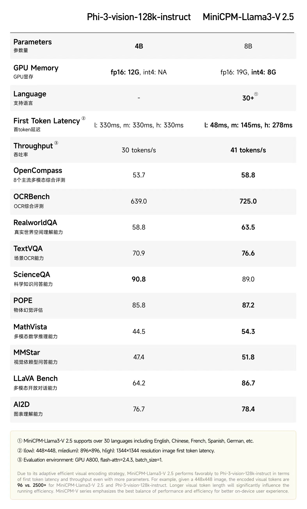
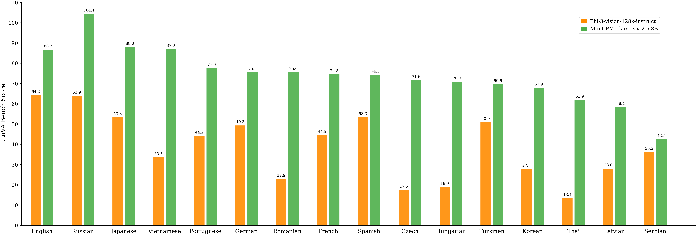

## Phi-3-vision-128K-Instruct vs MiniCPM-Llama3-V 2.5

Comparison results of Phi-3-vision-128K-Instruct and MiniCPM-Llama3-V 2.5, regarding the model size, hardware requirements, and performances.
With int4 quantization, MiniCPM-Llama3-V 2.5 delivers **smooth inference with only 8GB of GPU memory**. In most benchmarks, MiniCPM-Llama3-V 2.5 achieves **better performance** compared with Phi-3-vision-128K-Instruct. Moreover, MiniCPM-Llama3-V 2.5 also exhibits **lower latency and better throughtput even without quantization**.

我们提供了从模型参数、硬件需求、性能指标等方面对比 Phi-3-vision-128K-Instruct 和 MiniCPM-Llama3-V 2.5 的结果。通过 int4 量化，MiniCPM-Llama3-V 2.5 **仅需 8GB 显存即可推理**。在大多数评测集上， MiniCPM-Llama3-V 2.5 相比于 Phi-3-vision-128K-Instruct 都展现出了**更优的性能表现**。 即使未经量化，MiniCPM-Llama3-V 2.5 的**推理延迟和吞吐率也都更具优势**。

    

### Multilingual Capabilities（多语言能力对比）

MiniCPM-Llama3-V 2.5 exhibits **stronger multilingual** capabilities compared with Phi-3-vision-128K-Instruct on LLaVA Bench.

MiniCPM-Llama3-V 2.5 在对话和推理评测榜单 LLaVA Bench 上展现出了比 Phi-3-vision-128K-Instruct **更强的多语言的性能**。

    
     
    Evaluation results of multilingual LLaVA Bench
     
    多语言LLaVA Bench评测结果

