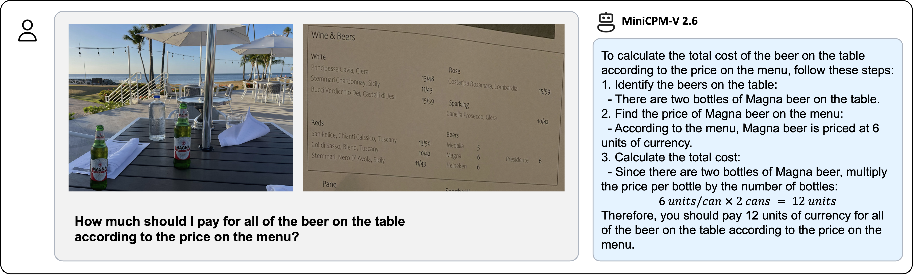
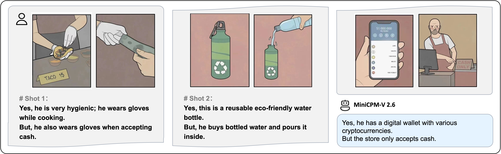
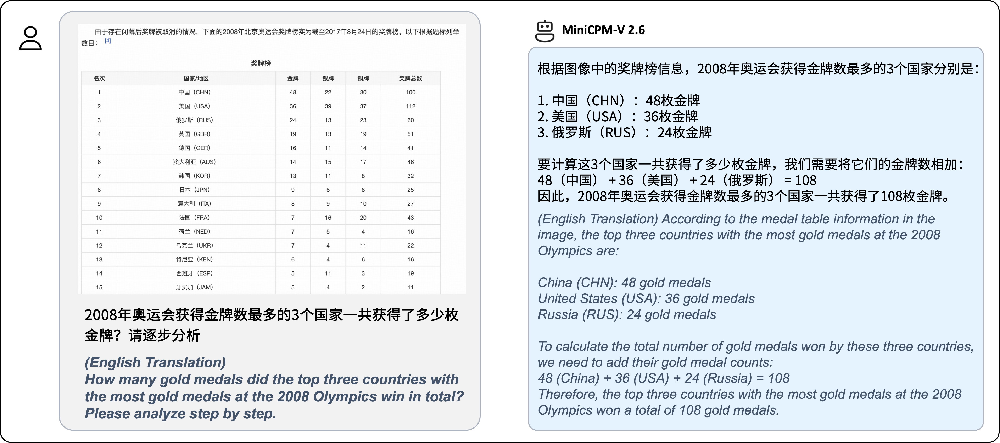
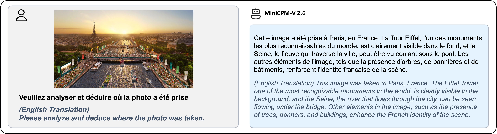

## MiniCPM-V 2.6

> Archieve at: 2025-01-13

**MiniCPM-V 2.6** is the latest and most capable model in the MiniCPM-V series. The model is built on SigLip-400M and Qwen2-7B with a total of 8B parameters. It exhibits a significant performance improvement over MiniCPM-Llama3-V 2.5, and introduces new features for multi-image and video understanding. Notable features of MiniCPM-V 2.6 include:

- 🔥 **Leading Performance.**
  MiniCPM-V 2.6 achieves an average score of 65.2 on the latest version of OpenCompass, a comprehensive evaluation over 8 popular benchmarks. **With only 8B parameters, it surpasses widely used proprietary models like GPT-4o mini, GPT-4V, Gemini 1.5 Pro, and Claude 3.5 Sonnet** for single image understanding.

- 🖼️ **Multi Image Understanding and In-context Learning.** MiniCPM-V 2.6 can also perform **conversation and reasoning over multiple images**. It achieves **state-of-the-art performance** on popular multi-image benchmarks such as Mantis-Eval, BLINK, Mathverse mv and Sciverse mv, and also shows promising in-context learning capability.

- 🎬 **Video Understanding.** MiniCPM-V 2.6 can also **accept video inputs**, performing conversation and providing dense captions for spatial-temporal information. It outperforms **GPT-4V, Claude 3.5 Sonnet and LLaVA-NeXT-Video-34B** on Video-MME with/without subtitles.

- 💪 **Strong OCR Capability and Others.**
  MiniCPM-V 2.6 can process images with any aspect ratio and up to 1.8 million pixels (e.g., 1344x1344). It achieves **state-of-the-art performance on OCRBench, surpassing proprietary models such as GPT-4o, GPT-4V, and Gemini 1.5 Pro**.
  Based on the the latest [RLAIF-V](https://github.com/RLHF-V/RLAIF-V/) and [VisCPM](https://github.com/OpenBMB/VisCPM) techniques, it features **trustworthy behaviors**, with significantly lower hallucination rates than GPT-4o and GPT-4V on Object HalBench, and supports **multilingual capabilities** on English, Chinese, German, French, Italian, Korean, etc.


- 🚀 **Superior Efficiency.**
  In addition to its friendly size, MiniCPM-V 2.6 also shows **state-of-the-art token density** (i.e., number of pixels encoded into each visual token). **It produces only 640 tokens when processing a 1.8M pixel image, which is 75% fewer than most models**. This directly improves the inference speed, first-token latency, memory usage, and power consumption. As a result, MiniCPM-V 2.6 can efficiently support **real-time video understanding** on end-side devices such as iPad.

-  💫  **Easy Usage.**
MiniCPM-V 2.6 can be easily used in various ways: (1) [llama.cpp](https://github.com/OpenBMB/llama.cpp/blob/minicpmv-main/examples/llava/README-minicpmv2.6.md) and [ollama](https://github.com/OpenBMB/ollama/blob/minicpm-v2.6/examples/minicpm-v2.6/README.md) support for efficient CPU inference on local devices, (2) [int4](https://huggingface.co/openbmb/MiniCPM-V-2_6-int4) and [GGUF](https://huggingface.co/openbmb/MiniCPM-V-2_6-gguf) format quantized models in 16 sizes, (3) [vLLM](#inference-with-vllm) support for high-throughput and memory-efficient inference, (4) fine-tuning on new domains and tasks, (5) quick local WebUI demo setup with [Gradio](#chat-with-our-demo-on-gradio), and (6) online web [demo](http://120.92.209.146:8887/).

### Evaluation  <!-- omit in toc -->
<div align="center">
    
</div>

<details>
<summary>Click to view single image results on OpenCompass, MME, MMVet, OCRBench, MMMU, MathVista, MMB, AI2D, TextVQA, DocVQA, HallusionBench, Object HalBench. </summary>
<div align="center">

<table style="margin: 0px auto;">
    <thead>
        <tr>
            <th align="left">Model</th>
            <th>Size</th>
            <th>Token Density<sup>+</sup></th>
            <th>OpenCompass</th>
            <th>MME</th>
            <th>MMVet</th>
            <th>OCRBench</th>
            <th>MMMU val</th>
            <th>MathVista mini</th>
            <th>MMB1.1 test</th>
            <th>AI2D</th>
            <th>TextVQA val</th>
            <th>DocVQA test</th>
            <th>HallusionBench</th>
            <th>Object HalBench</th>
        </tr>
    </thead>
    <tbody align="center">
        <tr>
            <td colspan="15" align="left"><strong>Proprietary</strong></td>
        </tr>
        <tr>
            <td nowrap="nowrap" align="left">GPT-4o</td>
            <td>-</td>
            <td>1088</td>
            <td>69.9</td>
            <td>2328.7</td>
            <td>69.1</td>
            <td>736</td>
            <td>69.2</td>
            <td>61.3</td>
            <td>82.2</td>
            <td>84.6</td>
            <td>-</td>
            <td>92.8</td>
            <td>55.0</td>
            <td>17.6</td>
        </tr>
        <tr>
            <td nowrap="nowrap" align="left">Claude 3.5 Sonnet</td>
            <td>-</td>
            <td>750</td>
            <td>67.9</td>
            <td>1920.0</td>
            <td>66.0</td>
            <td>788</td>
            <td>65.9</td>
            <td>61.6</td>
            <td>78.5</td>
            <td>80.2</td>
            <td>-</td>
            <td>95.2</td>
            <td>49.9</td>
            <td>13.8</td>
        </tr>
        <tr>
            <td nowrap="nowrap" align="left">Gemini 1.5 Pro</td>
            <td>-</td>
            <td>-</td>
            <td>64.4</td>
            <td>2110.6</td>
            <td>64.0</td>
            <td>754</td>
            <td>60.6</td>
            <td>57.7</td>
            <td>73.9</td>
            <td>79.1</td>
            <td>73.5</td>
            <td>86.5</td>
            <td>45.6</td>
            <td>-</td>
        </tr>
        <tr>
            <td nowrap="nowrap" align="left">GPT-4o mini</td>
            <td>-</td>
            <td>1088</td>
            <td>64.1</td>
            <td>2003.4</td>
            <td>66.9</td>
            <td>785</td>
            <td>60.0</td>
            <td>52.4</td>
            <td>76.0</td>
            <td>77.8</td>
            <td>-</td>
            <td>-</td>
            <td>46.1</td>
            <td>12.4</td>
        </tr>
        <tr>
            <td nowrap="nowrap" align="left">GPT-4V</td>
            <td>-</td>
            <td>1088</td>
            <td>63.5</td>
            <td>2070.2</td>
            <td>67.5</td>
            <td>656</td>
            <td>61.7</td>
            <td>54.7</td>
            <td>79.8</td>
            <td>78.6</td>
            <td>78.0</td>
            <td>87.2</td>
            <td>43.9</td>
            <td>14.2</td>
        </tr>
        <tr>
            <td nowrap="nowrap" align="left">Step-1V</td>
            <td>-</td>
            <td>-</td>
            <td>59.5</td>
            <td>2206.4</td>
            <td>63.3</td>
            <td>625</td>
            <td>49.9</td>
            <td>44.8</td>
            <td>78.0</td>
            <td>79.2</td>
            <td>71.6</td>
            <td>-</td>
            <td>48.4</td>
            <td>-</td>
        </tr>
        <tr>
            <td nowrap="nowrap" align="left">Qwen-VL-Max</td>
            <td>-</td>
            <td>784</td>
            <td>58.3</td>
            <td>2281.7</td>
            <td>61.8</td>
            <td>684</td>
            <td>52.0</td>
            <td>43.4</td>
            <td>74.6</td>
            <td>75.7</td>
            <td>79.5</td>
            <td>93.1</td>
            <td>41.2</td>
            <td>13.4</td>
        </tr>
        <tr>
            <td colspan="15" align="left"><strong>Open-source</strong></td>
        </tr>
        <tr>
            <td nowrap="nowrap" align="left">LLaVA-NeXT-Yi-34B</td>
            <td>34B</td>
            <td>157</td>
            <td>55.0</td>
            <td>2006.5</td>
            <td>50.7</td>
            <td>574</td>
            <td>48.8</td>
            <td>40.4</td>
            <td>77.8</td>
            <td>78.9</td>
            <td>69.3</td>
            <td>-</td>
            <td>34.8</td>
            <td>12.6</td>
        </tr>
        <tr>
            <td nowrap="nowrap" align="left">Mini-Gemini-HD-34B</td>
            <td>34B</td>
            <td>157</td>
            <td>-</td>
            <td>2141.0</td>
            <td>59.3</td>
            <td>518</td>
            <td>48.0</td>
            <td>43.3</td>
            <td>-</td>
            <td>80.5</td>
            <td>74.1</td>
            <td>78.9</td>
            <td>-</td>
            <td>-</td>
        </tr>
        <tr>
            <td nowrap="nowrap" align="left">Cambrian-34B</td>
            <td>34B</td>
            <td>1820</td>
            <td>58.3</td>
            <td>2049.9</td>
            <td>53.2</td>
            <td>591</td>
            <td>50.4</td>
            <td>50.3</td>
            <td>77.8</td>
            <td>79.5</td>
            <td>76.7</td>
            <td>75.5</td>
            <td>41.6</td>
            <td>14.7</td>
        </tr>
        <tr>
            <td nowrap="nowrap" align="left">GLM-4V-9B</td>
            <td>13B</td>
            <td>784</td>
            <td>59.1</td>
            <td>2018.8</td>
            <td>58.0</td>
            <td>776</td>
            <td>46.9</td>
            <td>51.1</td>
            <td>67.9</td>
            <td>71.2</td>
            <td>-</td>
            <td>-</td>
            <td>45.0</td>
            <td>-</td>
        </tr>
        <tr>
            <td nowrap="nowrap" align="left">InternVL2-8B</td>
            <td>8B</td>
            <td>706</td>
            <td>64.1</td>
            <td>2215.1</td>
            <td>54.3</td>
            <td>794</td>
            <td><strong>51.2</strong></td>
            <td>58.3</td>
            <td><strong>79.4</strong></td>
            <td><strong>83.6</strong></td>
            <td>77.4</td>
            <td><strong>91.6</strong></td>
            <td>45.0</td>
            <td>21.3</td>
        </tr>
        <tr>
            <td nowrap="nowrap" align="left">MiniCPM-Llama-V 2.5</td>
            <td>8B</td>
            <td>1882</td>
            <td>58.8</td>
            <td>2024.6</td>
            <td>52.8</td>
            <td>725</td>
            <td>45.8</td>
            <td>54.3</td>
            <td>72.0</td>
            <td>78.4</td>
            <td>76.6</td>
            <td>84.8</td>
            <td>42.4</td>
            <td>10.3</td>
        </tr>
        <tr style="background-color: #e6f2ff;">
            <td nowrap="nowrap" align="left">MiniCPM-V 2.6</td>
            <td>8B</td>
            <td><strong>2822</strong></td>
            <td><strong>65.2</strong></td>
            <td><strong>2348.4</strong>*</td>
            <td><strong>60.0</strong></td>
            <td><strong>852</strong>*</td>
            <td>49.8*</td>
            <td><strong>60.6</strong></td>
            <td>78.0</td>
            <td>82.1</td>
            <td><strong>80.1<strong></td>
            <td>90.8</td>
            <td><strong>48.1</strong>*</td>
            <td><strong>8.2</strong></td>
        </tr>
    </tbody>
</table>

</div>
* We evaluate this benchmark using chain-of-thought prompting. Specifically, for MME, we used this technique only for the Cognition set.

<sup>+</sup> Token Density: number of pixels encoded into each visual token at maximum resolution, i.e., # pixels at maximum resolution / # visual tokens.

Note: For proprietary models, we calculate token density based on the image encoding charging strategy defined in the official API documentation, which provides an upper-bound estimation.

</details>


<details>
<summary>Click to view multi-image results on Mantis Eval, BLINK, Mathverse mv, Sciverse mv, MIRB.</summary>
<div align="center">
 
<table style="margin: 0px auto;">
    <thead>
        <tr>
            <th align="left">Model</th>
            <th>Size</th>
            <th>Mantis Eval</th>
            <th>BLINK val</th>
            <th>Mathverse mv</th>
            <th>Sciverse mv</th>
            <th>MIRB</th>
        </tr>
    </thead>
    <tbody align="center">
        <tr>
            <td colspan="7" align="left"><strong>Proprietary</strong></td>
        </tr>
        <tr>
            <td nowrap="nowrap" align="left">GPT-4V</td>
            <td>-</td>
            <td>62.7</td>
            <td>54.6</td>
            <td>60.3</td>
            <td>66.9</td>
            <td>53.1</td>
        </tr>
        <tr>
            <td nowrap="nowrap" align="left">LLaVA-NeXT-Interleave-14B</td>
            <td>14B</td>
            <td>66.4</td>
            <td>52.6</td>
            <td>32.7</td>
            <td>30.2</td>
            <td>-</td>
        </tr>
        <tr>
            <td colspan="7" align="left"><strong>Open-source</strong></td>
        </tr>
        <tr>
            <td nowrap="nowrap" align="left">Emu2-Chat</td>
            <td>37B</td>
            <td>37.8</td>
            <td>36.2</td>
            <td>-</td>
            <td>27.2</td>
            <td>-</td>
        </tr>
        <tr>
            <td nowrap="nowrap" align="left">CogVLM</td>
            <td>17B</td>
            <td>45.2</td>
            <td>41.1</td>
            <td>-</td>
            <td>-</td>
            <td>-</td>
        </tr>
        <tr>
            <td nowrap="nowrap" align="left">VPG-C</td>
            <td>7B</td>
            <td>52.4</td>
            <td>43.1</td>
            <td>24.3</td>
            <td>23.1</td>
            <td>-</td>
        </tr>
        <tr>
            <td nowrap="nowrap" align="left">VILA 8B</td>
            <td>8B</td>
            <td>51.2</td>
            <td>39.3</td>
            <td>-</td>
            <td>36.5</td>
            <td>-</td>
        </tr>
        <tr>
            <td nowrap="nowrap" align="left">InternLM-XComposer-2.5</td>
            <td>8B</td>
            <td>53.1*</td>
            <td>48.9</td>
            <td>32.1*</td>
            <td>-</td>
            <td>42.5</td>
        </tr>
        <tr>
            <td nowrap="nowrap" align="left">InternVL2-8B</td>
            <td>8B</td>
            <td>59.0*</td>
            <td>50.9</td>
            <td>30.5*</td>
            <td>34.4*</td>
            <td><strong>56.9*</strong></td>
        </tr>
        <tr style="background-color: #e6f2ff;">
            <td nowrap="nowrap" align="left">MiniCPM-V 2.6</td>
            <td>8B</td>
            <td><strong>69.1</strong></td>
            <td><strong>53.0</strong></td>
            <td><strong>84.9</strong></td>
            <td><strong>74.9</strong></td>
            <td>53.8</td>
        </tr>
    </tbody>
</table>

</div>
* We evaluate the officially released checkpoint by ourselves.
</details>

<details>
<summary>Click to view video results on Video-MME and Video-ChatGPT.</summary>
<div align="center">
<table style="margin: 0px auto;">
    <thead>
        <tr>
            <th align="left">Model</th>
            <th>Size</th>
            <th colspan="2">Video-MME</th>
            <th colspan="5">Video-ChatGPT</th>
        </tr>
        <tr>
            <th align="left"></th>
            <th></th>
            <th>w/o subs</th>
            <th>w subs</th>
            <th>Correctness</th>
            <th>Detail</th>
            <th>Context</th>
            <th>Temporal</th>
            <th>Consistency</th>
        </tr>
    </thead>
    <tbody align="center">
        <tr>
            <td colspan="9" align="left"><strong>Proprietary</strong></td>
        </tr>
        <tr>
            <td nowrap="nowrap" align="left">Claude 3.5 Sonnet</td>
            <td>-</td>
            <td>60.0</td>
            <td>62.9</td>
            <td>-</td>
            <td>-</td>
            <td>-</td>
            <td>-</td>
            <td>-</td>
        </tr>
        <tr>
            <td nowrap="nowrap" align="left">GPT-4V</td>
            <td>-</td>
            <td>59.9</td>
            <td>63.3</td>
            <td>-</td>
            <td>-</td>
            <td>-</td>
            <td>-</td>
            <td>-</td>
        </tr>
        <tr>
            <td colspan="9" align="left"><strong>Open-source</strong></td>
        </tr>
        <tr>
            <td nowrap="nowrap" align="left">LLaVA-NeXT-7B</td>
            <td>7B</td>
            <td>-</td>
            <td>-</td>
            <td>3.39</td>
            <td>3.29</td>
            <td>3.92</td>
            <td>2.60</td>
            <td>3.12</td>
        </tr>
        <tr>
            <td nowrap="nowrap" align="left">LLaVA-NeXT-34B</td>
            <td>34B</td>
            <td>-</td>
            <td>-</td>
            <td>3.29</td>
            <td>3.23</td>
            <td>3.83</td>
            <td>2.51</td>
            <td>3.47</td>
        </tr>
        <tr>
            <td nowrap="nowrap" align="left">CogVLM2-Video</td>
            <td>12B</td>
            <td>-</td>
            <td>-</td>
            <td>3.49</td>
            <td><strong>3.46</strong></td>
            <td>3.23</td>
            <td><strong>2.98</strong></td>
            <td><strong>3.64</strong></td>
        </tr>
        <tr>
            <td nowrap="nowrap" align="left">LongVA</td>
            <td>7B</td>
            <td>52.4</td>
            <td>54.3</td>
            <td>3.05</td>
            <td>3.09</td>
            <td>3.77</td>
            <td>2.44</td>
            <td><strong>3.64</strong></td>
        </tr>
        <tr>
            <td nowrap="nowrap" align="left">InternVL2-8B</td>
            <td>8B</td>
            <td>54.0</td>
            <td>56.9</td>
            <td>-</td>
            <td>-</td>
            <td>-</td>
            <td>-</td>
            <td>-</td>
        </tr>
        <tr>
            <td nowrap="nowrap" align="left">InternLM-XComposer-2.5</td>
            <td>8B</td>
            <td>55.8</td>
            <td>-</td>
            <td>-</td>
            <td>-</td>
            <td>-</td>
            <td>-</td>
            <td>-</td>
        </tr>
        <tr>
            <td nowrap="nowrap" align="left">LLaVA-NeXT-Video</td>
            <td>32B</td>
            <td>60.2</td>
            <td>63.0</td>
            <td>3.48</td>
            <td>3.37</td>
            <td><strong>3.95</strong></td>
            <td>2.64</td>
            <td>3.28</td>
        </tr>
        <tr style="background-color: #e6f2ff;">
            <td nowrap="nowrap" align="left">MiniCPM-V 2.6</td>
            <td>8B</td>
            <td><strong>60.9</strong></td>
            <td><strong>63.6</strong></td>
            <td><strong>3.59</strong></td>
            <td>3.28</td>
            <td>3.93</td>
            <td>2.73</td>
            <td>3.62</td>
        </tr>
    </tbody>
</table>
</div>
</details>


<details>
<summary>Click to view few-shot results on TextVQA, VizWiz, VQAv2, OK-VQA.</summary>
<div align="center">
<table style="margin: 0px auto;">
    <thead>
        <tr>
            <th align="left">Model</th>
            <th>Size</th>
            <th>Shot</th>
            <th>TextVQA val</th>
            <th>VizWiz test-dev</th>
            <th>VQAv2 test-dev</th>
            <th>OK-VQA val</th>
        </tr>
    </thead>
    <tbody align="center">
        <tr>
            <td align="left" nowrap="nowrap" rowspan="3">Flamingo</td>
            <td rowspan="3">80B</td>
            <td>0*</td>
            <td>35.0</td>
            <td>31.6</td>
            <td>56.3</td>
            <td>40.6</td>
        </tr>
        <tr>
            <td>4</td>
            <td>36.5</td>
            <td>39.6</td>
            <td>63.1</td>
            <td><strong>57.4</strong></td>
        </tr>
        <tr>
            <td>8</td>
            <td>37.3</td>
            <td>44.8</td>
            <td>65.6</td>
            <td>57.5</td>
        </tr>
        <tr>
            <td align="left" nowrap="nowrap" rowspan="3">IDEFICS</td>
            <td rowspan="3">80B</td>
            <td>0*</td>
            <td>30.9</td>
            <td>36.0</td>
            <td>60.0</td>
            <td>45.2</td>
        </tr>
        <tr>
            <td>4</td>
            <td>34.3</td>
            <td>40.4</td>
            <td>63.6</td>
            <td>52.4</td>
        </tr>
        <tr>
            <td>8</td>
            <td>35.7</td>
            <td>46.1</td>
            <td>64.8</td>
            <td>55.1</td>
        </tr>
        <tr>
            <td align="left" nowrap="nowrap" rowspan="3">OmniCorpus</td>
            <td rowspan="3">7B</td>
            <td>0*</td>
            <td>43.0</td>
            <td>49.8</td>
            <td>63.2</td>
            <td>45.5</td>
        </tr>
        <tr>
            <td>4</td>
            <td>45.4</td>
            <td>51.3</td>
            <td>64.5</td>
            <td>46.5</td>
        </tr>
        <tr>
            <td>8</td>
            <td>45.6</td>
            <td>52.2</td>
            <td>64.7</td>
            <td>46.6</td>
        </tr>
        <tr>
            <td align="left" nowrap="nowrap" rowspan="3">Emu2</td>
            <td rowspan="3">37B</td>
            <td>0</td>
            <td>26.4</td>
            <td>40.4</td>
            <td>33.5</td>
            <td>26.7</td>
        </tr>
        <tr>
            <td>4</td>
            <td>48.2</td>
            <td>54.6</td>
            <td>67.0</td>
            <td>53.2</td>
        </tr>
        <tr>
            <td>8</td>
            <td>49.3</td>
            <td>54.7</td>
            <td>67.8</td>
            <td>54.1</td>
        </tr>
        <tr>
            <td align="left" nowrap="nowrap" rowspan="2">MM1</td>
            <td rowspan="2">30B</td>
            <td>0</td>
            <td>26.2</td>
            <td>40.4</td>
            <td>48.9</td>
            <td>26.7</td>
        </tr>
        <tr>
            <td>8</td>
            <td>49.3</td>
            <td>54.7</td>
            <td><strong>70.9</strong></td>
            <td>54.1</td>
        </tr>
        <tr style="background-color: #e6f2ff;">
            <td align="left" nowrap="nowrap" rowspan="3">MiniCPM-V 2.6<sup>+</sup></td>
            <td rowspan="3">8B</td>
            <td>0</td>
            <td>43.9</td>
            <td>33.8</td>
            <td>45.4</td>
            <td>23.9</td>
        </tr>
        <tr style="background-color: #e6f2ff;">
            <td>4</td>
            <td>63.6</td>
            <td>60.5</td>
            <td>65.5</td>
            <td>50.1</td>
        </tr>
        <tr style="background-color: #e6f2ff;">
            <td>8</td>
            <td><strong>64.6</strong></td>
            <td><strong>63.4</strong></td>
            <td>68.2</td>
            <td>51.4</td>
        </tr>
    </tbody>
</table>


</div>
* denotes zero image shot and two additional text shots following Flamingo.

<sup>+</sup> We evaluate the pretraining ckpt without SFT.
</details>

### Examples <!-- omit in toc -->

<div style="display: flex; flex-direction: column; align-items: center;">
  
  
  
  
  
</div>
<details>
  <summary>Click to view more cases.</summary>
  <div style="display: flex; flex-direction: column; align-items: center;">
    
    
  </div>
</details>

We deploy MiniCPM-V 2.6 on end devices. The demo video is the raw screen recording on a iPad Pro without edition.

<table align="center"> 
    <p align="center">
      
      &nbsp;&nbsp;&nbsp;&nbsp;
      
    </p>
</table> 

<table align="center"> 
    <p align="center">
      
      &nbsp;&nbsp;&nbsp;&nbsp;
      
    </p>
</table> 

<table align="center">
    <p align="center">
      <video src="https://github.com/user-attachments/assets/21f4b818-ede1-4822-920e-91281725c830" width="360" /> </video>
      <!-- <video src="https://github.com/user-attachments/assets/c835f757-206b-4d9c-8e36-70d67b453628" width="360" /> </video> -->
    </p>
</table>

</details>


### Multi-turn Conversation


<div align="center">

</div>


```python
import torch
from PIL import Image
from transformers import AutoModel, AutoTokenizer

torch.manual_seed(0)

model = AutoModel.from_pretrained('openbmb/MiniCPM-V-2_6', trust_remote_code=True,
    attn_implementation='sdpa', torch_dtype=torch.bfloat16) # sdpa or flash_attention_2, no eager
model = model.eval().cuda()
tokenizer = AutoTokenizer.from_pretrained('openbmb/MiniCPM-V-2_6', trust_remote_code=True)

image = Image.open('./assets/airplane.jpeg').convert('RGB')

# First round chat 
question = "Tell me the model of this aircraft."
msgs = [{'role': 'user', 'content': [image, question]}]

answer = model.chat(
    image=None,
    msgs=msgs,
    tokenizer=tokenizer
)
print(answer)

# Second round chat 
# pass history context of multi-turn conversation
msgs.append({"role": "assistant", "content": [answer]})
msgs.append({"role": "user", "content": ["Introduce something about Airbus A380."]})

answer = model.chat(
    image=None,
    msgs=msgs,
    tokenizer=tokenizer
)
print(answer)
```

You could get the following output:

```
"The aircraft in the image is an Airbus A380, which can be identified by its large size, double-deck structure, and the distinctive shape of its wings and engines. The A380 is a wide-body aircraft known for being the world's largest passenger airliner, designed for long-haul flights. It has four engines, which are characteristic of large commercial aircraft. The registration number on the aircraft can also provide specific information about the model if looked up in an aviation database."

"The Airbus A380 is a double-deck, wide-body, four-engine jet airliner made by Airbus. It is the world's largest passenger airliner and is known for its long-haul capabilities. The aircraft was developed to improve efficiency and comfort for passengers traveling over long distances. It has two full-length passenger decks, which can accommodate more passengers than a typical single-aisle airplane. The A380 has been operated by airlines such as Lufthansa, Singapore Airlines, and Emirates, among others. It is widely recognized for its unique design and significant impact on the aviation industry."
```

#### Multi-image Understanding
<details>
<summary> Click to view Python example of MiniCPM-V 2.6 multi-image understanding </summary>
  
```python
import torch
from PIL import Image
from transformers import AutoModel, AutoTokenizer

model = AutoModel.from_pretrained('openbmb/MiniCPM-V-2_6', trust_remote_code=True,
    attn_implementation='sdpa', torch_dtype=torch.bfloat16) # sdpa or flash_attention_2, no eager
model = model.eval().cuda()
tokenizer = AutoTokenizer.from_pretrained('openbmb/MiniCPM-V-2_6', trust_remote_code=True)

image1 = Image.open('image1.jpg').convert('RGB')
image2 = Image.open('image2.jpg').convert('RGB')
question = 'Compare image 1 and image 2, tell me about the differences between image 1 and image 2.'

msgs = [{'role': 'user', 'content': [image1, image2, question]}]

answer = model.chat(
    image=None,
    msgs=msgs,
    tokenizer=tokenizer
)
print(answer)
```
</details>

#### Few-shot In-Context-Learning 

<details>
<summary> Click to view Python example of MiniCPM-V 2.6 few-shot in-context-learning example </summary>

```python
import torch
from PIL import Image
from transformers import AutoModel, AutoTokenizer

model = AutoModel.from_pretrained('openbmb/MiniCPM-V-2_6', trust_remote_code=True,
    attn_implementation='sdpa', torch_dtype=torch.bfloat16) # sdpa or flash_attention_2, no eager
model = model.eval().cuda()
tokenizer = AutoTokenizer.from_pretrained('openbmb/MiniCPM-V-2_6', trust_remote_code=True)

question = "production date" 
image1 = Image.open('example1.jpg').convert('RGB')
answer1 = "2023.08.04"
image2 = Image.open('example2.jpg').convert('RGB')
answer2 = "2007.04.24"
image_test = Image.open('test.jpg').convert('RGB')

msgs = [
    {'role': 'user', 'content': [image1, question]}, {'role': 'assistant', 'content': [answer1]},
    {'role': 'user', 'content': [image2, question]}, {'role': 'assistant', 'content': [answer2]},
    {'role': 'user', 'content': [image_test, question]}
]

answer = model.chat(
    image=None,
    msgs=msgs,
    tokenizer=tokenizer
)
print(answer)
```
</details>

#### Video understanding
<details>
<summary> Click to view Python example of MiniCPM-V 2.6 video understanding </summary>

```python
import torch
from PIL import Image
from transformers import AutoModel, AutoTokenizer
from decord import VideoReader, cpu    # pip install decord

model = AutoModel.from_pretrained('openbmb/MiniCPM-V-2_6', trust_remote_code=True,
    attn_implementation='sdpa', torch_dtype=torch.bfloat16) # sdpa or flash_attention_2, no eager
model = model.eval().cuda()
tokenizer = AutoTokenizer.from_pretrained('openbmb/MiniCPM-V-2_6', trust_remote_code=True)

MAX_NUM_FRAMES=64 # if cuda OOM set a smaller number

def encode_video(video_path):
    def uniform_sample(l, n):
        gap = len(l) / n
        idxs = [int(i * gap + gap / 2) for i in range(n)]
        return [l[i] for i in idxs]

    vr = VideoReader(video_path, ctx=cpu(0))
    sample_fps = round(vr.get_avg_fps() / 1)  # FPS
    frame_idx = [i for i in range(0, len(vr), sample_fps)]
    if len(frame_idx) > MAX_NUM_FRAMES:
        frame_idx = uniform_sample(frame_idx, MAX_NUM_FRAMES)
    frames = vr.get_batch(frame_idx).asnumpy()
    frames = [Image.fromarray(v.astype('uint8')) for v in frames]
    print('num frames:', len(frames))
    return frames

video_path="video_test.mp4"
frames = encode_video(video_path)
question = "Describe the video"
msgs = [
    {'role': 'user', 'content': frames + [question]}, 
]

# Set decode params for video
params = {}
params["use_image_id"] = False
params["max_slice_nums"] = 2 # 如果cuda OOM且视频分辨率大于448*448可设为1

answer = model.chat(
    image=None,
    msgs=msgs,
    tokenizer=tokenizer,
    **params
)
print(answer)
```
</details>
