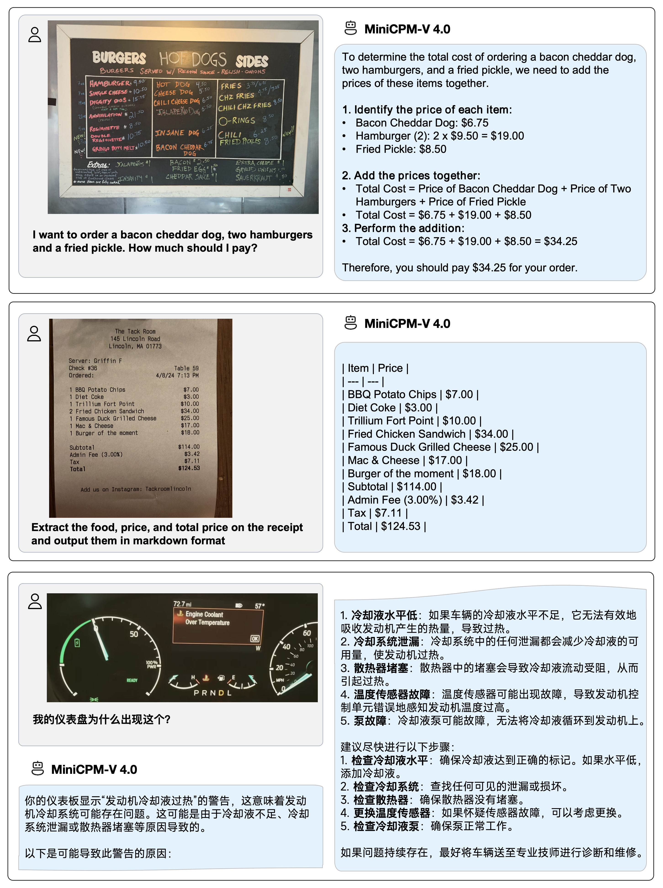

## MiniCPM-V 4.0

> Archieve at: 2025-08-25

MiniCPM-V 4.0 是 MiniCPM-V 系列中的最新模型。该模型基于 SigLIP2-400M 和 MiniCPM4-3B 构建，参数总量为 4.1B。它延续了 MiniCPM-V 2.6 在单图、多图和视频理解方面的强大能力，同时大幅提升了推理效率。MiniCPM-V 4.0 的主要特点包括：

- 🔥 **领先的视觉能力。**
MiniCPM-V 4.0 在 OpenCompass 上获得了平均 69.0 的高分，超越了 MiniCPM-V 2.6（8.1B，得分 65.2）、 Qwen2.5-VL-3B-Instruct（3.8B，得分 64.5）和**广泛使用的闭源模型 GPT-4.1-mini-20250414**。在多图理解与视频理解任务上，MiniCPM-V 4.0 也表现出色。

- 🚀 **卓越的效率。**
MiniCPM-V 4.0 专为端侧设备优化，**可在 iPhone 16 Pro Max 上流畅运行，首 token 延迟低至 2 秒，解码速度达 17.9 tokens/s**，且无发热问题。MiniCPM-V 4.0 在并发请求场景下表现出领先的吞吐率指标。

- 💫 **易于使用。**
MiniCPM-V 4.0 支持多种推理方式，包括 **llama.cpp、Ollama、vLLM、SGLang、LLaMA-Factory 及本地 Web Demo 等**。我们还开源了可以在 iPhone 和 iPad 运行的 iOS App。欢迎参考我们开源的 **结构清晰的[使用手册](https://github.com/OpenSQZ/MiniCPM-V-CookBook)** 玩转 MiniCPM-V 4.0，其中涵盖了详细的部署指南和真实示例。

### 性能评估 <!-- omit in toc -->

点击查看在OpenCompass上的单图理解能力的评测结果。

<table style="margin: 0px auto;">
    <thead>
        <tr>
            <th nowrap="nowrap" align="left">model</th>
            <th>Size</th>
            <th>Opencompass</th>
            <th>OCRBench</th>
            <th>MathVista</th>
            <th>HallusionBench</th>
            <th>MMMU</th>
            <th>MMVet</th>
            <th>MMBench V1.1</th>
            <th>MMStar</th>
            <th>AI2D</th>
        </tr>
    </thead>
    <tbody align="center">
        <tr>
            <td colspan="11" align="left"><strong>Proprietary</strong></td>
        </tr>
        <tr>
            <td nowrap="nowrap" align="left">GPT-4v-20240409</td>
            <td>-</td>
            <td>63.5</td>
            <td>656</td>
            <td>55.2</td>
            <td>43.9</td>
            <td>61.7</td>
            <td>67.5</td>
            <td>79.8</td>
            <td>56.0</td>
            <td>78.6</td>
        </tr>
        <tr>
            <td nowrap="nowrap" align="left">Gemini-1.5-Pro</td>
            <td>-</td>
            <td>64.5</td>
            <td>754</td>
            <td>58.3</td>
            <td>45.6</td>
            <td>60.6</td>
            <td>64.0</td>
            <td>73.9</td>
            <td>59.1</td>
            <td>79.1</td>
        </tr>
        <tr>
            <td nowrap="nowrap" align="left">GPT-4.1-mini-20250414</td>
            <td>-</td>
            <td>68.9</td>
            <td>840</td>
            <td>70.9</td>
            <td>49.3</td>
            <td>55.0</td>
            <td>74.3</td>
            <td>80.9</td>
            <td>60.9</td>
            <td>76.0</td>
        </tr>
        <tr>
            <td nowrap="nowrap" align="left">Claude 3.5 Sonnet-20241022</td>
            <td>-</td>
            <td>70.6</td>
            <td>798</td>
            <td>65.3</td>
            <td>55.5</td>
            <td>66.4</td>
            <td>70.1</td>
            <td>81.7</td>
            <td>65.1</td>
            <td>81.2</td>
        </tr>
        <tr>
            <td colspan="11" align="left"><strong>Open-source</strong></td>
        </tr>
        <tr>
            <td nowrap="nowrap" align="left">Qwen2.5-VL-3B-Instruct</td>
            <td>3.8B</td>
            <td>64.5</td>
            <td>828</td>
            <td>61.2</td>
            <td>46.6</td>
            <td>51.2</td>
            <td>60.0</td>
            <td>76.8</td>
            <td>56.3</td>
            <td>81.4</td>
        </tr>
        <tr>
            <td nowrap="nowrap" align="left">InternVL2.5-4B</td>
            <td>3.7B</td>
            <td>65.1</td>
            <td>820</td>
            <td>60.8</td>
            <td>46.6</td>
            <td>51.8</td>
            <td>61.5</td>
            <td>78.2</td>
            <td>58.7</td>
            <td>81.4</td>
        </tr>
        <tr>
            <td nowrap="nowrap" align="left">Qwen2.5-VL-7B-Instruct</td>
            <td>8.3B</td>
            <td>70.9</td>
            <td>888</td>
            <td>68.1</td>
            <td>51.9</td>
            <td>58.0</td>
            <td>69.7</td>
            <td>82.2</td>
            <td>64.1</td>
            <td>84.3</td>
        </tr>
        <tr>
            <td nowrap="nowrap" align="left">InternVL2.5-8B</td>
            <td>8.1B</td>
            <td>68.1</td>
            <td>821</td>
            <td>64.5</td>
            <td>49.0</td>
            <td>56.2</td>
            <td>62.8</td>
            <td>82.5</td>
            <td>63.2</td>
            <td>84.6</td>
        </tr>
        <tr>
            <td nowrap="nowrap" align="left">MiniCPM-V-2.6</td>
            <td>8.1B</td>
            <td>65.2</td>
            <td>852</td>
            <td>60.8</td>
            <td>48.1</td>
            <td>49.8</td>
            <td>60.0</td>
            <td>78.0</td>
            <td>57.5</td>
            <td>82.1</td>
        </tr>
        <tr>
            <td nowrap="nowrap" align="left">MiniCPM-o-2.6</td>
            <td>8.7B</td>
            <td>70.2</td>
            <td>889</td>
            <td>73.3</td>
            <td>51.1</td>
            <td>50.9</td>
            <td>67.2</td>
            <td>80.6</td>
            <td>63.3</td>
            <td>86.1</td>
        </tr>
        <tr>
            <td nowrap="nowrap" align="left">MiniCPM-V-4.0</td>
            <td>4.1B</td>
            <td>69.0</td>
            <td>894</td>
            <td>66.9</td>
            <td>50.8</td>
            <td>51.2</td>
            <td>68.0</td>
            <td>79.7</td>
            <td>62.8</td>
            <td>82.9</td>
        </tr>
    </tbody>
</table>

点击查看在图表理解、文档理解、数学推理、幻觉等领域的评测结果。 

<table style="margin: 0px auto;">
    <thead>
        <tr>
            <th nowrap="nowrap" align="left">model</th>
            <th>Size</th>
            <th>ChartQA</th>
            <th>MME</th>
            <th>RealWorldQA</th>
            <th>TextVQA</th>
            <th>DocVQA</th>
            <th>MathVision</th>
            <th>DynaMath</th>
            <th>WeMath</th>
            <th colspan="2">Obj Hal</th>
            <th colspan="2">MM Hal</th>
        </tr>
    </thead>
    <tbody>
        <tr>
            <td></td>
            <td></td>
            <td></td>
            <td></td>
            <td></td>
            <td></td>
            <td></td>
            <td></td>
            <td></td>
            <td></td>
            <td>CHAIRs↓</td>
            <td>CHAIRi↓</td>
            <td nowrap="nowrap">score avg@3↑</td>
            <td nowrap="nowrap">hall rate avg@3↓</td>
        </tr>
        <tbody align="center">
        <tr>
            <td colspan="14" align="left"><strong>Proprietary</strong></td>
        </tr>
        <tr>
            <td nowrap="nowrap" align="left">GPT-4v-20240409</td>
            <td>-</td>
            <td>78.5</td>
            <td>1927</td>
            <td>61.4</td>
            <td>78.0</td>
            <td>88.4</td>
            <td>-</td>
            <td>-</td>
            <td>-</td>
            <td>-</td>
            <td>-</td>
            <td>-</td>
            <td>-</td>
        </tr>
        <tr>
            <td nowrap="nowrap" align="left">Gemini-1.5-Pro</td>
            <td>-</td>
            <td>87.2</td>
            <td>-</td>
            <td>67.5</td>
            <td>78.8</td>
            <td>93.1</td>
            <td>41.0</td>
            <td>31.5</td>
            <td>50.5</td>
            <td>-</td>
            <td>-</td>
            <td>-</td>
            <td>-</td>
        </tr>
        <tr>
            <td nowrap="nowrap" align="left">GPT-4.1-mini-20250414</td>
            <td>-</td>
            <td>-</td>
            <td>-</td>
            <td>-</td>
            <td>-</td>
            <td>-</td>
            <td>45.3</td>
            <td>47.7</td>
            <td>-</td>
            <td>-</td>
            <td>-</td>
            <td>-</td>
            <td>-</td>
        </tr>
        <tr>
            <td nowrap="nowrap" align="left">Claude 3.5 Sonnet-20241022</td>
            <td>-</td>
            <td>90.8</td>
            <td>-</td>
            <td>60.1</td>
            <td>74.1</td>
            <td>95.2</td>
            <td>35.6</td>
            <td>35.7</td>
            <td>44.0</td>
            <td>-</td>
            <td>-</td>
            <td>-</td>
            <td>-</td>
        </tr>
        <tr>
            <td colspan="14" align="left"><strong>Open-source</strong></td>
        </tr>
        <tr>
            <td nowrap="nowrap" align="left">Qwen2.5-VL-3B-Instruct</td>
            <td>3.8B</td>
            <td>84.0</td>
            <td>2157</td>
            <td>65.4</td>
            <td>79.3</td>
            <td>93.9</td>
            <td>21.9</td>
            <td>13.2</td>
            <td>22.9</td>
            <td>18.3</td>
            <td>10.8</td>
            <td>3.9 </td>
            <td>33.3 </td>
        </tr>
        <tr>
            <td nowrap="nowrap" align="left">InternVL2.5-4B</td>
            <td>3.7B</td>
            <td>84.0</td>
            <td>2338</td>
            <td>64.3</td>
            <td>76.8</td>
            <td>91.6</td>
            <td>18.4</td>
            <td>15.2</td>
            <td>21.2</td>
            <td>13.7</td>
            <td>8.7</td>
            <td>3.2 </td>
            <td>46.5 </td>
        </tr>
        <tr>
            <td nowrap="nowrap" align="left">Qwen2.5-VL-7B-Instruct</td>
            <td>8.3B</td>
            <td>87.3</td>
            <td>2347</td>
            <td>68.5</td>
            <td>84.9</td>
            <td>95.7</td>
            <td>25.4</td>
            <td>21.8</td>
            <td>36.2</td>
            <td>13.3</td>
            <td>7.9</td>
            <td>4.1 </td>
            <td>31.6 </td>
        </tr>
        <tr>
            <td nowrap="nowrap" align="left">InternVL2.5-8B</td>
            <td>8.1B</td>
            <td>84.8</td>
            <td>2344</td>
            <td>70.1</td>
            <td>79.1</td>
            <td>93.0</td>
            <td>17.0</td>
            <td>9.4</td>
            <td>23.5</td>
            <td>18.3</td>
            <td>11.6</td>
            <td>3.6 </td>
            <td>37.2</td>
        </tr>
        <tr>
            <td nowrap="nowrap" align="left">MiniCPM-V-2.6</td>
            <td>8.1B</td>
            <td>79.4</td>
            <td>2348</td>
            <td>65.0</td>
            <td>80.1</td>
            <td>90.8</td>
            <td>17.5</td>
            <td>9.0</td>
            <td>20.4</td>
            <td>7.3</td>
            <td>4.7</td>
            <td>4.0 </td>
            <td>29.9 </td>
        </tr>
        <tr>
            <td nowrap="nowrap" align="left">MiniCPM-o-2.6</td>
            <td>8.7B</td>
            <td>86.9</td>
            <td>2372</td>
            <td>68.1</td>
            <td>82.0</td>
            <td>93.5</td>
            <td>21.7</td>
            <td>10.4</td>
            <td>25.2</td>
            <td>6.3</td>
            <td>3.4</td>
            <td>4.1 </td>
            <td>31.3 </td>
        </tr>
        <tr>
            <td nowrap="nowrap" align="left">MiniCPM-V-4.0</td>
            <td>4.1B</td>
            <td>84.4</td>
            <td>2298</td>
            <td>68.5</td>
            <td>80.8</td>
            <td>92.9</td>
            <td>20.7</td>
            <td>14.2</td>
            <td>32.7</td>
            <td>6.3</td>
            <td>3.5</td>
            <td>4.1 </td>
            <td>29.2 </td>
        </tr>
    </tbody>
</table>

点击查看多图和视频理解能力的评测结果。 

<table style="margin: 0px auto;">
    <thead>
        <tr>
            <th nowrap="nowrap" align="left">model</th>
            <th>Size</th>
            <th>Mantis</th>
            <th>Blink</th>
            <th nowrap="nowrap" colspan="2" >Video-MME</th>
        </tr>
    </thead>
    <tbody>
        <tr>
            <td></td>
            <td></td>
            <td></td>
            <td></td>
            <td>wo subs</td>
            <td>w subs</td>
        </tr>
        <tbody align="center">
        <tr>
            <td colspan="6" align="left"><strong>Proprietary</strong></td>
        </tr>
                <tr>
            <td nowrap="nowrap" align="left">GPT-4v-20240409</td>
            <td>-</td>
            <td>62.7</td>
            <td>54.6</td>
            <td>59.9</td>
            <td>63.3</td>
        </tr>
        <tr>
            <td nowrap="nowrap" align="left">Gemini-1.5-Pro</td>
            <td>-</td>
            <td>-</td>
            <td>59.1</td>
            <td>75.0</td>
            <td>81.3</td>
        </tr>
        <tr>
            <td nowrap="nowrap" align="left">GPT-4o-20240513</td>
            <td>-</td>
            <td>-</td>
            <td>68.0</td>
            <td>71.9</td>
            <td>77.2</td>
        </tr>
        <tr>
            <td colspan="6" align="left"><strong>Open-source</strong></td>
        </tr>
        <tr>
            <td nowrap="nowrap" align="left">Qwen2.5-VL-3B-Instruct</td>
            <td>3.8B</td>
            <td>-</td>
            <td>47.6</td>
            <td>61.5</td>
            <td>67.6</td>
        </tr>
        <tr>
            <td nowrap="nowrap" align="left">InternVL2.5-4B</td>
            <td>3.7B</td>
            <td>62.7</td>
            <td>50.8</td>
            <td>62.3</td>
            <td>63.6</td>
        </tr>
        <tr>
            <td nowrap="nowrap" align="left">Qwen2.5-VL-7B-Instruct</td>
            <td>8.3B</td>
            <td>-</td>
            <td>56.4</td>
            <td>65.1</td>
            <td>71.6</td>
        </tr>
        <tr>
            <td nowrap="nowrap" align="left">InternVL2.5-8B</td>
            <td>8.1B</td>
            <td>67.7</td>
            <td>54.8</td>
            <td>64.2</td>
            <td>66.9</td>
        </tr>
        <tr>
            <td nowrap="nowrap" align="left">MiniCPM-V-2.6</td>
            <td>8.1B</td>
            <td>69.1</td>
            <td>53.0</td>
            <td>60.9</td>
            <td>63.6</td>
        </tr>
        <tr>
            <td nowrap="nowrap" align="left">MiniCPM-o-2.6</td>
            <td>8.7B</td>
            <td>71.9</td>
            <td>56.7</td>
            <td>63.9</td>
            <td>69.6</td>
        </tr>
        <tr>
            <td nowrap="nowrap" align="left">MiniCPM-V-4.0</td>
            <td>4.1B</td>
            <td>71.4</td>
            <td>54.0</td>
            <td>61.2</td>
            <td>65.8</td>
        </tr>
    </tbody>
</table>

### 典型示例

  

我们在 iPhone 16 Pro Max 上部署了 MiniCPM-V 4.0 [iOS demo](https://github.com/OpenSQZ/MiniCPM-V-CookBook/blob/main/demo/ios_demo/ios.md)，并录制了以下演示录屏，视频未经加速等任何编辑：

<table align="center"> 
    

      
      &nbsp;&nbsp;&nbsp;&nbsp;
      
    

    

      
      &nbsp;&nbsp;&nbsp;&nbsp;
      
    

</table> 
