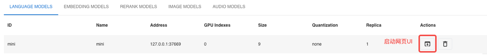
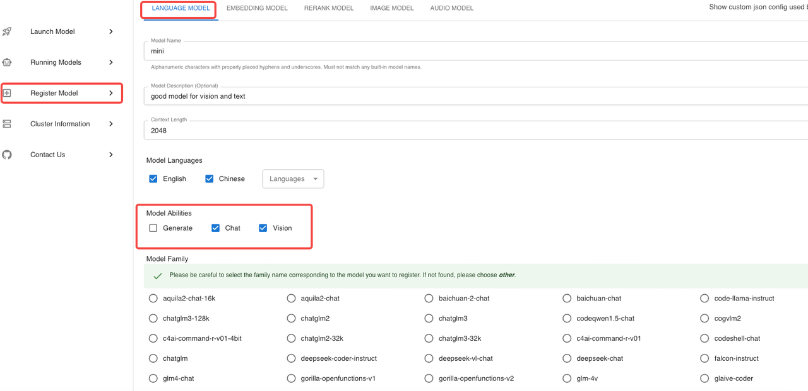

## Xinference Infer
Xinference is a unified inference platform that provides a unified interface for different inference engines. It supports LLM, text generation, image generation, and more.but it's not bigger than Swift too much.


### Xinference install
Xinference can be installed simply by using the following easy bash code:
```shell
pip install "xinference[all]"
```

### Quick start
The initial steps for conducting inference with Xinference involve downloading the model during the first launch.
1. Start Xinference in the terminal:
```shell
xinference
```
2. Start the web ui.
3. Search for "MiniCPM-Llama3-V-2_5" in the search box.


4. Find and click the MiniCPM-Llama3-V-2_5 button.
5. Follow the config and launch the model.
```plaintext
Model engine : Transformers
model format : pytorch
Model size   : 8
quantization : none
N-GPU        : auto
Replica      : 1
```
6. After first click the launch button,xinference will download the model from huggingface. We should click the webui button.



7. Upload the image and chatting with the MiniCPM-Llama3-V-2_5

### Local MiniCPM-Llama3-V-2_5 Launch
If you have already downloaded the MiniCPM-Llama3-V-2_5 model locally, you can proceed with Xinference inference following these steps:
1. Start Xinference
```shell
xinference
```
2. Start the web ui.
3. To register a new model, follow these steps: the settings highlighted in red are fixed and cannot be changed, whereas others are customizable according to your needs. Complete the process by clicking the 'Register Model' button.




4. After completing the model registration, proceed to 'Custom Models' and locate the model you just registered.
5. Follow the config and launch the model.
```plaintext
Model engine : Transformers
model format : pytorch
Model size   : 8
quantization : none
N-GPU        : auto
Replica      : 1
```
6. After first click the launch button,Xinference will download the model from Huggingface. we should click the chat button.

7. Upload the image and chatting with the MiniCPM-Llama3-V-2_5

### FAQ
1. Why can't the sixth step open the WebUI?

Maybe your firewall or mac os to prevent the web to open.